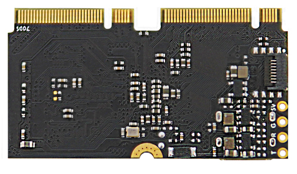
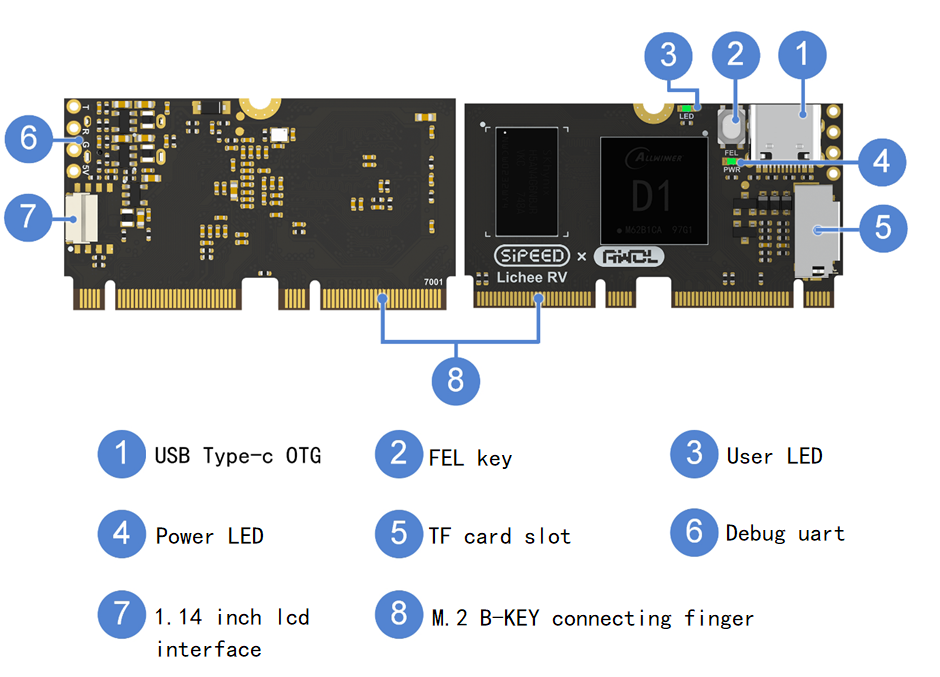
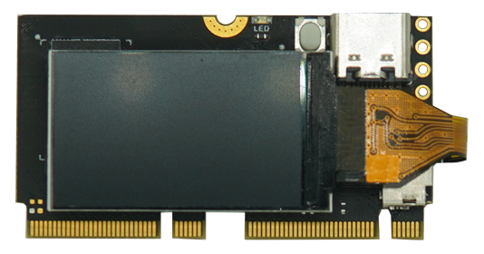

# Lichee RV - Nezha CM

> Edit on 2022.05.13

## Overview
Lichee RV - Nezha CM is a compute module with modular design, equipped with Allwinner D1 chip (based on T-Head XuanTie C906 core), 512MB DDR3 RAM. It can boot from TF card or SD-NAND, uses two sets of M.2 b key 67 pin connectors to route all IO, making it convient for wide use and easy to replace.




## Specifications

| Item                 | Value                                                                                                                                                                                                                             |
| -------------------- | --------------------------------------------------------------------------------------------------------------------------------------------------------------------------------------------------------------------------------- |
| CPU                  | Allwinner D1 chip (Based on T-Head XuanTie C906 core) up to 1GHZ                                                                                                                                                                  |
| RAM                  | 16bits 512MB DDR3，Up to 792MHz                                                                                                                                                                                                   |
| Storge               | Onboard TF card slot，can use tf card for storing,1TB storage capacity have been tested ok <br>Reserve SD-NAND pads (Conflict with 8pins lcd interface. using for business custom made )                                                                                    |
| Display              | **MIPI**：4-lane MIPI DSI <br>**RGB**：RGB888 interface(partially multiplexed with DSI) <br>**MCU** : I80 interface<br>**SPI**：Onboard 8pins SPI screen interface，can be used for 1.14 inch screen                              |
| Audio                | Analog audio headphone output(HPOUT); <br>Analog audio line input(LINEIN); <br>Digital Audio (I2S/SPDIF); <br>Analog microphone interface(MIC3);<br>Digital microphone interface(DMIC);<br>All above pin out to connecting finger |
| Ethernet             | Pin out RMII/RGMII to connecting finger (Multiplexed with some GPIOs)                                                                                                                                                             |
| USB                  | Onboard TYPE-C USB-OTG interface(USB0) <br>USB-HOST pins out to connecting finger(USB1)                                                                                                                                           |
| GPIO                 | Other GPIOs all pin out to  connecting finger                                                                                                                                                                                     |
| Key                  | • FEL key (Enter to download mode)                                                                                                                                                                                                |
| Led                  | • A power led <br>• A user led (active high)                                                                                                                                                                                      |
| PCB                  | 4 layers                                                                                                                                                                                                                          |
| Fixed<br> way        | Connect the core board and bottom board by two sets of M.2B connecting finger and fasten with a M2 screw                                                                                                                          |
| Development lanuguge | C/C++, Python, Golang, etc...                                                                                                                                                                                                     |
| System Mirrors       | Tina Linux (Based on OpenWRT 14.07), Debian, YoC (RTOS )                                                                                                                                                                         |



## Comparison between the bottom board

|       Item       | Lichee RV Dock                                                                                                                                                                                                                                                                | Lichee RV Panel                                                                                                                                                                             |
| :--------------: | ----------------------------------------------------------------------------------------------------------------------------------------------------------------------------------------------------------------------------------------------------------------------------- | ------------------------------------------------------------------------------------------------------------------------------------------------------------------------------------------- |
|       SOC        | Allwinner D1（XuanTie C906 RISC-V）                                                                                                                                                                                                                                           | Allwinner D1（XuanTie C906 RISC-V）                                                                                                                                                         |
|       Ram        | 1GByte                                                                                                                                                                                                                                                                        | 1GByte                                                                                                                                                                                      |
| Wireless network | Choosable: <br>-2.4G WIFI+BT<br>- none (You can weld other WiFi modules but need debug by yourself)                                                                                                                                                                           | 2.4G WIFI+BT                                                                                                                                                                                |
|  Wired network   | None                                                                                                                                                                                                                                                                          | Support 100M Ethernet                                                                                                                                                                       |
|    Video out     | HDMI connector; <br>SPI screen interface; <br>Screen convert board can be used for：<br>- common RGB screen connector(include TP pins)(support 4.3inch/5.0inch screen we sell<br>-  MIPI screen interface connector(compatible with 8-inch screen of NeZha development board) | sRGB screen interface connector(include TP pins)(support standard 4 inch ips screen with TP )<br> MIPI screen interface connector(compatible with 8-inch screen of NeZha development board) |
|     USB port     | One USB OTG(Type-C port on core board) <br> One USB Host(USB-A port on bottom board)                                                                                                                                                                                          | One USB OTG(Type-C port on core board) <br> One USB Host(USB-C port on bottom board)                                                                                                        |
| Expand interface | Support microphone arrays <br>Most GPIOs are connected with 2x20P pin pads                                                                                                                                                                                                    | Part GPIOs are connected to 2x20P pin pads出                                                                                                                                                |
|      Audio       | Onboard 3W Audio amplifier <br> Onboard electret microphone circuit                                                                                                                                                                                                           | Onboard 3W Audio amplifier  <br> Onboard 2 MEMS digital microphones                                                                                                                         |
|       Key        | One FEL key(Enter to download mode)<br>One RST key(Reset)<br>One user key                                                                                                                                                                                                     | One FEL key(Enter to download mode)                                                                                                                                                         |
|       LED        | One power led<br>One 2812 RGB LED                                                                                                                                                                                                                                             | One power led                                                                                                                                                                               |
|      Shell       | None                                                                                                                                                                                                                                                                          | 3D print shell                                                                                                                                                                              |
|       Size       | 65.0mm x 40.0mm                                                                                                                                                                                                                                                               | 86.0mm x 86.0mm                                                                                                                                                                             |


## Connect 1.14 inch screen




> Up to now 1.14 inch screen is not able to display and need to wait for updating

## Burn system

[Flash tutorial](./flash.md)

## Notice

The USB TYPE-C connector of the core board uses the CC pin as an automatic OTG identification pin, so it conflicts with the identification when using the USB C to C data line, and it only works with the USB A to C data line. There are two ways to solve this problem and the steps are as follows

| Type-C work mode                         | OTG (Factory default product) | CC identification(Need to change hardware) |
| ---------------------------------------- | :---------------------------: | :----------------------------------------: |
| Resistance R30 and resistance R31        |             Blank             |        weld 5.1K 1% 0402 resistance        |
| Diode D3 and D4                          |        weld 4148 diode        |                   Blank                    |
| Compatible with C to C cables            |              no               |                    yes                     |
| Compatible with A to C cables            |              yes              |                    yes                     |
| Whether supports automatic OTG switching |              yes              |                     no                     |

To use C to C data line, a physical modification to the device is required to be made around the type-c connector in order to use the corresponding CC identification mode. A manual switch to Host mode using OTG cables will be required from then on should you wish to attach the external USB devices, as automatic OTG switching is disabled.

If you want to use USB C to C data line, you need do two things：

> ① add two 5.1K 1% 0402 Resistances at R30 and R31 ，② Remove Diode


## Download

Download the Debian system image from Mega netdisk: 

<https://mega.nz/folder/lx4CyZBA#PiFhY7oSVQ3gp2ZZ_AnwYA>

If you want to build your own custom image, you can visit the BSP SDK in the following link.

[BSP SDK](./user.html#BSP-SDK-development)

## Pre made images
[**Sipeed Lichee RV** Archlinux 6.1.0-rc3 with LED and 1.14 Display support](https://github.com/miloserdev/sunxi_licheerv)  
Default login `root` and password `archriscv`  
```console
git clone https://github.com/miloserdev/sunxi_licheerv.git
cd ./sunxi_licheerv
./create_sd.sh /dev/mmcblk0
```
