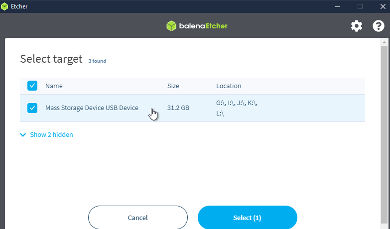
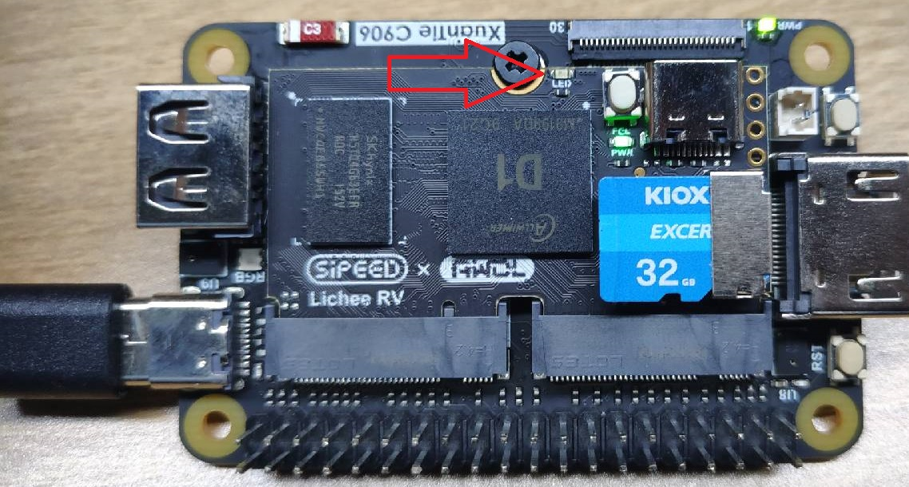

Ubuntu released the image file which can run on LicheeRV. But we can't flash this image file with PhoenixCard application, so here are steps.

After booting this system on LicheeRV, we can use mouse and keyboard to operate this system if connecting this board with HDMI screen, otherwise we can only operate this system by serial communication.

## Ubuntu Introduction

Ubuntu is based on another linux distribution Debian, and we can find many answers from internet when meet trouble, which is friendly to beginners and helps them find solutions quickly when they have trouble.

Because of the limited performance, it's suggested running this system by command edition. If you need graphical interface, you need to do it by yourself.


The photo above is D1 Dock Pro，and it's different with Dock board, Dock Pro board contains USB uart port, by which we can communicate the board card with the computer with only one USB TypeC cable. The relevant peripherals can be seen in the following figure.


This board can be bought from [aliexpress](https://www.aliexpress.com/item/1005003741287162.html?).

## Steps

### Get image

We upload this image file on [mega](https://mega.nz/folder/1FxlVKrA#nONEKgZWKBzeEkWKAq_AcQ).

### Software

Visit [balenaEtcher](https://www.balena.io/etcher/) to download application. We have upload Windows edition software in our [Download station](https://dl.sipeed.com/shareURL/others/balenaEtcher), other edition can be downloaded from [balenaEtcher official site](https://www.balena.io/etcher/).

### Flash System

Prepare a SD card over 8G, the card with better performance can have better experienxe.

Connect the TF card with computer by SD card reader or SD card slot in the computer. Here is an example about SD card slot in computer, if your computer dose not have SD card slot, you need the SD card reader.

<table>
    <tr>
        <th colspan="2"> Connect TF card with computer </th>
    </th>
    </tr>
    <tr>
        <td>Connect by SD card reader</td>
        <td>Connect by SD card slot</td>
    </tr>
    <tr>
        <td></td>
        <td></td>
    </tr>
</table>

Run balenaEtcher, choose the downloaded image file, choose your TF card, click Flash:


Make sure you choose the correct SD card.



This will take a bit time, and after finishing this work it will be like as following figure. If there is no `Successful` shown after finishing this work, try to reburn this image.


## Run System

Finishing flashing system and seeing `sucessful` shown in the end, we can connect SD card with this board to start ubuntu.


View messages from UART, and we can operate this board by UART.


Wait a while, then the username and password are both `root`.


## Connect wifi

Use command `nmcli` to connect 2.4G wireless.

- Scan wifi

```bash
nmcli dev wifi
```


- Connect wifi，by command `nmcli dev wifi connect wifi_name password wifi_password`

```bash
nmcli dev wifi connect Sipeed_Guest password 12345678
```


See `successfully`, then we have already connected to the wifi, and commands like `apt` and others work fine.


## Blink led

We can blink led on our board by this Ubuntu system like what we have done on Tina, here are the codes:

Tuen on LED :

```bash
echo 1 > /sys/class/leds/\:status/brightness
```

Note the `\` in this command, without which you can't run this command successfully.


Turn off LED :

```bash
echo 0 > /sys/class/leds/\:status/brightness
```



## In the end

Based in [Ubuntu LicheeRV image](https://wiki.ubuntu.com/RISC-V/LicheeRV), we packed the wireless driver inside, which make user more convenient to experience this system.