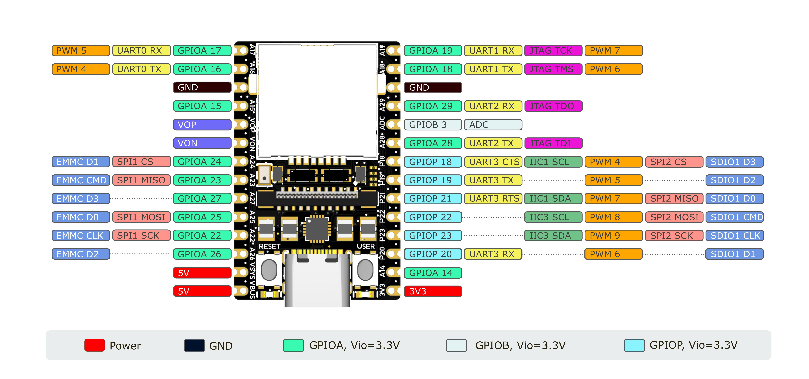

# Pinout



## Connecting to the Board

### UART0

Connect the UART port to the board at:

A17 A16 GND

Then use terminal software to connect to the serial port, with a baud rate of 115200.

### USB CDC ACM Serial Port

When the board's USB Type-C port is connected to a computer, it will provide a USB CDC ACM serial port device (provided by Linux gadget).

Linux:

```
# Replace /dev/ttyACMX with the specific device, depending on your computer
picocom -b 9600 /dev/ttyACMX
```

Windows:

Press Win + R, enter devmgmt.msc, and press Enter.

Find the new device's serial port number under the serial port devices.

Then use PuTTY or HyperTerminal to connect.

### USB RNDIS Network Port

When the board's USB Type-C port is connected to a computer, it will provide a USB RNDIS network card device (provided by Linux gadget).

The PC will automatically obtain an address using DHCP.

Replace the last digit of the automatically obtained IPv4 address with 1 to get the board's IPv4 address:

```
10.44.55.66 PC's IPv4 address
10.44.55.1  Board's IPv4 address
```

Then use ssh to connect: `ssh root@board's IP address`

Username: root
Password: cvitek

### Ethernet Connection

Connect the Ethernet cable to the board; the board will automatically obtain an address using DHCP upon boot.

The board's image defaults to enabling the MDNS service.

Use the command:

```
avahi-browse -art | grep lpirvnano
```

to list devices in the broadcast domain with lpirvnano in their domain names.

Then use:

```
ssh root@lpirvnano-XXXX.local
```

to connect to the board.

## Disabling the Boot Demo of the Image

```
# Clear rc.local
echo '#!/bin/sh' > /etc/rc.local
# Reboot
reboot
```

## Audio

The LicheeRV Nano supports recording and playback. Standard ALSA tools can be used for recording, playback, and other operations.

### Recording

First, set the microphone volume, range: 0-24

```shell
amixer -Dhw:0 cset name='ADC Capture Volume' 24
```

After setting, start recording:

```shell
arecord -Dhw:0,0 -d 3 -r 48000 -f S16_LE -t wav test.wav & > /dev/null &
```

### Playback

```shell
./aplay -D hw:1,0 -f S16_LE test.wav
```

## I2C

I2C1 and I2C3 are brought out on the pin header, and devices can be connected to them.

Before using, you need to correctly set the PINMUX:

```
shell# I2C1
devmem 0x030010D0 32 0x2
devmem 0x030010DC 32 0x2
# I2C3
devmem 0x030010E4 32 0x2
devmem 0x030010E0 32 0x2
```

Then you can use i2c-tools to operate the i2c peripherals. The image is already pre-installed.

## ADC

An ADC route is brought out on the pin header, using ADC1.

First, select the ADC channel, here taking ADC1 as an example:

```shell
echo 1 > /sys/class/cvi-saradc/cvi-saradc0/device/cv_saradc
```

Read the value of ADC1:

```shell
cat /sys/class/cvi-saradc/cvi-saradc0/device/cv_saradc
```

## LCD

Connect the screen's ribbon cable to the board's MIPI interface, paying attention to the wire order.

Edit /opt/fb_load.sh on the board, and uncomment the specific model's initialization command.

Then execute:

```
/opt/fb_load.sh # Initialize the screen driver
devmem # Test color bars
```

If it works, you can add it to the boot script:

```
echo /opt/fb_load.sh >> /etc/rc.local
```

The LCD will provide a framebuffer for user space programs to access.

It is recommended to use QT5, SDL1.2, or LVGL for UI development, or you can write directly to the Framebuffer.

For direct framebuffer writing, refer to /opt/src/vendortest in the board's filesystem.

## Touch Screen

Connect the touchscreen ribbon to the board's touchscreen interface, paying attention to the wire sequence.

Then execute:

```
/opt/touch.sh # Load the touchscreen driver
```

Followed by:

```
echo 2 | evtest
```

Touching the screen will display specific coordinates in the terminal.

For reading coordinates and touch events, refer to the input section in /opt/src/vendortest.

## WIFI

Install the antenna onto the WIFI module's antenna connector.

Then write the AP's SSID and password into the /etc/wpa_supplicant.conf file:

```
network={
        ssid="ssid"
        psk="password"
}
```

After that, execute:

```
/opt/wifi.sh
```

To verify if the network is available:

```
ping your gateway address
```

If available, you can add it to the boot script:

```
echo '/opt/wifi.sh' >> /etc/rc.local
```

## Camera

Install the camera onto the camera mount, paying attention to the wire sequence.

Then execute:

```
/opt/camera.sh 0

echo "
1
0
1
255" | sensor_test # Capture an image, saved in the current directory
```

## Button

To view button events, use the command:

```
echo 1 | evtest
```

Then press the USER button, and you will see the corresponding event report in the terminal.

## HelloWorld

For information on compiling programs using the vendor's toolchain, visit:

https://github.com/sipeed/LicheeRV-Nano-Build/blob/v4.1.0/build/boards/cv181x/cv1812cp_licheerv_nano_sd/readme.md#compile-program-use-vendors-toolchain
