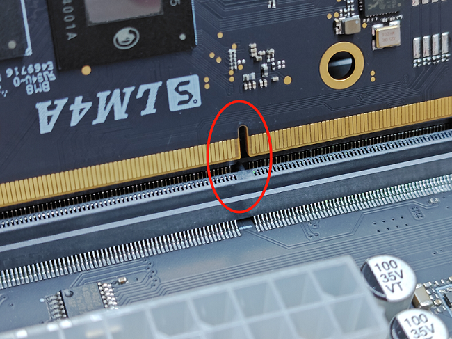
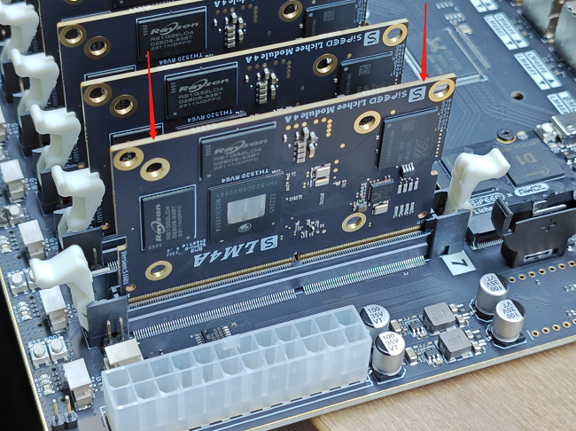
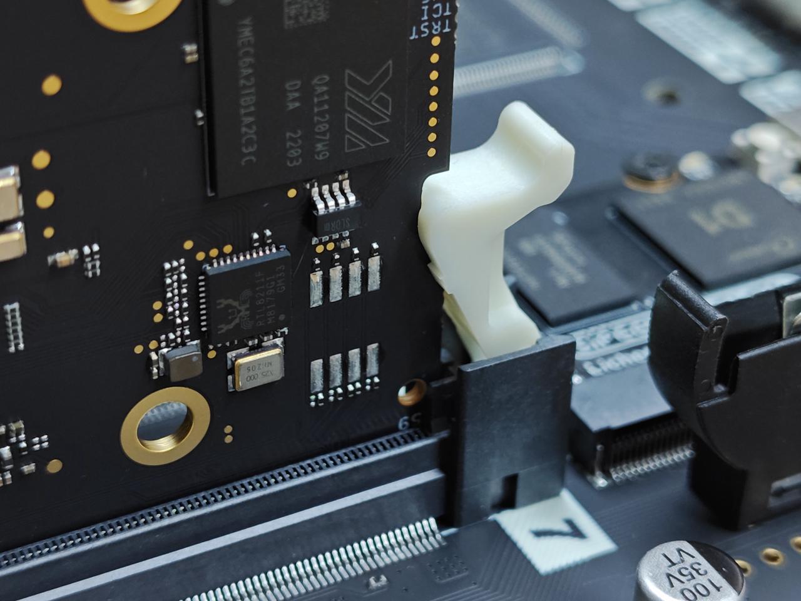
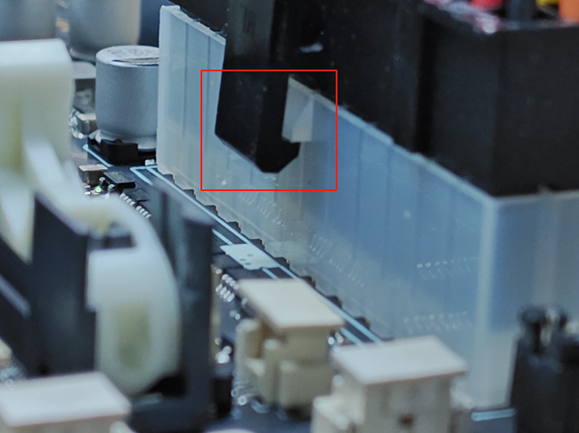
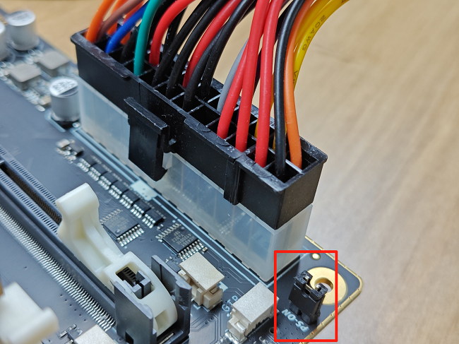

## Introduction

Lichee Cluster 4A (hereinafter referred to as LC4A) is a high-performance RISC-V cluster computing platform developed by SiliconSpeed Technology. It can be used to build multi-node computing clusters, and can also learn Kubernetes, automation, edge artificial intelligence computing, local mini servers, and hosted applications. Excellent tool for programs, containers, etc. A single Lichee Cluster 4A can be equipped with up to 7 LM4A core boards. Each LM4A core board contains an NPU with 4TOPS@int8 AI computing power. A single core board supports up to 16GB LPDDR4X memory and 128G eMMC storage. The entire cluster has strong flexibility and reliability. Scalability.

Lichee Cluster 4A has an onboard eight-port Gigabit switch to provide high-speed connections and easily connect multiple nodes to form a powerful computing cluster. It also supports USB3.0 and SD card storage expansion, making it easy to expand additional storage or add peripherals. equipment.

Lichee Cluster 4A also comes with BMC (out-of-band management), which independently connects the system serial port and reset pin of each LM4A. BMC can reset a single computing node from the hardware, and can also execute commands through the serial port, such as executing ser2net or kermit to manage slots.

## Technical specifications

<table>
<colgroup>
<col class="org-left" />
<col class="org-left" />
</colgroup>
<tr>
<td class="org-left">Supported core boards</td>
<td class="org-left"> <a href="https://wiki.sipeed.com/lm4a">LM4A</a> * 7</td>
</tr>
<tr>
<td class="org-left">CPU</td>
<td class="org-left"><strong>RiscV C910@1.85GHz * 4</strong> * 7</td>
</tr>
<tr>
<td class="org-left">GPU</td>
<td class="org-left">IMG™ B Series BXM-4-64 * 7</td>
</tr>
<tr>
<td class="org-left">NPU</td>
<td class="org-left">4TOPS@INT8 * 7</td>
</tr>
<tr>
<td class="org-left">RAM</td>
<td class="org-left">Max 16GB * 7</td>
</tr>
<tr>
<td class="org-left">EMMC</td>
<td class="org-left">Max 128GB * 7</td>
</tr>
<tr>
<td class="org-left">BMC</td>
<td class="org-left"><a href="https://wiki.sipeed.com/Lichee-RV">SIPEED Lichee RV</a></td>
</tr>
<tr>
<td class="org-left">Power management</td>
<td class="org-left"><a href="https://wiki.sipeed.com/m0sense"> Sipeed M0 Sense</a></td>
</tr>
<tr>
<td class="org-left">Ethernet</td>
<td class="org-left">Gigabit Ethernet 1 (Slot#1)<br>Gigabit Ethernet 2 (Switch)<br>100 Mbit Ethernet (BMC)</td>
</tr>
<tr>
<td class="org-left">USB</td>
<td class="org-left">USB3.0 * 7 (LM4A)<br>USB2.0 * 1 (BMC)</td>
</tr>
<tr>
<td class="org-left">HDMI</td>
<td class="org-left">HDMI * 1 (Slot 1)</td>
</tr>
<tr>
<td class="org-left">SDCARD</td>
<td class="org-left">TF * 7</td>
</tr>
<tr>
<td class="org-left">Power support</td>
<td class="org-left">Supports DC port DC power supply<br>Supports ATX 24PIN power supply</td>
</tr>
<tr>
<td class="org-left">RTC power supply</td>
<td class="org-left">CR2032 button battery</td>
</tr>
<tr>
<td class="org-left">Heat dissipation</td>
<td class="org-left">5V PWM fan interface * 7<br>12V 4PIN PWM fan interface * 1</td>
</tr>
<tr>
<td class="org-left">Dimensions</td>
<td class="org-left">Mini ITX, 17 * 17 cm (6.7 * 6.7 inch)<br> Optional MINI ITX chassis, 20 * 12 * 22 cm</td>
</tr>
</table>

## Hardware system

### Motherboard introduction


### Motherboard frame diagram


LicheeRV SOM (D1 C906@1GHz) has 5 native serial ports and two USB serial ports, which are independently connected to 7 SOMs.

Each LM4A's RST/BOOT can be controlled via an analog switch.

LM4A No. 1 has the second Gigabit port and HDMI port by default, which facilitates the SOM to perform task distribution operations for the entire cluster.

The motherboard can be powered by a 12V DC charging head (12V9A or above recommended), or by a standard ATX power supply.

### Chassis introduction

It is recommended to choose the MINI-ITX chassis. This chassis has good appearance and heat dissipation performance, and is convenient for the deployment and display of computing clusters.

The chassis is adapted to the MINI-ITX motherboard, equipped with a 250W high-power power supply, and installed with a 12cm silent fan for heat dissipation, which can ensure that the CPU temperature is below 70 degrees when running at full load.


### Hardware Installation Guide

By default, all SOMs have been installed on the LC4A during transportation. If you need to remove or upgrade the SOM, please refer to the following instructions.

#### Install core board

Pull the white lock buckle to both sides. Please confirm the gap before inserting to avoid damage caused by incorrect direction.



After placing the core board, apply downward pressure evenly



After hearing a click, confirm that the white lock is properly engaged and the installation is complete. If you need to take out the core board, just pull the white locks to both sides.



#### Install BMC

Install the burned image SD card to LicheeRV, then install the LicheeRV module to the seat next to the switch chip, and then tighten the screws.

#### Plug in power

Optional ATX power supply or DC movie power supply.

Make sure the buckle of the ATX power socket is fastened to avoid poor contact causing the connector to heat up.



Plug in the jumper cap



#### Internet connection

The cluster system mainly connects to two external network ports: 1. Onboard Gigabit switch network port 2. BMC network port
It is recommended that the onboard Gigabit switch network port be connected to the user's intranet or main network for the cluster to obtain required network data.
It is recommended that the BMC network port be connected to an independent network for cluster control, which is more secure.
The clusters are connected internally through Gigabit switches.

How to get the cluster’s IP address:

The pre-installed firmware installation has the mdns service enabled
Enable avahi service on your PC (Linux)
Use mdns to scan the entire network to obtain the mdns domain name information of lc4a:
```
avahi-browse-art | grep lc4a
```
Then use:
```
ssh debin@lc4aXXXX.local
```
XXXX is the last four digits of the mac address, used to distinguish each slot

## Software system

### LM4A Mirror

The LM4A SOM in the cluster can directly use the LicheePi4A image.

If you need to enable USB, you can apply the following PATCH in the Linux device tree: [Click here to download](https://dl.sipeed.com/fileList/LICHEE/LicheeCluster4A/04_Firmware/lpi4a/src/linux/0001-arch- riscv-boot-dts-lpi4a-disable-i2c-io-expander-fo.patch)

Or use the precompiled image directly: [Click here to download](https://dl.sipeed.com/shareURL/LICHEE/LicheeCluster4A/04_Firmware/lpi4a/bin)

Image burning method:

1. Press the BOOT button and press the RST button at the same time, then use the A to A male USB cable to connect to the computer

2. Burn using fastboot tool

### OpenBMC Image

The LicheeRV SOM on the motherboard runs OpenBMC to manage the SOM on the motherboard.

Mirror download address: [Click here to jump](https://dl.sipeed.com/shareURL/LICHEE/LicheeCluster4A/04_Firmware/bmc/bin)

Image burning method:

```
bmaptool copy obmc-phosphor-image-lichepi-rv.wic.gz /dev/YOUR_SDCARD
```

Default username: `root`

Default password: `0penBmc`

0 is zero, not O

If you need to develop customization, please download PATCH:

https://dl.sipeed.com/shareURL/LICHEE/LicheeCluster4A/04_Firmware/bmc/src

And applied to OpenBMC source code:

```
git clone https://github.com/openbmc/openbmc/
git checkout commit-id
git amxxx.patch
```

### OpenBMC Management

Access Slot's serial port from SSH:

```
ssh -p 2301 root@bmcip # access first slot's serial port
```

* Port 22: OpenBMC shell

* Port 2301: SOL (Serial Over LAN) of slot1
* Port 2302: SOL for slot2
* Port 2303: SOL for slot3
* Port 2304: SOL for slot4
* Port 2305: SOL for slot5
* Port 2306: SOL for slot6
* Port 2307: SOL for slot7

The serial port of each Slot is output to the log:

```
cat /var/log/obmc-cons*.log
```

