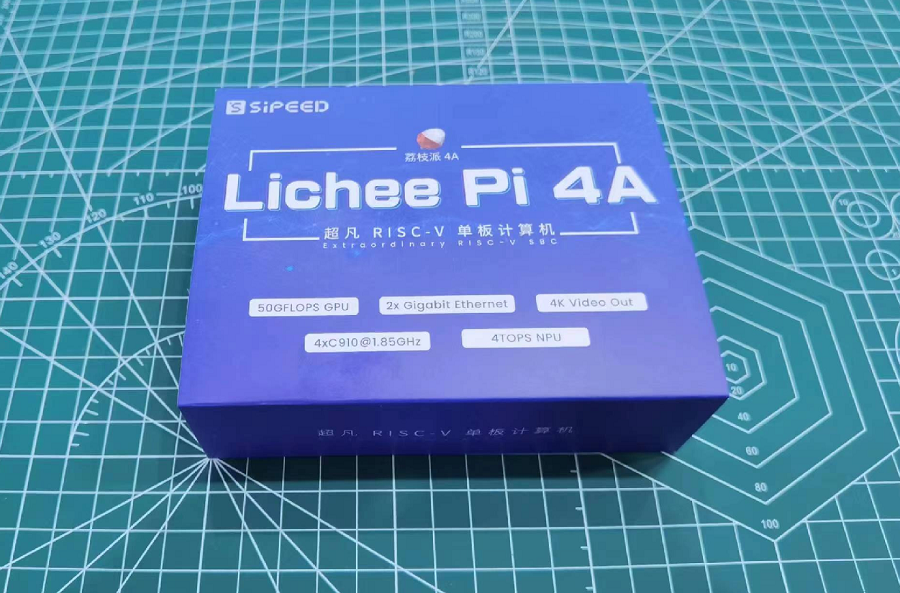
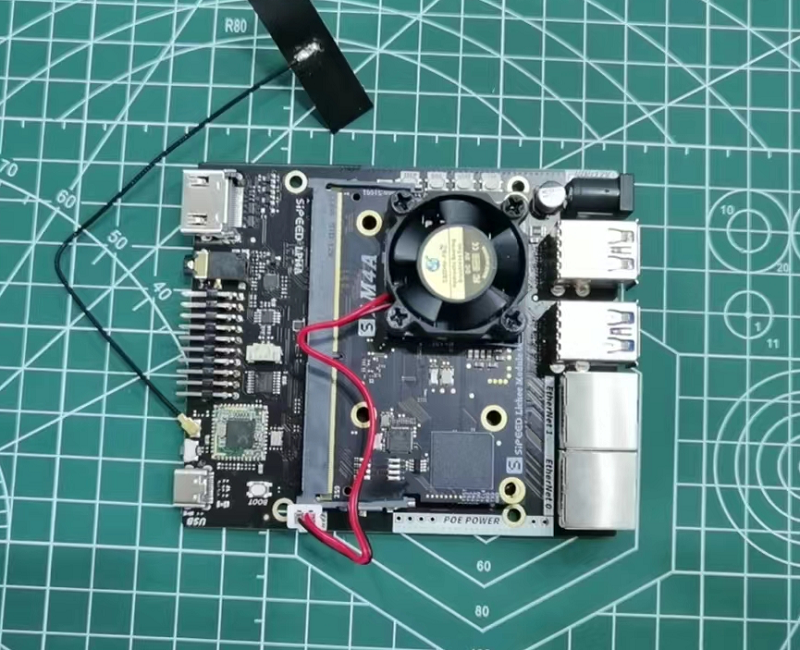
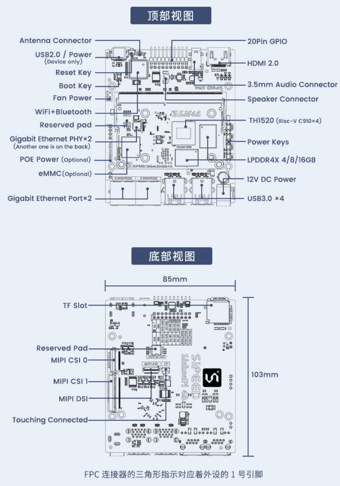

## 开箱内容

LicheePi 4A 分为两个版本，内测版与正式版。 
内测版于 2023 年 5 月发售，仅有 8+8（DDR+eMMC）版本，各部分功能基本正常。
正式版预计于 2023 年 6 月发售，将有 8+32,16+128 版本，也会针对内测版用户提出的相关建议进行局部微调优化，功能/镜像与内测版会保持一致。

### 内测版

如果你是第一批内测版 LicheePi 4A 用户，你收到的包裹内将是如下包装：

打开塑料盒包装，你将看到如下的内容：
 
包裹在黑色泡棉内的就是 LicheePi 4A 主体，其余标号部件为：
1. 30x30mm 散热硅脂
2. 30mm 5V 散热风扇，右边已连接至风扇插针。如果松动脱出，请自行安装回去，注意红线为正极，装反后风扇不会转动。
3. 2.4G WiFi 天线，已安装至 IPEX 座子。如果松动脱出，请自行安装回去。
4. USB-C 线缆，作为供电和下载镜像使用。

如果开箱后发现缺少相关部件，请联系客服咨询。

### 正式版

（预计2023年6月发售）

### 选配件

如果你购买了选配件的话，包裹里还可能有：

图中上半部分是选配的 RVDebugger Plus，具有 JTAG+UART 功能，如果你需要进行底层调试，可选购买。
图中下半部分是选配的 12V2A 电源适配器，如果你需要在板子上外接大量耗电外设（如 USB，MIPI 屏），可选购买。

5V2A USB 供电可满足板卡在 1.85GHz 下的满载烤机运行

以及未来还会有POE供电模块（TODO）

## 组装板卡

### SOM安装

默认情况下 LM4A SOM 已经安装至主板上，如果你需要升级/替换 SOM，可按如下说明进行 SOM 的取出和安装

1. 取出 SOM:
   <table>
    <tr>
      <td colspan=2>先用手指往外拨动弹片解锁 SOM, 然后将 SOM 取出</td>
    </tr>
    <tr>
      <td></td>
      <td></td>
    </tr>
   </table>

2. 安装 SOM:
   <table>
    <tr>
      <td colspan=2>先把 SOM 斜着插入连接器插槽, 然后按压SOM，两边弹片会自动锁住SOM</td>
    </tr>
    <tr>
      <td></td>
      <td></td>
    </tr>
   </table>

### 散热器安装

LicheePi 4A 是高性能 SBC，需要安装主动散热器对 SOM 进行散热，否则在满载时可能由于核心过热而自动降频，无法达到最优性能。
1. 安装导热硅脂片
    取出导热硅脂片，撕开两面薄膜，将硅脂片放置在下图位置并轻轻按压固定（硅脂片自己具备一定粘性可以固定住），注意完整覆盖住主芯片与两颗内存芯片
    

2. 安装散热风扇
    在硅脂片上对齐安装30mm的散热风扇，并轻轻按压固定住。
    

3. 安装散热风扇电源
    默认收到时应该已经插入好了风扇电源，如果风扇电源线脱出，请按下图所示插入，注意电源线顺序，装反风扇不会旋转。
    注意，该位置上的插针电源受 linux 内核控制，需正确配置内核才会旋转，如果风扇不转，也可插到板卡下方的 20pin 插针的 5V + GND 处测试风扇好坏。
    

### WIFI天线安装 

默认情况下WIFI天线已经安装在主板上，如果脱出，请按照下图安装回去：

### POE模块安装

选配，TODO。

### 组装完成

组装完成后的状态如下所示：

## 启动板卡

LicheePi 4A出库已预烧录了基础系统镜像，至此你已可以快速进行开机体验！
注意：预烧录的系统镜像版本可能比较旧，体验不佳，完成上电体验后，可以根据下章教程进行镜像更新。

使用 HDMI 线缆(自备)连接显示器(自备)与 LicheePi 4A 的 HDMI 口，使用配套的 USB-C 线缆连接到至少 5V2A 输出的 USB 电源(自备)上，LicheePi 4A 即会开机启动，默认镜像会在 30s 内启动到桌面系统的登录界面。

默认镜像有两类帐号密码配置，可以都尝试下：
1. 帐号：`root`，`debian`，`sipeed`；密码均为 `licheepi`
2. 帐号`debian`，密码`debian`；帐号`sipeed`，密码`licheepi`

如果按照上述操作，没能点亮显示器，进入系统，有以下可能请自查：
1. 检查电源电压是否正常，USB-C 口连接是否正常，电源指示灯是否点亮
2. 检查散热器是否正常安装，风扇是否旋转
3. 检查 HDMI 是否稳固连接，显示器是否开机，以及可以尝试更换显示器测试
4. 也可能是出厂遗漏固件烧录，请按下章方法进行镜像烧录后再试
5. 如果以上均不奏效，请联系客服售后

## 板卡硬件说明

完成初次点亮板卡后，可以静下心来认识下 LicheePi 4A 的硬件，方便后期可能的维护工作。
 

### 超频说明

TH1520 标称频率为 1.85GHz，我们仅保证你收到的板卡可以稳定工作在 1.85GHz。
如果你是发烧玩家，想进行超频操作，那么你有一定概率可以超频到 2GHz，但我们不保证在该频率下的稳定性。
经不完全测试，约有 80% 的 SOM 可以超频至 2GHz 启动系统，约有 50% 的 SOM 可以在 2GHz 下跑通压力测试。

### USB 限流说明

由于系统最大电源输入能力为 12V2A，即约 24W，转换为 5V 后，大约有 20W 左右有效功率。
为了更好地为 SOM 供电（SOM 在超频满载情况下可达 12W 功率），所以 USB HUB 处进行了电流限制，限制了 1.5A 的电流（内测版硬件。正式版硬件会根据反馈调整此处电流限制），即 7.5W 功率。
再接入大量 USB 设备时可能会超出该电流限制，此时建议对 USB 设备进行外部辅助供电。
如果需要解除此处电流限制，请进行如下操作：TODO。

### 内测版已知问题

1. 仅支持原生eMMC启动，不支持 SD / SPI Flash 启动。正式版会增加拨码开关选择。
2. HDMI电平转换可能在个别显示器上存在兼容性问题，导致无法设置分辨率。可以尝试更换显示器。
3. 板载音频输出电路的高通滤波电路的截止频率过高（500Hz），导致低音丢失。正式版中会修正RC参数

### 硬件资料下载

[板卡规格书](https://dl.sipeed.com/shareURL/LICHEE/licheepi4a/01_Specification)
[底板原理图](https://dl.sipeed.com/shareURL/LICHEE/licheepi4a/02_Schematic)
[底板点位图](https://dl.sipeed.com/shareURL/LICHEE/licheepi4a/03_Bit_number_map)
[底板尺寸图](https://dl.sipeed.com/shareURL/LICHEE/licheepi4a/04_Dimensional_drawing)
[模型文件](https://dl.sipeed.com/shareURL/LICHEE/licheepi4a/05_3D_model)

## 其他链接

Online store: [Aliexpress](https://www.aliexpress.com/item/1005005532736080.html)

[Github](https://github.com/sipeed/LicheePi4A)
[Sipeed 下载站](https://dl.sipeed.com/shareURL/LICHEE/licheepi4a)

Telegram: https://t.me/linux4rv

联系邮箱：support@sipeed.com