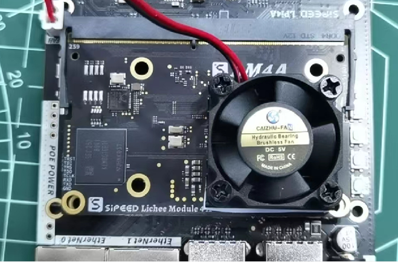
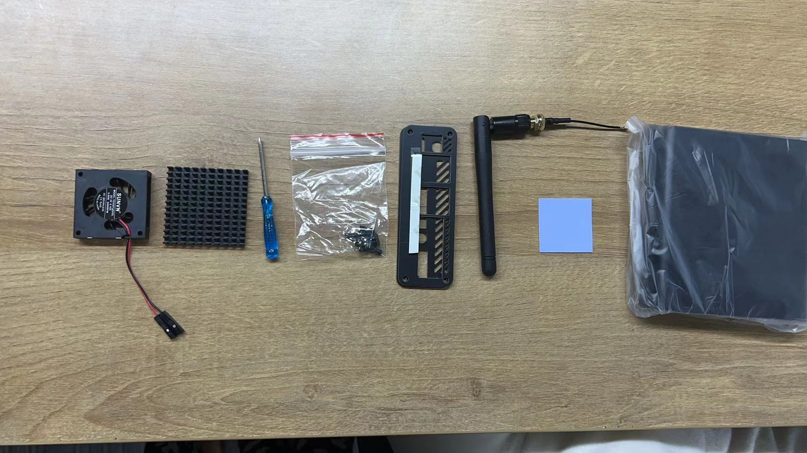
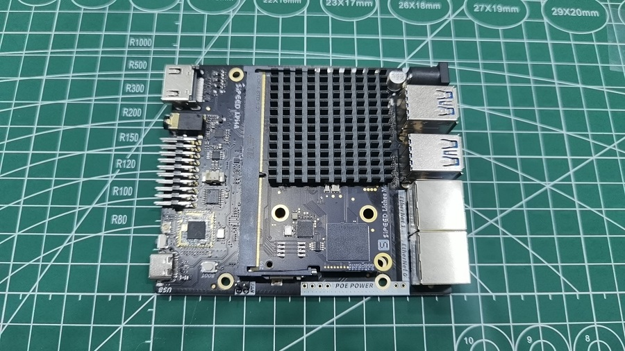
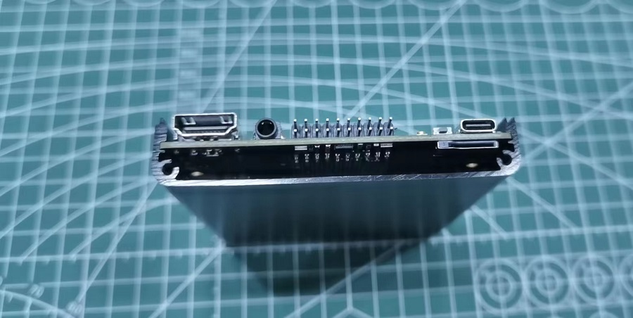
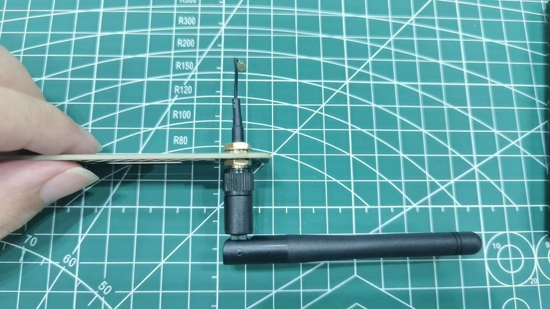
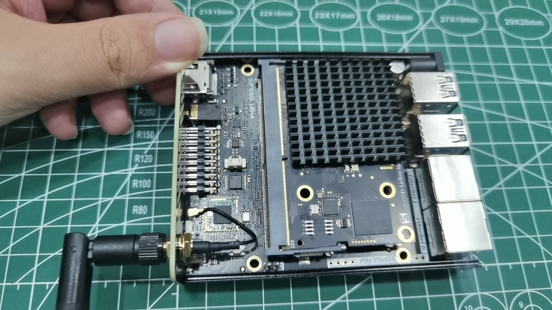
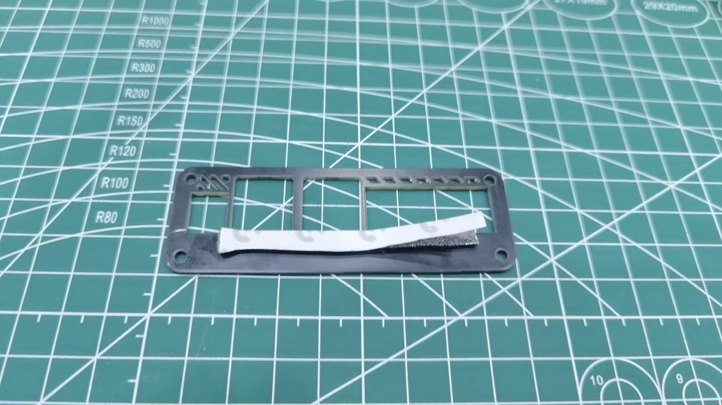
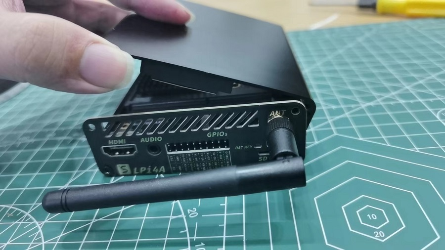
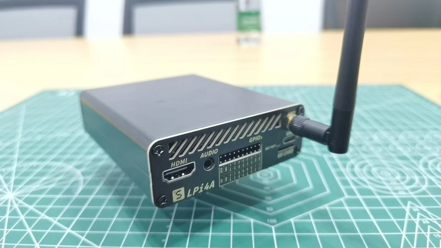
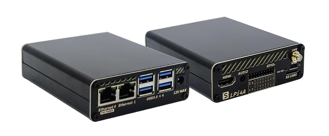

## Unboxing / Box contents

There are two versions of the LicheePi 4A board, the beta version and the official version.
The beta version was released in May 2023. There is only one version of the board with 8+8 (DDR+eMMC).
The official version is expected to release in July 2023, comes up with 8+32 (DDR+eMMC) and 16+128 (DDR+eMMC) version, with some minor adjustments and fixes based on the feedback from the beta version users. The functionality and images will stay the same as the beta version.

### Beta Version

If you received the board as part of the beta program, you will receive the following package:

The opened box will look like this：
 

The main body of LicheePi 4A is wrapped in black foam, and the other labeled parts are:
1. 30x30mm thermal grease pad, used to attach the heatsink to the CPU.
2. 30mm 5V cooling fan. The connector should be plugged into the 5V fan header on the board. Note: The red wire is the positive wire and should be connected to the + pole. The fan will not work if you reverse the polarity.
3. 2.4G WiFi Antenna, already connected to the IPEX socket. If it comes loose please re-attach it yourself.
4. USB-C cable, used for power supply and image flashing.

If you miss any part during unpacking, please contact customer service for help.

### Offical Version

Here is what you will receive if you purchase the official LicheePi 4A:

The side of the package shows the memory/eMMC version of the enclosed hardware. If it does not match your purchase, please contact customer support:

 

Removing the blue cover reveals a white box package:

Opening the white box reveals the LicheePi 4A board:

Note the two QR codes on the board. The one on the USB port is the base board production info, indicating the base board model, version, production date, e.g.  
`LPI4A0-23070702067`.

The one on the SOM is the SOM production info, indicating the SOM model, memory, eMMC, MAC addresses (second port is address+1), and production date, e.g. 
`LM4A0-16128-48DA3560003E-23071100318`.

Removing the board reveals the included accessories in the bottom of the box, a USB cable, heatsink, and thermal paste:

 

Please contact customer support if any items are missing from your order.

### Optional Accessories

The LicheePi 4A also has a variety of optional accessories as shown below:

Purchase recommendations:

|Accessory|Description|
|-|-|  
|Aluminum Case|Suitable as a small host or router case|
|10.1" Touch Screen|1280x800 4lane MIPI, suitable for vehicle computers, Android debugging| 
|OV5693 Camera|5MP camera, suitable as a native camera for mobile devices like Android debugging|
|USB Camera|5MP USB camera with onboard mic, suitable as a webcam for OpenCV|
|PoE Power Module|5V2.4A PoE power module, for PoE power over Ethernet for gateway applications| 
|12V Power Adapter|12V2A power adapter, for powering many external peripherals|
|RV Debugger Plus|UART+JTAG debugger board for connecting to serial console|

## Assembling the board

### SOM installation

By default, the LM4A SOM has been installed on the motherboard. If you need to upgrade/replace the SOM, you can follow the instructions below to remove and install the SOM

1. Removing the SOM:
   <table>
    <tr>
      <td colspan=2>Unlock the board by pushing the retainer tabs outwards and lift up the SOM</td>
    </tr>
    <tr>
      <td></td>
      <td></td>
    </tr>
   </table>

2. Installing the SOM:
   <table>
    <tr>
      <td colspan=2>First insert the SOM into the connector, ensure that it´s pushed all the way in and push down on both sides till the retainer clips automatically hold the board.</td>
    </tr>
    <tr>
      <td></td>
      <td></td>
    </tr>
   </table>

### Cooler Installation 

LicheePi 4A is a high performance SBC，you need to install an active cooler to dissipate the heat. Otherwise it might automatically throttle the frequency due to overheating and is unable to deliver the full performance.
1. Installing the thermal pad,
    take the thermal pad and remove the protective film from both sides, then place the thermal pad in the location shown below, the thermal pad can be re-arragnet if needed. Please ensure that you cover the main CPU as well as both memory chips fully.
    

2. Installing the fan / heatsink
    Allign the 30x30mm heatsink and fan with the thermal pad and press down lightly.
    

3. Connecting the cooling fan
    By default the cooling fan should already be plugged in when you received the board. If the fan power cables was unplugged, please re-plug it as shown in the image below.
    Pay attention to the polarity of the fan, in case the fan is plugged-in backwards it will not work.
    Note: The fan is controlled by a linux kernel driver which needs to be configured correctly to work. (fan does not spin per default)
    If you are unsure if the fan works, you can test it by plugging it into a +5V and GND pin on the 20-pin GPIO header.
    

### WiFi Antenna Installation 

The WiFi antenna is already connected when you receive the board. If it got unplugged, here is how to install it:

### POE module installation

The POE module can be purchased seperatly. It´s a 5V POE power module with a length of 35.6mm, which can be soldered to the POE POWER holes on the development board.

The PoE module should be installed like this：

   <table>
    <tr>
      <td></td>
      <td></td>
    </tr>
   </table>

### Assembly completed

This is what the fully assembled board looks like:

## Booting the board

LicheePi 4A is pre-loaded with a basic system image, so you can try it out directly!

Note: The pre-loaded system image might be very old. After you booted the system for the first time, please have a look at the next section on how to flash / update the image.

Use an HDMI cable (not included) to connect a display (not included) to the HDMI port of LicheePi 4A. Use the supplied USB-C cable to connect the board to a USB power supply (not included) with at least 5V and 2A output.
The LicheePi 4A will automatically boot into the default image and the login screen should appear within 30 seconds, or automaticly login via sipeed username.

The default image's account and password configurations is:
User: `debian`，password: `debian`;
User: `sipeed`，password: `licheepi`;
root has no password by default.

If you followed the above procedure, but your display fails to show any image, please check the following:
1. Check whether the USB-Power supply is connected correctly, works and whether the power LED is lit on the board.
2. Check that the heatsink is installed correctly and that the fan is spinning.
3. Check that the HDMI connection is correct and that the display is turned on and the correct input is selected.
4. It might be the case that there is no pre-loaded image from the factory, in this case check the next section on how to flash an image.
5. If none of the above works, please contact us for support.

## Aluminum Case Installation Guide

### Case Accessory Overview
The shell accessories should include the following contents, if there is something missing, please contact customer service.

From left to right:

1. 3507 Turbo Fan 
2. 40x40x5mm Aluminum Heat Sink  
3. Small Phillips Screwdriver
4. M3x5 Flat Head Screws x 8
5. Case Cover Plates x 2
6. IPEX to SMA Pigtail + SMA Whip Antenna
7. 30x30mm Thermal Paste Sheet
8. Aluminum Case x 2

### Install Heat Sink
1. Prepare board  

2. Apply thermal paste
   

3. Install heat sink in orientation

### Install Cover Plates 
1. Slide in board  

2. Install antenna to plate
   

3. Install antenna to PCB
   

4. Install front plate (2 screws)

5. Remove foam from back plate  

6. Install back plate (2 screws) 

### Install Fan
1. Connect fan power to pins (red on top, black on bottom), attach fan to top shell (ensure fan is close to shell edge to straighten wires)   

2. Carefully cover from right, ensure wires are not snagged

### Install Remaining Screws

### Final Result

## POE Module Installation

The POE module requires manual soldering as shown:

> Note that the POE module **cannot** be inserted into the metal case after soldering.

## Board hardware overview

After booting up the board for the first time, let´s take a look at the hardware of LicheePi 4A, so you can get familiar with it and maybe do some maintenance work in the future.
 

### Overclocking

The nominal operating frequency of the TH1520 is 1.85GHz, and we only guarantee that the board you receive can work stably at 1.85GHz.
If you are an enthusiast you can try to overclock the board to 2GHz, but we don´t guarantee that the board will work stable at this frequency.
After some testing, about 80% of the boards can boot into the system when overclocked to 2GHz and about 50% of the boards sucessfully pass the stress test at 2GHz.

### USB Power Limitation

The maximum input power of the board is 12V at 2A which is 24W. After it is converted to 5V on the board, there is about 20W of effective power available.

In order to provide maximum power to the SOM (the SOM can pull up to 12W when overclocked), the output of the USB-Hub is limited to 1.5A. This is for the pre-production version of the board, the final version will have a higher current limit based on feedback from the community.
When you connect a large number of USB-Devices, you might exceed this current limit, in this case we recommend to use an external power supply for the USB devices.
If you need to disable the current limit, please do the following: TODO

### Differences between the official version and the beta version

1. Added high-voltage protection at the input of the USB-C port to prevent some fast charging adapters from burning the SOM due to high-voltage input
2. The system serial port IO adds a level conversion IC to 3.3V, which can be connected with a common serial port module
3. Repair the automatic switching circuit of the earphone and speaker (the speaker circuit of the beta version is not in place and unstable)
4. Add a new mic input in the headphone socket
5. Added boot media dial switch (bottom of SOM), optional TF/eMMC boot
6. Other details silk screen, component fine-tuning 

### Board info download links

[Specification / Datasheet](https://dl.sipeed.com/shareURL/LICHEE/licheepi4a/01_Specification)
[Schematic](https://dl.sipeed.com/shareURL/LICHEE/licheepi4a/02_Schematic)
[BOM](https://dl.sipeed.com/shareURL/LICHEE/licheepi4a/03_Bit_number_map)
[Dimensional Drawing](https://dl.sipeed.com/shareURL/LICHEE/licheepi4a/04_Dimensional_drawing)
[3D Model](https://dl.sipeed.com/shareURL/LICHEE/licheepi4a/05_3D_model)

## Other links

Online store: [Aliexpress](https://www.aliexpress.com/item/1005005532736080.html)

[Github](https://github.com/sipeed/LicheePi4A)
[Sipeed Site](https://dl.sipeed.com/shareURL/LICHEE/licheepi4a)

Telegram: https://t.me/linux4rv

Contact email: support@sipeed.com