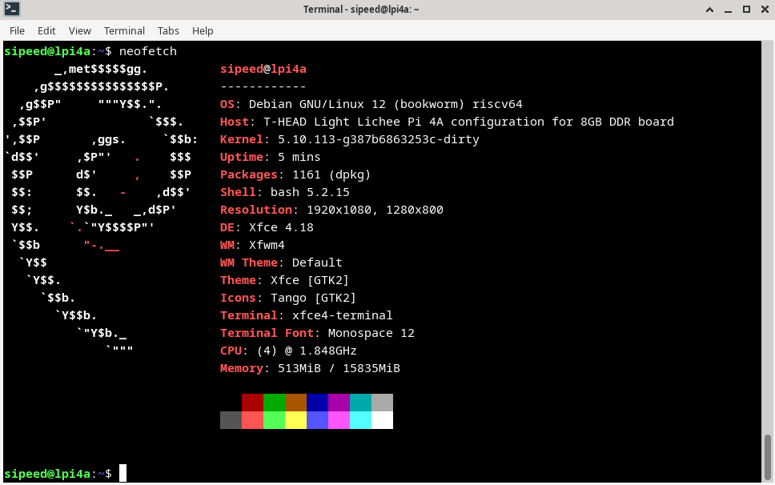

## Supported kernels

Currently T-Heads SDK uses Linux Kernel 5.10: https://gitee.com/thead-yocto
Support is currently added to Linux 6.x, the main contributor of this is `Jisheng Zhang `

## Official Sipeed image

The image for the LicheePi 4A is updated irregularly. The initial image may not be stable, or it may not be able to fully utilize the performance of the TH1520. Please follow the steps below to get the latest image.
The official Sipeed image is based on an adapted Debian.

There may be problems with the memory identification of some 16G memory core boards, which may cause the system to crash when the memory usage is high.

The default image's account and password configurations is:
User: `debian`，password: `debian`;
User: `sipeed`，password: `licheepi`;
root has no password by default.

### Memory Problem Repair Instructions
IMPORTANT：16GB memory board sendout before 2023.8.1 have a buggy images that can't correctly recognize 16GB memory (occupy errors running big applications), please follow the next instructions to fix this error.

Please use the following command to burn a new u-boot to the board. The u-boot used by 16G memory is in the [Mega Cloud Storage link]( https://mega.nz/folder/phoQlBTZ#cZeQ3qZ__pDvP94PT3_bGA), and can also be downloaded from [this link](https://dl.sipeed.com/shareURL/LICHEE/licheepi4a/07_Tools)
The relevant files are in the `20230803_tempfix.zip` compressed package.
(images of 0721 and later versions can be used normally, no need to replace it with the file here)

```shell
sudo ./fastboot flash ram ./images/u-boot-with-spl-lpi4a-16g.bin
sudo ./fastboot reboot
sleep 1
sudo ./fastboot flash ram ./images/u-boot-with-spl-lpi4a-16g.bin
# If there is no device tree corresponding to 16G ddr in the boot.ext4 you use, you need to burn the boot.ext4 corresponding to 16G ddr
sudo ./fastboot flash boot ./images/boot.ext4
```

### Debian




Download Links:

Mega Cloud Storage：[click me](https://mega.nz/folder/phoQlBTZ#cZeQ3qZ__pDvP94PT3_bGA)
ISCAS mirror(including test mirror, ordinary users please use the mirror in the previous network disk): [click me](https://mirror.iscas.ac.cn/revyos/extra/images/lpi4a/)

1. LPI4A_20240111_BASIC.zip

- Release Date: Jan 11, 2024
- Kernel: 5.10
- Root Filesystem: ext4, 4.3GB  
- Preinstalled Software Packages:
  - Development: python3.11
  - Office: libreoffice suite 
  - Browser: chromium
  - Media: 4K video players like Parole, VLC, GIMP
- changelog:
  20230706:
    - Fixed HDMI display device and HDMI audio device recognition issues.
    - Fixed Bluetooth issues. Bluetooth devices now function properly, and Bluetooth headphones can play audio normally.
    - Fixed the issue with the browser shortcut in the bottom launch bar not being available. It is now clickable to access Chromium.
    - Fixed kernel panic issue caused by prolonged connection to a USB camera.
  20230721:
    - Fixed the issue with recognizing 16GB of memory. To fully recognize 16GB of memory, please update this image.
  20230912:
    - Fixed audio quality issue when playing HDMI audio in Chromium.
    - Fixed font pixel loss issue when using dual monitors with different resolutions.
  20231023:
    - Fixed cursor misalignment issue.
    - Fixed the mismatch between NPU driver kernel and user versions.
    - Fixed the failure to burn root file system larger than 4GB.
  20231214:
    - Fixed cursor flickering issue.
    - Added support for Wifi6 driver.
  20240111:
    - Fixed MIPI screen brightness not being adjustable
    - Fixed Bluetooth not working with new WIFI/BT module
- Usage Instructions:
  - Auto login enabled, default login user is sipeed
  - Sudo without password enabled
  - NPU drivers loaded automatically, no manual initialization needed
  - Supports both HDMI and MIPI display, switch in boot menu
    - Boot menu config at /boot/extlinux/extlinux.conf in boot.ext4. 3 options, distinguished by suffix:
       - Suffix (HDMI only) - HDMI only
       - Suffix (HDMI and MIPI) - Dual display
       - Suffix (rescue target) - Recovery
    - Default is HDMI only. Two ways to switch to MIPI:  
       1. Connect serial tool, press 2 to choose MIPI display when boot menu appears, one time only
       2. Edit extlinux.conf, change default l0 to default l1 to change default to MIPI
  - The zip contains two u-boot, note the suffix and device parameters when burning
     - u-boot with 16g suffix is for 16GB memory, no suffix is for 8GB memory
- Known Issues:

2. LPI4A_20240111_FULL.zip

- Release Date: Jan 11, 2024
- Kernel: 5.10
- Root Filesystem: ext4, 9.7GB
- Preinstalled Software Packages:
  - Development: python3.11, GCC, VScode, Kicad (with demo projects), AI env (with precompiled yolov5n/yolov5s executables)
  - Office: libreoffice suite
  - Browser: chromium 
  - Media: 4K video players like Parole (with demo 4K videos), VLC, GIMP, video editor Kdenlive (with demo video clips), kodi
  - Game: SuperTuxKart
  - Other: btop, neofetch
- changelog:
  20230706:
    - Fixed HDMI display device and HDMI audio device recognition issues.
    - Fixed Bluetooth issues. Bluetooth devices now function properly, and Bluetooth headphones can play audio normally.
    - Fixed the issue with the browser shortcut in the bottom launch bar not being available. It is now clickable to access Chromium.
    - Fixed kernel panic issue caused by prolonged connection to a USB camera.
  20230721:
    - Fixed the issue with recognizing 16GB of memory. To fully recognize 16GB of memory, please update this image.
  20230912:
    - Fixed audio quality issue when playing HDMI audio in Chromium.
    - Fixed font pixel loss issue when using dual monitors with different resolutions.
  20231023:
    - Fixed cursor misalignment issue.
    - Fixed the mismatch between NPU driver kernel and user versions.
    - Fixed the failure to burn root file system larger than 4GB.
  20231214:
    - Fixed cursor flickering issue.
    - Added support for Wifi6 driver.
  20240111:
    - Fixed MIPI screen brightness not being adjustable
    - Fixed Bluetooth not working with new WIFI/BT module
- Usage Instructions: 
  - Auto login enabled, default login user is sipeed
  - Sudo without password enabled
  - NPU drivers loaded automatically, no manual initialization needed
  - Supports both HDMI and MIPI display, switch in boot menu
     - Boot menu config at /boot/extlinux/extlinux.conf in boot.ext4. 3 options, distinguished by suffix:
        - Suffix (HDMI only) - HDMI only  
        - Suffix (HDMI and MIPI) - Dual display
        - Suffix (rescue target) - Recovery 
     - Default is HDMI only. Two ways to switch to MIPI:
        1. Connect serial tool, press 2 to choose MIPI display when boot menu appears, one time only
        2. Edit extlinux.conf, change default l0 to default l1 to change default to MIPI
  - The zip contains two u-boot, note the suffix and device parameters when burning
     - u-boot with 16g suffix is for 16GB memory, no suffix is for 8GB memory
- Known Issues:

<!-- 1. LPi4A_Test_0425
   1. Release date: April 25, 2023
   2. Linux Kernel version: 5.10
   3. rootfs: ext4, 4.3GB
   4. Pre-Installed packages:
      1. Development utilities
      2. Office suite
   5. Fixed issues:
   6. Known problems：
      1. GPU sometimes turns off
      2. After installing the ibus input method, the GPU will be turned on, and the problem of GPU double-buffering (terminal + graphical interface) will be reproduced.
2. LPI4A-tempfix0428
   1. Release date: April 28, 2023
   2. Linux Kernel version: 5.10
   3. rootfs: ext4, 4.3GB
   4. Pre-Installed packages: TODO
   5. Fixed issues:
      1. Temporarily fix the problem of terminal display lag in version 0425, but it will increase CPU usage and halve GPU efficiency
   6. Known issues:
      1. After installing the ibus input method, the GPU will be turned on, and the problem of GPU double-buffering (graphical interface) will be reproduced. -->

### OpenWRT


[Click me](https://github.com/ruyisdk/openwrt)

### Android


Readme and image download link: [Click me](https://gitee.com/thead-android/thead-android)

Prebuild Image Download Links:

Mega Cloud Storage：[click me](https://mega.nz/folder/phoQlBTZ#cZeQ3qZ__pDvP94PT3_bGA)

> The Android 13 SDK is still in its infancy, and the problems will be gradually fixed

The precompiled image file of Android 13 is provided in the network disk download link of Sipeed official image, and the burning method after downloading is as follows. Please use the version downloaded from here for the fastboot tool:
https://developer.android.com/tools/releases/platform-tools

There are also fastboot files in the network disk.

```shell
#Burn uboot and initialize boot environment variables
fastboot flash ram u-boot-with-spl.bin
fastboot reboot
fastboot flash uboot u-boot-with-spl.bin

#Burn all partitions
#In the non-boot burning mode, you can enter the command fastboot usb 0 in the uboot command line to burn the partition separately
fastboot flash bootpart bootpart.ext4
fastboot flash boot boot.img
fastboot flash vendor_boot vendor_boot.img
fastboot flash super super.img
fastboot flash userdata userdata.img
fastboot flash vbmeta vbmeta.img
fastboot flash vbmeta_system vbmeta_system.img

#Initialize metadata and misc partition
fastboot erase metadata
fastboot erase misc
```

## Third-party images

The images provided by third parties are listed here for informational purposes only. Sipeed does not guarantee the availability and stability of these images.

### openEuler


Download: [Click me](https://mirror.iscas.ac.cn/openeuler-sig-riscv/openEuler-RISC-V/preview/openEuler-23.03-V1-riscv64/lpi4a/)   
Twitter: https://twitter.com/openEuler   

### DeepinOS

 


Readme and image download address: [Link](https://github.com/aiminickwong/licheepi4a-images)

### openKylin


 

Readme link: [Click me](https://github.com/aiminickwong/licheepi4a-images)
[openKylin V1.0 Download address](https://www.openkylin.top/downloads/index-cn.html)

### armbian

     
Project address: [Click me](https://github.com/chainsx/armbian-riscv-build)  

### Fedora


Project address: [Click me](https://github.com/chainsx/fedora-riscv-builder)  

### Ubuntu


[Click me](http://cdimage.ubuntu.com/ubuntu-base/releases/22.04/release/)


### NixOS (unofficial)


Project address: [Click me](https://github.com/ryan4yin/nixos-licheepi4a)

### Gentoo

Project address: [Click me](https://wiki.gentoo.org/wiki/Project:RISC-V)

The link below shows how to create a Gentoo Linux system from stage3

Deplay Gentoo Linux [Click me](https://wiki.gentoo.org/wiki/User:Dlan/RISC-V/TH1520)


### slarm64

  
Project address: [Click me](https://gitlab.com/sndwvs/images_build_kit)  
Download: [Click me](https://dl.slarm64.org/slackware/images/lichee_pi_4a/)  
