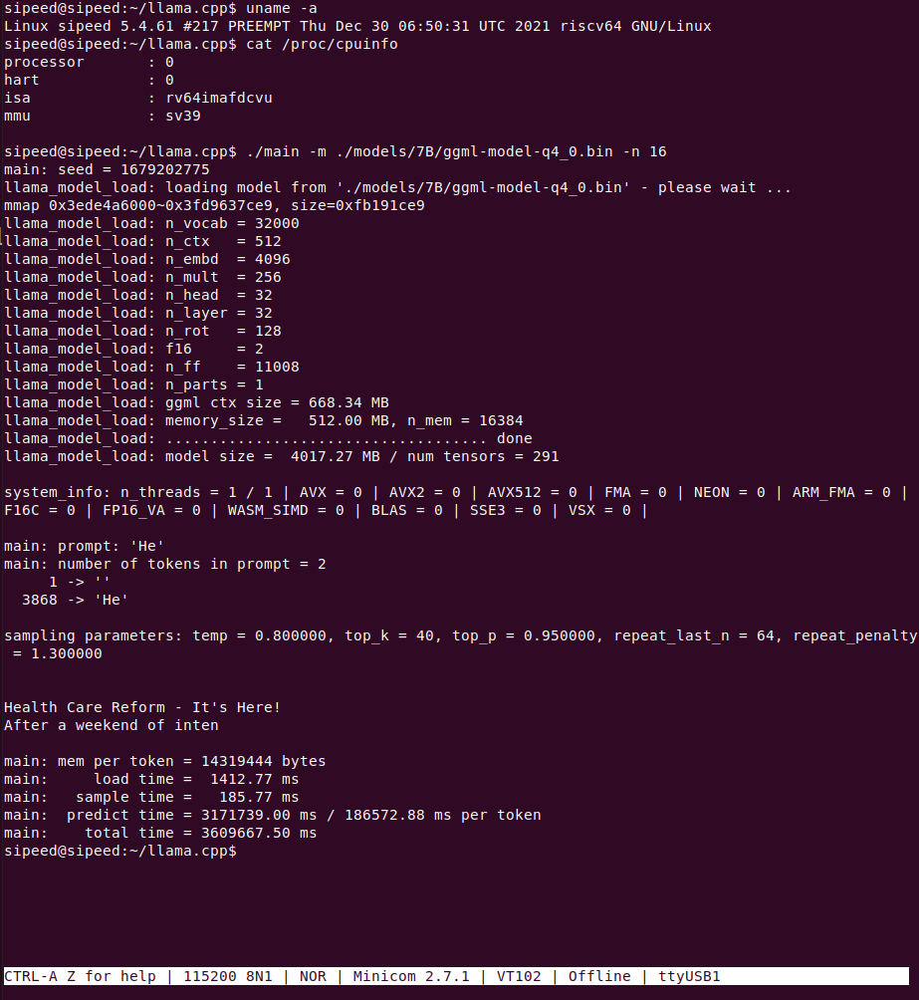
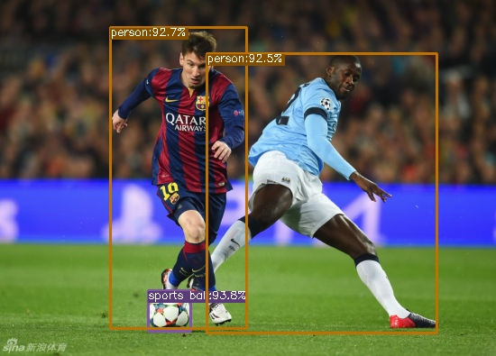

## llama.cpp

llama is the META Open Source Large Language Model, and [llama.cpp](https://github.com/ggerganov/llama.cpp) is the ggerganov Open Source pure cpp runtime llama inference project.
Thanks to llama.cpp, an excellent project, we can run LLM on LicheePi 4A.

Zepan slightly modified llama.cpp [https://github.com/Zepan/llama.cpp](https://github.com/Zepan/llama.cpp) earlier to allow it to run the 7B model with less memory (down to about 700MB).

You can see that TH1520 takes about 6s to compute a token (without V-extension acceleration, which is expected to accelerate it by a factor of 4-8, so feel free to pitch in if you've added V-extension support!)
 

The feasibility of running the 7B model on an entry-level C906 core was also briefly tested, and due to the small amount of memory in the D1 and the use of mmap read-only extensions, a large number of low-speed IO operations were introduced, which slowed down the speed of the run, ending up at only 18s/token.

  

## YOLOX Target Detection

This tutorial is an example of how to deploy the [YOLOX](https://github.com/Megvii-BaseDetection/YOLOX) model to accomplish target detection on the LPi4A (LicheePi 4A) development board platform.
Included in the tutorial:
- Installing the Python environment on the LPi4A development board
- Executing the model using the source code from the YOLOX project.

The tutorial follows the usual model deployment process:
1. Basic Python environment configuration on LPi4A. 2.
2. Obtaining the yolox source code and models
3. Installing python packages that yolox depends on
4. Example execution using HHB-onnxruntime on LPi4A

**Basic Python Environment Configuration**
**Basic Hardware and Software Configuration**

Refer to the description in LPi4A's "[Out-of-the-box experience](https://wiki.sipeed.com/hardware/zh/lichee/th1520/lpi4a/2_unbox.html)", install the development board correctly, and enter with root privileges after powering on and booting up.

Ensure that you are connected to the Internet, and update the apt source.
```bash
sudo apt update
```

Install some software for subsequent use in the example
```bash
sudo apt install wget git vim
```

Installing the SHL Library
```bash
wget https://github.com/T-head-Semi/csi-nn2/releases/download/v2.4-beta.1/c920.tar.gz
tar xf c920.tar.gz
cp c920/lib/* /usr/lib/riscv64-linux-gnu/ -rf
```


**Python Environment Configuration**
Python version 3.11 is installed by default on the system where LPi4A is burned. You can confirm this with the following command
```bash
python --version
```

We will use python 3.11 as an example, but for other versions, you will need to change to the corresponding version of the command when installing dependencies.
Most of the packages that the various python programs depend on can be installed via pip, which can be installed with the following command
```bash
apt install python3-pip
```

Before installing other python packages, install the venv package, which is used to create a python virtual environment
```bash
apt install python3.11-venv
```

Create a python virtual environment and activate it
```bash
cd /root
python3 -m venv ort
source /root/ort/bin/activate
```


At this point, the basic python environment has been created. Similar to other architectures, you can install pure python packages directly via pip install.

The opencv installation will depend on other python packages, so if pip does not download them automatically, you can install the dependencies manually first. See [download riscv whl](https://www.yuque.com/za4k4z/uzn618/zsp0krgg9dlp0fhx) for more information on how to get the packages.

**获取 YOLOX 模型**

[YOLOX](https://github.com/Megvii-BaseDetection/YOLOX) is a YOLO-like target detection model with quite excellent performance.
The source code and model can be downloaded directly from github
```bash
git clone https://github.com/Megvii-BaseDetection/YOLOX.git
cd YOLOX/demo/ONNXRuntime
wget https://github.com/Megvii-BaseDetection/YOLOX/releases/download/0.1.1rc0/yolox_s.onnx
```

**Modify the source code**

This tutorial will use the HHB-onnxruntime execution model, so switch to. In the onnxruntime example directory in the source code, modify the beginning of the file demo/ONNXRuntime/onnx_inference.py to add two new lines of code
```bash
#!/usr/bin/env python3
# Copyright (c) Megvii, Inc. and its affiliates.

+import sys
+sys.path.insert(0, "../../")
+
import argparse
import os
```
The code uses sys.path.insert to specify the search path, thus eliminating the need to install the YOLOX installer from the source code.

**Installing dependencies

The python ecosystem for the RISC-V architecture is still lacking, but in the future, packages dependent on YOLOX can be installed directly from the [requirements.txt](https://github.com/Megvii-BaseDetection/YOLOX/blob/main/) file. requirements.txt) file.
The YOLOX example in this tutorial relies on a large number of python packages, download the pre-compiled python packages
```bash
git clone -b python3.11 https://github.com/zhangwm-pt/prebuilt_whl.git
cd prebuilt_whl
```

It can be handled manually in the following order.
```bash
pip install numpy-1.25.0-cp311-cp311-linux_riscv64.whl
pip install opencv_python-4.5.4+4cd224d-cp311-cp311-linux_riscv64.whl
pip install kiwisolver-1.4.4-cp311-cp311-linux_riscv64.whl
pip install Pillow-9.5.0-cp311-cp311-linux_riscv64.whl
pip install matplotlib-3.7.2.dev0+gb3bd929cf0.d20230630-cp311-cp311-linux_riscv64.whl
pip install pycocotools-2.0.6-cp311-cp311-linux_riscv64.whl
pip3 install loguru-0.7.0-py3-none-any.whl
pip3 install torch-2.0.0a0+gitc263bd4-cp311-cp311-linux_riscv64.whl
pip3 install MarkupSafe-2.1.3-cp311-cp311-linux_riscv64.whl
pip3 install torchvision-0.15.1a0-cp311-cp311-linux_riscv64.whl
pip3 install psutil-5.9.5-cp311-abi3-linux_riscv64.whl
pip3 install tqdm-4.65.0-py3-none-any.whl
pip3 install tabulate-0.9.0-py3-none-any.whl
```

The installation process will involve other pure python dependencies, which pip will automatically download from the official sources.

**Installation of HHB-onnxruntime**

HHB-onnxuruntime is a port of the SHL backend (execution providers) that allows onnxruntime to reuse the high-performance optimized code in SHL for the Gentei CPU.

```bash
wget https://github.com/zhangwm-pt/onnxruntime/releases/download/riscv_whl/onnxruntime-1.14.1-cp311-cp311-linux_riscv64.whl
pip install onnxruntime-1.14.1-cp311-cp311-linux_riscv64.whl
```

**Execute**

Execute the onnx_inference.py example in the example directory

```bash
python3 onnx_inference.py -m yolox_s.onnx -i soccer.jpg -o outdir -s 0.3 --input_shape 640,640
```

`python3 onnx_inference.py -m yolox_s.onnx -i soccer.jpg -o outdir -s 0.3 --input_shape640,640`

Parameter Description:
-m: specify model
-i: specify image
-o: specify output directory
--s: specify the detection threshold
--input_shape: specify the size of the image to be used for detection

**Reference results**

The input for this tutorial is the following image, which is an image of an athlete playing soccer, and the expected detection result is to detect two people and a soccer ball.

> Image from the web


After the example executes normally, the result image soccer.jpg will be generated in the outdir directory. the image will draw the detected target with a box and labeled with the probability, and the effect is as shown in the following figure:



## Docker

First install the required packages
```shell
sudo apt-get update
sudo apt-get install docker docker-compose
```

Once the installation is complete, use the ``sudo docker info`` command to verify that the installation was successful:
```shell
sipeed@lpi4a:~$ sudo docker info
Client: 
 Context: default
 Debug Mode: false  
Server:
 Containers: 0
  Running: 0 
  Paused: 0  
  Stopped: 0 
 Images: 0
 Server Version: 20.10.24+dfsg1 
 Storage Driver: overlay2 
  Backing Filesystem: extfs  
  Supports d_type: true
  Native Overlay Diff: true  
  userxattr: false  
 Logging Driver: json-file
 Cgroup Driver: systemd
 Cgroup Version: 2
 Plugins:
  Volume: local  
  Network: bridge host ipvlan macvlan null overlay
  Log: awslogs fluentd gcplogs gelf journald json-file local logentries splunk syslog 
 Swarm: inactive 
 Runtimes: io.containerd.runc.v2 io.containerd.runtime.v1.linux runc 
 Default Runtime: runc 
 Init Binary: docker-init 
 containerd version: 1.6.20~ds1-1+b1
 runc version: 1.1.5+ds1-1+b1
 init version:
 Security Options:
  seccomp 
Profile: default 
  cgroupns
 Kernel Version: 5.10.113-gfac22a756532
 Operating System: Debian GNU/Linux 12 (bookworm)  
 OSType: linux
 Architecture: riscv64 
 CPUs: 4  
 Total Memory: 15.47GiB
 Name: lpi4a 
 ID: MCKE:SEGQ:EBUX:ZMLC:P2WK:GIJ7:XAEQ:F56H:73HK:C3L5:IA5A:7GJI  
 Docker Root Dir: /var/lib/docker
 Debug Mode: false  
 Registry: https://index.docker.io/v1/ 
 Labels:  
 Experimental: false
 Insecure Registries:  
  127.0.0.0/8
 Live Restore Enabled: false
```
If you want a normal user to have Docker execution privileges as well, you can execute the following command to do so:  
```shell
sudo groupadd docker
sudo usermod -aG docker $USER
newgrp docker
```
These commands add a username with normal user privileges to the `docker` user group and activate group privileges. If you don't add them, you'll need to execute Docker-related commands with sudo privileges every time you execute them.

Next, let's pull up the hello-world image to get a taste of Docker:
```shell
sipeed@lpi4a:~$ docker pull hello-world
Using default tag: latest
latest: Pulling from library/hello-world   
b102dd09f2b3: Pull complete 
Digest: sha256:926fac19d22aa2d60f1a276b66a20eb765fbeea2db5dbdaafeb456ad8ce81598      
Status: Downloaded newer image for hello-world:latest    
docker.io/library/hello-world:latest 
```

Next, start the container you just pulled off:
```shell
sipeed@lpi4a:~$ docker run hello-world
Hello from Docker!
This message shows that your installation appears to be working correctly.

To generate this message, Docker took the following steps:
 1. The Docker client contacted the Docker daemon.
 2. The Docker daemon pulled the "hello-world" image from the Docker Hub.
    (amd64)
 3. The Docker daemon created a new container from that image which runs the
    executable that produces the output you are currently reading.
 4. The Docker daemon streamed that output to the Docker client, which sent it
    to your terminal.

To try something more ambitious, you can run an Ubuntu container with:
 $ docker run -it ubuntu bash

Share images, automate workflows, and more with a free Docker ID:
 https://hub.docker.com/

For more examples and ideas, visit:
 https://docs.docker.com/get-started/
```

View information about the hello-world mirror:
```shell
sipeed@lpi4a:~$ docker images hello-world
REPOSITORY TAG IMAGE ID CREATED SIZE
hello-world latest eb6f80695a28 2 months ago 4.98kB
```

To experience a more complete image, go [here](https://hub.docker.com/) and search for the name of the distribution you want to use and pull it.

## Minecraft Server

Here we take `1.20.1` version as an example, LPi4A as Server and PC (Ubuntu 22.04) as Client.

First download the Fizzed optimized nitro JDK 19 from [here](https://github.com/fizzed/nitro/releases/tag/builds), extract it, rename the folder and move it to the `/opt/` directory:
```shell
tar xvf fizzed19.36-jdk19.0.1-linux_riscv64.tar.gz
sudo mv fizzed19.36-jdk19.0.1-linux_riscv64 /opt/jdk_19
```

Test if this JDK is available:
```shell
sipeed@lpi4a:~$ /opt/jdk_19/bin/java -version
openjdk version "19.0.1" 2022-09-20
OpenJDK Runtime Environment Fizzed19.36 (build 19.0.1+10)
OpenJDK 64-Bit Server VM Fizzed19.36 (build 19.0.1+10, mixed mode)
```

If the version number appears, it is available. If you have already pre-installed a different version of the JDK, you can change the softlinks by checking the original softlinks and making a note of them so that you can change them back later:
```shell
sipeed@lpi4a:~$ ls /usr/bin/java -l
lrwxrwxrwx 1 root root 22 Apr 26 10:40 /usr/bin/java -> /etc/alternatives/java
```

Then change the softlink to point to the JDK you just installed:
```shell
sudo rm /usr/bin/java
sudo ln -s /opt/jdk_19/bin/java /usr/bin/java
```

Verify that the soft link was configured successfully with the command
```shell
java -version
```
If the version appears, the configuration was successful.

Next, download the original server-side jar file to LPi4A at [here](https://www.minecraft.net/zh-hans/download), noting that the version is ``1.20.1``, and then execute it on LPi4A first:
```shell
java -jar server.jar nogui
```

If prompted
```shell
[ServerMain/WARN]: Failed to load eula.txt
[ServerMain/INF0]:You need to agree to the EULA in order to run the server. Go to e ula.txt for more info.
Go to eula.txt for more info.

Changes false to true on the corresponding line in the `eula.txt` file in the current directory:
```shell
eula=true
```

Save and exit, restart the server, the first startup will be slower, be patient, the startup time will be displayed after the startup is complete (the following time is not the first startup time):
```shell
[03:51:02] [Server thread/INFO]: Time elapsed: 36394 ms
[03:51:02] [Server thread/INFO]: Done (52.927s)! For help, type "help"
```

Next, you can connect after launching the client on the PC, we recommend using the third-party client launcher HMCL (download link https://hmcl.huangyuhui.net/download/).
Once the download is complete, launch HMCL:
```shell
java -jar HMCL-3.5.5.jar
```

You can download ``1.20.1`` version directly in the launcher and configure the game account, then you can enter the game, after entering the game, enter the server IP (LPi4A's IP) to add the server to connect (make sure that the computer and LPi4A are under the same network), the effect is as follows:


> Note that if you want to change back to the original version of the JDK, run:
> ```shell.
> sudo rm /usr/bin/java
> sudo ln -s /opt/jdk_19/bin/java /etc/alternatives/java
> ```

## Wine-CE

First download [here](https://gitee.com/wine-ce/wine-ce/releases/tag/v8.9) the `wine-ce_dlls_8.9.0.all.tar.xz`, `wine-ce_core_8.9.0.riscv64.tar.xz` files. Both files are assumed to be downloaded to the user's home directory (the latest version is 8.9 at the time of writing this document).

Then follow the steps in the documentation to install them:
```shell
sudo apt install fonts-liberation fonts-wine glib-networking libpulse0 gstreamer1.0-plugins-good gstreamer1.0-x libaa1 libaom3 libasound2-plugins  libcaca0 libcairo-gobject2 libcodec2-1.0 libdav1d6 libdv4 libgdk-pixbuf-2.0-0 libgomp1 libgpm2 libiec61883-0 libjack-jackd2-0 libmp3lame0 libncurses6 libncursesw6 libnuma1 libodbc2 libproxy1v5 libraw1394-11 librsvg2-2 librsvg2-common libsamplerate0 libshine3 libshout3 libslang2 libsnappy1v5 libsoup2.4-1 libsoxr0 libspeex1 libspeexdsp1 libtag1v5 libtag1v5-vanilla libtwolame0 libva-drm2 libva-x11-2 libva2 libvdpau1 libvkd3d-shader1 libvkd3d1 libvpx7 libwavpack1 libwebpmux3 libx265-199 libxdamage1 libxvidcore4 libzvbi-common libzvbi0 mesa-va-drivers mesa-vdpau-drivers va-driver-all vdpau-driver-all vkd3d-compiler

sudo tar -Jxvf wine-ce_core_8.9.0.riscv64.tar.xz -C /opt/
sudo tar -Jxvf wine-ce_dlls_8.9.0.all.tar.xz -C /opt/
sudo ln -sf /opt/wine-ce/bin/wine /usr/bin/wine
sudo ln -sf /opt/wine-ce/bin/winecfg /usr/bin/winecfg
rm -rf ~/.wine
```

Next some initialization settings:
```shell
winecfg
```

The settings used here are as follows:


Once the settings are complete, you can run programs under Windows, such as the command here to run Notepad under Windows:
```shell
wine notepad.exe
```


## SuperTuxKart

SuperTuxKart is a 3D open-source arcade racer with a variety characters, tracks, and modes to play. It can also be experienced on LPi4A by compiling the source code:

First install dependencies:
```shell
sudo apt-get install build-essential cmake libbluetooth-dev libsdl2-dev \
libcurl4-openssl-dev libenet-dev libfreetype6-dev libharfbuzz-dev \
libjpeg-dev libogg-dev libopenal-dev libpng-dev \
libssl-dev libvorbis-dev libmbedtls-dev pkg-config zlib1g-dev
```

Next, refer to [documentation](https://github.com/supertuxkart/stk-code/blob/master/INSTALL.md#building-supertuxkart-on-linux) step to compile:
```shell
# clone and configure src
git clone https://github.com/supertuxkart/stk-code stk-code
svn co https://svn.code.sf.net/p/supertuxkart/code/stk-assets stk-assets

# go into the stk-code directory
cd stk-code

# create and enter the cmake_build directory
mkdir cmake_build
cd cmake_build

# run cmake to generate the makefile
cmake .. -DBUILD_RECORDER=off -DNO_SHADERC=on

#compile
make -j$(nproc)
```

After compiling, you can find the `supertuxkart` program in the `bin/` folder in the current directory. Just run:
```shell
./bin/supertuxkart
```

The effect is as follows:


## Other

Contributions are welcome~ You can get ￥5~150 ($1~20) coupon if your contribution is accepted!