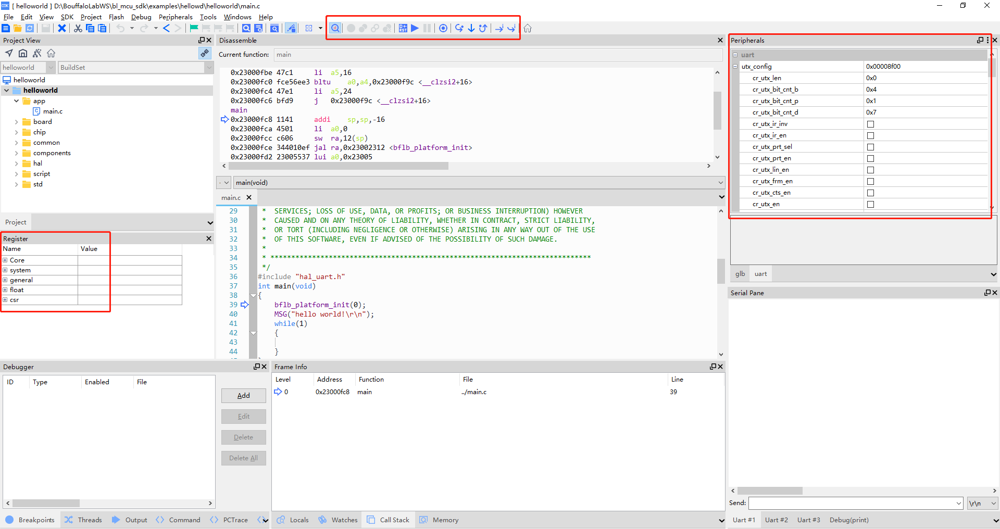

SLogic Combo8 features high-speed CK-Link functionality, with a speed that surpasses CK-Link Lite and comes close to CK-Link Pro, making it a great tool for debugging RISC-V chips. In this mode, it also has a high-speed serial port (20Mbps).

Let's get started with using CK-LINK!

## Enable CKLink Functionality

Press the toggle button to switch the indicator light to yellow.

> To verify if CKLink functionality is enabled:
> Open the device manager in Windows environment, and use the lsusb command in Linux environment to find the "CKLink HS" device

## Getting Started

### Pin sequence

> CKLink and DAPLink have similar pin connections, so they are shown together in one diagram. Please ignore the 'DAP' label.

In CKLink mode, it can simultaneously support one CKLink interface and one UART interface.

The pins on the left side of the diagram (TXD, RXD, DTR, RTS) can be used as a UART interface.

The pins on the right side of the diagram (TCK, TDI, TDO, TMS) are used for CKLink debugging.

### Instructions

On both Windows and Linux systems, you can directly refer to [Using CDK + Sipeed RV-Debugger Plus for Compilation and Debugging](https://bouffalolab.gitee.io/bl_mcu_sdk/get_started/cdk_rv_debugger_plus.html#cdk-sipeed-rv-debugger-plus) and [T-HEAD Debug Server User Manual](https://occ.t-head.cn/document?temp=introduction-2&slug=t-head-debug-server-user-manual), the usage is exactly the same.

#### Debugging with CDK

- Click the `Start/Stop Debugger` button on the toolbar to enter the debug interface, as shown in the image below:

   
   _Debug HelloWorld!_

- Under the `debug` interface, you can view the internal register data of the CPU in the `Register` window on the left side. At the same time, in the `Peripherals` peripheral panel on the right side, you can browse the corresponding peripheral register data. You can select the desired peripherals by using the `Peripherals->System Viewer` option in the top menu bar. Additionally, in the toolbar above the interface, you will find relevant debugging buttons that can be used for setting breakpoints, single-stepping, executing instructions one by one, and running at full speed. Of course, all these operations have corresponding shortcuts and quick setup methods. For detailed information, please refer to the CDK documentation, which will provide a comprehensive guide.

- Click the single-step run button to execute the code. You will see the cursor move to the next line of code, and at the same time, the serial panel will display the output "Hello World!"

#### Debugging with T-HEAD Debug Server

> Please refer to the **Section Ten: Debugging with JTAG** in the [Getting Started with M1s DOCK](../../maix/m1s/other/start.md) guide for details.
