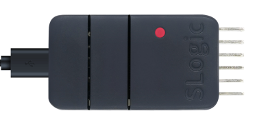
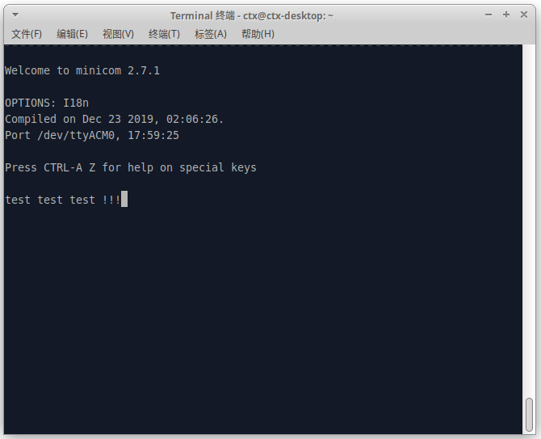

SLogic Combo8 has 4 independent high-speed serial port functionalities. The first two ports based on UART can achieve a super-high speed baud rate of up to 20Mbps simultaneously, while the latter two ports can reach up to 1Mbps through IO simulation. It is highly suitable for scenarios such as batch programming and production testing.

## Enable Serial Module Functionality

Press the toggle button to switch the indicator light to red.



> To verify if Serial Module functionality is enabled:
>
> Linux: Use the lsusb command to check if the UARTx4 HS USB device appears.


## Getting Started

Please note: Due to system reasons, Linux may consider the device as a modem when it has more than one ttyACM. This may temporarily occupy the device for sending AT commands. In this situation, you may not be able to open the serial port, and it may report "Resource busy" due to device being occupied. This is normal, and it will return to normal after a while. To solve this problem, you can add a udev rule to avoid this issue. Please refer to the following commands:

```shell
sudo touch /etc/udev/rules.d/49-sipeed.rules
sudo echo "ATTRS{idVendor}==\"359f\", ATTRS{idProduct}==\"3101\", ENV{ID_MM_DEVICE_IGNORE}=\"1\"" > /etc/udev/rules.d/49-sipeed.rules
sudo udevadm control --reload
```

### Hardware Connection

SLogic Combo8 has a total of 4 serial ports. UART0 and UART1 support a maximum baud rate of 20M, while UART3 and UART4 support a maximum baud rate of 1M. Refer to the panel pinout diagram and connect any UART's TX, RX, and GND to the RX, TX, and GND pins of the target device (note that RX and TX need to be crossed).

Note：
1. Ensure that the module and the target device share a common ground to prevent issues such as garbled data.
2. The device numbers on Windows may be in random order, so manual trial-and-error may be required to find the corresponding serial port.

### Data Transmission and Reception

For Linux, you can use **picocom** or **minicom** as the serial communication tool. Install it using the following commands:

```Bash
sudo apt install picocom
sudo apt install minicom
```

For example, to use **minicom** with UART0 to communicate with the test device, open the Linux terminal using **CTRL+ALT+T**, enter the installation commands, and enter the administrator user password when prompted. Wait for the package installation to complete.


After installation, communicate with the test device using UART0. In the terminal, enter the command:

```Bash
sudo minicom -b 2000000 -D /dev/ttyACM0
```

The **-b** parameter specifies the desired baud rate, which should be the same as the UART baud rate setting of the test device.

The **-D** parameter specifies the port to listen to.


After entering the command, you can communicate with the test device, receive and print messages in the terminal, and send data to the test device.

#### Serial Loopback Test：


(Above: Serial module wiring diagram)

Loopback test result:
