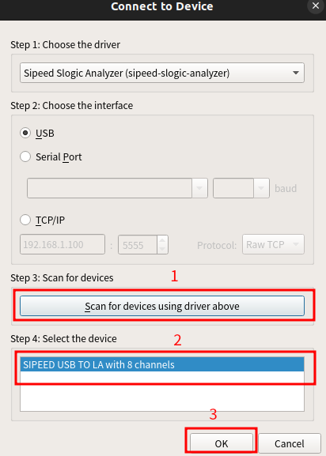
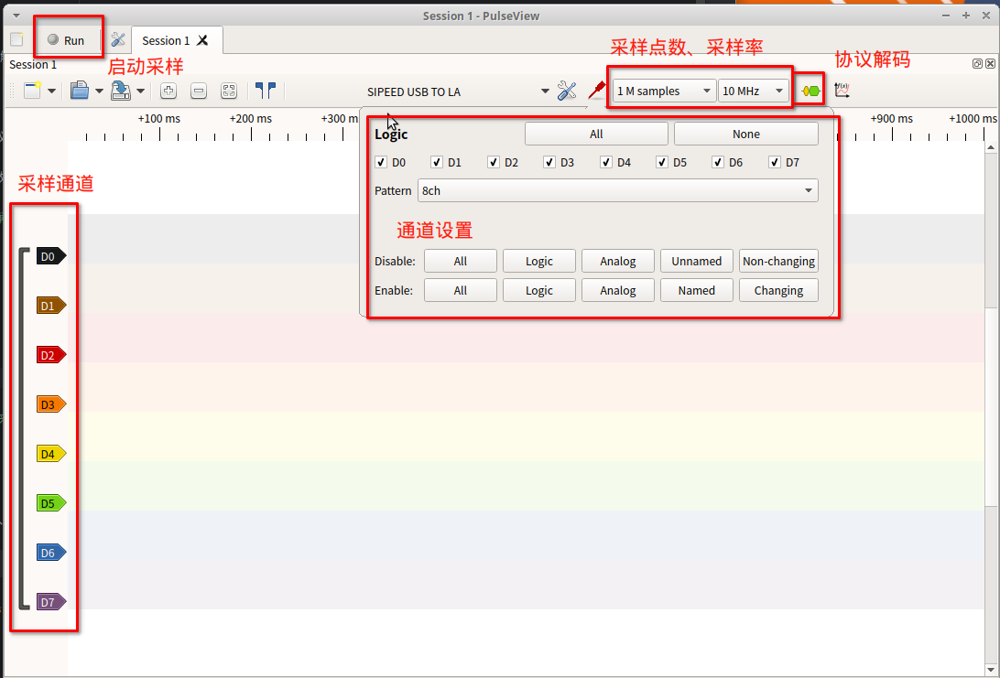

## Enabling the Logic Analyzer Function

Press the button to switch the indicator light to blue. As shown below:


## Verifying that the Logic Analyzer Function is Enabled

Linux:

Use the lsusb command to see the USB TO LA USB device appear


## Using USB TO LA

> Currently, the logic analyzer only supports Linux systems

Attention!!!

> 1. When using the host computer, ensure that the sampling bandwidth does not exceed 320MHz, i.e., the number of channels * sampling rate must be less than 320MHz. For example, if you set the number of channels to 8, the sampling rate can only be set to 40MHz or lower; otherwise, it may cause host computer malfunctions.
> 2. If there is a disconnection issue with the device during the host computer's startup process, please rescan and reconnect the device before performing any other operations; otherwise, it may result in software crashes.

### Quick Use

#### Pin sequence


The diagram above shows the pinout for the SLogic 8-channel logic analyzer. Connect the test signals from the target device to any available CH (Channel) port on the SLogic, and ensure that the GND (Ground) of the target device is connected to the GND of the SLogic.

#### Connect SLogic and Computer

You need to download the host computer software for data decoding and visualization from the [here](https://dl.sipeed.com/shareURL/SLogic/SLogic_combo_8/4_application/PulseView).Please make sure to use the latest uploaded version of the software for optimal performance.After downloading, go to the directory where the file is located, use `CTRL+ALT+T` to open the Linux terminal, and enter the following command to **add permissions** and **run** the program **as administrator**:：

```bash
chmod +x PulseView-x86_64-032323-1101.AppImage
sudo ./PulseView-x86_64-032323-1101.AppImage
```
**Connection Steps**
1.  Select the device to connect
2.  Select the driver **Sipeed Slogic Analyzer(sipeed-slogic-analyzer)**
3.  Select the connection mode as USB
4.  Scan for devices that meet the requirements
5.  Select the device that has been found



> If no device is found in the third step, you can try to switch the module function, switch back to the logic analyzer mode, and repeat the third step

### Start Sampling

1. Configure the number of channels, number of samples, and sampling rate of PulseView

The figure below sets the number of channels to **8**, the number of samples to **1M samples**, and the sampling rate to **10Mhz**



2. Set the trigger mode of channel D0 to **rising and falling edge trigger**

Click on the label icon of channel D0 to set the trigger mode


3. Start acquisition and get sampling results


### Detailed Configuration

#### Channel Settings

Open the **"red probe"** icon in the top toolbar, select the channels you want to enable, and the number of sampling channels for the logic analyzer. The optional options are 1ch, 2ch, 4ch and 8ch. There are also shortcut keys for quick switching of channels that meet the corresponding conditions


#### Sampling Parameters

Sampling parameters include sample quantity, sampling frequency and sampling time

1.  Sample quantity: select an appropriate value according to your needs
2.  Sampling frequency: select according to the frequency of the signal to be measured, **recommended to choose more than 10 times the frequency of the signal to be measured**
3.  Sampling time: sampling time is calculated based on the **sample quantity** and **sampling frequency**, the calculation formula is:</br>**Time (seconds) = Number of samples / Sampling rate**</br>For example, when 1M samples and 1Mhz, the sampling time is 1s


> After setting the sample quantity and sampling frequency, place the mouse over the sample quantity selection box, and it will display the sampling time for the current parameters

#### Channel Parameters

Click on the channel label to set the channel parameters, which include label name, label color, channel waveform display window width and signal trigger mode

1. Label name: can be set according to the meaning of the sampling signal, for easy distinction of multiple signals
2. Label color: set according to personal preference, for easy distinction of different signals
3. Channel waveform display window width: set according to the signal amplitude, unit is pixels, when the signal amplitude changes greatly, you can increase this parameter to observe the signal amplitude change
4. **Signal trigger mode**: has **direct sampling**, **high level trigger**, **low level trigger**, **falling edge trigger**, **rising edge trigger** and **edge trigger**


### Debugging Waveforms

#### View Operations

> -   **Waveform zoom**: mouse wheel (middle button) scroll up to zoom in waveform, scroll down to zoom out waveform
> -   **Drag waveform**: mouse left button hold can drag the waveform display area left and right up and down
> -   **Area zoom**: mouse double click on an area can zoom in the waveform of that area
> -   **Channel scroll**: "waveform display area" use Ctrl+mouse wheel (middle button) can quickly scroll channels up and down
> -   **Time measurement**: You can mark a position by right-clicking on the desired position and clicking "Create Marker Here". When you repeat marking another position, the software will automatically calculate and display the time length between the two markers on the time axis
> -   **Adjust channel order**: mouse drag channel label can drag channel to specified position


#### Protocol Decoding

> Clicking on the **yellow-blue waveform icon** from the top toolbar will list the currently supported protocol list, you can directly search for the protocol you want to decode on the list to add a new protocol, new protocol can be viewed in the waveform display area


> On the waveform chart, a new protocol will occupy a row of channel waveform display window, click on the **protocol label**, you can set the basic parameters of the protocol. Taking UART protocol as an example, set UART protocol frequency to 115200, data bits to 8 bits, use ascii format decoding. After setting, the system will decode the waveform of the selected channel, so that you can more intuitively observe and analyze the communication data.


> After setting, the waveform display area will show the corresponding protocol decoding results of the waveform


### Precautions

When connecting logic analyzer to test system, pay attention to the following points:

1. **The logic analyzer and computer are grounded together. If the device under test is a strong electric system, be sure to use a "USB isolator" for isolation measures. Otherwise, there is a high risk of damaging the logic analyzer or computer**
2. GND channel and GND of test system must be reliably connected, as short as possible
3. Signal channel must be reliably connected to the test signal position of test system, not randomly "grafted", causing interference introduction
4. If you do not pay attention to wiring method, it may introduce a lot of glitches, causing software unable to analyze data