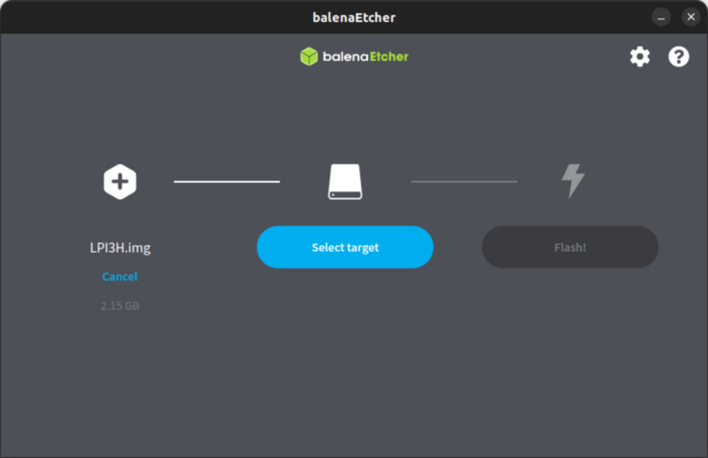

## Preparation

### Get the Image

Refer to the previous section[images](https://wiki.sipeed.com/hardware/en/longan/h618/lpi3h/3_images.html), and download the desired image.

### Get the Flashing Tool

The commonly used tools for flashing images to an SD card are balenaEtcher, Rufus, etc. Here, we'll use balenaEtcher as an example. First, go to the [balenaEtcher official website](https://etcher.balena.io/#download-etcher) to download and install the software.
For Linux, you can also use the dd command to write the image directly.

### Flashing the Linux Image to SD cards

After preparing the image to be flashed, open balenaEtcher. First, select the image file you want to flash:



Then, select the target device:


Finally, click on "Flash" and wait for the flashing process to complete. Once it's done, you'll have an SD card with the bootable image:


The steps for Windows and Linux are similar.

### Flashing the Linux image to EMMC

**Note that you need to use the image version 20240106 and above**

First prepare a boot TF card, login to the system, and then use SCP or other tools to copy the EMMC image file to the system running on the TF card , and then use the dd command to write the image file to EMMC:
```shell
# Assuming the image file is copied to /opt/ directory
dd if=/opt/your_image_file of=/dev/mmcblk1
sync
```
When the burning is finished, unplug the SD card and you can enter the system from the EMMC.

If you want to boot with EMMC and use SD card for expansion, you need to make sure that the SD card is formatted and does not contain a boot image, otherwise it may be changed to SD card boot due to priority issues.

### Flashing the Android image to SD card 

**Note: Android images cannot be flashed using balenaEtcher. Please use PhoenixCard to flash the image before it can be booted.**

First, download the PhoenixCard tool from the cloud storage. Once downloaded, open the tool and select the second option: 启动卡. Then click the 烧卡 button to burn the Android image to the TF card, and it will be ready for use.


### Flashing the Android image to EMMC

Open PhoenixCard and select the first option: 量产卡. Then click the 烧卡 button to burn the Android image to the TF card, and then insert the TF card into the board. Power on the board, and the Android image will be automatically flashed to the eMMC. After the flashing process is complete, remove the TF card, and the Android image in the eMMC will be ready for use.

