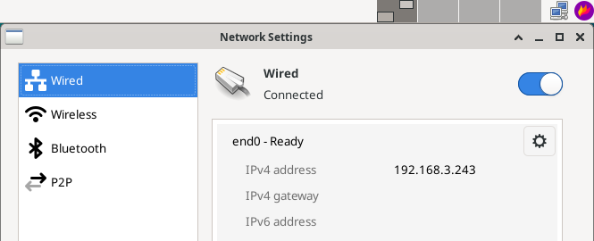
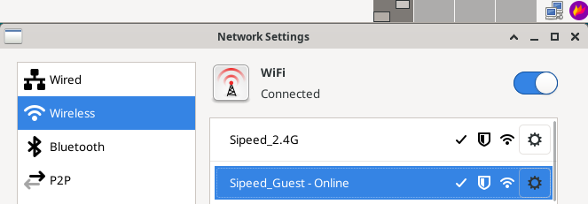
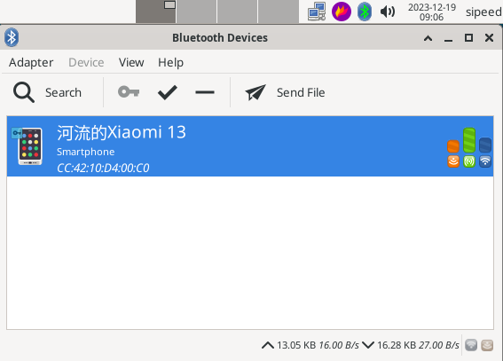
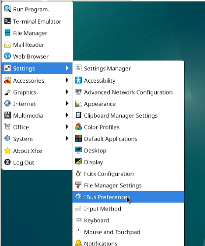
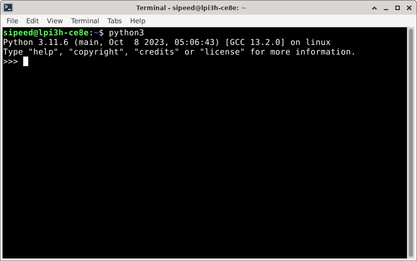
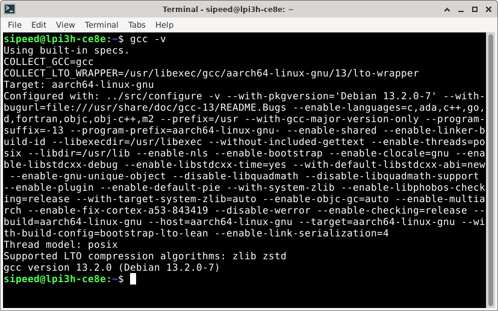

## Logging into the System

In this document, we'll use the default Debian desktop system as an example to explain basic system usage.

The default credentials for the image are as follows:
User: `sipeed`, Password: `licheepi`;
User: `root`, licheepi `root`;

The image has automatic login enabled, and the user sipeed is automatically logged in. If you don't want automatic login, you can comment out the line `autologin-user=sipeed` in the file `/usr/share/lightdm/lightdm.conf.d/01_debian.conf`.

## Opening the Command Line

In the Debian graphical system of LonganPi 3H, you can open the command line terminal quickly and conveniently by pressing the key combination Ctrl + Alt + T.

## Connecting to the Network

The desktop system uses ConnMan to manage network connections by default.

You can find `ConnMan Settings` in the application menu at the top-left corner. After clicking it, a network icon will appear at the top-right corner of the desktop. Clicking the network icon allows you to create new network connections and view network connection information:


### Connecting to Wired Network

In the terminal, you can enable a wired network connection and view related information using:
```shell
connmanctl enable ethernet
```

LonganPi 3H has a Gigabit Ethernet interface. To connect to a wired network, plug in an Ethernet cable that is already connected to the network into the network interface of LonganPi 3H. You can see the connection information by clicking the network icon at the top-right corner:



### Connecting to Wireless Network

LonganPi 3H has an onboard wireless module that supports Bluetooth and Wi-Fi.

Graphical Interface Method:

Click the network icon at the top-right corner and switch to the Wi-Fi connection page. Select the desired Wi-Fi network and click "Connect":



Commandline Interface Method:
We can use connmanctl to enable wifi connections and other information:
```shell
connmanctl enable wifi
```

Open the command line and use wpa_supplicant to connect to Wi-Fi. The following steps need to be executed as the root user:
```shell
sudo -i
nano /etc/wpa_supplicant.conf
```

Create the wpa_supplicant.conf file and enter the SSID and passphrase of the Wi-Fi network. After filling in the information, run the following command to connect to Wi-Fi:
```shell
wpa_supplicant -D nl80211 -i 网卡名 -c /etc/wpa_supplicant.conf &
```


## Connecting to Bluetooth

In the terminal, you can enable Bluetooth connection and view related information using:
```shell
connmanctl enable bluetooth
```

The desktop system uses `blueman` to manage Bluetooth connections by default.

Find the Bluetooth icon at the top-right corner of the desktop and make sure that Bluetooth is turned on. If it's not, right-click the Bluetooth icon to turn it on:


After turning it on, left-click the Bluetooth icon to see the Bluetooth device scanning interface.
Click the "Search" button in the top-left corner of that interface to search for Bluetooth devices. Make sure that Bluetooth devices such as keyboards, mice, and headphones are in pairing mode and can be discovered.
Right-click the desired device and select "Connect" to establish the connection. After a successful connection, you can also right-click the device and click "Trust" to enable automatic connection in the future.



If the Bluetooth graphical management interface cannot find devices, you can use `bluetoothctl` in the command line interface to pair devices. The steps are as follows:

```shell
bluetoothctl
scan on
# Find the MAC address of the device you want to pair with
pair MAC_address_of_target_deviceconnect
connect MAC_address_of_target_device
```

## Software Installation

 After connected to the network, you can update and install software packages.

### Software Sources

 In Debian, apt (Advanced Packaging Tool) can be used to install software.

 When installing software, it will search and download the target software from the system-specified software website. When the target website is difficult to access (such as the server is too far away or the server network is not good), you can manually set up and edit the software source website to change it to the nearest source to reduce the download time.

 The default software source is the content of the `/etc/apt/sources.list` file, which can be changed by yourself if there is additional need.

### Upgrading Software

Using `sudo apt update` can update the software list, which is generally needed after changing the software source.

Before using this command, use the `date` command to check the time. If the system time is wrong or there is no automatic update time after connecting to the network, you can update it manually to ensure that the software package in the software source is the latest version:
```shell
sudo date -s "20230717 12:00:00"
```

Then you can update the software named `package_name` with `sudo apt upgrade package_name`.

### Install

Software can be installed with the apt command;for example, `sudo apt install package_name` to install `package_name`, replacing `package_name` with the name of the software package you want to install. 

## SSH

If you don't have ssh or sshd in your image, you can install them first with the following command:

```bash
sudo apt install ssh openssh-server
```

Once installed, you can use ssh to log in to other machines or log in to the LicheePi 4A from other machines.
You can also use scp to transfer files:

```bash
scp demo.zip sipeed@192.168.1.9:~/
```

## Input Languages

If you need to input non-ascii characters, you need to install input languages. Here I use Chinese input language as an example, please find related tutorials for other languages.

First, install ibus-libpinyin:

```bash
sudo apt install -y ibus-libpinyin
```

> Note that this will consume about 200MB of disk space

After installation, reboot the board, you will see the `IBus Preference` option under Applications, click to enter the settings.



Click `Input Method` in the appearing interface, click `Add`, select `Chinese`, select `Intelligent Pinyin`, click `Add` to add Chinese Pinyin input method.

 

Click the input icon in the upper right corner, you will see the following options, select `Chinese - Intelligent Pinyin`. 


At this point, you can input Chinese successfully in the system.

## Browser

The system has built-in Firefox browser, which can be used by clicking the browser icon at the bottom of the desktop: 


The effect is as follows:


## Player

You can install the VLC player by using the command: 

```shell
sudo apt install vlc
```

After installation, the video playback effect is as follows:


## Programming Development 

### Python

The python3 environment is installed in the system, so you can run `python3` directly in the terminal:



If you need to install Python packages, use: `sudo apt install python3-XXX`
For example, to install the pyserial package: `sudo apt install python3-serial`. 

### C

The `build-essential` package needs to be installed, which takes up about 800MB of disk space.

```bash
sudo apt install build-essential
```

Then you can use gcc to do the relevant operations:



## More
Welcome to submit your submissions! You can get ¥5~150 ($1~20) coupons after your submissions are accepted!