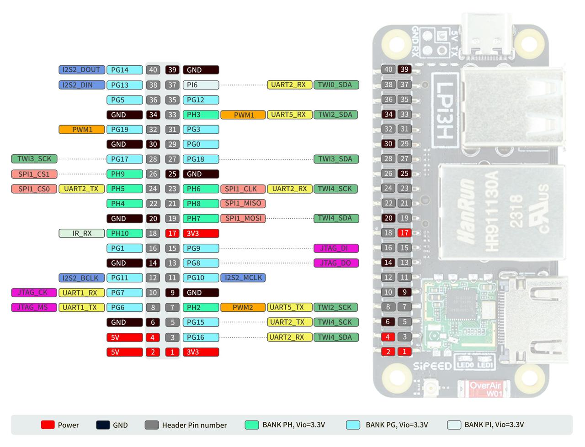
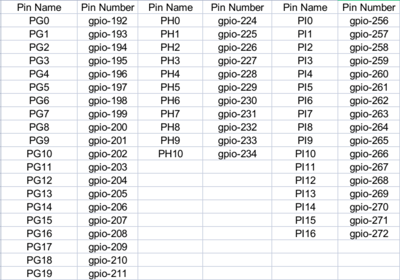
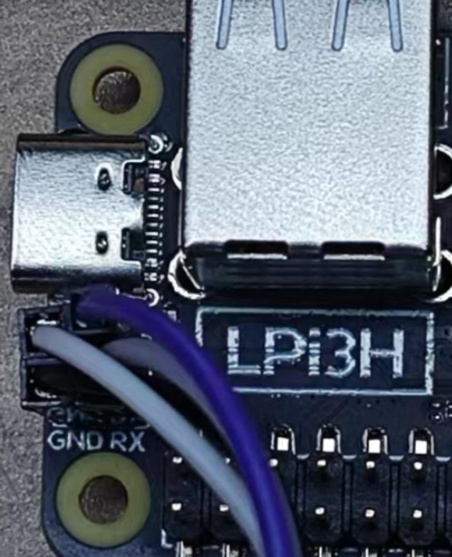

## SoC
 
### CPU frequency

```shell
sudo cat /sys/devices/system/cpu/cpu*/cpufreq/cpuinfo_cur_freq
```
Unit: KHz
Note that the system has a temperature control strategy, which will reduce the frequency when the system is too idle or the temperature is too high.

## PWM

TODO 

## GPIO





Referring to the two tables above, you can find the position and number of the GPIO to be used. Taking the example of lighting up the two LEDs on the board, you can use the following command to manipulate the corresponding GPIO in the user space:

```shell
num=194
echo ${num} > /sys/class/gpio/export  
echo out > /sys/class/gpio/gpio${num}/direction 
echo 0 > /sys/class/gpio/gpio${num}/value
num=196
echo ${num} > /sys/class/gpio/export  
echo out > /sys/class/gpio/gpio${num}/direction 
echo 0 > /sys/class/gpio/gpio${num}/value
```

In addition to the above methods, GPIO can also be controlled using the libgpiod library in the C language. The following example still uses the LED lights on the board:

```c
#include <gpiod.h>
#include <stdio.h>
#include <unistd.h>
#include <stdlib.h>

int main(int argc, char **argv)
{
    int i;
    int ret;

    struct gpiod_chip * chip;
    struct gpiod_line * line;

    chip = gpiod_chip_open("/dev/gpiochip0");
    if(chip == NULL)
    {
        printf("gpiod_chip_open error\n");
        return -1;
    }

    line = gpiod_chip_get_line(chip, 194);
    if(line == NULL)
    {
        printf("gpiod_chip_get_line error\n");
        gpiod_line_release(line);
    }

    ret = gpiod_line_request_output(line,"gpio",0);
    if(ret < 0)
    {
        printf("gpiod_line_request_output error\n");
        gpiod_chip_close(chip);
    }

    for(i = 0; i < 10; i++)
    {
        gpiod_line_set_value(line,1);
        sleep(1);
        gpiod_line_set_value(line,0);
        sleep(1);
    }

    gpiod_line_release(line);
    gpiod_chip_close(chip);

    return 0;
}
```

To install the required dependencies:
```shell
sudo apt update
sudo apt install build-essential libgpiod-dev gpiod
```

After compiling, you need to execute the program with root privileges:
```shell
gcc gpio.c -I /usr/include/ -L /usr/lib/aarch64-linux-gnu/ -lgpiod -o gpio
sudo ./gpio
```

The libgpiod library also provides some commands to manipulate GPIO. Here are some commonly used commands:
gpiodetect: List all GPIO controllers
```shell
sudo gpiodetect
```
gpioinfo: Display the pin information of a GPIO controller, showing which pins are already in use.
```shell
sudo gpioinfo gpiochip0
```
gpioset: Set the state of a GPIO pin.
```shell
sudo gpioset gpiochip0 196=0
```
gpioget: Get the state of a GPIO pin.
```shell
sudo gpioget gpiochip0 196
```

## UART 

### System serial port

The system serial port of the LonganPi 3H is UART0, which is provided in the side pins.  

  

You can use USB to serial module to connect the serial port, namely `U0-RX` and `U0-TX`, pay attention to cross connection, as well as GND connection (there is also an extra power line in the following picture, if you use typeC port to power, you can not connect this power line).

  

After the connection is completed, you can use the serial port tool for communication, recommended `XShell` and `mobaterm` under Windows, and `minicom` under Linux.
Set the serial port baud rate to `115200`, and you can log in and operate the commands under the serial terminal:
> Note: After the connection, you can knock several enters to see if there is a response, if there is no response, check the wiring or serial port configuration.


### General serial port

In addition to the system serial port UART0, the device tree also enabled UART1, UART2, UART3, UART4 serial ports by default, which can be used as needed.

#### List serial devices 

```bash
ls /dev/ttyS*
```

#### Viewing serial port information such as baud rate

```bash
stty -F /dev/ttyS1 -a 
```

#### Set serial port baud rate and data mode

```bash
stty -F /dev/ttyS1 ispeed 115200 ospeed 115200 cs8
```

#### Check serial data

```bash
cat /dev/ttyS1
```

#### Sending serial data

```bash
echo "LonganPi3H" > /dev/ttyS1
```

#### Other tools

You can also use `minicom` or pyserial library for serial operation, please find relevant information for yourself.If you want to use unusual baud rate, you can use `picocom`.

## I2C

TODO

## SPI

TODO

## HDMI display

LonganPi 3H supports a display with a maximum resolution of 4k, as shown in the following image:


If you don't see anything when you plug in an HDMI display, try changing the display configuration parameters using xrandr from the command line.

First export the DISPLAY variable:
```shell
export DISPLAY=:0.0
```

Then use xrandr to see the available arguments:
```shell
sipeed@lpi3h-ce8e:~$ xrandr                                                     
Screen 0: minimum 320 x 200, current 1920 x 1080, maximum 8192 x 8192           
HDMI-1 connected 1920x1080+0+0 (normal left inverted right x axis y axis) 255mm 
x 220mm                                                                         
   1920x1080     60.00*+  60.00    59.94                                        
   1400x1050     59.95                                                          
   1280x1024     75.02    60.02                                                 
   1440x900      59.90                                                          
   1280x960      60.00                                                          
   1152x864      75.00                                                          
   1280x720      60.00    59.94                                                 
   1024x768      75.03    70.07    60.00                                        
   832x624       74.55                                                          
   800x600       72.19    75.00    60.32    56.25                               
   640x480       75.00    72.81    66.67    60.00    59.94                      
   720x400       70.08                                                          
```

Based on the output of the above command, we can try to change the resolution, frame rate and other configurations, such as changing to 1440x900 resolution: 
```shell
xrandr xrandr --output HDMI-1 --mode 1440x900
```
Some parameters may cause the screen to not light up. When you have no display when you plug in an HDMI display, you can use this command to adjust the display parameters to light up, or you can adjust them in the display graphical menu in the system settings.

If you find that you have flickering problems with higher resolutions, try lowering the refresh rate in the graphical settings display menu.

## HDMI audio

TODO

## GPU

TODO

## Others
 Welcome to submit! You can get ¥5~150 ($1~20) coupons after your submission is accepted!