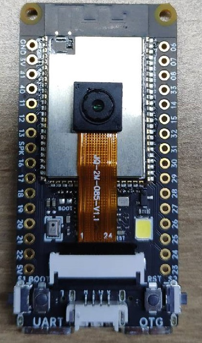
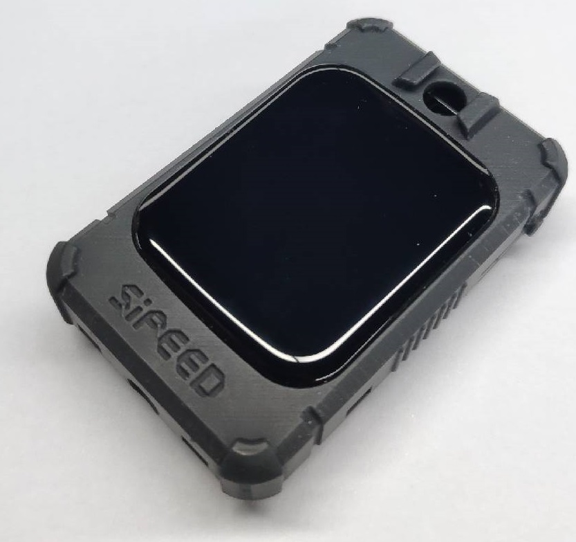
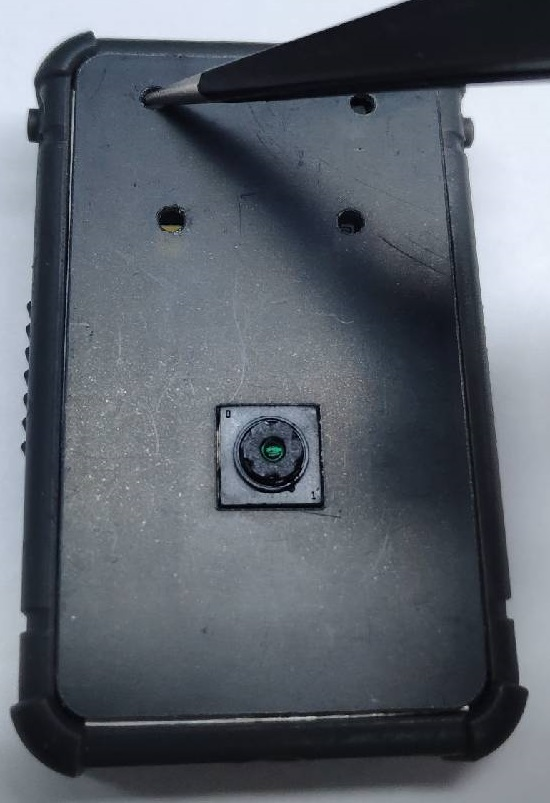
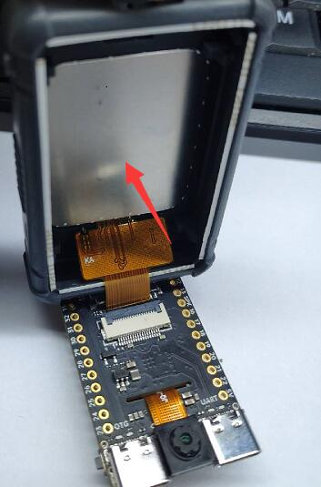

> Please use translation tool to read this page.

Here are some steps like how to remove the camera or screen.

## Remove the screen

The camera and screen are oriented in the same direction by default, we may need to remove the screen for some reason, here are the steps to do this and matters need attention.

| Camera and screen in the same direction                                                     | Camera and screen in the opposite direction                                         |
| ------------------------------------------------------------------------------------------- | ----------------------------------------------------------------------------------- |
|  |  |

Screen and board are fixed together, so when removing the screen, we need to force the metal on the back of the screen, not the edge of the screen. Be careful when doing this, otherwise your screen will be damaged.

<table>
    <tr>
        <td></td>
        <td></td>
        <td> Here we can see screen and board are fixed together</td>
    </tr>
</table>
<table>
    <tr>
        <td></td>
        <td> The center is the metal layer on the back of screen, where we force on when removing screen, and the black parts is the edge of the screen. </td>
    </tr>
</table>
<table>
    <tr>
        <td></td>
        <td>Note the connection between board and screen, DO NOT CONNECT THEM WRONG</td>
    </tr>
</table>

## Change camera direction

After removing the screen, we can change camera direction.

Make sure your connection is not wrong.

<table>
    <tr>
        <td></td>
        <td>Make sure the 1 on board and 1 on the camera is in the same direction</td>
    </tr>
</table>

## Install shell

We sell shell for M1s Dock, here is the assembly tutorial.

You can decide the camera direction.

To begin this, depart the board into following parts.

The camera can be assembled in two directions: the camera shooting direction is the same to the screen or the camera shooting direction is opposite to the screen.

### Same to the screen

<table>
    <tr>
        <td></td>
        <td></td>
        <td>First, insert the camera into the shell, and the camera will be slightly fixed in the shell, ensuring that the inserting is not offset and the camera is centered. </td>
    </tr>
</table> 
<table>
    <tr>
        <td></td>
        <td></td>
        <td>Connect board with screen, and make the screen through shell</td>
    </tr>
</table> 
<table>
    <tr>
        <td>Rotate the shell to make the TF card slot on the board is in the same direction as the SiPEED logo on the shell</td>
        <td>Align the two TypeC ports with the holes in the shell to prepare for inserting the board into the shell</td>
        <td>Press where the arrow points at, it's a bit difficult for first time inserting, make sure the two TypeC ports align with the holes. Inster board into the shell</td>
    </tr>
    <tr>
        <td></td>
        <td></td>
        <td></td>
    </tr>
</table> 
<table>
    <tr>
        <td></td>
        <td></td>
        <td>Bend not fold the camera cable through the hole on the board to connect to the connector</td>
    </tr>
</table> 
<table>
    <tr>
        <td>Use the reserved double-sided tape on the shell to fix the screen, the back panel is also fixed on the shell by double-sided tape, and note that the reserved camera hole on the back panel and the M1s module should be in the same direction.
        </td>
        <td></td>
        <td></td>
    </tr>
</table> 

Up to now we have finished installing shell.

### Opposite to the screen

<table>
    <tr>
        <td></td>
        <td></td>
        <td> Connect camera and screen with board first, and camera should be on the M1s module</td>
    </tr>
</table> 
<table>
    <tr>
        <td>Make the board through shell</td>
        <td>Then it should be like this</td>
        <td>Change the board direction to make the TF card slot on the board is in the same direction as the SiPEED logo on the shell</td>
    </tr>
    <tr>
        <td></td>
        <td></td>
        <td></td>
    </tr>
</table> 
<table>
    <tr>
        <td>Align the two TypeC ports with the holes in the shell to prepare for inserting the board into the shell</td>
        <td>Press where the arrow points at, it's a bit difficult for first time inserting, make sure the two TypeC ports align with the holes. Inster board into the shell</td>
    </tr>
    <tr>
        <td></td>
        <td></td>
    </tr>
</table> 
<table>
    <tr>
        <td colspan="3">Make the camera through the back panel, slide the panel to change the camera into the right position</td>
    </tr>
    <tr>
        <td></td>
        <td></td>
        <td></td>
    </tr>
</table>

Up to now we have finished installing shell.

## Remove shell

First, use tweezers or other tools to remove the back panel of the fixed shell.

Use tweezers to push this board out through the hole which is in the same direction as Logo on the shell

Push on the metal panel of the screen to make the screen out of the shell.

Now we have finished removing the shell.