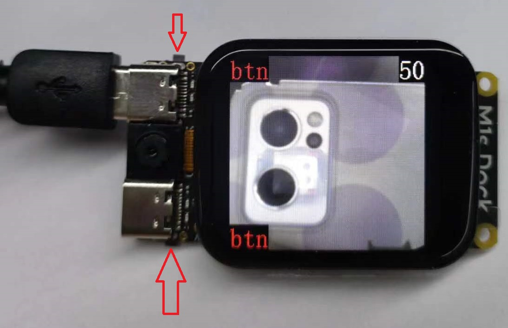
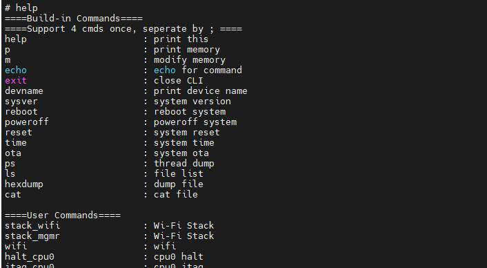
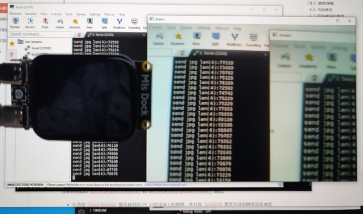
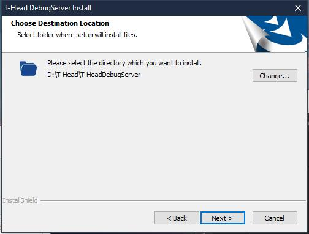
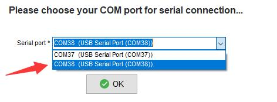
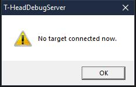
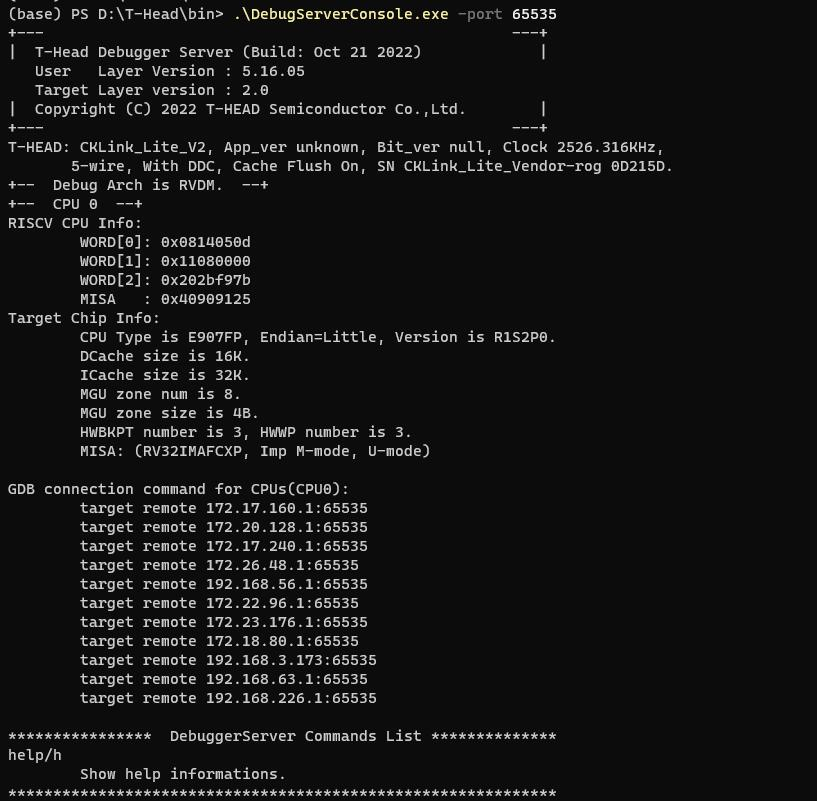

<!-- The M1s Dock can be used for a variety of interesting things by its delicate design. Here we tell the usages of this device. Note that the default baudrate is 2000000.

There are two Converter devices in `Windows` device manager if you connect the computer with the UART port of M1s Dock.

 -->

## Hardware preparation

- Two TypeC Cables
- One M1s Dock
- One Computer

There are two TypeC Ports on M1s Dock. The UART TypeC Port is for serial communication between M1s Dock and computer. The OTG Port is designed for burning firmware of the C906 Core in BL808 chip, and you can change its function by programming it as if you want to learn USB protocol.


1. We can see there are `S1_Button` and `S2_button`, and there are also `BOOT` key and `RST` key.
2. There is a `UART` on the left bottom, it's used for communication with two cores of BL808.
3. A `OTG` port is on the tighe bottom, we use burn the C906 Core firmware of BL808 bia this port.

## First time boot

### Board state

Power the M1s Dock, screen displays what the camera captures. 

Press `S1_Button` or `S2_button` the number on the right top of the screen changes, which is the brightness percentage of the LED.



This is the state of 50% LED brightness.


### OTG PORT

> A virtual removable disk with 3MB storage capacity is on your computer if you connect this board with your computer via TypeC OTG port on this board. 

Because the driver is not compatible well with some computers, we can flash the firmware via [UART](https://wiki.sipeed.com/hardware/en/maix/m1s/other/start.html#Burn-with-UART) to solve this problem.


And there is USB Mass Storge Device in `Windows` device manager, in `Linux` there is also a removable device.


If there is no USB Mass Storge Device in Windows device manager, try to use other USB TypeC cable or connect with other USB port of computer, if this problem remains, read [Burn-with-UART](https://wiki.sipeed.com/hardware/en/maix/m1s/other/start.html#Burn-with-UART) to flash M1s Dock to solve this problem. Make sure you have choose `partition table`, `boot2`, `firmware` these three files, after finishing burning, reconnect the board with computer.

### UART PORT

Two serial devices will be shown in your computer if you connect this board with your computer by TypeC UART port on this board.


There are two Converter devices in Windows device manager.


If there is no serial device，try to use other USB TypeC cable or use other USB port of computer.

If this problem remains, visit [Burn onboard bl702](https://wiki.sipeed.com/hardware/en/maix/m1s/other/start.html#Burn-onboard-bl702) to reburn the download debugger firmware. we set a BL702 on M1s Dock, and use it as USB to two uart convertor.

If there is only one serial device, visit [Burn onboard bl702](https://wiki.sipeed.com/hardware/en/maix/m1s/other/start.html#Burn-onboard-bl702) to reflash the download debugger firmware

Set baudrate to 2000000，open the two serial ports, you will see different information.

Open the small serial port and you can see that the messages are being printed:


Open the big serial port for command-line interaction:



## Burn firmware

To run our program on M1s Dock, we should know how to burn the firmware into M1s Dock first.

### Burn via u-disk

To make it easier to burn firmware, we design u-disk burning method to burn the program for C906 core of BL808 in the chip.

Connect this board by its TypeC OTG port with computer, hold the 2 sides keys (which have been marked on the following figure) of M1s Dock, then press RST button to make this board into u-disk burn mode.

<table>
    <tr>
        <td></td>    
        <td>Hold 2 side keys and press RST，make M1s Dock into u-disk burn mode</td>
    </tr>
</table>

Besides, when 2 side keys are being pressed, power on this board can make this board into u-disk burn mode too.


A removable disk with tiny storage capacity will be shown on your computer if this board is in u-disk burn mode. Just drag the firmware <a href="https://dl.sipeed.com/shareURL/MAIX/M1s/M1s_Dock/7_Firmware/demo_bin"> Here are some demo bins </a> into the removable disk to burn the firmware.


After succeed dragging the firmware bin into removable disk, the board will reboot and the u-disk is removed. Try to repower this board if its not working well after burning firmware.

### Burn via UART

The u-disk burning method above is used to burn firmware for C906 core of BL808. If we want to burn other firmware for other cores or when we need to upgrade the whole firmware of BL808, we need to burn M1s Dock via UART.

Connect this board by its TypeC UART port with computer, 2 serial ports will be shown on your computer (If your mouse doesn't work after connecting board with computer, please disconnect board with computer and visit [Burn onboard bl702](https://wiki.sipeed.com/hardware/en/maix/m1s/other/start.html#Burn-onboard-bl702) to solve this problem).

#### Get the burn software

To burn for M1s, we need bouffalolab official burning application, visit https://dev.bouffalolab.com/download and download the file named `Bouffalo Lab Dev Cube`. Decompress the downloaded file then we get the application to burn the board.


Backup download: [Sipeed Download Station](https://dl.sipeed.com/shareURL/others/BouffaloLabDevCube)

We mainly use `BLDevCube`, `BLDevCube-macos` and `BLDevCube-ubuntu` these three files, by which to burn our board with graphical interface on different OS.


And there are `bflb_iot_tool`、`bflb_iot_tool-macos`、`bflb_iot_tool-ubuntu` three applications, with which we can burn this board via commad line.

#### Burn via graphical interface

Run the software based on your operating system, choose bl808, then we put this [partition file](https://dl.sipeed.com/fileList/MAIX/M1s/M1s_Dock/7_Firmware/partition/partition_cfg_16M_m1sdock.toml) in partition table (marked with ②) in IOT page.

<table>
    <tr>
        <td></td>    
        <td></td>
    </tr>
</table>

After selecting the partition file, we have more choice in this page. We just need `boot2`, `firmware` and  `d0fw` these options.


In the picture above, `boot2` stays the same, and it's in this directory: `BLDevCube\chips\bl808\builtin_imgs\boot2_isp_bl808_xxxx_xxx`, under where the path if this burning application is, and make sure your choosing file named with `debug`. `firmware` is the firmware file for E907 core, and `d0fw` is C906 core file, the previous [Burn with u-disk](#burn-with-u-disk) operation can also burn firmware for this core. 

The firmware file for E907 or C906 can be gotten by compiling [M1s_dock example](https://gitee.com/sipeed/M1s_BL808_example).

First time burning, both `firmware` and `boot2` are needed, after this you just need tick what you want to burn not all.

The default firmware can be downloaded [here](https://dl.sipeed.com/shareURL/MAIX/M1s/M1s_Dock/7_Firmware/factory).

After choose the firmware, click the `Refresh` in the righr to refresh the serial port, then we can see 2 serial ports. If there are not 2 serial ports, visit [Burn onboard bl702](https://wiki.sipeed.com/hardware/en/maix/m1s/other/start.html#Burn-onboard-bl702) to solve this. We choose the bigger number serial port, and set uartrate 2000000 .


Press BOOT key and RST key on the board, then release RST key first, then release BOOT key in order to make M1s Dock into UART burning mode.


Click `Create & Download`, then we can see the following message where the arrow points at, before this we should make M1s Dock into UART burning mode.


It will burn M1s Dock if it shows `shake hand success`


Reburn this if it `SHAKEHAND FAIL`. Try to release the keys in order (Release RST key first then release BOOT key, I mean when release RST key, the BOOT key is being pressed) to make the board into UART burning mode, otherwise the burning software will show error because of timeout burning.


#### Burn via command-line

We can burn M1s Dock by command-line through serial port on this board.

In `BLDevCube` folder, there is `bflb_iot_tool` application, `bflb_iot_tool`、 `bflb_iot_tool-macos` and `bflb_iot_tool-ubuntu` are used for different OS to burn the bouffalolab chip.

Here I take Windows command line as example to burn M1s Dock, and for other OS you need to change the commands by yourself.

```bash
.\bflb_iot_tool.exe --chipname=bl808 --port=COM38 --baudrate=2000000 --firmware="firmware_20221212.bin" --pt="M1s_BL808_example\partition\partition_cfg_16M_m1sdock.toml" --boot2="BLDevCube\chips\bl808\builtin_imgs\boot2_isp_bl808\boot2_isp_debug.bin"
```

In this command, `firmware` is the bin file for E907 Core, the default bin file can be downloaded from [here](https://dl.sipeed.com/shareURL/MAIX/M1s/M1s_Dock/7_Firmware/factory). `pt` is the partition file, it's in the `M1s_BL808_example\partition` folder, you can also [Click me](https://dl.sipeed.com/fileList/MAIX/M1s/M1s_Dock/7_Firmware/partition/partition_cfg_16M_m1sdock.toml) to get it.`boot2` is in `BLDevCube\chips\bl808\builtin_imgs\boot2_isp_bl808` folder, and is named with `debug`. Set baudrate 2000000 to burn this board fast. `port` is the bigger port number.

Of course, make sure you have made this board into UART burning mode: Press BOOT key and RST key, then release RST key first then release BOOT key.


After burning these, you can burn the bin file for C906 core according to [Burn with u-disk](#burn-with-u-disk). You can also burn this board based on the adderss, from `partition_cfg_16M_m1sdock.toml` file you can know the burn address and modify it.

### Trobules when burning

#### BFLB IMG LOAD SHAKEHAND FAIL

This means M1s Dock is not at the burning state. Make sure you have held the RST key and BOOT key together when M1s Dock is powered on, then release RST key first, and then release BOOT key. When release RST key, the BOOT key is being pressed to make the board into UART burning mode.


Make sure you choose the bigger COM port to burn M1s Dock, not the smaller COM port.


#### Only one COM port

This means you are in the bl702 burning mode. Make sure power on this board before pressing BOOT key. 


#### No COM port

Make sure you connected the computer and M1s Dock UART port, not that OTG port.

#### Burn single firmware

In the burning software, we need to tick and choose `partition table`, `boot2`, `firmware`, `d0fw` for the first time burning. If we want to burn only one firmware not all firmware, tick your target firmware and burn it.

`firmware` can be compiled out via e907_demo.
`d0fw` can be compiled out via c906_demo.

`partition table` and `boot2` are needed to burn every time.

<table>
<tr>
  <td>Burn c906_demo firmware</td>
  <td>Burn e907_demo firmware</td>
</tr>
<tr>
  <td></td>
  <td></td>
</tr>
</table>

## Burn examples

There are some demos compiled from M1s_BL808_example, with which you can have a test on M1s Dock.

### lvgl_demo

[LVGL](https://lvgl.io/) (Light and Versatile Graphics Library) is a free open source graphics library suitable for mcu graphical interfaces.

Demo File: [Click me](https://dl.sipeed.com/shareURL/MAIX/M1s/M1s_Dock/7_Firmware/demo_bin/lvgl_demo)

After burning into M1s Dock, the screen displays the lvgl test. And then sets the baudrate to 2000000, the serial port with the smaller serial port number prints the last touch screen position.

 
 

### image_processing_demo

A simple image processing example.

Demo File: [Click me](https://dl.sipeed.com/shareURL/MAIX/M1s/M1s_Dock/7_Firmware/demo_bin/image_processing_demo)

Burning into M1s Dock, screen displays what the camera captured, press the side key to change image operator. Set the baudrate to 2000000, to see the image operator state by the small serial port.

Click the RST key to reset the bl808, and we can see the information about the camera from the small serial port when the board boots, to know if there is some error with the camera.

 
 

### tinymaix_mnist_demo

[TinyMaix](https://github.com/sipeed/TinyMaix) is a tiny inference Neural Network library specifically for microcontrollers (TinyML), can run lightweight deep learning model on any Single Chip Microcomputer.

Demo File: [Click me](https://dl.sipeed.com/shareURL/MAIX/M1s/M1s_Dock/7_Firmware/demo_bin/tinymaix_mnist_demo)

Burning into M1s Dock, recognizing number through the red box in the center of screen. Set the baudrate to 2000000, to see the process and result by the small serial port.

 
 

### pikascript_demo

[PikaScript](http://pikascript.com/) is a cross-platform, ultra-lightweight embedded Python engine.

Demo File: [Click me](https://dl.sipeed.com/shareURL/MAIX/M1s/M1s_Dock/7_Firmware/demo_bin/pikascript_demo)

Burning into M1s Dock, the screen is white. Set the baudrate to 2000000, open the small serial port for command-line interaction:

Use these commands:
```bash
arc = lv.arc(lv.scr_act())
arc.set_end_angle(200)
arc.set_size(150, 150)
arc.center()
```


Then the screen displays as shown(Ignore the bad shoot):


## SDK Compile

M1s can be compiled in Linux.

### Preparation

We need `git` to get the SDK complie envorioument, and use `make` to compile SDK, `tree` is also need to be installed to check the directory structure.

The following command can be used in debian Linux distribution like Ubuntu to install the three softwares mentioned above.

```bash
sudo apt-get install git make tree
```

For the command of other Linux distribution to install the three softwares mentioned above can be searched on the Internet by yourself.

### Get example

```bash
git clone https://github.com/Sipeed/M1s_BL808_example.git
```

Then the file tree should be like this:

```bash
sipeed@DESKTOP:~$ tree -L 1 M1s_BL808_example/
M1s_BL808_example/
├── LICENSE           # License file
├── assets            # folder for assets for readme.md
├── c906_app          # folder for C906 core example
├── e907_app          # folder for E907 core example
├── partition         # folder for partition file
└── readme.md         # guide
```

### Get SDK

It's about 120MB memory storage.

```bash
git clone https://github.com/sipeed/M1s_BL808_SDK.git
```

Then the file tree should be like this:

```bash
sipeed@DESKTOP:~$ tree -L 1 
.
├── M1s_BL808_example   # Folder of example
└── M1s_BL808_SDK       # Folder of SDK
```

### Get toolchain

According to the `readme.md` in example folder, we need to put the toolchain in M1s_BL808_SDK/toolchain

```bash
mkdir -p M1s_BL808_SDK/toolchain
cd M1s_BL808_SDK/toolchain
git clone https://github.com/wonderfullook/m1s_toolchain.git
```

Rename the toolchain folder name to `Linux_x86_64`, and return to the previous two levels of directories.

```bash
mv m1s_toolchain Linux_x86_64
cd ../../
```

Then the file tree should be like this(The main folder and files):

```bash
sipeed@DESKTOP:~$ tree -L 2
.
├── M1s_BL808_example     # Folder of example
│   ├── LICENSE           # License file
│   ├── assets            # folder for assets for readme.md
│   ├── c906_app          # folder for C906 core example
│   ├── e907_app          # folder for E907 core example
│   ├── partition         # folder for partition file
│   └── readme.md         # guide
└── M1s_BL808_SDK         # Folder of SDK
    ├── toolchain         # Folder of toolchain
    ...
```

### Set toolcahin path

Everytime compling for M1s, we need to set toolcahin path once.

First we need to know the path of `M1s_BL808_SDK`:

```bash
sipeed@DESKTOP:~$ cd M1s_BL808_SDK
sipeed@DESKTOP:~/M1s_BL808_SDK$ pwd
/home/lee/bl808/M1s_BL808_SDK
```

We copy the result (the result of everyone is different) of `pwd` command, then run following commamd to set toolcahin path.

```bash
export BL_SDK_PATH=/home/lee/bl808/M1s_BL808_SDK
```

Note that this is `M1s_BL808_SDK` ，not `M1s_BL808_SDK/`，normally this error is made by automatic string completion.

### Compile demo

Run `build.sh` which is in the folder of M1s_BL808_example/c906_app, add the `demo` in the end you want to try to compile.

Demos（Edited in 2022-12-13）：

```bash
c906_app
├── audio_recording
├── blai_mnist_demo
├── camera_bypass_lcd
├── camera_dump
├── camera_streaming_through_wifi
├── cli_demo
├── flash_demo
├── gpio_demo
├── hello_world
├── i2c_touch
├── image_processing_demo
├── lfs_demo
├── lvgl_demo
├── pikascript_demo
├── proj_config.mk
├── pwm_demo
├── spi_lcd
├── tinymaix_mnist_demo
└── uvc_demo
```

```bash
cd M1s_BL808_example/c906_app
./build.sh lvgl_demo
```

Then the compiled bin file is in M1s_BL808_example/c906_app/build_out folder, and its name is `d0fw.bin`, we can burn it by [u-disk](#burn-with-u-disk).

### Compile firmware

Run `build.sh` which is in the folder of M1s_BL808_example/e907_app, add `firmware` in the end to compile.

```bash
cd M1s_BL808_example/e907_app
./build.sh firmware
```

Then the compiled bin file is in M1s_BL808_example/e907_app/build_out folder, and its name is `firmware.bin`, we can burn it with the burning application provided by Bouffalo.

### Questions

1. Run command `build.sh` and get error `Makefile:14: *** BL_SDK_PATH not found, please enter: export BL_SDK_PATH={sdk_path}.  Stop.`, Visit [Set toolcahin path](#set-toolcahin-path) to set `BL_SDK_PATH` correctly.

2. Failed compiling

When compiling your firmware, make sure your command is `./build.sh demo_name`, like  `./build.sh hello_world`, not `./build.sh hello_world/` (pay atention to the end symbol `/`)

## WIFI stream DEMO

Wireless SDK will open in May. Before that we use this example to test the wireless of M1s Dock.

### Preparation

Network: PC and M1s Dock are in a same network, M1s Dock supports 2.4G wireless network.

PC Software：`python3`， `OpenCV`

M1s Dock firmware: Use this [Firmware](https://dl.sipeed.com/shareURL/MAIX/M1s/M1s_Dock/7_Firmware/factory) named with `firmware_20230227.bin`, burn it via [UART](https://wiki.sipeed.com/hardware/en/maix/m1s/other/start.html#Burn-via-UART).


### Edit Code

Open the `main.c` which is in the `M1s_BL808_example/c906_app/camera_streaming_through_wifi` directory.


Pay attention to `m1s_xram_wifi_connect()` 和 `m1s_xram_wifi_upload_stream()`.

- Edit `liuxo_desktop` into your wireless network, and change `12345678` into the wireless network password.
- Change `10.42.0.1` to your PC ip address.

Here is an example, this computer connects to the network named `Test` and its ip address in this network is `192.168.43.183`, the password of the `Test` wireless work is `testtest`.


Save `main.c` after editing it.

### Compile and burn

Finishing editing the code, follow the [sdk compile](http://wiki.sipeed.com/hardware/en/maix/m1s/other/start.html#SDK-Compile) steps to compile this `camera_streaming_through_wifi` demo.

Burn the compiled out `d0fw.bin` firmware via u-disk burn into M1s Dock, open the bigger COM port on your computer, press the RST ket on the M1s Dock.

If M1s Dock succeeds in connecting the wireless work, its IP address is printed out via UART, and message `Socket connect` means it's waiting the computer to receive the data.


### PC show screen

Run `python3 main.py` in the `M1s_BL808_example/c906_app/camera_streaming_through_wifi` directory to receive the data with opencv from M1s dock.



### Note

1. Make sure you use M1s Dock firmware named with [firmware_20230227.bin](https://dl.sipeed.com/shareURL/MAIX/M1s/M1s_Dock/7_Firmware/factory)
2. The IP address of M1s Dock is printed via bigger COM port if it succeeds in connecting the wireless work
3. Make sure computer and M1s Dock are in a same network, and the PC IP address has been edited in `main.c`.

## Linux Demo

This is a basic Linux Demo to run on M1s Dock.

[Click me](https://dl.sipeed.com/fileList/MAIX/M1s/M1s_Dock/7_Firmware/m1sdock_linux_20221116.zip) to download Linux demo, and following the `steps.md` in the compressed file to finish burning Linux image.


Login in with `root`


Visit CPU information


## Use Jtag

The jtag debugger is sold in [Sipeed aliexpress store](https://sipeed.aliexpress.com/store/1101739727), you can buy one if you need.


### Connect to device

Insert the jtag convertor board into the TF card slot on M1s Dock, then the convertor board is connected and fixed on the board.

And it's look like as follows:


Both jtag and M1s Dock are need to be connected with computer, and we need to make sure the UART port on M1s Dock is connected with computer, by which we can enable the core jtag and ensure that the jtag will not be very hot because of heavy power supply to M1s Dock.

### Install driver

Visit [Download station](https://dl.sipeed.com/shareURL/MAIX/M1s/M1s_Dock/9_Driver/cklink) to download the driver for your OS.

#### Windows

Unzip `T-Head-DebugServer-windows`, run `Setup` to install driver.


It's suggested not to change the default installation path, to avoid it remove all child directory when uninstalling it.



Install all compoents, which we may need in the future.


Finish installing this, and we can see there is `CKlink-Lite` in Windows device manager if we have connected the debugger.


There is an icon of the debug software.


#### Linux

Download driver：[Click me](https://dl.sipeed.com/shareURL/MAIX/M1s/M1s_Dock/9_Driver/cklink)


Unzip the downloaded file.

```bash
tar xvf T-Head-DebugServer*
```

Then there is a new script file.


Run this script, then its usages are shown, by which we can know that add with command `-i` to install driver or with `-u` to remove it in the end of command.

```
./T-Head-DebugServer-linux-x86_64-V5.16.5-20221021.sh
```


Install driver：

```
sudo ./T-Head-DebugServer-linux-x86_64-V5.16.5-20221021.sh -i
```


We need enter `yes` two times when installing it, and for as for `Set full installing path` we can just press Enter on the keyboard to use the default installation path or set your own installation path by yourself.

Finishing installing the driver, use command `lsusb` to see there is `CKlink-Lite` if we have connected the debugger.


### Debug denive

Before debugging, we need to enable core debug. Connect computer with UART port on M1s Dock, and open the bigger serial port.




We can know there are two jtag choices, run command `jtag_cpu0` to debug C906 Core or run command `jtag_m0` to debug E907 Core.


#### Windows

Run T-HeadDebugServer software on the desktop, if it shows following message, try following steps:

- Make sure you have enabled core debug in serial connection
- There is `CKlink-Lite` in Windows device manager, if there is no `CKlink-Lite`, check the connection of debugger or reinstall the driver 
- Debugger is occupied by other T-HeadDebugServer application



Click the triangle icon to connect device.


If there shows Failed about port, set another port and then rerun connecting device.


Click Socket Setting, set a port.


If succeed connecting, the triangle icon will change into circle icon.


Up to now we have connected device, and the picture above is we usr command `jtag_m0` to debug E907 Core, you can also run `jtag_cpu0` to debug C906 Core.

And we can use software like gdb to debug the chip.


Besides, in the directory where we install this software, we can run `DebugServerConsole` to connect debugger by command-line.


Run it by command-line to see its usages.

```bash
.\DebugServerConsole.exe -h
```


```bash
.\DebugServerConsole.exe -port 65535
```



Then we can debug it with port number 65535.

#### Linux

Run command`DebugServerConsole -h` to see help.


Run following command to debug M1s Dock with port number 12345.

```bash
DebugServerConsole -port 12345
```


## blai npu

### Supported operators

<table>
<thead>
<tr>
  <th>Type</th>
  <th>Operators</th>
  <th>Applicable Subset Spec.</th>
  <th>Processor</th>
</tr>
</thead>
<tbody>
<tr>
  <td rowspan="10">Convolution</td>
  <td rowspan="4">Conv </td>
  <td>Kernel: 1x1,3x3,5x5,7x7</td>
  <td rowspan="4">:strong:<code>NPU</code></td>
</tr>
<tr>
  <td>Stride: 1x1, 2x2</td>
</tr>
<tr>
  <td>Dilation: 1x1, 2x2</td>
</tr>
<tr>
  <td>Pad: same</td>
</tr>
<tr>
  <td rowspan="4">Depthwise Conv</td>
  <td>Kernel: 1x1,3x3 (5x5, 7x7 TBD)</td>
  <td rowspan="4">:strong:<code>NPU</code></td>
</tr>
<tr>
  <td>Stride: 1x1, 2x2</td>
</tr>
<tr>
  <td>Dilation: 1x1 (2x2 TBD)</td>
</tr>
<tr>
  <td>Pad: same</td>
</tr>
<tr>
  <td rowspan="2">Transpose Conv</td>
  <td>Kernel: 3x3</td>
  <td rowspan="2">strong:<code>NPU</code></td>
</tr>
<tr>
  <td>Stride: 2x2</td>
</tr>
<tr>
  <td rowspan="4">Pooling</td>
  <td rowspan="2">MaxPool (NPU TBD)</td>
  <td>Kerenl: 2x2</td>
  <td rowspan="2">DSP</td>
</tr>
<tr>
  <td>Stride: 2x2</td>
</tr>
<tr>
  <td rowspan="2">MaxPool</td>
  <td>Kerenl: 3x3</td>
  <td rowspan="2">:strong:<code>NPU</code></td>
</tr>
<tr>
  <td>Stride: 1x1, 2x2</td>
</tr>
<tr>
  <td rowspan="2">Activation</td>
  <td>Relu</td>
  <td></td>
  <td>:strong:<code>NPU</code></td>
</tr>
<tr>
  <td>Relu 6</td>
  <td></td>
  <td>:strong:<code>NPU</code></td>
</tr>
<tr>
  <td rowspan="5">Other processing</td>
  <td>BatchNormalization</td>
  <td>fused with conv</td>
  <td>:strong:<code>NPU</code></td>
</tr>
<tr>
  <td>Add (shortcut)</td>
  <td></td>
  <td>:strong:<code>NPU</code></td>
</tr>
<tr>
  <td>Concat (route)</td>
  <td>Channel wise (AXIS 3 in BHWC)</td>
  <td>:strong:<code>NPU</code></td>
</tr>
<tr>
  <td>Fully Connected</td>
  <td></td>
  <td>:strong:<code>NPU</code></td>
</tr>
<tr>
  <td>Upsample</td>
  <td>Nearest</td>
  <td>:strong:<code>NPU</code></td>
</tr>
</tbody>
</table>

### blai_mnist_demo

Burning the compiled [blai_mnist_demo](https://dl.sipeed.com/shareURL/MAIX/M1s/M1s_Dock/7_Firmware/demo_bin/blai_mnist_demo) firmware into M1s Dock, we have told that the each compiled demo bin is named `d0fw.bin`, and it's in `M1s_BL808_example/c906_app/built_out` folder.

```
#c906_app
./build.sh blai_mnist_demo
```


After burning this firmware (when the u-disk is automatically removed it means we have finished burning this firmware), press RST key to reset M1s Dock and reload firmware, then open the smaller serial port (with baudrate 2000000) we can see it shows failed loading model.


So we need upload model into M1s Dock, from source code we can know we need to save model in flash.


Connect computer with OTG port of M1s Dock we can see there is a u-disk with nearly 7M storage memory.


Follow the source code, in the u-disk (which is the flash of M1s Dock indeed), we create a folder named `models`, and save [mnist.blai](https://dl.sipeed.com/shareURL/MAIX/M1s/M1s_Dock/7_Firmware/demo_bin/blai_mnist_demo) into the newly created folder.

```bash
models
└── mnist.blai
```


Press onboard RST key to restart the M1s Dock to load the model

Open the smaller serial port we can see we succeed loading model, and the recognition results are printed.

Screen displays camera contents, and show recognition result.


### tom_and_jerry_classification_demo

This ai model file can be downloaded from [MaixHub](https://maixhub.com/model/zoo/127). We can upload dataset, label and train out model file in this website. Here we tell how to deploy the detection model downloaded from [Maixhub](https://maixhub.com/) on M1s Dock.

To start this, refer to the [SDK compile](#sdk-compile) chapter and compile out the [tom_and_jerry_classification_demo](https://dl.sipeed.com/fileList/MAIX/M1s/M1s_Dock/7_Firmware/demo_bin/tom_and_jerry_classification_demo.bin) firmware first.

```
#c906_app
./build.sh tom_and_jerry_classification_demo
```

Burn the compiled firmware into M1s Dock.


Form the source code of `main.c` in tom_and_jerry_classification_demo we can see that the ai model file is the the models folder in the Flash, and the ai model file name is `tj.blai`.


We download the example ai model from [MaixHub](https://maixhub.com/model/zoo/127), and rename the file whose extended name is `.blai` into `tj.blai`.


Connect computer with OTG port of M1s Dock we can see there is a u-disk with nearly 7M storage memory.


According to the source code, we copy the renamed `tj.blai` ai model file to the models folder in the u-disk: Create a folder named models in the u-disk, and copy the renamed `tj.blai` ai model file into the created models folder.


Finish there, we can use M1s Dock to distinguish Tom and Jerry.


Because this ai model is a big one, it's heavy for M1s Dock.

## Questions

### Why there is a BL702 chip on M1s Dock?

We use this chip as a USB to 2 UART convertor.

If there is some problem with your serial COM port, you can burn its firmware to solve this problem.

### Why there are 2 serial COM ports on M1s Dock

We can know there are 3 cores in BL808, and 2 serial COM ports are connecting with 2 different cores of BL808, with which you can see their own logs if you need.

### Why choose u-disk burn

This u-disk is built on a firmware, via which user can burn demos and experience M1s Dock.

If you full-erase the flash, there is no u-disk anymore.

If you want to use this u-disk again, reburn the default firmware into bl808 via serial burn.

### Why use serial burn

U-disk burn is based on firmware, we need a way to burn this firmware into M1s Dock when it's produced.

So we use serial burn to flash the defaule firmware into M1s Dock.

### How to erase bl808 flash

To erase the flash. we need [Bouffalo Lab Dev Cube](https://dev.bouffalolab.com/download), download and run it, choose Chip BL808.


`Show advnaced Page` first.


Do following steps:
- Choose Flash interface
- Make sure you have made M1s Dock in burning status(Hold BOOT ket and RST key, then relase RST key first, then release BOOT key.)
- Selest the bigger COM port
- Tick Whole Chip
- Click Erase Flash


Then your M1s Dock is being erased, there is no progress bar, but `Success` shows when finishing erasing.


### BFLB IMG LOAD SHAKEHAND FAIL

This means M1s Dock is not in burning mode. Hold BOOT ket and RST key, then relase RST key first, then release BOOT key to make it into burning mode.


And Make sure you choose the bigger COM port.


### Only one COM port

This means you are in the bl702 burning mode. Make sure power on this board before pressing BOOT key. 


### Burn single firmware

In the burning software, we need to tick and choose `partition table`, `boot2`, `firmware`, `d0fw` for the first time burning. If we want to burn only one firmware not all firmware, tick your target firmware and burn it.

`firmware` can be compiled out via e907_demo.
`d0fw` can be compiled out via c906_demo.

`partition table` and `boot2` are needed to burn every time.

<table>
<tr>
  <td>Burn c906_demo firmware</td>
  <td>Burn e907_demo firmware</td>
</tr>
<tr>
  <td></td>
  <td></td>
</tr>
</table>

### Trouble about compiling SDK

1. Run command `build.sh` and get error `Makefile:14: *** BL_SDK_PATH not found, please enter: export BL_SDK_PATH={sdk_path}.  Stop.`, Visit [Set toolcahin path](#set-toolcahin-path) to set `BL_SDK_PATH` correctly.

2. Failed compiling

When compiling your firmware, make sure your command is `./build.sh demo_name`, like  `./build.sh hello_world`, not `./build.sh hello_world/` (pay atention to the end symbol `/`)

### Burn onboard bl702

We do this only when there is some trouble with our board. Hold BOOT key and cold boot the board, the bl702 is into download mode, then we burn its firmware.

Hold BOOT key before power this device, then connect this board ti==with computer by the UART TypeC USB port, after this the onboard is in download mode. Run `BLDevCube`, choose `BL702`, then in MCU page, choose the firmware. Here we have provided the [firmware](https://dl.sipeed.com/shareURL/MAIX/M1s/M1s_Dock/7_Firmware), download the file whose name starts with `usb2dualuart_bl702`.

<table>
    <tr>
        <td></td>    
        <td></td>
    </tr>
</table>

Click `Refresh`，choose the serial port (there is only one port, if you can't see this port, make sure you have hold BOOT key before powering this device), set UartRate 2000000, click `Create & Diwnload`.


After finishing burning, repower this board to use the new firmware.


