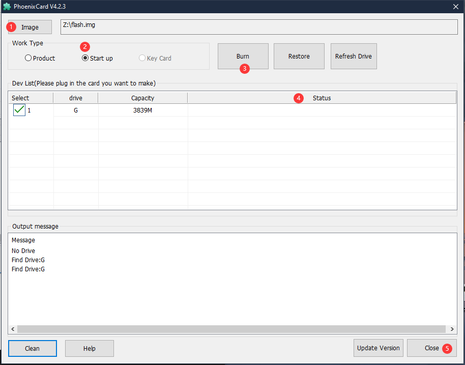
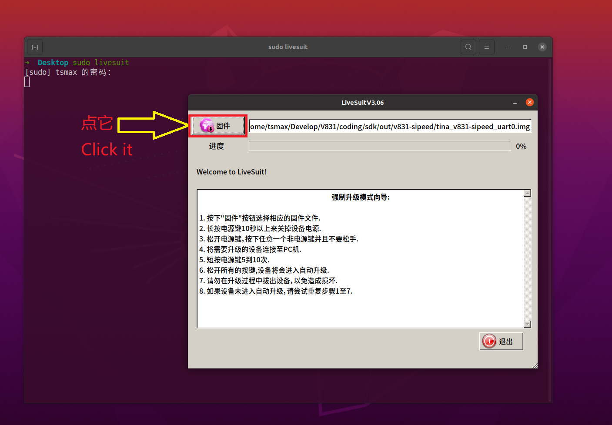
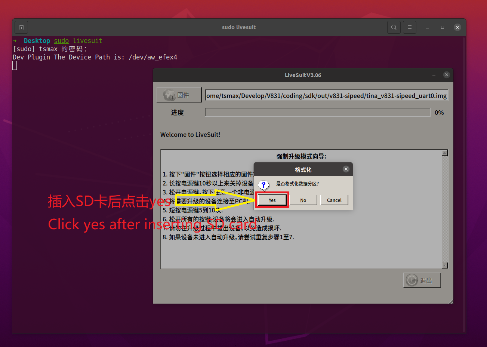
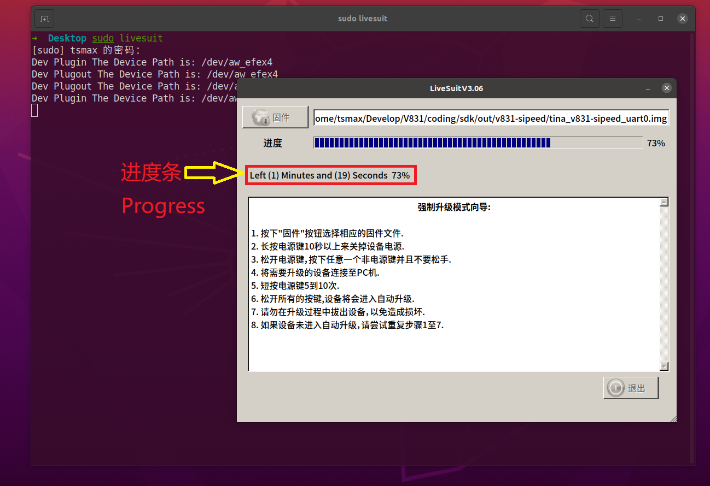

> Edit on 2022.06.27

## Get system image file

Download the newest V831 system image from Download website [SDK_MaixII/release](https://dl.sipeed.com/shareURL/MaixII/MaixII-Dock/SDK/release), unpack the downloaded file to get the .img file, which is the system image file. 

> If it slows to download, you can use [MEGA]https://mega.nz/fm/9Bw0wJoD 

## Image file name rule

For V831 there is name rule for all files.

Here I take `v831-m2dock-maixhub-0.5.1-20220701.zip` and ` v831-m2dock-maixpy3-0.5.1-20220701.zip`  these two image files for example.

| Name          | Meaning                                                                                           |
| ------------- | ------------------------------------------------------------------------------------------------- |
| maixpy3-0.5.1 | For [MaixPy3](https://wiki.sipeed.com/maixpy3) and its version is `0.5.1` , no maixhub app inside |
| maixhub-0.5.1 | For [MaixPy3](https://wiki.sipeed.com/maixpy3) and its version is `0.5.1` , contains maixhub app  |
| m2dock        | Image for MaixII-Dock                                                                             |
| 20220701      | Update date                                                                                       |

## Buring System 

### Using Windows

We use PhoenixCard and PhoenixSuit to burn image in Windows OS. The first one is used for burning image file into TF card and PhoenixSuit is used for burning image file into flash through USB.

Here we take PhoenixCard for example.

#### Prepear

- Get burnning tool [PhoenixCard](https://dl.sipeed.com/shareURL/MaixII/MaixII-Dock/SDK/tools)
- Get [image file](https://dl.sipeed.com/shareURL/MaixII/MaixII-Dock/SDK/release)
- Get SD card [Formatter Tool](https://www.sdcard.org/downloads/formatter/eula_windows/SDCardFormatterv5_WinEN.zip)

#### Buring system

- Use SD Card Formatter to format your TF card. Click Refresh then choose your target disk carefully, click Format


- Run PhoenixCard, and choose the target firmware, insert tf card into card reader then connect with the computer.



### Using Linux(Ubuntu)

#### Prepare

- Install Livesuit

1. Install dkms

    ```bash
    sudo apt install dkms
    ```

2. Install libpng1.2(It must be this version)

     ```shell
     wget http://archive.ubuntu.com/ubuntu/pool/main/libp/libpng/libpng_1.2.54.orig.tar.xz
     tar xvf  libpng_1.2.54.orig.tar.xz
     ```

     ```shell
     cd libpng-1.2.54
     ./autogen.sh
     ./configure
     make -j8
     sudo make install
     ```

     update link binary:

     ```shell
     sudo ldconfig
     ```

3. Install **livesuit**

     ```shell
     git clone --recursive https://github.com/QinYUN575/allwinner-livesuit.git
     cd allwinner-livesuit
     chmod +x livesuit_installer.run
     sudo ./ 
     ```

#### Burning system

- Run command `sudo livesuit` to run livesuit software, then click the red box marked in the picture below to choose your image file.



- Connect your computer with **OTG** interface on MaixII-Dock without SD card in it, this software will show a dialog, then insert SD card into MaixII-Dock and click yes to format SD card and burning system.



- Wait burning finished, then we can begin to use it.



