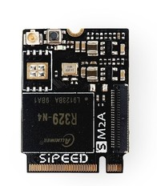
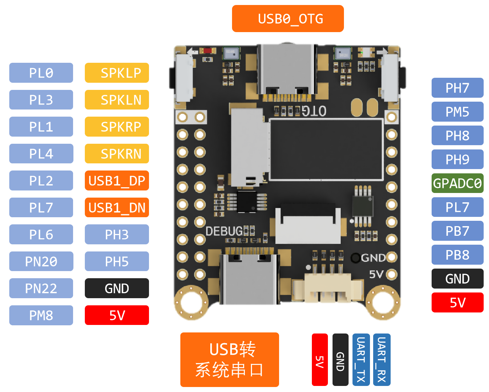

# MaixSense

This board is different from Maix-I series, it's main chip not only contains AI acceleration hardcore, but also supports running armbian operating systems.

## M2A core board

M2A core board use R329 as main chip, and also contains components like power management chip, fel burn key, wifi module, storge pad reserved and RMGII interface.

### R329 chip

R329 is a 64 bits processor designed by Allwinner containing dual Cortex-A53 inside, with 2 HIFI4 DSP used for audio pre-processing and post-processing, containing an extremely low energy consumption AIPU (Artificial intelligence processing unit) whose hash rate over 0.256 TOPS designed by ARM China, can be used to accelerate neural network, dealing with the 720P image captured by camera.

| Item | Specs |
| --- | --- |
| CPU | Dual-core ARM Cortex™-A53@1.5GHz 32KB L1 I-cache + 32KB L1 D-cache per core 256KB L2 cache |
| DSP | Dual-core HiFi4@400MHz  32KB L1 I-cache + 32KB L1 D-cache per core  2MB SRAM |
| NPU | zhouyi™Z1 AIPU，0.25TOPS@600MHz |
| RAM |256MB DDR3 inside |
| Storge |  Support SPI Nand/Nor/eMMC |
| Audio | Supports 5 audio ADC and 2 audio DAC Supports 5 analog audio inputs and 2 analog audio output Up to 3 I2S/PCM controllers for Bluetooth and external audio codec Integrated digital microphone, supports up to 8 digital microphones |
| Enthernet | 10/100/1000 Mbps |
| USB | OTG \* 1 Host \* 1|
| SDIO | SDIO 3.0 * 2 |
| I2S | I2S*3(I2S0, I2S1, S-I2S0) |
| SPI | SPI*2(SPI0, SPI1) |
| TWI | TWI*3(TWI0, TWI1, S-TWI0) |
| GPADC | 4-ch |
| SCR | SCR*1 |
| PWM | PWM*15(PWM[8:0], S-PWM[5:0]) |

### MaixSense 

MaixSense is a really small Linux card computer. Its package contains a SOM based on R329, and a multifunction IO expansion bottom board. Running Linux OS, it can be used for personal server, Intelligent voice assistant or robotis. Because of the AIPU npu core, this board can also be used for intelligent voice and video image processing, and AI model like  CV , NLP can also run on it.

**Tina Linux**：Tina Linux is an embedded system built for intelligent hardware products by Allwinner based on openwrt-14.07. Kernel source code, drivers, toolchain, system middleware and application packages can be found @ [https://github.com/sipeed/r329-linux-4.9](https://github.com/sipeed/r329-linux-4.9)

MaixSense not only can run Tina os, but also can run **armbian**, which is built based on debian/ubuntu,this is a really common linux os.

| Name | armbian | Tina |
|:---|:---|:---|
|Description| A `Debian OS` for `arm` devices | An OS modified from OpenWRT1404 |
| Feature | Linux mainline, with many advantages | Deeply modified, well fits hardware |
| Target user | New Linux user | Linux developer, custome design  |

## MaixSense Specs

<table role="table" class="center_table">
    <thead>
        <tr>
            <th colspan = "2">MaixSense Specs</th>   
        </tr>
    </thead>
    <tbody float:left>
    <tr>    
        <td>CPU</td>
        <td>Dual ARM CortexTM-A53™ </td>
    </tr>
    <tr>
        <td>AIPU(NPU)</td>
        <td>TZ1AIPU，Supports up to 0.25TOPS@600MHz max</td>
    </tr>
    <tr>
        <td>DRAM</td>
        <td>SIP 256MB DDR3</td>
    </tr>
    <tr>
        <td>Memory</td>
        <td>SPI NAND pad(Default blank) SD card slot on bottom board</td>
    </tr>
    <tr>
        <td>Video Encoder</td>
        <td>H264/5 &JPEG,supports up to 720p@30fps</td>
    </tr>
    <tr>
        <td>Camera</td>
        <td>Default equipped with OV9732，720P@30fps HD. Connected by USB-C connector, supports front or back insertion (can be used as front or rear cameras)</td>
    </tr>
    <tr>
        <td>Microphone</td>
        <td>2 Analog MEMS microphones，average sensitivity 91dB SPL@1kHz</td>
    </tr>
    <tr>
        <td>Screen</td>
        <td>1.5 inch SPI screen, with 0.5mm 12P FPC interface，240*240 resolution</td>
    </tr>
    <tr>
        <td>Key</td>
        <td>1 reset key and 4 user keys(ADC keys)，1 download key(FEL)</td>
    </tr>
    <tr>
        <td>Ethernet</td>
        <td>24P 0.5mm FPC connector，for connecting PHY</td>
    </tr>
    <tr>
        <td>IO Routed</td>
        <td>3*10P 2.54mm IO pads 4P* 1.25 male connectors(Used for usart1) See following pinout for more help</td>
    </tr>
    </tbody>
</table>

## Pinout

## Download station

[MaixSense other related information](https://dl.sipeed.com/shareURL/MaixII/MaixII-A)

## Support

Email to support@sipeed.com for business cooperation or leave messge in this page for help.