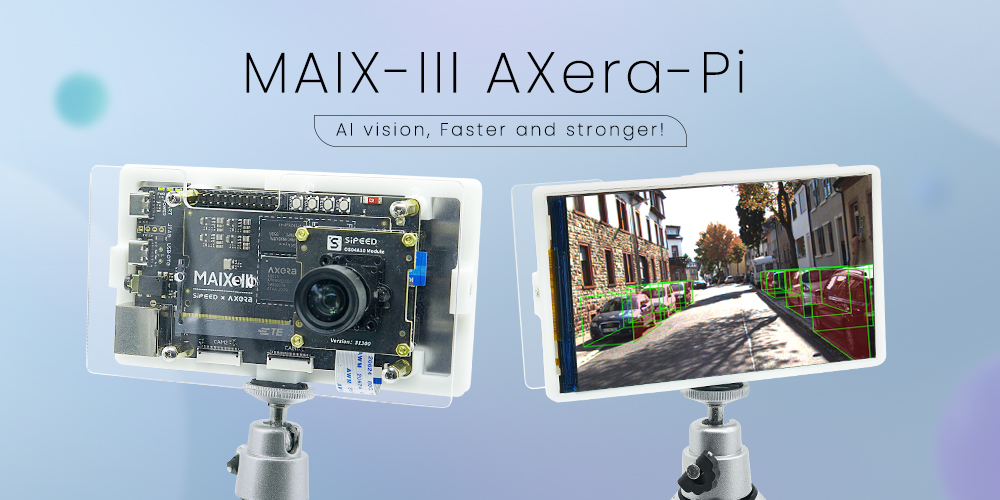
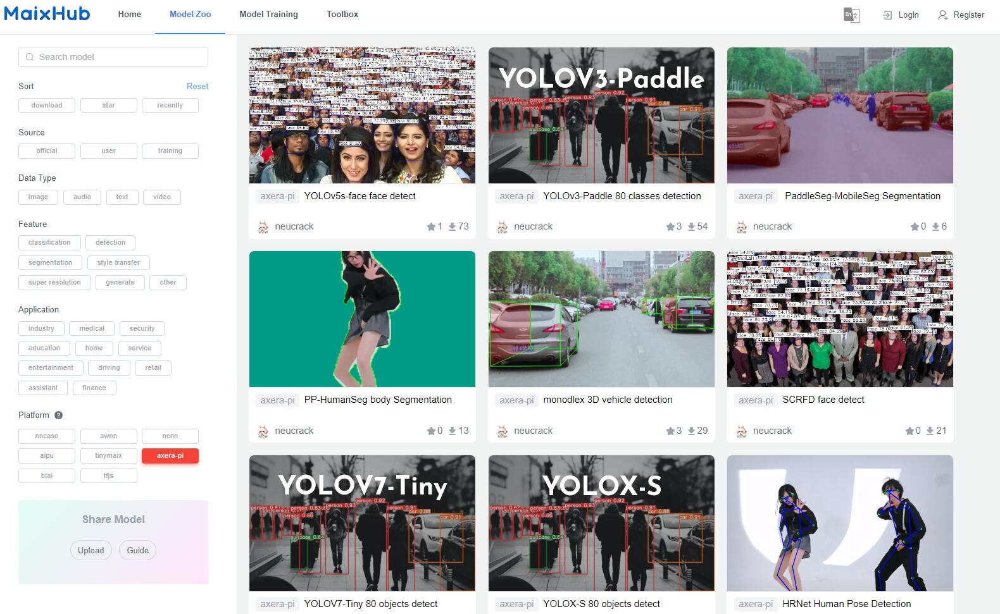

If you think this AI development board are excellent enough and your friends may be interested with this, just share with them this link [http://wiki.sipeed.com/en/m3axpi](http://wiki.sipeed.com/en/m3axpi)

> [Official Online Store](https://www.aliexpress.com/item/1005005016931077.html)

In the past few years, many Linux AI chips come out.

Raspberry Pi and Jetson Nano these boards are really popular by their good performance, but now MAIX-III AXera-Pi comes out, equipped with the high-performance 3.6TOPs@INT8 chip ax620a, which will be your good choice and provice you a really good experience.

We design a core module for this chip, which is convenient if you want to design the ext-board for yourself.

<table>
<thead>
<tr>
  <th colspan=2>MaixIII Core module</th>
</tr>
</thead>
<tbody>
<tr>
  <td>CPU</td>
  <td>Cortex-A7@1.0Ghz*4</td>
</tr>
<tr>
  <td>NPU</td>
  <td>14.4Tops@int4，3.6Tops@int8</td>
</tr>
<tr>
  <td>ISP</td>
  <td>4K@30fps</td>
</tr>
<tr>
  <td>Codec format</td>
  <td>H.264, H.265</td>
</tr>
<tr>
  <td>Video encode</td>
  <td>4K@30fps</td>
</tr>
<tr>
  <td>Video decode</td>
  <td>1080P@60fps</td>
</tr>
<tr>
  <td>Ethernet</td>
  <td>Support RGMII / RMII Ethernet</td>
</tr>
<tr>
  <td>Display</td>
  <td>MIPI DSI 4 Lane，up to 4K@30FPS</td>
</tr>
<tr>
  <td>DRAM</td>
  <td>2GB LPDDR4X 3733Mhz</td>
</tr>
<tr>
  <td>Storge</td>
  <td>Optional 16GB EMMC (Boot from TF card by default)</td>
</tr>
<tr>
  <td>IO pins</td>
  <td>DDR4 SODIMM 260P route all IO</td>
</tr>
</tbody>
</table>

<!-- 没错，它就是来自「[爱芯元智](https://axera-tech.com/)」的 [AX620A](https://axera-tech.com/product/T7297367876123493768)，这是一款高算力，高能效比，低功耗的 AI SoC 芯片，芯片集成了四核 Cortex A7 @ 1Ghz CPU，拥有 3.6TOPs@INT8 的高算力 NPU，支持 4K@30fps 的 ISP，以及支持 H.264、H.265 编码的 VPU，AX620A 还支持 32bit LPDDR4x，支持 EMMC v5.1 / SPI Flash，最多支持 6 路 MIPI 输入，同时最多支持 4 路工作，支持多路子码流，支持 1 路千兆 Ethernet，支持 1 路 USB2.0，支持 2 路 MIPI DSI/CSI 输出。拥有大算力和优异画质处理能力的 AX620A 可以实现更多的 AI 功能，带来最优的 AI 体验！（来自官方） -->

## Introduction

In WORLD ARTIFICIAL INTELLIGENCE CONFERENCE 2022, this AI board is shown the first tima, like what's in the following picture.

  

And finally we launched this AI development board equipped with AX620A in 20221001. Its official name is **MAIX-III AXera-Pi**, while we like to call it **m3axpi** in the following content.

  <video src="../../../zh/maixIII/assets/axpi_boom.mp4"
    width="100%" controls="controls" autoplay="autoplay"
    x5-playsinline=""
 		playsinline
 		webkit-playsinline="true"
 		poster="../../../zh/maixIII/assets/maix-iii-small.jpg"
 		preload="auto"
  >
  </video>

So, why is this AI development board good?

- Lack of documents? Follow our guides, to start journey from embedded Linux development to AI model deployment.
- High power consumption? Just use one usb cable connecting with USB3.0 port to boot this device, no need of other power supply.
- Hard in development? Compile your own application just by this board, or train your own AI model online and deploy it on board.
- Bad camera result? This chip is aimed for AI ISP night vision enhancement, we have adjust the camera to best state.
- Too expensive? This board sold about 100$, chiper than any other similar board.

## Features

### Camera effect

#### Night vision enhancement

<table>
    <tr>
        <th colspan="2">Left picture is original, right picture is enhanced</th>
    </tr>
    <tr>
        <td></td>
        <td></td>
    </tr>
    <tr>
        <td></td>
        <td></td>
    </tr>
</table>

<!-- 

    <iframe src="//player.bilibili.com/player.html?aid=561523949&bvid=BV1Ee4y1v7iF&cid=860676576&page=1" scrolling="no" border="0" frameborder="no" framespacing="0" allowfullscreen="true" style="max-width:640px; max-height:480px;"> </iframe>

 -->

#### Exhibition darkroom

- The left screen shows the enhanced picture and the righr screen is the original one.

<!-- 

    <iframe src="//player.bilibili.com/player.html?aid=430541632&bvid=BV1iG41137tx&cid=831645988&page=1&t=83.6" scrolling="no" border="0" frameborder="no" framespacing="0" allowfullscreen="true" style="max-width:640px; max-height:480px;"> </iframe>

 -->

#### Actual AI effect

    <iframe src="//player.bilibili.com/player.html?aid=773227207&bvid=BV1B14y1Y7A4&cid=837154353&page=1" scrolling="no" border="0" frameborder="no" framespacing="0" allowfullscreen="true" style="max-width:640px; max-height:480px;"> </iframe>

### AI resources

#### Support many Operators

Screenshots of part operators. [Click me to see whole operator support list](https://pulsar-docs.readthedocs.io/en/latest/appendix/op_support_list.html)

#### Many archived models

Before receiving this board, visit [MaixHub](https://maixhub.com/model/zoo) to see your interested model, choose Platform `axera-pi` at the Lower left corner to find model can be deployed on `AX-PI`

Apart from these, many models are uploaded to [github AXERA-TECH/ax-samples](https://github.com/AXERA-TECH/ax-samples), and we also put sme models in sustem image, just burn the system image into SD card and boot it on board to experience these models. Up to now the supported models are as follows:

- Objects Classification
  - MobileNetv1
  - [MobileNetv2](https://github.com/AXERA-TECH/ax-samples/blob/main/examples/README.md#MobileNetv2)
  - MobileOne-s0
  - ResNet18
  - ResNet50
  - Others......
- Objects Detection
  - [PP-YOLOv3](https://github.com/AXERA-TECH/ax-samples/blob/main/examples/README.md#yolov3paddle)
  - YOLOv3
  - YOLOv3-Tiny
  - YOLOv4
  - YOLOv4-Tiny
  - YOLOv4-Tiny-3l
  - [YOLOv5s](https://github.com/AXERA-TECH/ax-samples/blob/main/examples/README.md#YOLOv5s)
  - [YOLOv5-Lite](https://github.com/AXERA-TECH/ax-samples/blob/main/examples/README.md#YOLOv5-Lite)([original model](https://github.com/ppogg/YOLOv5-Lite))
  - [YOLOv7-Tiny](https://github.com/AXERA-TECH/ax-samples/blob/main/examples/README.md#YOLOv7-Tiny)
  - [YOLOX-S](https://github.com/AXERA-TECH/ax-samples/blob/main/examples/README.md#YOLOX-S)
  - YOLO-Fastest-XL
  - NanoDet
- Human Body Detection
  - YOLO-Fastest-Body
- Human Face Detection
  - [scrfd](https://github.com/AXERA-TECH/ax-samples/blob/main/examples/README.md#Scrfd)
  - [YOLOv5-Face](https://github.com/AXERA-TECH/ax-samples/blob/main/examples/README.md#YOLOv5-Face)([original model](https://github.com/deepcam-cn/yolov5-face))
- Human Face Segmentation
  - Face_Parsing
- Obstacles Detection
  - Robot-Obstacle-Detect
- Object detection of Uav view
  - [YOLOv5s_visdrone](https://github.com/AXERA-TECH/ax-samples/blob/main/examples/README.md#YOLOv5s_visdrone)
- Monocular 3D Vehicle Detection
  - [Monodlex](https://github.com/AXERA-TECH/ax-samples/blob/main/examples/README.md#Monodlex)
- Human body Key points
  - [HRNet](https://github.com/AXERA-TECH/ax-samples/blob/main/examples/README.md#HRNet)
  - [AX-POSE-PPL](https://github.com/AXERA-TECH/ax-samples/blob/main/examples/README.md#AX-POSE-PPL)
  - [HandPose](https://github.com/AXERA-TECH/ax-samples/blob/main/examples/README.md#HandPose)
- Human body Segmentation
  - [PP-HumanSeg](https://github.com/AXERA-TECH/ax-samples/blob/main/examples/README.md#PP-HumanSeg)
- Semantics Segmentation
  - [PP-Seg](https://github.com/AXERA-TECH/ax-samples/blob/main/examples/README.md#MobileSeg)
- Classic CV
  - CropResize
- Pipeline example
  - NV12 -> CropResize -> NN(Classification)

Visit [Deploy models to AX-Pi (Maix-III(M3) series) board](/ai/en/deploy/ax-pi.html) to deploy models to AX-Pi.

<!-- 

  

 -->

#### Online tranning model

Now the [MaixHub](https://maixhub.com/welcome) has been upgraded, with more friendly interface and more functions, here are steps to tranning model online.

  

<!-- > m3axpi does not support deploy model by scanning QR code while m2dock can do, m3axpi only can be deployed models by local operations. -->

<!-- 

    <iframe src="//player.bilibili.com/player.html?aid=597374704&bvid=BV1eB4y1Q74i&cid=741940038&page=1" scrolling="no" border="0" frameborder="no" framespacing="0" allowfullscreen="true" style="max-width:640px; max-height:480px;"> </iframe>

 -->

#### Share your model

There are your model and codes or programs to run the model after you finish training the model, you can share these on [Maixhub](https://maixhub.com/model/zoo) to others, let's have fun and build the model Community together.

  

### Cases

> Updated in 20221205

  
  

### Linux development

#### Used on debian

We provide a linux image based on debian11, and you can boot this board from SD card after you burn the system image into SD card. We aim to make it easiler for user to use. Besides, it's really conveient to program AI development with Python API.

1. Burning image: [WIKI AXera-Pi Burn image](https://wiki.sipeed.com/hardware/en/maixIII/ax-pi/flash_system.html#Burn-system-image)

2. Basic usage：[WIKI AXera-Pi guide](./flash_system.md)

3. Program with Python：[ax_pipeline_api](https://github.com/junhuanchen/ax_pipeline_api)

<!-- 4. 开发笔记：[[maixpy3 axpi] 关于爱芯 ax620a 移植 debian11 系统这件事](https://www.cnblogs.com/juwan/p/16751348.html)

5. 开发笔记：[[maixpy3 axpi] 编辑发布 debian 镜像与在 PC 上交叉编译程序 ](https://www.cnblogs.com/juwan/p/16769237.html) -->

#### BSP SDK

We provide source code, api documents, sdk usages, visit [sdk usage](https://wiki.sipeed.com/hardware/zh/maixIII/ax-pi/sdk_usage.html) to get more.

##### [ax-sample](https://github.com/AXERA-TECH/ax-samples)

Here are typical AI models provided by Axera for development, evaluation and verification, those who are good at AI development or want to test these models can have a try, and these are not involved with peripherals.

1. [examples](https://github.com/AXERA-TECH/ax-samples/tree/main/examples)
2. [PP-YOLOv3](https://github.com/AXERA-TECH/ax-samples/blob/main/examples/README.md#yolov3paddle)
3. [PP-HumanSeg](https://github.com/AXERA-TECH/ax-samples/blob/main/examples/README.md#MobileSeg)
4. [PP-Seg](https://github.com/AXERA-TECH/ax-samples/blob/main/examples/README.md#PP-HumanSeg)

##### [libmaix](https://github.com/sipeed/libmaix)

A unified embedded development environment come by SIPEED, contains camera, screen, vision, image processing and pipelines-related deployment examples, is suitable for those who want to learn embedded Linux.

1. [Test screen display](https://github.com/sipeed/libmaix/tree/release/examples/display)
2. [Screen displays camera content](https://github.com/sipeed/libmaix/tree/release/examples/axpi)
3. [camera + screen + yolov5 model](https://github.com/sipeed/libmaix/tree/release/examples/axpi_yolov5_cam)

##### [axpi_bsp_sdk](https://github.com/sipeed/axpi_bsp_sdk)

BSP development package for business, provided by Axera. It's the original development package for this chip, containing components like uboot、linux、msp 、sample、rtsp、ipcdemo, and this is progressively open source, you can get these codes for commercial evaluation, such as ipcdemo, but normally these codes are complex and highly coupled, those who are experienced enough and want to use this board for business cooperation can try this.

1. Development documents [docs](https://github.com/sipeed/axpi_bsp_sdk/tree/main/msp/sample/vo_fb)
2. Platform application [ipcdmeo](https://github.com/sipeed/axpi_bsp_sdk/tree/main/app/IPCDemo)
3. Peripheral Verification[sample](https://github.com/sipeed/axpi_bsp_sdk/tree/main/msp/sample)

##### [ax-pipeline](https://github.com/AXERA-TECH/ax-pipeline)

AX-Pipeline is provided by Axera. With m3axpi, this project is used for pepole to know the usages of ISP, image processing, NPU, codec and display, which is convenient for developers to quickly evaluate and develop their own multimedia applications.

1. [Quick compilation](https://github.com/AXERA-TECH/ax-pipeline/blob/main/docs/compile.md) Simple cross-platform compilation based on cmake.
2. [How to replace into my own trained yolov5 model](https://github.com/AXERA-TECH/ax-pipeline/blob/main/docs/how_to_deploy_custom_yolov5_model.md)
3. [How to deploy my other models](https://github.com/AXERA-TECH/ax-pipeline/blob/main/docs/how_to_deploy_custom_model.md)
4. [How to adjust the image orientation](https://github.com/AXERA-TECH/ax-pipeline/blob/main/docs/how_to_adjust_image_orientation.md)
5. [ModelZoo](https://github.com/AXERA-TECH/ax-pipeline/blob/main/docs/modelzoo.md) descriptions for models which are supported or to be supported

## Hardware

  
  
  

### Hardware function diagram

  
  

### Core module parameters

<table>
<thead>
<tr>
  <th colspan=2>MaixIII Core module</th>
</tr>
</thead>
<tbody>
<tr>
  <td>CPU</td>
  <td>Cortex-A7@1.0Ghz*4</td>
</tr>
<tr>
  <td>NPU</td>
  <td>14.4Tops@int4，3.6Tops@int8</td>
</tr>
<tr>
  <td>ISP</td>
  <td>4K@30fps</td>
</tr>
<tr>
  <td>Codec format</td>
  <td>H.264, H.265</td>
</tr>
<tr>
  <td>Video encode</td>
  <td>4K@30fps</td>
</tr>
<tr>
  <td>Video decode</td>
  <td>1080P@60fps</td>
</tr>
<tr>
  <td>Ethernet</td>
  <td>Support RGMII / RMII Ethernet</td>
</tr>
<tr>
  <td>Display</td>
  <td>MIPI DSI 4 Lane，up to 4K@30FPS</td>
</tr>
<tr>
  <td>DRAM</td>
  <td>2GB LPDDR4X 3733Mhz</td>
</tr>
<tr>
  <td>Storge</td>
  <td>Optional 16GB EMMC (Boot from TF card by default)</td>
</tr>
<tr>
  <td>IO pins</td>
  <td>DDR4 SODIMM 260P route all IO</td>
</tr>
</tbody>
</table>

### Ext-board parameters

<table>
<thead>
<tr>
  <th colspan=2> Ext-board </th>
</tr>
</thead>
<tbody>
<tr>
  <td>Camera</td>
  <td> Maixmum supported 3 cameras (Default connecting one camera):  1 MIPI 4-LANE + 2 MIPI 2-LANE</td>
</tr>
<tr>
  <td>Display</td>
  <td>Maixmum supported 4-LANE MIPI DSI</td>
</tr>
<tr>
  <td>SD card slot</td>
  <td>Default boot from SD card</td>
</tr>
<tr>
  <td>Recording</td>
  <td>2 onboard MEMS MIC support dual MIC noise reduction</td>
</tr>
<tr>
  <td>Audio output</td>
  <td>Support 3.5MM interface, used for stereo output or MIC input</td>
</tr>
<tr>
  <td>Network</td>
  <td>Support Gigabit Ethernet (ETH) and 2.4GHZ WI-FI</td>
</tr>
<tr>
  <td>USB </td>
  <td>1 x USB2.0HS osed for OTG or HOST 1 x USB-UART</td>
</tr>
<tr>
  <td>Others</td>
  <td>1 User key， 3 x System keys， 1 x RTC， 2 x LEDs</td>
</tr>
<tr>
  <td>Interface</td>
  <td>Reserved CJTAG，used for connecting corresponding debugger，  2 x 12 pin headers， 4 x M2.5 screw positioning holes</td>
</tr>
</tbody>
</table>

[Hardware summary informations](https://dl.sipeed.com/shareURL/MaixIII/AXera)

- [Datasheet](https://dl.sipeed.com/shareURL/MaixIII/AXera/01_Specification)
- [Schematic](https://dl.sipeed.com/shareURL/MaixIII/AXera/02_Schematic)
- [Bit map](https://dl.sipeed.com/shareURL/MaixIII/AXera/03_Bit_number_map)
- [3D file](https://dl.sipeed.com/shareURL/MaixIII/AXera/05_3D_file)
- [Dimension](https://dl.sipeed.com/shareURL/MaixIII/AXera/04_Dimensional_drawing)
- [GC4653 Camera DS](https://dl.sipeed.com/shareURL/MaixIII/AXera/07_Chip_manual)

### Camera comparison

- Low-end camera gc4653 400w basic experience

  

- High-end camera os04a10 400w enhanced night vision edition

  

> [How to change camera](./faq_axpi.md)

## Others

- Online AI: http://maixhub.com
- Documents: http://wiki.sipeed.com
- Github: http://github.com/sipeed

> Visit [Maix-III AXera-Pi (FAQ)](./faq_axpi.md) if you have trobule.
