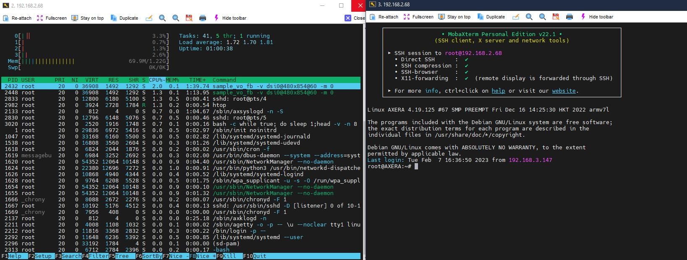
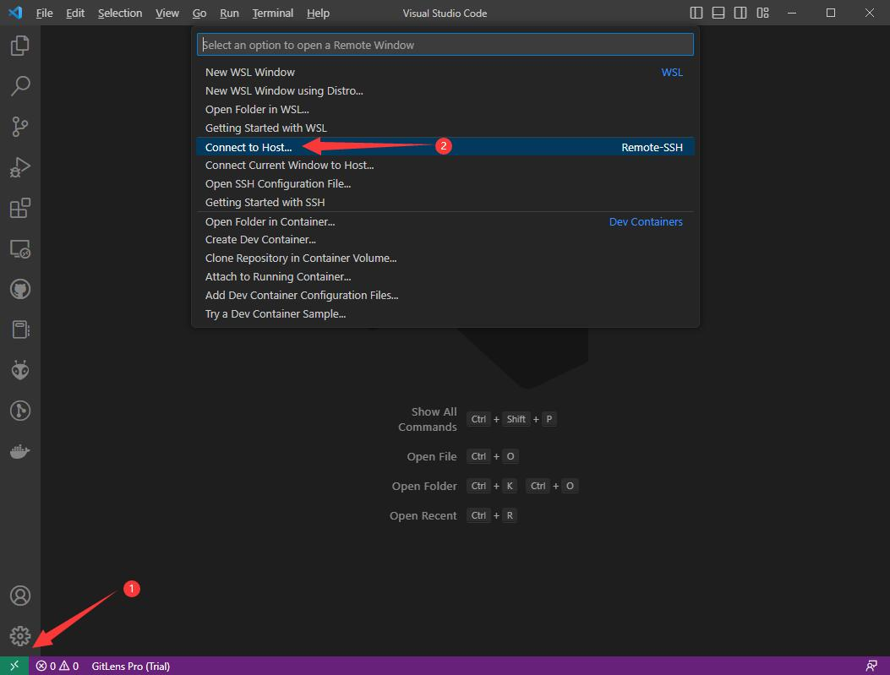
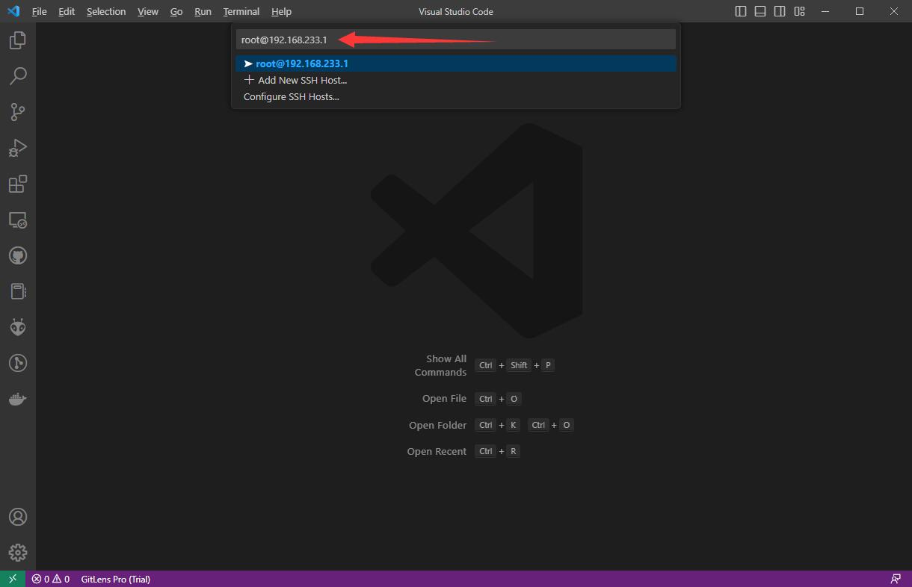
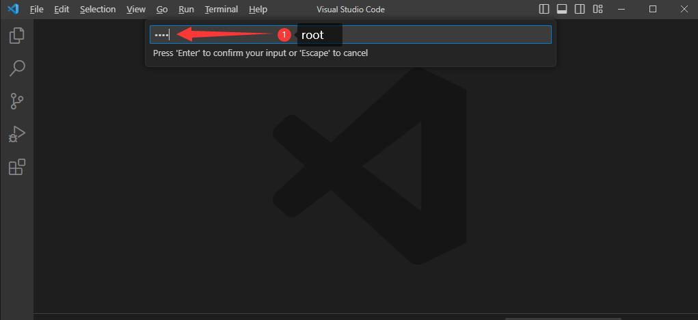

> Before reading, it's necessary to know basic usage about `gcc` and `make`.

## Preparation

We have told basic operation like burning system and using AXera-Pi in previous article, which help you know how to use AXera-Pi.

For embedded linux, we usually use cross-compile technology to compile out the application for target linux device.

A cross compiler is a compiler capable of creating executable code for a platform other than the one on which the compiler is running. For example, a cross compiler executes on machine X and produces machine code for machine Y. 

Normally our computer have better performance than target embedded linux device, compiling the executable on our computer, then run the application on target embedded linux device. This saves more time than compiling and running on target embedded linux device.

For example, `ax-sample` takes more than 10 minutes to be compiled on AXera-Pi, but it takes less than one minute on your computer.

Above all, for embedded development, coree-compile technology is commom and it's necessary to know about this if you want to save your time.

## Transfer files

Compiling out the application on our computer, we need send the application to AXera-Pi.

- `SSH` (Secure Shell) enables secure system administration and file transfers over insecure networks. 
- `Serial` application tool is OK to transfer files but it's too slow.

### Transfer file with SSH

There are many good SSH application on Windows, here we use [Mobaxterm](https://mobaxterm.mobatek.net/) to login AXera-Pi and Transfer file.

[Mobaxterm Usage Demo](https://mobaxterm.mobatek.net/demo.html)


Besides, [Vscode](https://code.visualstudio.com/) is also a gooe idea for transfering file. Install the [Remote - SSH](https://marketplace.visualstudio.com/items?itemName=ms-vscode-remote.remote-ssh) and [Remote Explorer](https://marketplace.visualstudio.com/items?itemName=ms-vscode.remote-explorer) extensions, then login to AXera-Pi via vscode SSH.


### Transfer file with scp

scp means `ssh + cp`.

Here is the command to transfer file.

```bash
scp [option] /path/to/source/file user@server-ip:/path/to/destination/directory
```

- `/path/to/source/file` Target file/folder sent from host to device
- `user@server-ip` : Remote target device IP address.
- `/path/to/destination/directory` Target device directory to receive the file/folder

###  Use card reader

Because of different file system, it's only suggested to use this way if operating system of your computer is Linux.

### Transfer file with UART

For linux users, install `lrzsz` first (`sudo apt-git install lrzsz`) and use it to finish this

Windows user can use Mobaxterm to transfer file between computer and AXera-Pi via USB-UART connection.

## Compile on AXera-Pi

Here we tell how to compile application on AXera-Pi.

Because serial port connector is slow and can be only opened by only one application at one time, we usually login to AXera-Pi by SSH, which we can open many terminals and enter different commands in dirrerent ssh terminal at the same time.



### Vscode remote

We have told how to login to AXera-Pi via SSH with vscode, login to AXera-Pi by Vscode first, make sure not install [C/C++](https://marketplace.visualstudio.com/items?itemName=ms-vscode.cpptools) extension of vscode on AXera-Pi, this extension may close SSH connnection.

Click ① and ② to open a SSH connection.



Here we take `192.168.233.1` IP address as example, make sure not forget add username `root` at first.

`root@IP_address`



Choose platform `Linux` and `Continue`.


Eenter password `root` to login



Succeed logining to AXera-Pi.


Click `Open Folder` to see your AXera-Pi directory structure.


Use command <code>Ctrl + Shift + `</code> to new a terminal, run following command to compile <code>libmiax</code> application.

Example compiling command:

```bash
cd /home/libmaix/examples/axpi/ # Open source code directory
python3 project.py build # Compile the project
fbon # Enable screen control
./dist/start_app.sh # Run compiled out application
```


Running the commands above, screen displays camera content, use `Ctrl + c` to stop this application if you want to do other task.


### Mobaxterm

Using Mobaxtern to login AXera-Pi is a good idea for windows user.

Complie libmaix example on AXera-Pi:


## Cross compiling on computer

We compile out the application for AXera-Pi on our computer first. 

AXera-Pi is based on Cortex-A7 arm architecture, while normally our computer is based on x86-64 architecture, these two different architectures are based on different instruction set.

The binary executable program normally can not be executed on the same OS if the cpu architecture is not the same because different architecture means different instruction set.

We can install the compiler for arm architecture on our computer, compiled by this compiler, we get the program which can execute on arm architecture device like AXera-Pi.

Here we compile the program based on ubuntu, then send the compiled program to AXera-Pi and run on it.

Install the compiler for AXera-Pi first.

```bash
sudo apt install gcc-arm-linux-gnueabihf
```

Run following command to check your installation.

```bash
arm-linux-gnueabihf-gcc
```

The result should be as following.


New a C file named `cross_test.c`, and compile it by `arm-linux-gnueabihf-gcc`. The content of the C file like this:

```c
#include <stdio.h>
int main(){
    printf("Hello, AxPi!\n");
    return 0;
}
```

Then use following command to compile the C file.

```bash
arm-linux-gnueabihf-gcc -o test cross_test.c -static
```

Then we get the executable file named `test` on our computer, and if we run `./test`, it says `Exec format error`. Check file format of `test`, we can see it's `ELF 32-bit LSB executable, ARM, EABI5`


So it can only be executed on Axera-Pi, sending the `test` executable file to AxPi, and on Axera-Pi this program works well.

```bash
csp test root@192.168.233.1:/home
```

By this command, we succeed upload the `test` executable file to Axera-Pi via rndis protocol by `scp` commmand. And note that the password requirement of running command above is `root`.

Then we can run `test` executable file on Axera-Pi.


We finish cross-compile.

## SDK Repositories

Here are repositories for AXera-Pi, check them if you need.

### libmaix

[libmaix](https://github.com/sipeed/libmaix) is unified embedded development environment come by SIPEED, contains camera, screen, vision, image processing and pipelines-related deployment examples, is suitable for those who want to learn embedded Linux.

### ax-sample

[ax-sample](https://github.com/AXERA-TECH/ax-samples) contains typical AI models provided by Axera for development, evaluation and verification, those who are good at AI development or want to test these models can have a try, and these are not involved with peripherals.

### axpi_bsp_sdk

[axpi_bsp_sdk](https://github.com/sipeed/axpi_bsp_sdk) is the bsp development package for business usage. It's the original development package for this chip, containing components like uboot、linux、msp 、sample、rtsp、ipcdemo, and this is progressively open source, you can get these codes for commercial evaluation, such as ipcdemo, but normally these codes are complex and highly coupled, those who are experienced enough and want to use this board for business cooperation can try this.

### ax-pipeline

[ax-pipeline](https://github.com/AXERA-TECH/ax-pipeline) is provided by Axera. With m3axpi, this project is used for pepole to know the usages of ISP, image processing, NPU, codec and display, which is convenient for developers to quickly evaluate and develop their own multimedia applications.

## SDK usage

There are guides in each SDK Repositories. Here we tells how to build the program for AXera-Pi with SDK Repositories.

To begin this, we need install `git`, `cmake` first.

### libmaix

#### Get SDK

```bash
git clone https://github.com/sipeed/libmaix.git --recursive
```

#### Compile SDK 

We have said that we can compile on AXera-Pi or cross-compile on our computer and send to AXera-Pi.

<!-- ### [libmaix](https://github.com/sipeed/libmaix)

> /home/ 目录已预置，可以 git pull 联网拉取更新。

对于 `libmaix`， 按照其`README.md` 文件描述的方法编译即可， 不过需要在`menuconfig`命令中选择 `AXera-Pi` 作为编译目标。

这里简要介绍一下编译过程（libmaix 目前还未稳定，未来可能会有大的更新），实际以[libmaix 仓库](https://github.com/sipeed/libmaix)代码和说明为准。

* 先安装依赖
```
apt install build-essential cmake python3 sshpass git
```
> sshpass 也可以不安装， build-essential, cmake, git, python3 必须安装

* 克隆仓库到本地或者开发板
```
git clone https://github.com/sipeed/libmaix --recursive
```
>! 注意 `--recursive` 参数是必须的，用以克隆子模块，否则会缺代码。

这里以在开发板上编译为例：

```bash
cd /home/libmaix # git clone https://github.com/sipeed/libmaix --recursive
cd examples/axpi
python3 project.py distclean
# python3 project.py menuconfig # 可以配置相关参数
python3 project.py build        # 如果增加文件了，需要 python3 project.py rebuild 命令
./dist/start_app.sh             # 运行示例程序
``` -->

### ax-samples

Repository: [Click me](https://github.com/AXERA-TECH/ax-samples)

This SDK has been set in `/home` path of AXera-Pi, read [ax-samples](https://github.com/AXERA-TECH/ax-samples) for more help.

```bash
cd /home/ax-samples # git clone https://github.com/AXERA-TECH/ax-samples.git
mkdir build
cd build
cmake ..
make install
```

THen we get the executable program, which is in `ax-samples/build/install/bin/` directory

### [axpi_bsp_sdk](https://github.com/sipeed/axpi_bsp_sdk)

Repository: [Click me](https://github.com/sipeed/axpi_bsp_sdk)

Read [readme](https://github.com/sipeed/axpi_bsp_sdk/blob/main/readme.md) for more information, and read document here [Click me](https://github.com/sipeed/axpi_bsp_sdk/tree/main/docs).

The `on pc` of `run your program` [readme](https://github.com/sipeed/axpi_bsp_sdk/blob/main/readme.md) is sending the executable program to AXera-Pi first, then run it.

## SDK with AI

To load AI vision model, we need to use camera, screen and AI model. Here are several Repositories which can help you this.

### Build with libmaix (Easy for developmrnt, for quick verification)

- [axpi libmaix](https://github.com/sipeed/libmaix/tree/release/examples/axpi)
- [axpi_classification_cam](https://github.com/sipeed/libmaix/tree/release/examples/axpi_classification_cam)
- [axpi_yolov5_cam](https://github.com/sipeed/libmaix/tree/release/examples/axpi_yolov5_cam)

> 20221113 This SDK is only for test, no optimization include.

### Build with ax-pipeline (Medium difficulty, for optimization)

This SDK is based on `bsp sdk`(axpi_bsp_sdk), and with better proformance.

- [Compile prepare](https://github.com/AXERA-TECH/ax-pipeline/blob/main/docs/compile.md)
- [Use yolov5 model](https://github.com/AXERA-TECH/ax-pipeline/blob/main/docs/how_to_deploy_custom_yolov5_model.md)
- [Use other models](https://github.com/AXERA-TECH/ax-pipeline/blob/main/docs/how_to_deploy_custom_model.md)

### Build with ipcdemo (Hard for developmrnt, business suggessted)

Based on axpi_bsp_sdk, difficult code with good proformance, it's suggessed for business development.

- [axpi_bsp_sdk/app/IPCDemo](https://github.com/sipeed/axpi_bsp_sdk/tree/main/app/IPCDemo)