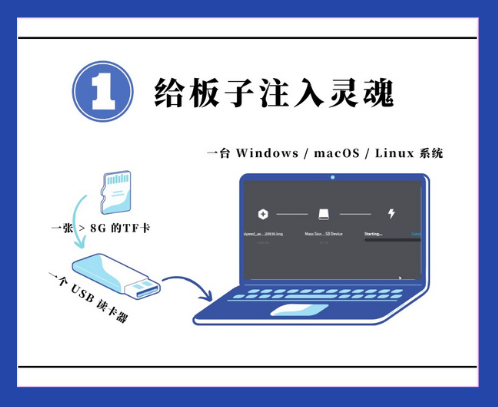
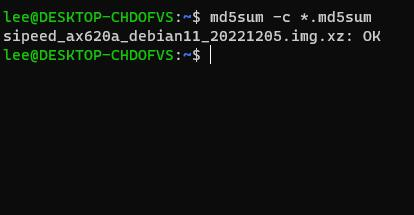
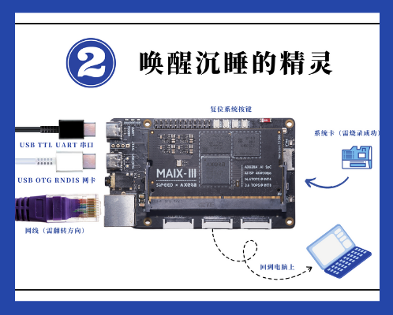

---

> This page is on building, please use translation application to see https://wiki.sipeed.com/m3axpi instead.

## Product guideline

To make it easiler to use this board, we prepare this guide.

## OS introduction

**The default AXera-Pi kit has no onboard memory storage, so it's necessary to prepare a TF card to boot this device.**

For Axera-Pi, we provide Debian11 Bullseye image file.

> 
> [Reasons to use Debian](https://www.debian.org/intro/why_debian.en.html).

TF card which has been burnned system image can be bought from [Sipeed aliexpress](https://sipeed.aliexpress.com/store/1101739727), otherwise you need to perpare your own system image TF card by following steps.

## Choose TF card

People who has bought the the TF card which has been burnned system image can skip this chapter and read [start Linux]() to use this board

We have tested the read and write speed of some TF cards on Axera-pi, for users to make the choice of TF card.


> Some TF cards are added to test after this photo, so they are not in this photo but they can be recognized by their number.

| Number | Model                                    | <p style="white-space:nowrap">Write speed（Write 160MB）</p> | <p style="white-space:nowrap">Read speed（Read 160MB） </p> |
| ------ | ---------------------------------------- | ------------------------------------------------------------ | ----------------------------------------------------------- |
| 1.     | Netac A2  P500-HS-64GB                   | 2.04697 s, 80.0 MB/s                                         | 1.8759 s, 87.3 MB/s                                         |
| 2.     | Samsung microSDXC UHS-I 128G (Bule card) | 2.53387 s, 64.7 MB/s                                         | 1.99882 s, 82.0 MB/s                                        |
| 3.     | EAGET T1 series 64G                      | 6.56955 s, 24.9 MB/s                                         | 7.13792 s, 23.0 MB/s                                        |
| 4.     | Keychron microSDXC UHS-I 128G            | 2.28133 s, 71.8 MB/s                                         | 1.92001 s, 85.3 MB/s                                        |
| 5.     | KIOXIA microSDXC UHS-I 32G               | 6.71284 s, 24.4 MB/s                                         | 2.36794 s, 69.2 MB/s                                        |
| 6.     | Netac  A1 32GB                           | 4.31411 s, 38.0 MB/s                                         | 2.00759 s, 81.6 MB/s                                        |
| 7.     | BanQ JOY card platinum 64G               | 9.08105 s, 18.0 MB/s                                         | 9.02843 s, 18.1 MB/s                                        |
| 8.     | Hiksemi HS -TF- P2 64G                   | 2.28079 s, 71.8 MB/s                                         | 1.87698 s, 87.3 MB/s                                        |

Tht following TF cards are not in this photo but we also tested them.

| Number | Model                                 | <p style="white-space:nowrap">Write Speed (Write 160MB) </p> | <p style="white-space:nowrap">Read Speed (Read 160MB) </p> |
| ------ | ------------------------------------- | ------------------------------------------------------------ | ---------------------------------------------------------- |
| 1.     | Lexar 64GB TF（MicroSD）C10 U3 V30 A2 | 2.59644 s, 63.1 MB/s                                         | 1.9106 s, 85.8 MB/s                                        |
| 2.     | Lexar 128GB TF（MicroSD）C10 U3 V30   | 6.73793 s, 24.3 MB/s                                         | 6.94079 s, 23.6 MB/s                                       |

### Burn system image



We only reserved EMMC pad on board, so we need to a TF card which have been burned system image to boot linux on this boad.

#### Get image

Because the system image is about 2G, so we only provide mega link to download.

Visit mega [Click me](https://mega.nz/folder/9EhyBbJZ#lcNhhm9aWXOyo2T0DDaSqA) to download the image file.


The file name end with `img.xz` is the compressed system image file, and the other file name end with `img.xz.md5sum` is the check file, which we use to check the compressed system image file.

The name rule of compressed system image file is `Image provider` _ `Target chip` _ `Linux distribution` _ `Created time` + `img.xz`

The check file should be used in the Linux, and users using windows10 or windows 11 can use the wsl to prepare a Linux environment

Run command `md5sum -c *.md5sum*` in the path where compressed system image file and check file are to check the compressed system image file.

| Check succeeded                                                       | Check failed                                                     |
| -------------------------------------------------------------- | ------------------------------------------------------------ |
|  |  |

If there is some thing with the compressed system image file, it will shows FAILED. Normally we don't need to check the compressed system image file, this is only for those who need.

## Burn image

**Before burning image, we need do following preparation:**

- A TF card with a storge capacity card over 8GB; It is recommended to buy an official image card, otherwise it may lead to a bad experience due to the bad performace of the TF card
- A card reader: It is recommended to use the card reader that supports USB3.0, this will save our time on burning the system image card.
- [Etcher] (https://www.balena.io/etcher/) application: Download the edition of this application suitable for your computer system.

**Burning system image steps**

Run [Etcher](https://www.balena.io/etcher/ "Etcher") application, click `Flash from file`, choose the compressed system image `img.xz` file， then click `Select target` to choose the TF card，click `FLASH` to burn your TF card.

**Burn the TF card**


| Burning                                                                          | Finish burning                                                    |
| ------------------------------------------------------------------------------- | ----------------------------------------------------------- |
|  |  |

Note that after finish burning the application shows `Flash Complete!` and `Successful`.

Finishing above steps, the computer will ask us to format the udisk, we just ignore this information and remove the TF card (Because we have make `Successful` in Etcher), prepare for the following operations.

#### Burning Questions

##### 1. After selecting sustem image, Etcher shows error.

Rerun Etcher application to solve this error due to software cache or other issues

##### 2. After finishing burning software the application shows FAILED not Successful

Reburn the TF card.

##### 3. The storage capacity of tf card is too small

In this case, those who use Windows and MaxOS can use [SD Card Formatter](https://www.sdcard.org/downloads/formatter/eula_windows/SDCardFormatterv5_WinEN.zip) to format tf card, and those use Linux can format the tf card by [Gparted](https://gparted.org/).

## Boot System

Finishing burning system image into tf card, we can assemble this board and boot this device.



### Assemble this board

> Those have bought the `Full board package` can skip these steps and visit [boot Axera-pi] to start.

**Preparation**

- An AXera-Pi development board
- At least one USB3.0 connector to connect device(This board may fail to boot because the insufficient of power supply from USB2.0)
- A tf card which has been burned system image
- GC4653 camera or OS04a10 camera
- The 5 inchs MIPI screen suitable for Axera-pi


**Follow these steps to make sure you assemble them correctly**

1. Set the screen and the board as shown in the image below, and connect them.
2. Insert tf card which has been burned system image into the card slot on Axera-pi.
3. Connect the camera with Axera-pi as shown in the image below, make sure you have removed the cover on the camera after finishing connectting.

<html>
  
  
</html>

### Boot AXera-Pi

Connect both `USB-UART` and `USB-OTG` port with computer by USB type-c cable to boot AXera-Pi, make sure you have insert the tf card which has been burned system image.


> In **20221013** we update the power-on phenomenon:

- The 3.5mm connector play the music if connected with device.
- 5 inches screen displays picture.
- The logs are printed to USB-UART port, run serial port application to see it if you need.

Here are the drivers for CH340 which is the USB-UART chip on Axera-Pi, install it if you can't see the serial device in your computer.

[CH34x Windows driver](https://dl.sipeed.com/shareURL/MAIX/tools/ch340_ch341_driver)
[CH34x Linux driver](http://www.wch-ic.com/downloads/CH341SER_LINUX_ZIP.html)

And those who use Ubuntu22.04 may not be able to open serial port (ttyUSB), read [this](https://www.chippiko.com/ch340-dev-ttyusb-not-showing) to see the solvement.

.. details:: Click to see the system boot log of debian11

    ```bash
    Vddr init success!
    The system boot form EMMC
    enter boot normal mode

    U-Boot 2020.04 (Jun 16 2022 - 00:16:34 +0800)

    Model: AXERA AX620_demo Board
    DRAM:  1 GiB
    NAND:  unknown raw ID 77ee0178
    uclass_get_device: Invalid bus 0 (err=-524)
    0 MiB
    initr_pinmux: delay pinmux_init for env board id
    MMC:   enter sdhci_cdns_get_cd call mmc_getcd
    enter sdhci_cdns_get_cd call mmc_getcd
    mmc@10000000: 0, mmc@4950000: 1
    Loading Environment from MMC... OK
    In:    serial
    Out:   serial
    Err:   serial
    MMC: no card present
    sd card is not present
    enter normal boot mode
    Net:
    reset EMAC0: ethernet@0x4970000 ...
    Warning: ethernet@0x4970000 (eth0) using random MAC address - 6a:e4:fd:58:97:ea
    eth0: ethernet@0x4970000
    Hit any key to stop autoboot:  0
    reading DTB and BOOT image ...
    reading bootimg header...
    MAGIC:       AXERA!
    img size:    4841536
    kernel_size: 4841472
    kernel_addr: 64
    id:bc 19 bb a7 2d 27 74 de 7c 91 4b 70 ea c9 ab 96 50 61 bd e0 2b 02 8b e5 c8 ee 22 ce df b1 cf ea
    load kernel image addr = 0x40008000,load dtb image addr = 0x48008000
    boot cmd is :bootm 0x40008000 - 0x48008000
    ## Booting kernel from Legacy Image at 40008000 ...
      Image Name:   Linux-4.19.125
      Image Type:   ARM Linux Kernel Image (uncompressed)
      Data Size:    4839952 Bytes = 4.6 MiB
      Load Address: 40008000
      Entry Point:  40008000
      Verifying Checksum ... OK
    ## Flattened Device Tree blob at 48008000
      Booting using the fdt blob at 0x48008000
      Loading Kernel Image
      Using Device Tree in place at 48008000, end 480103d6

    Starting kernel ...


    Welcome to Debian GNU/Linux 11 (bullseye)!

    [  OK  ] Created slice system-getty.slice.
    [  OK  ] Created slice system-modprobe.slice.
    [  OK  ] Created slice system-serial\x2dgetty.slice.
    [  OK  ] Created slice User and Session Slice.
    [  OK  ] Started Dispatch Password …ts to Console Directory Watch.
    [  OK  ] Started Forward Password R…uests to Wall Directory Watch.
    [  OK  ] Reached target Local Encrypted Volumes.
    [  OK  ] Reached target Network is Online.
    ......
    ```

### Login AXera-Pi


> When the logo above is displayed on the screen of AXera-Pi, the system has finished booting, and we can login to AXera-Pi.


The First time to login to device, we need to use serial port application to open serial port to communicate with device to login, and use SSH login is also ok if you know the ip address of your board.

[MobaXterm](https://mobaxterm.mobatek.net/) is a ultimate toolbox for remote computing, we use this software to run our command on the board for example.


#### Login by serial port

We take MobaXterm as the example serial port software, you can use your favorite one.

In MobaXterm, we create a serial session. Set baudrate 115200, then click ok to create it.


Then click the created serial session to open the serial port to build communication.


Run the serial port application, use username `root` and password `root` to login.

The password is not displayed when you enter it, so just retry if you fail login.


#### Login by SSH

To login by ssh, we need to know the ip address of Axera-Pi.

##### Traditional ip address

We make Axera-Pi and the computer in a same network environment, then run command `ifconfig` on Axera-Pi to get the ip address of Axera-Pi in this network environment.

But you need to make sure you have connected Axera-Pi to network, visit []() to know how to connect to network.

##### RNDIS

Connect the computer with USB-OTG port on Axera-Pi.


Normally RNDIS is driver free in Linux, and in Windows we need to update driver [Click me](./rndis.md), for macos it's need to build and install `horndis` to use RNDIS.

Deflaut RNDIS driver error in Windows:


Run command `ifconfig`, we can see there is a usb device with IP `192.168.1.233`, we'll use this ip address many time in the following content.


##### Login to board

Up to now you have get one of your ip address, run command `ssh {username}@{ip address}` to connect to your board.

Here we take the RNDIS ip address for example to connect Axera-Pi by SSH, and the username is root, you can use other ip address or username you like if you have created the new user.

```bash
ssh root@192.168.233.1
```


### Connect to network

Axera-Pi can connect to network through network cable or wireless.

#### Connect by Ethernet

Connect the board ethernet port with a network gateway by network cable.

Run command `ifconfig` to see whether there is the ip address.


#### Wireless network


### 学会使用板子


由于默认没有配置桌面环境（只显示 logo），所以我们需要将 **AXera-Pi** 连接一台电脑，通过终端管理软件（shell）与它进行命令行交互，这些可以在[「系统使用手册-验证外设」](https://wiki.sipeed.com/hardware/zh/maixIII/ax-pi/basic_usage.html#%E9%AA%8C%E8%AF%81%E7%B3%BB%E7%BB%9F%E5%A4%96%E8%AE%BE)学会板上所有验证过的系统调频、外设、驱动、应用等资源的用法，像一些 Linux 操作基础、如何控制 I2C / UART / SPI 这些硬件设备的操作，还可以在[「系统使用手册-内置 AI 应用」](https://wiki.sipeed.com/hardware/zh/maixIII/ax-pi/basic_usage.html#%E9%AA%8C%E8%AF%81%E7%B3%BB%E7%BB%9F%E5%A4%96%E8%AE%BE)里调用内置的开箱 AI 应用及例程，快去用起来吧！


### 试试 Python 编程（适用初学者）

基于这篇上手指引的一路走下来的学习，相信小伙伴们也基本对 **AXera-Pi** 基础使用以及验证外设有一定的掌握了，那我们就踏入编程的世界，一起来试试 Python 编程吧！

- [试试 Python 编程](https://wiki.sipeed.com/hardware/zh/maixIII/ax-pi/python_api.html)

我们内置了以 `jupyter notebook/ax-pipline-api/pinpong` 等 Python 包，你可以在**「试试 Python 编程」**里获得如何在 **AXera-Pi** 上进入 Python 模式启动 `jupyter notebook` 并使用运行 AI 模型。


以及如何连接 **Arduino UNO** 以及 **Microbit** 进行 Python 编程的效果如下图。

<html>
  
  
</html>

### 准备 C/C++ 编程（适用开发者）

能走到这里就说明板子已经用起来了，那就来开发吧！在这之前需要**「准备开发环境」**了解如何拷贝文件到板子里，如何搭建本地编译或交叉编译，然后通过**「SDK 开发指南」**学习到如何基于现有的代码进行开发。

- [准备开发环境](https://wiki.sipeed.com/hardware/zh/maixIII/ax-pi/dev_prepare.html)

快速了解现在提供哪些开源代码仓库以及用法，这些开源仓库会持续更新和开放的。

- [SDK 开发指南](https://wiki.sipeed.com/hardware/zh/maixIII/ax-pi/sdk_usage.html)


### 训练模型部署

初学者训练模型可以从 [AI 开发指南](https://wiki.sipeed.com/ai/zh/deploy/ax-pi.html) 学习如何训练一个最简单的模型到量化转换部署测试。

更专业更深入的调优需要了解 [Pulsar](https://pulsar-docs.readthedocs.io/) ，这是由**「爱芯元智」**自主研发的 all-in-one 神经网络编译器，充分发挥片上异构计算单元(CPU+NPU)算力， Pulsar 工具链核心功能是将 .onnx 模型编译成芯片能解析并运行的 （.joint） 模型。

目前有以下几种部署方式（Pipeline）推荐：

- **libmaix**：并不在意程序的性能和效率，用最快的方式把摄像头图像输入 AI 模型后输出识别结果绘制到显示到屏幕上验证一下识别效果。

- **ax-pipeline**：没有多余的封装，直接操作芯片核心资源 vin \ ivps \ npu \ vo 等硬解设备进行部署开发，可以使模型部署达到一个非常好的效果。

- **IPCDemo**：以效果最好、性能最好、占用最少、稳定可靠、功能最多、确保最终能部署到用户的现场不出问题的框架代码来开发 AI 程序。

#### libmaix 部署

在板子上编译这个示例代码 [axpi_classification_cam](https://github.com/sipeed/libmaix/tree/release/examples/axpi_classification_cam)，然后放入模型运行后即可看到效果，截止 **20221013** 前代码还没有优化所以性能不高只够看个结果，想要效果和性能可以看 **ax-pipeline** 部署。

<p align="center">
  
</p>

即可验证效果：[详细可从 maixhub 上获取](https://maixhub.com/model/zoo/89)。

#### ax-pipeline 部署

以上的部署方式都出于快速验证或应用落地的角度进行的，还有一套基于 **bsp sdk** 的 [ax-pipeline](https://github.com/AXERA-TECH/ax-pipeline) 部署方式，它面向既了解 AI 又知道芯片底层 Linux 开发方法的同学，目前内置应用中提供了板子的 **rtsp** 和屏幕双推流 **yolov5** 实时识别以及新增 **yolov5s-seg** 实例分割的程序就是来自于它。


#### IPCDemo 部署

这是一个典型的 IPC 演示程序，源码在这里 [axpi_bsp_sdk IPCDemo](https://github.com/sipeed/axpi_bsp_sdk/tree/main/app/IPCDemo) ，其中 IPCDemo 的功能模块有：

- ISP：负责从 Sensor 获取图像 RAW 数据并转为 YUV，最终分 3 路通道输出以上信息。
- IVPS：图像视频处理模块。实现对视频图形进行一分多、Resize、Crop、旋转等功能。
- VENC / JENC：视频/JPEG 编码输出。
- Detect：支持人脸或结构化检测。
- Web 显示：实现 H264 流的 Web 传输和提供 Web 方式查看实时视频。
- RTSP 推流：实现 H264 流的 RTSP 封装以及传输。
- 录像 TF 卡存储：封装 H264 流为 MP4 格式文件并保存至 TF 卡或者 FLASH 空间。

以下视频中的 IPCDemo 程序使用方法请点击<a href="https://wiki.sipeed.com/hardware/zh/maixIII/ax-pi/basic_usage.html#%E5%86%85%E7%BD%AE%E5%BC%80%E7%AE%B1%E5%BA%94%E7%94%A8" target="blank">内置开箱应用</a>查看。

<p align="center">
    <iframe src="//player.bilibili.com/player.html?aid=260625114&bvid=BV1me411T7g8&cid=837160730&page=1" scrolling="no" border="0" frameborder="no" framespacing="0" allowfullscreen="true" style="max-width:640px; max-height:480px;"> </iframe>
</p>
