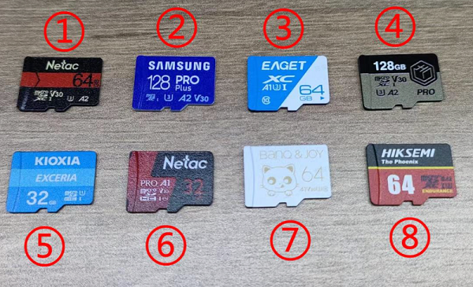
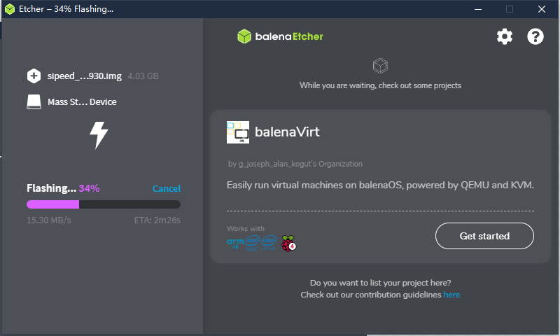
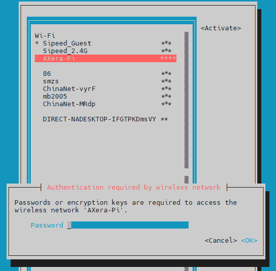

---

> This page is on building, please use translation application to see https://wiki.sipeed.com/m3axpi instead.

## Product guideline

To make it easiler to use this board, we prepare this guide.

## OS introduction

**The default AXera-Pi kit has no onboard memory storage, so it's necessary to prepare a TF card to boot this device.**

For Axera-Pi, we provide Debian11 Bullseye image file.

> 
> [Reasons to use Debian](https://www.debian.org/intro/why_debian.en.html).

TF card which has been burnned system image can be bought from [Sipeed aliexpress](https://sipeed.aliexpress.com/store/1101739727), otherwise you need to perpare your own system image TF card by following steps.

## Choose TF card

People who has bought the the TF card which has been burnned system image can skip this chapter and read [start Linux]() to use this board

We have tested the read and write speed of some TF cards on Axera-pi, for users to make the choice of TF card.



> Some TF cards are added to test after this photo, so they are not in this photo but they can be recognized by their number.

| Number | Model                                    | <p style="white-space:nowrap">Write speed（Write 160MB）</p> | <p style="white-space:nowrap">Read speed（Read 160MB） </p> |
| ------ | ---------------------------------------- | ------------------------------------------------------------ | ----------------------------------------------------------- |
| 1.     | Netac A2  P500-HS-64GB                   | 2.04697 s, 80.0 MB/s                                         | 1.8759 s, 87.3 MB/s                                         |
| 2.     | Samsung microSDXC UHS-I 128G (Bule card) | 2.53387 s, 64.7 MB/s                                         | 1.99882 s, 82.0 MB/s                                        |
| 3.     | EAGET T1 series 64G                      | 6.56955 s, 24.9 MB/s                                         | 7.13792 s, 23.0 MB/s                                        |
| 4.     | Keychron microSDXC UHS-I 128G            | 2.28133 s, 71.8 MB/s                                         | 1.92001 s, 85.3 MB/s                                        |
| 5.     | KIOXIA microSDXC UHS-I 32G               | 6.71284 s, 24.4 MB/s                                         | 2.36794 s, 69.2 MB/s                                        |
| 6.     | Netac  A1 32GB                           | 4.31411 s, 38.0 MB/s                                         | 2.00759 s, 81.6 MB/s                                        |
| 7.     | BanQ JOY card platinum 64G               | 9.08105 s, 18.0 MB/s                                         | 9.02843 s, 18.1 MB/s                                        |
| 8.     | Hiksemi HS -TF- P2 64G                   | 2.28079 s, 71.8 MB/s                                         | 1.87698 s, 87.3 MB/s                                        |

Tht following TF cards are not in this photo but we also tested them.

| Number | Model                                 | <p style="white-space:nowrap">Write Speed (Write 160MB) </p> | <p style="white-space:nowrap">Read Speed (Read 160MB) </p> |
| ------ | ------------------------------------- | ------------------------------------------------------------ | ---------------------------------------------------------- |
| 1.     | Lexar 64GB TF（MicroSD）C10 U3 V30 A2 | 2.59644 s, 63.1 MB/s                                         | 1.9106 s, 85.8 MB/s                                        |
| 2.     | Lexar 128GB TF（MicroSD）C10 U3 V30   | 6.73793 s, 24.3 MB/s                                         | 6.94079 s, 23.6 MB/s                                       |

### Burn system image


We only reserved EMMC pad on board, so we need to a TF card which have been burned system image to boot linux on this boad.

#### Get image

Because the system image is about 2G, so we only provide mega link to download.

Visit mega [Click me](https://mega.nz/folder/9EhyBbJZ#lcNhhm9aWXOyo2T0DDaSqA) to download the image file.


The file name end with `img.xz` is the compressed system image file, and the other file name end with `img.xz.md5sum` is the check file, which we use to check the compressed system image file.

The name rule of compressed system image file is `Image provider` _ `Target chip` _ `Linux distribution` _ `Created time` + `img.xz`

The check file should be used in the Linux, and users using windows10 or windows 11 can use the wsl to prepare a Linux environment

Run command `md5sum -c *.md5sum*` in the path where compressed system image file and check file are to check the compressed system image file.

| Check succeeded                                                       | Check failed                                                     |
| -------------------------------------------------------------- | ------------------------------------------------------------ |
|  |  |

If there is some thing with the compressed system image file, it will shows FAILED. Normally we don't need to check the compressed system image file, this is only for those who need.

## Burn image

**Before burning image, we need do following preparation:**

- A TF card with a storge capacity card over 8GB; It is recommended to buy an official image card, otherwise it may lead to a bad experience due to the bad performace of the TF card
- A card reader: It is recommended to use the card reader that supports USB3.0, this will save our time on burning the system image card.
- [Etcher] (https://www.balena.io/etcher/) application: Download the edition of this application suitable for your computer system.

**Burning system image steps**

Run [Etcher](https://www.balena.io/etcher/ "Etcher") application, click `Flash from file`, choose the compressed system image `img.xz` file， then click `Select target` to choose the TF card，click `FLASH` to burn your TF card.

**Burn the TF card**


| Burning                                                                          | Finish burning                                                    |
| ------------------------------------------------------------------------------- | ----------------------------------------------------------- |
|  |  |

Note that after finish burning the application shows `Flash Complete!` and `Successful`.

Finishing above steps, the computer will ask us to format the udisk, we just ignore this information and remove the TF card (Because we have make `Successful` in Etcher), prepare for the following operations.

#### Burning Questions

##### 1. After selecting sustem image, Etcher shows error.

Rerun Etcher application to solve this error due to software cache or other issues

##### 2. After finishing burning software the application shows FAILED not Successful

Reburn the TF card.

##### 3. The storage capacity of tf card is too small

In this case, those who use Windows and MaxOS can use [SD Card Formatter](https://www.sdcard.org/downloads/formatter/eula_windows/SDCardFormatterv5_WinEN.zip) to format tf card, and those use Linux can format the tf card by [Gparted](https://gparted.org/).

## Boot System

Finishing burning system image into tf card, we can assemble this board and boot this device.


### Assemble this board

> Those have bought the `Full board package` can skip these steps and visit [boot Axera-pi] to start.

**Preparation**

- An AXera-Pi development board
- At least one USB3.0 connector to connect device(This board may fail to boot because the insufficient of power supply from USB2.0)
- A tf card which has been burned system image
- GC4653 camera or OS04a10 camera
- The 5 inchs MIPI screen suitable for Axera-pi


**Follow these steps to make sure you assemble them correctly**

1. Set the screen and the board as shown in the image below, and connect them.
2. Insert tf card which has been burned system image into the card slot on Axera-pi.
3. Connect the camera with Axera-pi as shown in the image below, make sure you have removed the cover on the camera after finishing connectting.

<html>
  
  
</html>

### Boot AXera-Pi

Connect both `USB-UART` and `USB-OTG` port with computer by USB type-c cable to boot AXera-Pi, make sure you have insert the tf card which has been burned system image.


> In **20221013** we update the power-on phenomenon:

- The 3.5mm connector play the music if connected with device.
- 5 inches screen displays picture.
- The logs are printed to USB-UART port, run serial port application to see it if you need.

Here are the drivers for CH340 which is the USB-UART chip on Axera-Pi, install it if you can't see the serial device in your computer.

[CH34x Windows driver](https://dl.sipeed.com/shareURL/MAIX/tools/ch340_ch341_driver)
[CH34x Linux driver](http://www.wch-ic.com/downloads/CH341SER_LINUX_ZIP.html)

And those who use Ubuntu22.04 may not be able to open serial port (ttyUSB), read [this](https://www.chippiko.com/ch340-dev-ttyusb-not-showing) to see the solvement.

.. details:: Click to see the system boot log of debian11

    ```bash
    Vddr init success!
    The system boot form EMMC
    enter boot normal mode

    U-Boot 2020.04 (Jun 16 2022 - 00:16:34 +0800)

    Model: AXERA AX620_demo Board
    DRAM:  1 GiB
    NAND:  unknown raw ID 77ee0178
    uclass_get_device: Invalid bus 0 (err=-524)
    0 MiB
    initr_pinmux: delay pinmux_init for env board id
    MMC:   enter sdhci_cdns_get_cd call mmc_getcd
    enter sdhci_cdns_get_cd call mmc_getcd
    mmc@10000000: 0, mmc@4950000: 1
    Loading Environment from MMC... OK
    In:    serial
    Out:   serial
    Err:   serial
    MMC: no card present
    sd card is not present
    enter normal boot mode
    Net:
    reset EMAC0: ethernet@0x4970000 ...
    Warning: ethernet@0x4970000 (eth0) using random MAC address - 6a:e4:fd:58:97:ea
    eth0: ethernet@0x4970000
    Hit any key to stop autoboot:  0
    reading DTB and BOOT image ...
    reading bootimg header...
    MAGIC:       AXERA!
    img size:    4841536
    kernel_size: 4841472
    kernel_addr: 64
    id:bc 19 bb a7 2d 27 74 de 7c 91 4b 70 ea c9 ab 96 50 61 bd e0 2b 02 8b e5 c8 ee 22 ce df b1 cf ea
    load kernel image addr = 0x40008000,load dtb image addr = 0x48008000
    boot cmd is :bootm 0x40008000 - 0x48008000
    ## Booting kernel from Legacy Image at 40008000 ...
      Image Name:   Linux-4.19.125
      Image Type:   ARM Linux Kernel Image (uncompressed)
      Data Size:    4839952 Bytes = 4.6 MiB
      Load Address: 40008000
      Entry Point:  40008000
      Verifying Checksum ... OK
    ## Flattened Device Tree blob at 48008000
      Booting using the fdt blob at 0x48008000
      Loading Kernel Image
      Using Device Tree in place at 48008000, end 480103d6

    Starting kernel ...


    Welcome to Debian GNU/Linux 11 (bullseye)!

    [  OK  ] Created slice system-getty.slice.
    [  OK  ] Created slice system-modprobe.slice.
    [  OK  ] Created slice system-serial\x2dgetty.slice.
    [  OK  ] Created slice User and Session Slice.
    [  OK  ] Started Dispatch Password …ts to Console Directory Watch.
    [  OK  ] Started Forward Password R…uests to Wall Directory Watch.
    [  OK  ] Reached target Local Encrypted Volumes.
    [  OK  ] Reached target Network is Online.
    ......
    ```

### Login AXera-Pi


> When the logo above is displayed on the screen of AXera-Pi, the system has finished booting, and we can login to AXera-Pi.


The First time to login to device, we need to use serial port application to open serial port to communicate with device to login, and use SSH login is also ok if you know the ip address of your board.

[MobaXterm](https://mobaxterm.mobatek.net/) is a ultimate toolbox for remote computing, we use this software to run our command on the board for example.


#### Login by serial port

We take MobaXterm as the example serial port software, you can use your favorite one.

In MobaXterm, we create a serial session. Set baudrate 115200, then click ok to create it.


Then click the created serial session to open the serial port to build communication.


Run the serial port application, use username `root` and password `root` to login.

The password is not displayed when you enter it, so just retry if you fail login.


#### Login by SSH

To login by ssh, we need to know the ip address of Axera-Pi.

##### Traditional ip address

We make Axera-Pi and the computer in a same network environment, then run command `ifconfig` on Axera-Pi to get the ip address of Axera-Pi in this network environment.

But you need to make sure you have connected Axera-Pi to network, visit []() to know how to connect to network.

##### RNDIS

Connect the computer with USB-OTG port on Axera-Pi.


Normally RNDIS is driver free in Linux, and in Windows we need to update driver [Click me](./rndis.md), for macos it's need to build and install `horndis` to use RNDIS.

Deflaut RNDIS driver error in Windows:


Run command `ifconfig`, we can see there is a usb device with IP `192.168.1.233`, we'll use this ip address many time in the following content.


##### Login to board

Up to now you have get one of your ip address, run command `ssh {username}@{ip address}` to connect to your board.

Here we take the RNDIS ip address for example to connect Axera-Pi by SSH, and the username is root, you can use other ip address or username you like if you have created the new user.

```bash
ssh root@192.168.233.1
```


### Connect to network

Axera-Pi connects to network through network cable or wireless.

#### Connect by Ethernet

Connect the board ethernet port with a network gateway by network cable.

Run command `ifconfig` to see whether there is the ip address.


#### Wireless network

1. Run command `ifconfig wlan0` to see whether there is the wireless device first, if there is no wireless device, visit [AXera-Pi Q&A](./faq_axpi.md#qno-wlan0-shown-in-result-after-running-command-ifconfig) to spove this problem.

2. Run command `mntui-connect` to open a wireless internet graphical interface.
