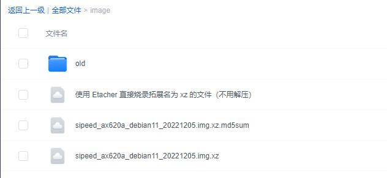

---

## OS introduction

The default package of AXera-Pi has no onboard memory storage to boot system, so it's necessary to prepare a TF card to boot this device.

For Axera-Pi, we provide Debian11 Bullseye image file,  [reasons to use Debian](https://www.debian.org/intro/why_debian.en.html).

TF card which has been burnned image can be bought from [Sipeed aliexpress](https://sipeed.aliexpress.com/store/1101739727), and you need to burn your own TF image card by following steps.

## Which SD card to choose？

Except get the TF card from [Sipeed aliexpress](https://sipeed.aliexpress.com/store/1101739727), the following TF cards are also suitable for AXera-Pi.
We have tested the read and write speed of some TF cards on Axera-pi, for users to make the decesion of TF card.


> Some SD cards are added to test after this photo, so they are not in this photo but they can be recognized by their number.

| Number | Model                                    | <p style="white-space:nowrap">Write speed（Write 160MB）</p> | <p style="white-space:nowrap">Read speed（Read 160MB） </p> |
| ------ | ---------------------------------------- | ------------------------------------------------------------ | ----------------------------------------------------------- |
| 1.     | Netac A2  P500-HS-64GB                   | 2.04697 s, 80.0 MB/s                                         | 1.8759 s, 87.3 MB/s                                         |
| 2.     | Samsung microSDXC UHS-I 128G (Bule card) | 2.53387 s, 64.7 MB/s                                         | 1.99882 s, 82.0 MB/s                                        |
| 3.     | EAGET T1 series 64G                      | 6.56955 s, 24.9 MB/s                                         | 7.13792 s, 23.0 MB/s                                        |
| 4.     | Keychron microSDXC UHS-I 128G            | 2.28133 s, 71.8 MB/s                                         | 1.92001 s, 85.3 MB/s                                        |
| 5.     | KIOXIA microSDXC UHS-I 32G               | 6.71284 s, 24.4 MB/s                                         | 2.36794 s, 69.2 MB/s                                        |
| 6.     | Netac  A1 32GB                           | 4.31411 s, 38.0 MB/s                                         | 2.00759 s, 81.6 MB/s                                        |
| 7.     | BanQ JOY card platinum 64G               | 9.08105 s, 18.0 MB/s                                         | 9.02843 s, 18.1 MB/s                                        |
| 8.     | Hiksemi HS -TF- P2 64G                   | 2.28079 s, 71.8 MB/s                                         | 1.87698 s, 87.3 MB/s                                        |

Tht following TF cards are not in that photo but we also tested then.

| Number | Model                                 | <p style="white-space:nowrap">Write Speed (Write 160MB) </p> | <p style="white-space:nowrap">Read Speed (Read 160MB) </p> |
| ------ | ------------------------------------- | ------------------------------------------------------------ | ---------------------------------------------------------- |
| 1.     | Lexar 64GB TF（MicroSD）C10 U3 V30 A2 | 2.59644 s, 63.1 MB/s                                         | 1.9106 s, 85.8 MB/s                                        |
| 2.     | Lexar 128GB TF（MicroSD）C10 U3 V30   | 6.73793 s, 24.3 MB/s                                         | 6.94079 s, 23.6 MB/s                                       |

## Get image

Because the image is 1G up, so we only provide mega link.

Visit to mega [Click me](https://mega.nz/folder/9EhyBbJZ#lcNhhm9aWXOyo2T0DDaSqA) wo download the image file.

因为镜像文件比较大，因此这里仅提供百度云下载链接。

前往百度云 [点我](https://pan.baidu.com/s/1-UtDoAVP6spwqjHP2wneJA) ，提取码 `sdls` ,下载文件，镜像包与校验文件都已经放在里面了。



用两个文件名来举例，其中文件命名规则如下（拖动滚动条来查看全部）：

| 文件名                                 | 提供方 | 文件类型                                          | 适用芯片 | 镜像发行版 | 发布日期 |
| -------------------------------------- | ------ | ------------------------------------------------- | -------- | ---------- | -------- |
| sipeed_ax620a_debian11_20221013.zip    | sipeed | 镜像压缩包                                        | ax620a   | debian11   | 20221009 |
| sipeed_ax620a_debian11_20221013.md5sum |        | <p style="white-space:nowrap">md5sum 校验文件</p> |          |            |          |

如果里面有多个镜像文件，那么建议下载最新的镜像文件。

校验文件需要在 Linux 环境中使用，windows10 及以上的用户可以使用 wsl 当作 Linux 环境。

使用方法为 `md5sum -c md5sum校验文件`。

.. details::点我查看校验 log

    ```bash    
    root@desktop:$ md5sum -c sipeed_ax620a_debian11_20221009.md5sum
    sipeed_ax620a_debian11_20221009.zip: OK
    ```

## 烧录镜像

### 准备工作

**硬件**：
- 一张容量大于 8G 的 SD 卡：建议购买官方提供的卡，不然可能因为其他的 SD 卡质量差而带来糟糕的体验
- 一个读卡器：建议使用 USB3.0 接口的读卡器，不然读卡器的 USB 速度过低会导致烧录时间过长

**软件**：
- <a href="https://www.balena.io/etcher/" alt="Etcher" target="_blank"> Etcher </a>：根据自身电脑下载对应版本的软件即可

### 镜像系统烧录方法

> **20221012** 现已确认 Etcher 软件可直接支持烧录 zip 压缩包里面的 img 镜像，用户不需要解压的步骤直接选择 zip 文件按下面步骤操作即可。

首先打开 [Etcher](https://www.balena.io/etcher/ "Etcher") 软件，点击 `Flash from file` ,选中已经下载好的 `zip` 文件镜像，然后点击 `Select target` 选中sd卡，最后点击 `Flash` 进行烧录，等待完成即可。 

**解压出镜像文件：**


**烧录镜像文件到 SD 卡：**


下图是烧录过程中的一张截图（可参照）：


最终下载结束后的效果会和下图一样，显示 `Flash Complete!`：


> **注意**：如果出现烧录失败的情况，请手动格式化一下 SD 卡。
> Windows 和 MacOS 可以使用 [SD Card Formatter](https://www.sdcard.org/downloads/formatter/eula_windows/SDCardFormatterv5_WinEN.zip)来格式化 SD 卡，Linux 系统可以使用系统的 disk 工具或 [Gparted](https://gparted.org/)来格式化。

## 上手指引系列

1. 根据上文自行烧录镜像系统到 TF/SD 卡里。
   
   

2. 当烧录系统完成后，我们需要给 AXera-Pi 进行正确的接线并且上电。
   **如何正确接入屏幕及摄像头**：[点击查看](https://wiki.sipeed.com/hardware/zh/maixIII/ax-pi/basic_usage.html#%E6%8E%A5%E7%BA%BF%E7%A4%BA%E4%BE%8B).

   
 
3. 以上的准备工作完成后，可以开始对 AXera-Pi 登陆系统进行使用配置。
   **如何登陆 Linux debian11 系统**：[点击查看](https://wiki.sipeed.com/hardware/zh/maixIII/ax-pi/basic_usage.html#%E6%8E%A5%E7%BA%BF%E7%A4%BA%E4%BE%8B).

   

4. 登陆上 Debian 系统后即可体验我们内置的众多 AI 开箱应用。
   **如何体验内置 AI 应用**：[点击查看](https://wiki.sipeed.com/hardware/zh/maixIII/ax-pi/basic_usage.html#%E5%86%85%E7%BD%AE%E5%BC%80%E7%AE%B1%E5%BA%94%E7%94%A8).

   

  

