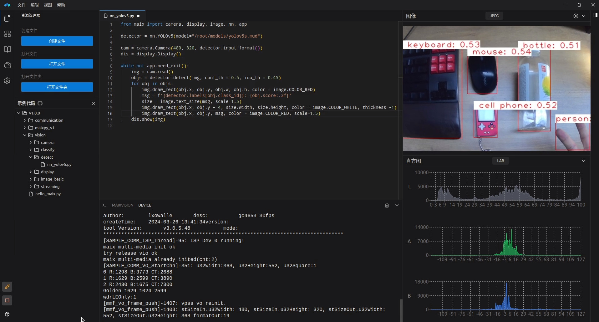
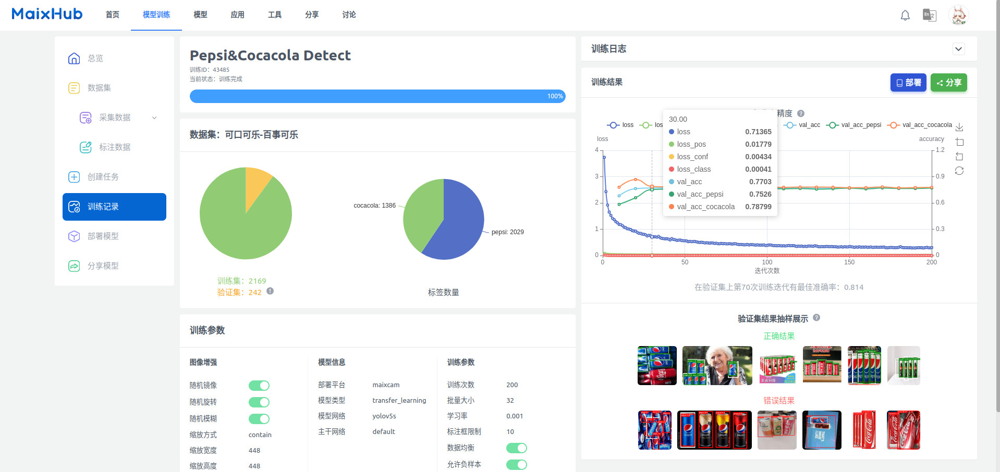

## Introduction to MaixCAM

MaixCAM is a hardware product designed for better implementation of AI vision, auditory, and AIOT applications. It is a platform that can quickly verify product prototypes and quickly mass-produce. It provides a powerful and cost-effective processor, matching cameras, screens, WiFi, etc., as well as a complete and very easy-to-use software ecosystem.

Suitable **application scenarios and crowds**:
* **AI algorithm implementation**: AI algorithm engineers can quickly deploy their AI models to physical hardware (MaixCAM), providing easy-to-use model conversion tools and SDK.
* **STEM education**: Provide easy-to-use MaixPy SDK and matching development tools, as well as online model training platforms. Teachers do not need software and hardware development, focus on teaching, and students can get started quickly.
* **University research and education**: Provide rich documents and tutorials, students at all stages of the university have suitable learning routes, and RISC-V and AI cutting-edge technology are also good helpers for scientific research.
* **Prototyping tool for makers and engineers**: Carefully designed hardware, rich peripherals, super easy-to-use software, let your interesting ideas and products land quickly, without being trapped in the quagmire of basic software and hardware development.
* **Enterprise product upgrade and implementation**: Quickly implement products without expensive R&D costs, or use them to assist products such as production line QA, and use AI vision to realize intelligence of old equipment.
* **Good helper for competitions**: MaixCAM + MaixPy + MaixCDK can quickly realize many innovations and functions, suitable as a designated software and hardware platform for competitions, and players can also rely on the development efficiency of the ecosystem to win the competition. Maix series products and MaixPy have been used in various competitions to win awards.

**【For more application introductions, see [MaixPy Homepage](https://wiki.sipeed.com/maixpy/)】**

MaixCAM **launch special price 169 yuan** (Lite version without screen and shell) and **249 yuan**, please consult [Sipeed Taobao](https://sipeed.taobao.com/) or [AliExpress](https://www.aliexpress.com/store/911876460) shopkeeper for details.

## Introduction to MaixCAM Hardware

| Component | Description |
| --- | --- |
| CPU Big Core | 1GHz RISC-V C906 processor (there is also a 1GHz ARM A53 core that can be used alternatively), running Linux |
| CPU Small Core | 700MHz RISC-V C906, running RTOS |
| CPU Low Power Core | 25~300MHz 8051 processor, used for low power applications |
| NPU | 1TOPS@INT8, supports BF16 model, rich operator support, supports common models such as Mobilenetv2, YOLOv5, YOLOv8, etc. |
| Memory | 256MB DDR3 |
| Storage | TF card boot / SD NAND boot |
| Camera | Supports up to 5M camera, officially supports 4M GC4653 and OS04A10 camera (4 lane MIPI CSI input, 22Pin interface, supports split dual-channel CSI) |
| Screen | 2.3-inch high-definition IPS capacitive touch screen, resolution 552x368 (2 lane MIPI DSI output, standard 31pin interface, 6pin capacitive touch screen) |
| Audio Output | On-board PA power amplifier, can directly connect speakers within 1W on the pin header |
| Audio Input | On-board analog silicon microphone, can directly receive sound |
| Network | On-board WiFi6 + BLE5.4 module, customizable Ethernet version |
| USB | Type-C USB2.0 |
| IO Interface | 2 x 14pin 2.54 pin header interface, 800mil spacing, can be directly inserted into the breadboard |
| Button | 1 x RST button + 1 x USER (function) button |
| LED | Power indicator + user LED |
| Codec | H.264 / H.265 / MJPEG hardware decoding, supports 2k@30fps encoding and decoding |
| Peripheral | I2C/SPI/UART/ADC/PWM/WDT and other common peripherals |
| Shell | 3D printed shell, two nut fixing holes, can be fixed on the bracket |

## MaixCAM Software Ecosystem

We have not only developed the hardware, but also provided a complete software ecosystem for MaixCAM, including:

| Name | Description | Image/Video |
| --- | --- | --- |
| [MaixPy](https://wiki.sipeed.com/maixpy/) | Python development package, provides a rich and easy-to-use API, optimized for MaixCAM, supports hardware acceleration, provides rich documentation tutorials | Please see [MaixPy Homepage](https://wiki.sipeed.com/maixpy/) |
| [MaixVision](https://wiki.sipeed.com/maixvision) | AI Vision IDE, programming, code running, real-time image preview, and even graphical programming, greatly reducing the difficulty of setting up the development environment and the threshold of use |   <video controls muted preload style="width:100%" src="https://wiki.sipeed.com/maixpy/static/video/maixvision.mp4"></video> |
| [MaixHub](https://maixhub.com) | Online AI model training platform, no need for AI knowledge and expensive training equipment, one-click model training, one-click deployment to MaixCAM |  |
| [MaixCDK](https://github.com/sipeed/MaixCDK) | C++ version of MaixPy, developers familiar with C/C++ can get started immediately | Please see [MaixCDK Homepage](https://github.com/sipeed/MaixCDK) |
| [App Store](https://maixhub.com) | Provides various applications and tools, no need to develop, just download and use, developers can also upload and share applications | Please see [Maix App Store](https://maixhub.com/app) |

## Resource Summary

### Exclusive Materials for MaixCAM (Provided by Sipeed)

* [MaixCAM Official Documentation](https://wiki.sipeed.com/maixcam)
* [MaixPy Official Documentation](https://wiki.sipeed.com/maixpy/)
* [MaixCDK](https://github.com/sipeed/MaixCDK)
* [System Source Code](https://github.com/sipeed/LicheeRV-Nano-Build)
* [Schematic](https://cn.dl.sipeed.com/shareURL/LICHEE/LicheeRV_Nano/02_Schematic)
* [Core Board (LicheeRV-Nano) Hardware Information](https://cn.dl.sipeed.com/shareURL/LICHEE/LicheeRV_Nano)
* Core board pin diagram:

## Chip Information

MaixCAM is based on Sipeed's LiecheeRV-Nano core board, which is based on the SG2002 chip for computing power, so their materials can also be referred to.
>! Note: MaixCAM can use the materials of LicheeRV-Nano and SG2002, but **LicheeRV-Nano and other SG2002 chip products cannot use software such as MaixPy MaixCDK MaixVision**, please do not buy the wrong one to waste time and money.
> If you want to get started quickly with application development, please choose MaixCAM, if you are a senior Linux developer and only want to develop based on the original SG2002 materials, you can choose LicheeRV-Nano.

* [Datasheet](https://github.com/sophgo/sophgo-doc/releases) (Register-level information)
* [LicheeRV-Nano Development Board Information](https://wiki.sipeed.com/hardware/zh/lichee/RV_Nano/1_intro.html)
* [Toolchain Download](https://sophon-file.sophon.cn/sophon-prod-s3/drive/23/03/07/16/host-tools.tar.gz)
* [Summary of SDK Development Documents](https://developer.sophgo.com/thread/471.html)
* [Summary of HDK Development Documents](https://developer.sophgo.com/thread/472.html)
* [Summary of TPU Development Documents](https://developer.sophgo.com/thread/473.html)
* [Summary of TDL Development Documents](https://developer.sophgo.com/thread/556.html) (High-level API encapsulation based on TPU)

## Purchase

There are currently two versions of MaixCAM, **the first release special price is 169 yuan** (Lite version without screen and shell) and **249 yuan**, for details please consult [Sipeed Taobao](https://sipeed.taobao.com/) or [AliExpress](https://www.aliexpress.com/store/911876460) store.

