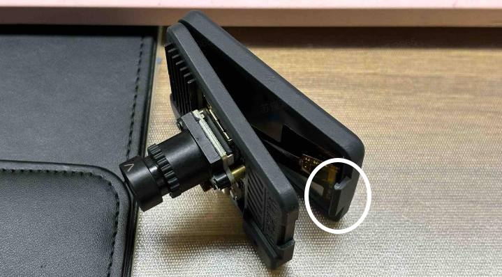
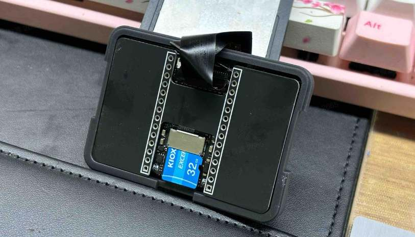

## Introduction

There are a few accessories to note when you receive your device:
* **Lens Cap**: Protects the lens during transport. Please remove it before use, otherwise, the image will appear black.
* **Screen Protector**: To prevent scratches during transport, there is a thin plastic film on the screen. Please remove it upon arrival, as it can severely affect the viewing quality.
* **Manual Focus Lens**: The lens supports manual focusing. Simply rotate the lens gently to adjust the focus. If the image is blurry, it may be due to incorrect focusing.
* **Case**: A 3D-printed case that facilitates handling and installation while enhancing aesthetics.

## Disassembly

It is strongly recommended to choose the package that includes a TF card, as it comes pre-assembled from the factory and you can skip this step and use it directly.

The device is pre-assembled from the factory, but if you need to replace the TF card or solder pin headers, you can attempt to disassemble it.

Here are some points to note:
* Ensure the device is powered off before disassembling.
* There is a thermal pad between the CPU and the case; be careful not to dislodge it during disassembly.
* Be careful not to damage the camera, touch, and screen ribbon cables (they can easily become loose), and do not break the cables.
* Pay attention to the orientation of the ribbon cables to avoid inserting them incorrectly.

## Replacing the TF Card

1. **Open the Case:** Gently pry open the clasps on both sides of the device to separate the front and back covers.

   

2. **Access the TF Card:** Once the case that holds the screen is lifted, you will see the TF card.

   

3. **Reassemble the Screen:** Before reattaching the screen, ensure that the screen's ribbon cable is properly connected. If it is misaligned, reconnect the ribbon cable correctly

   

## Open Source Case Files

**File Uploaded on MakerWorld:** [Click here to view](https://makerworld.com/zh/models/440321)

**Recommended Material:** It is recommended to use a resin with a heat resistance of 70 degrees Celsius for photopolymerization printing.
