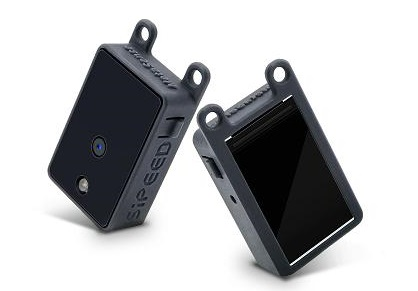
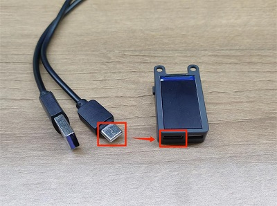
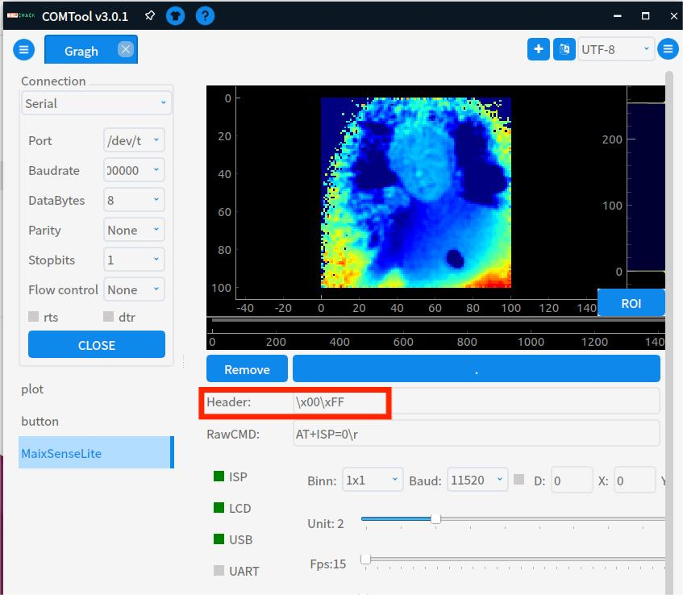

# MaixSense-A010

## Product description



MaixSense-A010 is an extremely cost-effective 3D sensor module composed of BL702 + OPNOUS 100x100 TOF launched by Sipeed, which supports a maximum resolution of 100x100 and 8-bit precision, and comes with a 240x135 pixel LCD display to preview the depth map after colormap in real time.

**Data summary**

Hardware information:[Click to download](https://dl.sipeed.com/shareURL/MaixSense/MaixSense_A010)

## Product unpacking guide

### Preparation

This device adopts the serial port protocol to provide external interface and transmit data, and the physical interface provides external type-c (virtual serial port) and 1.0mm 4pin female socket (UART) to obtain depth map data for integration.

**Product wiring instructions**

After connecting to the computer through the type-c interface, it can identify /dev/ttyUSBx (Linux) or COMx (Windows).



You can also connect the 4pin female socket through the usb2ttl module according to the hardware pin diagram.
Hardware pinout picture: Screen face down
<html>
  
  
</html>

<table>
    <tr>
        <td>MS-A010</td>
        <td>TX</td>
        <td>RX</td>
        <td>GND</td>
        <td>5V</td>
    </tr>
    <tr>
        <td>usb2ttl 模块</td>
        <td>RX</td>
        <td>TX</td>
        <td>GND</td>
        <td>5V</td>
    </tr>
</table>

**COMTOOL package**

Windows system:[Click to download](https://dl.sipeed.com/shareURL/MaixSense/MaixSense_A010/software_pack/comtool)

Linux system: download package is not provided, users need to compile it by themselves.[Obtain](https://github.com/sipeed/COMTool)

Note: Windows 7 and below systems need to install the driver, you can go to the FTDI official website to download.

### Power-up preview

After the device is powered on, the LCD screen on the device can preview the depth pseudo-color image after the color map in real time.


### PC side preview interaction

1. After opening the COMTOOL software, if there is no Graph above the software, you can add a Graph at the + sign in the upper right corner. After creating the Graph, if the center part is white and no graph, **double-click** MaixSenseLite in the lower left corner to open the interface display port.


2. Select the small Port and the corresponding baud rate on the left (select a high baud rate arbitrarily), click open and then check the USB below to receive a large amount of data, and Connected will be displayed in the lower left corner.


3. Set the Header to \x00\xFF to correctly parse the image data and observe the depth map to intuitively feel the depth on the 2D flat image.


### Comtool configuration instructions

Comtool configuration control description of the host computer
- Header:et the identification header.
- RawCMD:User can send commands manually (USB and UART serial ports behave the same).
- ISP:start stop.
- LCD:display the lcd screen on and off.
- USB:serial port transmission depth map on and off.
- UART:serial port transmission depth map on and off.
- ANTIMMI:Automatic anti-multi-machine interference is turned on and off (susceptible to interference, the effect of turning off is better)
- Binn:pull down to set BINNING, Baud to set UART baud rate.
- X, Y coordinates:When the checkbox to the left of D is on, the (x,y) distance from the camera is displayed.
- Unit sets the quantization unit:16-bit quantization to 8-bit, the scale is reduced, if the setting is too small, only very close images can be seen clearly.
- FPS:Set the output frame rate (it should not be too high, set it reasonably according to the performance of the docking device, reducing the frame rate can reduce the amount of transmitted data)
- Ev:Exposure gap control (leftmost represents AE, others are fixed exposure time)

## Case:Real shot of far middle and near objects

The distance between the objects is placed to form the difference in depth value. After the module captures the difference, it displays a warm and cold color, a warm color when the distance is close, and a cool color when the distance is far.


## Case:Keyboard lights follow gesture changes

Realize super cool keyboard light follow,track the position of the hand in real time,and then map the keyboard light according to the position of the hand.

[Related code](https://dl.sipeed.com/shareURL/others/maixsense_example)


## Case:Access to MCU
- MS-A010 has strong compatibility and is based on serial protocol. It can be connected to single-chip development boards such as K210 bit or linux development boards such as Raspberry Pi for secondary development.
- The k210 Bit development board is a member of the sipeed Maix product line. It is an AIOT development board designed based on the edge intelligent computing chip K210 (RISC-V architecture 64-bit dual-core) of Canaan Canzhi Technology.

[Click to learn about K210 Bit](https://www.aliexpress.com/item/1005002547039100.html?spm=5261.ProductManageOnline.0.0.15744edfvEngHc)

[MS-A010 external K210 bit source code acquisition](./../../../zh/maixsense/maixsense-a010/code.html#tof_mainpy)


## Secondary development:Serial protocol

Please refer to the above case:  **MS-A010 external K210 bit**

MS-A010 Secondary Development Manual:[Click to view](./at_command_en.md)

## Secondary development:Access ROS

### Access ROS1

**1. Preparations**

First, prepare the applicable environment: `Linux` system.
You can use the virtual machine `virtual box` or `vmware`.

**2. Install and run**

Since we provide the access function package of ROS2, if you run ROS1, you only need to switch branches.[Access package download.](https://dl.sipeed.com/shareURL/MaixSense/MaixSense_A010/software_pack/SDK)

```bash

# Unzip sipeed_tof_ms_a010.zip and enter the directory
git switch ros1 #switch to ros1 branch
source /opt/ros/*/setup.sh
catkin_make
source devel/setup.sh
rosrun sipeed_tof_ms_a010 a010_publisher _device:="/dev/ttyUSB0"
# After that, the terminal will continue to refresh and display [sipeed_tof]: Publishing, that is, it works normally

```

**3. You can check the frame rate in RQT by yourself.**

**4. RVIZ2 Preview**

After opening `rviz2`, in the lower left corner of the interface `Add`->`By topic`->`PointCloud2 or /depth` ->`Image Add` ->`Display/Global Options/Fixed Frame` needs to be modified to `tof `, the point cloud can be displayed normally. According to the added content, `Image` will be displayed on the left and the point cloud will be displayed in the middle.


### Access ROS1

**1. Preparations**

First, prepare the applicable environment: `Linux` system.
You can use the virtual machine `virtual box` or `vmware`.

**2. Install and run**

We provide an access package for ROS2, which users need to compile and install on a system running ROS2.[Access package download.](https://dl.sipeed.com/shareURL/MaixSense/MaixSense_A010/software_pack/SDK)

```bash
#Unzip sipeed_tof_ms_a010.zip and enter the directory
source /opt/ros/*/setup.sh
colcon build #If you are prompted that colcon is missing, you need sudo apt install python3-colcon-ros
ros2 run sipeed_tof_ms_a010 publisher --ros-args -p device:="/dev/ttyUSB0"
source install/setup.sh
# After that, the terminal will continue to refresh and display [sipeed_tof]: Publishing, that is, it works normally
```

**3. RQT View frame rate**


**4. RVIZ2 Preview**

After opening `rviz2`, in the lower left corner of the interface `Add`->`By topic`->`PointCloud2 or /depth` ->`Image Add` ->`Display/Global Options/Fixed Frame` needs to be modified to `tof `, the point cloud can be displayed normally. According to the added content, `Image` will be displayed on the left and the point cloud will be displayed in the middle.

