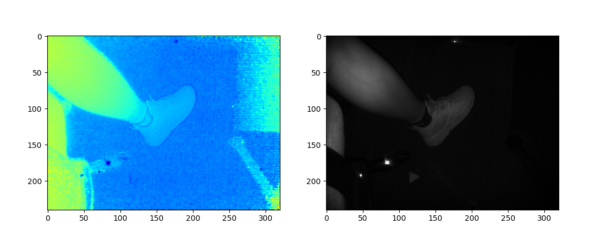
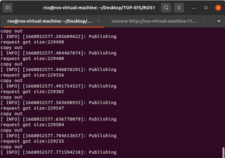
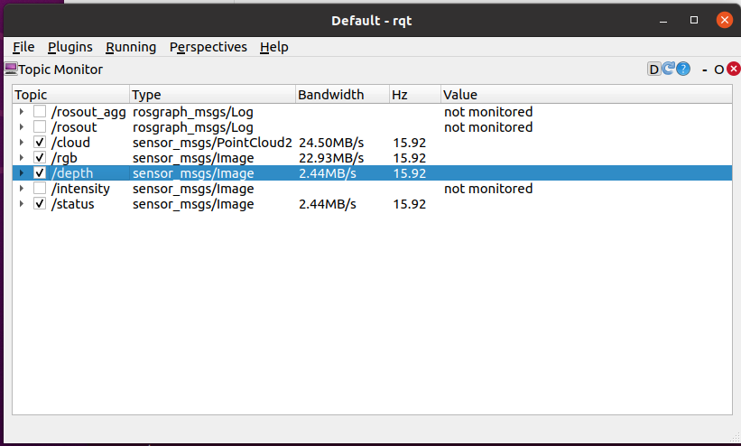
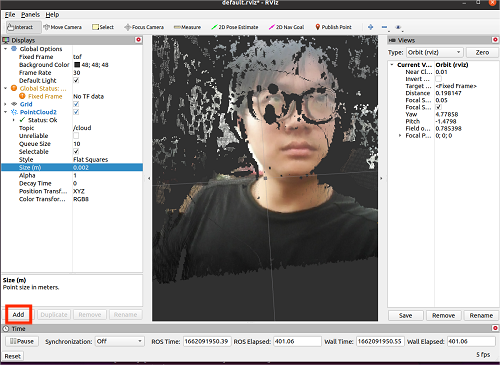

# MaixSense-A075V

## Summary


MS-A075V is a 3D TOF camera module with RGB designed by Sipeed, can display the live 3D picture.

## User Guide

### Preparation

To run preview MaixSense-A075V on Windows, install the driver.

**Windows Driver:**[Click Get](https://dl.sipeed.com/shareURL/MaixSense/Drivers)
**Windows Installation driver tutorial:**[Click to view](./install_drivers.md)

### On-page preview


>Before using this device, make sure that the 192.168.233.0/24 address segment is not occupied in your network environment, because the MS-A075V uses RNDIS and sets its IP address http://192.168.233.1.

Connect the module to the PC with power according to the figure above, then the built-in fan will start to work and the red light will be displayed at the lens. Select the browser and enter http://192.168.233.1 to preview the 3D point cloud image. After power-on, the system and program will be started 10s-15s later.

**Quick preview using web upper computer (front and side) :**

<html>
  
  
</html>

We can preview the depth pseudo-color point cloud map. Open the interaction panel in the upper right corner, uncheck RGB_Map in the first line.


### Interactive configuration 

The preview webpage contained many function configurations, we can change them to get different live preview result.


Here tells the functions of each widgets.

- **RGB_Map** checkbox, control RGB map. Display the deep pseudo-colored point map when checked, display the RGB-mapped point cloud map when unchecked.
- **colorMap** drop-down bar, provides several pseudo-color mapping options(cmap)，jet is recommended. Avaliable when RGB_Map is unchecked.
- **deepRangeMax** and **deepRangeMin** slide bar are used for setting the mapping range of cmap, the depth value between deepRangeMin and deepRangeMax are OK. Avaliable when RGB_Map is unchecked.
- **NormalPoint** checkbox, control the display of normal point(There maybe some invalidation points when TOF worked, need to do opposite action). Recommend checked.
- **OE_Points** checkbox, control the display of OE point. Recommend unchecked.
- **UE_Points** checkbox, control the display of UE point. Recommend unchecked.
- **Bad_Points** checkbox, control the display of bad point. Recommend unchecked
- **SpatialFilter** checkbox, control the Spatial filtering. Processing based on the spatialFilterSize value below and the algorithm specified by the SpatialFilterType.
- **TemporalFilter** checkbox, control the Temporal filtering, A time average is calculated based on the temporalfilteralpha values below.
- **TemporalFilteralpha** slide bar, set the time for Temporal filtering. Adjust it moderate, can be tested by yourself.
- **SpatialFilterType** drop-down bar, set the Spatial filtering algorithm, provides Gaussian filtering and Bilateral filtering. Bilateral filtering requires high performance, not recommended.
- **SpatialFilterSize** slide bar, set the range for Spatial Filter. Adjust it moderate, can be tested by yourself.
- **FlyingPointFilter** checkbox, control the flying point filter. Set the the following FlyingPointThreshold value as the filtering threshold, those that exceed the threshold will be filtered out. Set it moderate, otherwise the validation points will be filtered out.

### Save data

The webpage provides 2 buttons at the bottom of the control bar.

- **SaveRaw**：Save one frame raw data. If you want to use the depth data or IR or RGB data for development, you need to know the data struct of raw. We provide a detailed jupyter notebook about the data processing of raw for users and developers.
- **SavePointCloud**：Sava one frame 3D point map, and its saved format is pcd. Can be previewed via the script provided above.
Note: The data of raw can be get through open interface, which developers can do development on. While the pointcloud data does not provide any interface since it's calculated based on the raw data and camera internal parameters.

### SSH login

In addition to using the web page preview directly, you can also log in using SSH.`Password:root`

```bash
ssh root@192.168.233.1
```

## Examples

### Real shooting of distant, near and far point cloud

High-precision mapping of differences in object placement distances, point cloud maps can intuitively feel a more realistic visualization.


### Car avoid obstacles

The module can be carried by a car or drone to move back and forth to obtain the depth value of the obstacle, and judge whether there is an obstacle in the screen through the difference, make a rapid response and accurately avoid the obstacle (the example has not been open sourced, will be sorted out and disclosed).


### Detect foot traffic

High-precision, high resolution real-time monitoring of the flow of people moving around the situation statistics(the example has not been open sourced, will be sorted out and disclosed).


## Custom development

### python SDK

This is a SDK based on Python3. MS-A075V opens its http interface, we can get its origin data (Depth map, ir map, rgb map) through http request.

To help user understand the struct of data package and the relevant logic of decoding, we provide decoding related functions that encapsulate http requests and native data, based on which users can do custom development.

**Get SDK**:[Click to download](https://dl.sipeed.com/fileList/others/maixsense_example/matasense_075_tutorial.ipynb)

**Method**：Install jupyter, connect to the TOF module, then open the `toturial.py` file.

### Decode and stream

After understanding the struct of data package and the relevant logic of decoding from `Python SDK`, we can do advanced development, continuously get, decode and call the third-party `python` image library, like matplotlib for live display. The `toturial.py` gives the implementation of getting onr frame data, and it can achieve live display by plt with loop. 

**Decoding and steraming**:[Click me to see content of stream.py](https://wiki.sipeed.com/hardware/zh/maixsense/maixsense-a010/code.html#streampy)
**Methods**：Run command `python stream.py` after installing all dependent packages.



### Detect volume

Based on third-party `python` library，and have understood the logic of getting and decoding data, we can do more development: Continuously display frames, roughly calculate the point cloud through the data from TOF module by SDK, do the accumulation to get the total volume. Limit: The top view should include all details except bottom.

**Detect volume**：[Click to view calVolumes.py](https://wiki.sipeed.com/hardware/zh/maixsense/maixsense-a010/code.html#calvolumespy)
**Methods**：Run command `python calVolumes.py` after installing all dependent packages, there will be notice after you run it.


## Use ROS
### Use ROS1

**1. Preparation**

Prepare a Linux enviroment for ROS.

**2. Install and RUN**

[Access package download.](https://dl.sipeed.com/shareURL/MaixSense/MaixSense_A075V/software/SDK)

```bash
#Extract sipeed_tofv075-ros.zip，and open its path
source /opt/ros/*/setup.sh
catkin_make
source devel/setup.sh
rosrun sipeed_tof_cpp publisher
#Then the terminal continuously refreshes the command line
```



**3. View frames in RQT**



**4. RVIZ preview**

Open `rviz2`, in the bottom left interface choose `Add`->`By topic`->`PointCloud2 or/depth` ->`Image add` ->`Display/Global Options/Fixed Frame`, changed it into `tof`,
in this way it displays point cloud normally. According to the added content, the `Image` displays in the left and the point cloud display in the center.



### Use ROS2

**1. Preparation**

Prepare a Linux enviroment for ROS.

**2. Install and RUN**

We have provided the functional package for ROS2, users need compile and run it on the system with ROS2.[Access package download.](https://dl.sipeed.com/shareURL/MaixSense/MaixSense_A075V/software/SDK).

``` bash
#Extract sipeed_tofv075_ros2.zip，and open its path
source /opt/ros/*/setup.sh
colcon build #If it indicates missing colcon, use command sudo apt install python3-colcon-ros
source install/setup.sh
ros2 run sipeed_tof_cpp publisher
#Then the terminal continuously refreshes the command line and display [sipeed_tof]: Publishing,this means it works normally.
``` 

**3. View frames by RQT**

Open `RQT` and select `Plugins`->`Topics`->`Topic Monitor`.


**4. RVIZ2 Priview**

Open `rviz2`, in the bottom left interface choose `Add`->`By topic`->`PointCloud2 or/depth` ->`Image add` ->`Display/Global Options/Fixed Frame`, changed it into `tof`,
in this way it displays point cloud normally. According to the added content, the `Image` displays in the left and the point cloud display in the center.

**The result of mixing Pseudo-colored point clouds and RGB:**

<html>
  
  
</html>

