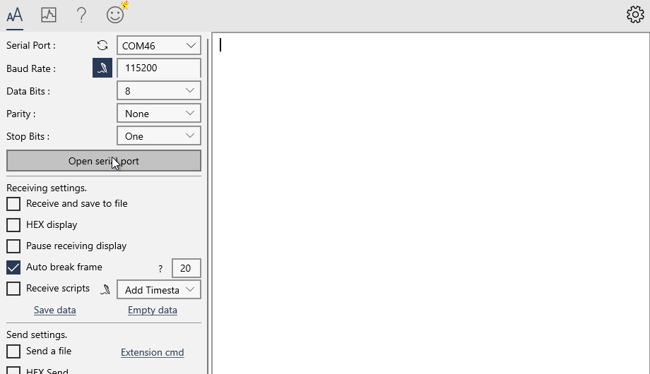
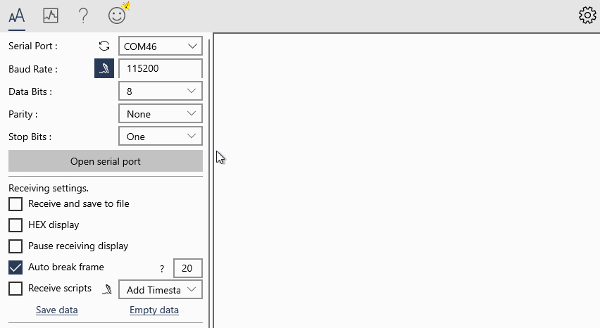
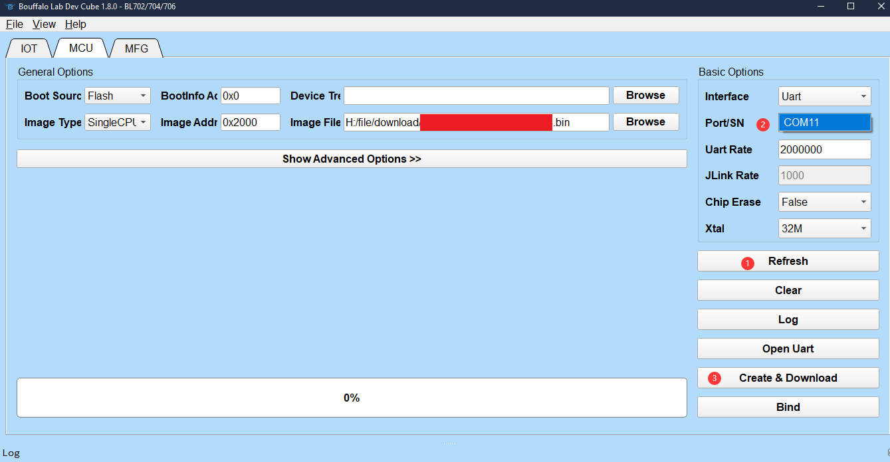
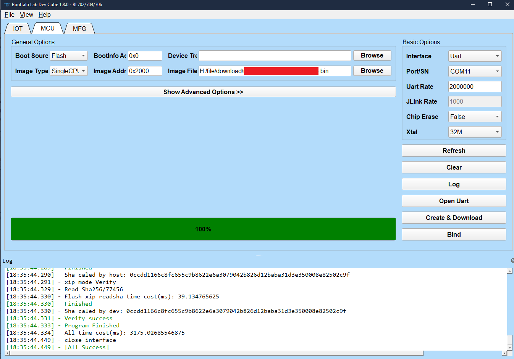
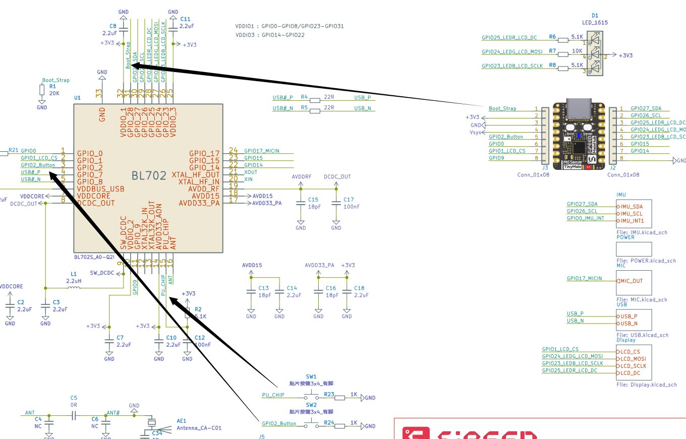

> Because of the different firmware, there is no u-disk in computer after connecting computer with m0sense, visit [Burn bin file](#burn-bin-file) to solve this.

## Power On

> Because of the different firmware, there may not be spectrum diagram of ambient sound on the screen,

The led lights up when M0sense is powered on, and the screen displays spectrum diagram of ambient sound.


## Burn by U-Disk

M0sense can be burned by dragging and dropping firmware to u-disk.

> There maybe no u-disk because of diferent firmware, visit [Burn bin file](#burn-bin-file) to solve this.

Hold BOOT key, then click RESET key once, a removable disk is shown in computer.


Just drag the firmware you want to burn and drop it in the removable disk, the removable disk will be automatically removed and M0sense will be automatically burned with this firmware.


Here are some demos [Click me](https://dl.sipeed.com/shareURL/Maix-Zero/M0sense/7_Example_demos), just use them by dragging and dropping firmware to u-disk to see their result, the source codes are in [github](https://github.com/sipeed/M0sense_BL702_example).

And the result of each demo is as follows:

### hello_world.uf2

[Click me to download](https://dl.sipeed.com/shareURL/Maix-Zero/M0sense/7_Example_demos/hello_world)

Burn it into m0sense via u-disk burn. Run serial application, and open the serial port, `Hello, World` is being printed.


### blink_baremetal.uf2

[Click me to download](https://dl.sipeed.com/shareURL/Maix-Zero/M0sense/7_Example_demos/blink_baremetal)

Dragging and dropping this file to u-disk, then repower M0sense, LED flashes, open the serial port and the LED states are printed.

- Open the serial port


- LED flashes


### blink_rtos.uf2

[Click me to download](https://dl.sipeed.com/shareURL/Maix-Zero/M0sense/7_Example_demos/blink_rtos)

This demo has the same effect as the previous one, but this demo is based on RTOS.

- Open the serial port


- LED flashes


### lcd_flush.uf2

[Click me to download](https://dl.sipeed.com/shareURL/Maix-Zero/M0sense/7_Example_demos/lcd_flush)

Burn this demo to M0sense, lcd background color flushes, and the color of screen is printed by serial port.


### imu.uf2

[Click me to download](https://dl.sipeed.com/shareURL/Maix-Zero/M0sense/7_Example_demos/imu)

Burn this demo to board, the data of onboard 6 axi IMU is printed by serial port.

烧录进板子后，从串口可以看到板子上面 6 轴 IMU (惯性传感器)的数据。



### single_button_control.uf2

[Click me to download](https://dl.sipeed.com/shareURL/Maix-Zero/M0sense/7_Example_demos/single_button_control)

Burn this demo to M0sense, press BOOT key, LED changes the color, and the state of LED is printed by serial port.

The detailed usage can be analysised by reading <a href="https://github.com/Sipeed/M0sense_BL702_example/blob/main/m0sense_apps/rtos_demos/single_button_control/main.c">source code</a>.


### audio_recording.uf2

[Click me to download](https://dl.sipeed.com/shareURL/Maix-Zero/M0sense/7_Example_demos/audio_recording)

Burn this demo to M0sense, the 16bit pcm format data of the onboard microphone is printed by serial port.



## SDK usage

M0sense can be compiled in Linux.

### Get example

```bash
git clone https://github.com/Sipeed/M0sense_BL702_example.git
```

Then the file tree should be like this:

```bash
sipeed@DESKTOP:~$ tree -L 1 M0sense_BL702_example/
M0sense_BL702_example/
├── LICENSE           # License file
├── README.md         # guide
├── bl_mcu_sdk        # Folder of SDK
├── build.sh          # Compile script
├── m0sense_apps      # Folder of example codes
├── misc              # Other utils
└── uf2_demos         # Example demo
```

### Get SDK

Get sdk in the path of example folder.

It's about 400MB memory storage.

```bash
cd M0sense_BL702_example
git clone https://github.com/bouffalolab/bouffalo_sdk
```

Then the file tree should be like this(The main folder and files):

```bash
sipeed@DESKTOP:~$ tree -L 2 M0sense_BL702_example/
M0sense_BL702_example/
├── LICENSE           # License file
├── README.md         # guide
├── bl_mcu_sdk        # Folder of SDK
│   ├── README.md     # SDK guide
│   ├── ReleaseNotes  # SDK history
│   ├── bsp
│   ├── cmake
│   ├── components
│   ├── docs
│   ├── drivers
│   ├── examples
│   ├── project.build
│   ├── tools
│   └── utils
├── build.sh          # Compile script
├── m0sense_apps      # Folder of example codes
├── misc              # Other utils
└── uf2_demos         # Example demo
```

### Get toolchain

Get toolchain in the path of example folder.

```bash
git clone https://github.com/wonderfullook/toolchain_gcc_sifive_linux
```

Then the file tree should be like this(The main folder and files):

```bash
sipeed@DESKTOP:~$ tree -L 2 M0sense_BL702_example/
M0sense_BL702_example/
├── LICENSE                       # License file
├── README.md                     # guide
├── bl_mcu_sdk                    # Folder of SDK
│   ├── README_zh.md              # SDK guide
│   ├── ReleaseNotes              # SDK history
│   ...
├── build.sh                      # Compile script
├── m0sense_apps                  # Folder of example codes
├── misc                          # Other utils
├── toolchain_gcc_sifive_linux    # Folder of toolchain
│   ├── bin                       # Folder of executable program
│   ├── lib                       # Folder of library
│   ...
└── uf2_demos                     # Example demo
```

### Put the patch

Make sure you are in `M0sense_BL702_example` directory.

Before putting the patch, we need to set username and email, just set what you like.

```bash
cd bl_mcu_sdk
git config user.email "m0sense@sipeed.com"
git config user.name "tinymaix"
```
Then put the patch.

```bash
cd ..
./build.sh patch
```

When it shows `Apply patch for you!`, we succeed in doing this.


### Set toolcahin path

Everytime compling for M0sense, we need to set toolcahin path once.

First we need to know the path of `M0sense_BL702_example`:

```bash
sipeed@DESKTOP:~$ pwd
/home/lee/M0sense_BL702_example
```

We copy the result (the result of everyone is different) of `pwd` command, then add `/toolchain_gcc_sifive_linux/bin` in the end，run following command, then we finish setting the toolcahin path.

```bash
PATH=$PATH:/home/lee/M0sense_BL702_example/toolchain_gcc_sifive_linux/bin
```

Then we can use command `riscv64-unknown-elf-gcc -v` to test our toolcahin, here is the right result.

```bash
sipeed@DESKTOP:~$ riscv64-unknown-elf-gcc -v
Using built-in specs.
COLLECT_GCC=riscv64-unknown-elf-gcc
COLLECT_LTO_WRAPPER=/home/lee/M0sense_BL702_example/toolchain_gcc_sifive_linux/bin/../libexec/gcc/riscv64-unknown-elf/10.2.0/lto-wrapper
Target: riscv64-unknown-elf
```

If not set the path right, the command `riscv64-unknown-elf-gcc` will be shown not found, try to reset the toolcahin path.


### Compile demo

Before compiling demo first time, we need to compile the firmware conversion application on the computer for dragging  and burning firmware by u-disk.

Run following command in the directory of `M0sense_BL702_example` .

```bash
sudo apt install gcc # Install gcc
gcc -I libs/uf2_format misc/utils/uf2_conv.c -o uf2_convert # Compile the firmware conversion application
```

Then we can compile demo.

```bash
./build.sh m0sense_apps/blink/blink_baremetal
```

The demo of uf2 format which can be burned to M0sense by u-disk is in the uf2_demos folder, and the demo file is in bl_mcu_sdk/out folder.

## SDK Note

1. Compiling your own firmware conversion application if it's the first time compiling.
2. Everytime compiling the firmware, make sure you have [set the toolcahin path](#set-toolcahin-path)
3. If failing to compile SDK. make sure the compiling command is `./build.sh m0sense_apps/blink/blink_baremetal`, not `./build.sh m0sense_apps/blink/blink_baremetal/` (Pay attention to the `/` in the end)

## Burn bin file

Sometimes we need to burn bin file because of some reasons, here are the steps.

We need to use bouffalolab official flash application to burn M0sense, visit https://dev.bouffalolab.com/download and download the file whose name is `Bouffalo Lab Dev Cube`, cecompress it then we get the flash application.


We mainly use `BLDevCube`, `BLDevCube-macos` and `BLDevCube-ubuntu` these three files, by which to burn our board with graphical interface on different OS.


We use metal material or wire to connect the 3.3V pin and boot pin, then power up M0sense, it will be into download mode, we can see there is a serial device in computer device manager.

| Connect pin                                   | Serial device in computer device manager                                |
| ------------------------------------------ | -------------------------------------------------- |
|  |  |

Run `BLDevCube`(Depends on your OS), choose `BL702`，and select MCU mode in application interface，choose the firmware bin file you want to burn. The default downloaded firmware can be found here: [Click me](https://dl.sipeed.com/shareURL/Maix-Zero/M0sense/7_Example_demos/default_firmware)

<table>
    <tr>
        <td></td>    
        <td></td>
    </tr>
</table>

Click `Refresh`，choose the only one serial port, if you did not see the serial port, reconnect the 3.3V pin and boot pin before power M0sense, set uartRate 2000000, click `Create & Diwnload`.



Finishing flashing firmware, repower M0sense to load the new firmware.



## Notes

There is a BOOT key and a BOOT silkprint pin on M0sense.


There are 2 BOOT on M0sense, here are their differences:



From the [schematic](https://dl.sipeed.com/shareURL/Maix-Zero/M0sense/2_Schematic) above, we can see that the two keys on Mosense are routed to GPIO_2 and AU_CHIP, from the chip manual we can know that `AU_CHIP` is the reset pin, so SW1 is the reset key, and another key is the soft BOOT key on M0sense, it requires the [firmware](https://dl.sipeed.com/shareURL/Maix-Zero/M0sense/7_Example_demos/default_firmware) for u-disk burn.

And we can see that the BOOT silkprint pin is Boot_Strap on M0sense, it's the hardware Boot key. Hold it before powering it to burn the firmware into M0sense.

U-disk is a special burn method based on firmware, while uart burn method is the basic way to burn this chip.
