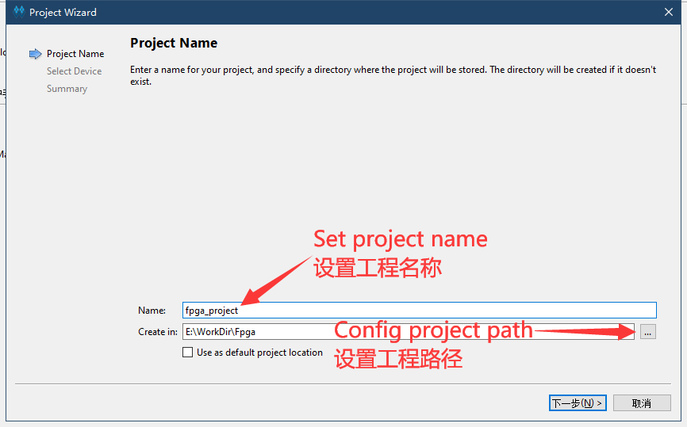
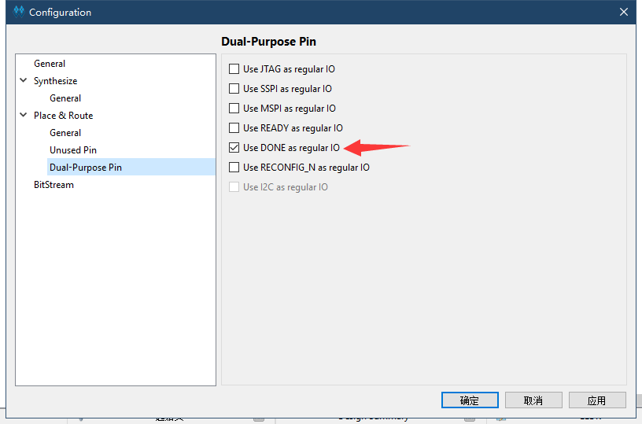
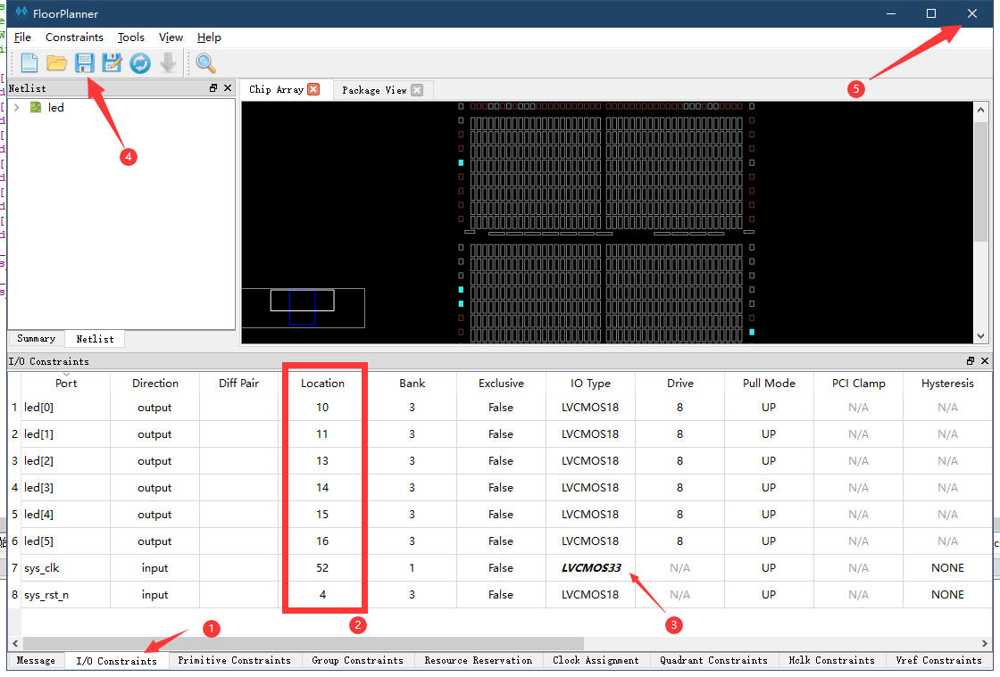
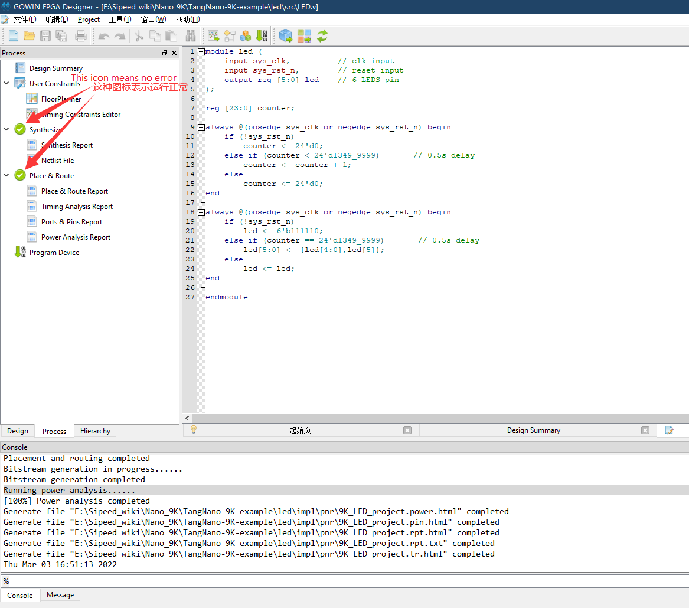
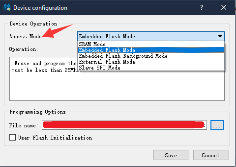

> Edit on 2022.07.13

This tutorial will walk you through the basics of the Gowin IDE, which we'll use to create a simple program to flash the onboard LEDs.

## Create Project

Create Project：File-->NEW-->FPGA Dsign Project-->OK

Set project name and project path (File name and project path should be English)

Choose the correct device: 

## Prepare the code

After creating the project, we can start editing the code. 
To create a new file, we can either click the marked icon (top left of the window) or use Ctrl+N.
Choose Verilog File in the pop-up window.

Name the file (it's best to use English for this)

Double click the created file to open it, then edit it in right window.

Here's all the code we're using for this example, either copy/paste it into your file or enter it manually.  

~~~v
module led (
    input sys_clk,          // clk input
    input sys_rst_n,        // reset input
    output reg [5:0] led    // 6 LEDS pin
);

reg [23:0] counter;

always @(posedge sys_clk or negedge sys_rst_n) begin
    if (!sys_rst_n)
        counter <= 24'd0;
    else if (counter < 24'd1349_9999)       // 0.5s delay
        counter <= counter + 1'b1;
    else
        counter <= 24'd0;
end

always @(posedge sys_clk or negedge sys_rst_n) begin
    if (!sys_rst_n)
        led <= 6'b111110;
    else if (counter == 24'd1349_9999)       // 0.5s delay
        led[5:0] <= {led[4:0],led[5]};
    else
        led <= led;
end

endmodule
~~~

Once we're done with the code, we need to tick `Use DONE as regular IO` in Project->Configuration->Place&Route->Dual-Purpose Pin which can be found in the top menu bar to avoid an error.

## Systhesize, constrain, place&route

### Systhesize

After finishing the steps above, go to the "Process" interface and double click "Synthesize" to synthesize our code. You can also right click "Synthesize" to see its other function

If the result is the same as shown below, then we can move on to setting our constraints.
 

If your synthesis fails, then check the console - it should tell you where the error is.

### Constrain

> Clock constraint is not involved here

For our code to actually do anything, we must bind the ports we defined to the actual pins of the FPGA chip.

Double click the FloorPlanner in the Process interface to set pin constraints (If synthesis fails we can't do this step). 

The first time we open FloorPlanner it will prompt lack of a ".cst" file, we'll just click ok. 

You can download the full schematic [here](https://dl.sipeed.com/shareURL/TANG/Nano%209K/2_Schematic).
Here is the part of schematic about LEDs on the nano 9k:

In this GUI interface we have two ways to constrain pins:
- Drag the corresponding port to the pin of the chip
- Enter the pin number corresponding to the port in IO constraints 

Refer to this guide for more information about FloorPlanner : [SUG935-1.3E_Gowin Design Physical Constraints User Guide.pdf](https://dl.sipeed.com/fileList/TANG/Nano%209K/6_Chip_Manual/EN/General%20Guide/SUG935-1.3E_Gowin%20Design%20Physical%20Constraints%20User%20Guide.pdf)

Don't forget bind the clock port and reset port to their pins marked in the [schematic](https://dl.sipeed.com/shareURL/TANG/Nano%209K/2_Schematic)

The following figure shows the example pin constraint of this project

### Place&Route

> If it shows error2017, make sure you have enabled `Use DONE as regular IO` (see [prepare the code](#Prepare-the-code))

Double click Place&Route to run it, it will shows as following:

## Download to device

Visit [here](https://dl.sipeed.com/shareURL/TANG/programmer/docs) to see docs about programmer if you need.

### Start to download

Connect your board to your PC, and select the device as shown in the picture:

We'll use download to SRAM as an example.

Follow the steps in the figure below to select that operation:

Click the button shown in the figure to start the firmware download process:

### Result

Once that's complete, the LEDs start flashing like this：

## Other

If you need to store firmware with no power, just change Accsess mode and choose your target .fs file .

Visit [Qustions&Answers](./../../Tang-Nano-Doc/questions.md) if you have trouble

## End

You've reached the end of the tutorial. If you have any suggestion, just leave your message.
