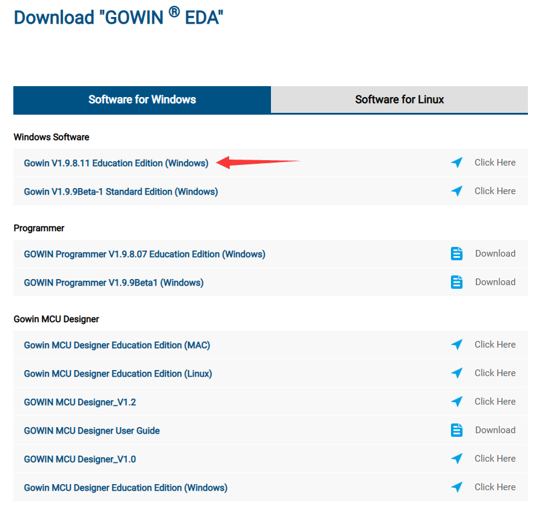

We need to use the Gowin IDE to program Gowin FPGA chips, and documentation about the ide can be found [here](https://www.gowinsemi.com/en/support/database/14/).

- Download and install the corresponding edition of the IDE according to your OS
- For linux users we suggested using Openfpgaloader to burn fpga. Read the end of this page [burn-in-linux](#burn-in-linux) for more details.

## Install the IDE

### Download the IDE

- The IDE can be downloaded from [this page](https://www.gowinsemi.com/en/support/download_eda/) after logging in.

It may look difference as this screenshot is from 2022.10.18 and the IDE has since been updated.

---

The IDE is available in two editions: Standard Edition and Education Edition.

The Standard Edition IDE requires license, which you can get from GOWIN Semiconductor Corp.

The Education Edition IDE is free to use, but supports fewer devices and contains fewer IP cores.

The following figure (updated 2022/11/09) shows the part numbers supported in the latest Education Edition IDE

The supported chips and boards are listed in the following table.

| Chip full name        |Chip Series|Chip model | Board       |
| --------------------- | --------- | --------  | ----------- |
| GW1NZ-LV1QN48C6/I5    | GW1NZ     |GW1NZ      | Nano 1K     |
| GW1NSR-LV4CQN48PC6/I5 | GW1NSR    |GW1NSR-4C  | Nano 4K     |
| GW1NR-LV9QN88PC6/I5   | GW1NR     |GW1NR-9C   | Nano 9K     |
| GW2AR-LV18QN88PC8/I7  | GW2AR     |GW2AR-LV18 | Nano 20K    |
| GW2A-LV18PG256C8/I7   | GW2A      |GW2A-18C   | Primer 20K  |

So for those who want to use Tang Nano (Onboard jtag is CH552), you'll need to use the Standard Edition IDE and apply for a license from GOWIN Semiconductor Corp.

### Install

#### Linux OS

For linux, download the Linux edition IDE and decompress it, the executable file `gw_ide` is in the decompressed folder /IDE/bin/. Execute it on command line to run the GOWIN IDE. Remember to change the permission of the software to make it executable with `chmod + x` if running the software fails.

#### Windows OS

Simply download the software and install it.

Making sure to install all components.

    
    

In the second picture, Gowin is the IDE which we will use to generate the bitstream file, and the Gowin programmer is what we use to burn it to the fpga. But the programmer installed with IDE does not match the USB-Jtag we provide. So we suggest you visit [Tang questions](./../Tang-Nano-Doc/questions.md) to see how to replace programmer software with one will work better.

<!-- so we recommand you use this [programmer](https://dl.sipeed.com/shareURL/TANG/programmer) to avoid situations such as failing downloading bitstream file. -->

After you finish installing IDE, you will need to install 2 drivers.

After installing everything there will be an IDE icon, like the one below, on your desktop.

## Use the IDE

### About the license

The Educational edition IDE does not require a license. 

The Standard edition IDE requires a license, which you should apply for from the Gowin official website, visit https://www.gowinsemi.com/en/support/license/ for more information, and there you will be able to make a choice of software between `GOWIN EDA` and `GOWIN GMD`. `GOWIN EDA` is what we use to program FPGA and the `GOWIN GMD` is what we use to program the hardcore or softcore in FPGA, so you should choose `GOWIN EDA` to get a license to run GOWIN IDE.

### Verify license

When you run GOWIN IDE, a license manager message box will appear. Once you have a license file you can click `Browse...` and select your license file, then `Check` and finally `Save`.

Now you can use the GOWIN IDE.

### Programmer

Because the Programmer installed with IDE may not match the USB-JTAG we provide it may not work. So for Windows users we recommended using this [Programmer](https://dl.sipeed.com/shareURL/TANG/programmer) instead.

For Linux users, go to the end of this page to see the section [burn-in-linux](#burn-in-linux) if you have issues with the Gowin programmer.

## Other 

It may take some time to receive a license. During this time we sugegst you read the GOWIN Semiconductor Corp official documents, which are installed with the IDE.

There are three things in the IDE installation path: IDE folder, Programmer folder, uninst.exe

**IDE** folder：Here I suggest you look in the **doc** folder, where many GOWIN Semiconductor Corp official documents are, as shown below.

**Programmer folder**: There are also many documents here.

We suggest you delete the Programmer folder installed with the IDE and use this version [Click me](https://dl.sipeed.com/shareURL/TANG/programmer)，which can solve some issues.

**uninst.exe**：This program uninstalls the IDE.

## Burn in linux

[Click here](./flash-in-linux.md) is how to burn the development board in linux.
