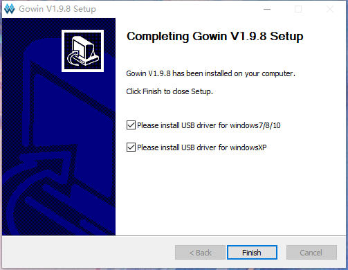

We need Gowin IDE to program Gowin FPGA chips, and the documents about the ide can be found here:[click me](https://www.gowinsemi.com/en/support/database/14/)

- Download and install the corresponding edition of the IDE according to your OS
- For linux users we suggested using Openfpgaloader to burn fpga, which maybe a good choice. Visit the end of this page [burn-in-linux](#burn-in-linux) for more details.

## Install the IDE

### Download IDE

- The IDE can be downloaded on this page https://www.gowinsemi.com/en/support/download_eda/ after logining in.

> Because of the IDE updating, the screenshot is created on 2022.10.18

---

The IDE is divided into Standard Edition and Education Edition:

Standard Edition IDE requires license, which you should apply from GOWIN Semiconductor Corp.

Education Edition IDE is free to use, but supports fewer device and contains less IP core.

The following figure shows part number supported in the latest Education Edition IDE

In this sheet：
- GW2A-LV18PG256C8/I7 GW2A-18C is the chip on Primer 20K
- GW1NR-LV9QN88PC6/I5 GW1NR-9C is the chip on Nano 9K
- GW1NSR-LV4CQN48PC6/I5 GW1NSR-4C is the chip on Nano 4K

So for those who use Tang Nano or Tang Nano 1K, it's need to use Standard Edition IDE and apply license from GOWIN Semiconductor Corp now.

### Install

#### Linux OS

For linux, download the Linux edition IDE and decompress it, the executable file `gw_ide` is in the decompressed folder /IDE/bin/，execute it in command line to run GOWIN IDE. Remember to change the executable permission of the software `chmod + x` if running the software fails.

#### Windows OS

Download the software and install it. This is not a difficult work.

Make sure you have installed all components.

    
    

In the second picture, Gowin is the IDE which we will use to generate bitstream file, and the Gowin programmer is what we use to burn fpga. But the programmer installed with IDE does not match the USB-Jtag we provide, so we suggest you visit [Tang questions](./../Tang-Nano-Doc/questions.md) to see how to replace programmer application to solve problems.

<!-- so we recommand you use this [programmer](https://dl.sipeed.com/shareURL/TANG/programmer) to avoid situations such as failing downloading bitstream file. -->

After finishing installing IDE, there are 2 drivers to be installed.

After installing all, there is an IDE icon is like this shown on your desktop.

## Use the IDE

### About the license

Educational edition IDE does not require license. 
Standard edition IDE require the license, which you should apply from Gowin official website, visit https://www.gowinsemi.com/en/support/license/ for more information, and there will be a software choice between `GOWIN EDA` and `GOWIN GMD`, the `GOWIN EDA` is what we use to program FPGA and the `GOWIN GMD` is what we use to program the hardcore or softcore in FPGA, so you should choose `GOWIN EDA` in the software choice to get your license to run GOWIN IDE.

### Verify license

When run GOWIN IDE, a license manager message box will appear, click `Broswer` and select your license file, `Check` and `Save`.

Then we can start to use GOWIN IDE.

### Programmer

Because the Programmer application installed with IDE may bot match with the USB-JTAG we provide when burning fpga, so for Windows users it's commanded that using this [Programmer](https://dl.sipeed.com/shareURL/TANG/programmer) to burn FPGA.

For Linux users, go to the end of this page to see [burn-in-linux](#burn-in-linux) if you have trouble running Gowin programmer.

## Other 

It may take a time to receive license. During this time we can read GOWIN Semiconductor Corp official documents, which can easily be found after installing IDE.

There are three contents in the IDE installation path : IDE folder, Programmer folder, uninst.exe

**IDE** folder：Here I suggest you view the **doc** folder, many GOWIN Semiconductor Corp official documents are set in it like showing below.

**Programmer folder**: There are also many documents

We suggest you delete the Programmer folder installed with IDE and use this version [Click me](https://dl.sipeed.com/shareURL/TANG/programmer)，which can reduse many troubles

**uninst.exe**：remove IDE

## Burn in linux

Here is a way to burn the development board in linux [click me](./flash-in-linux.md)