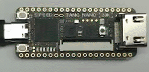
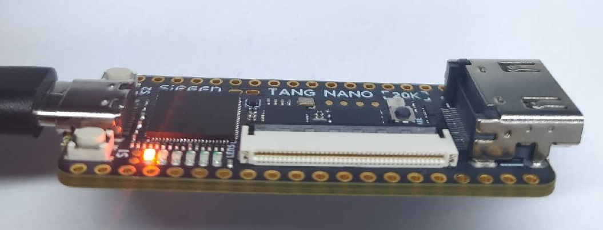
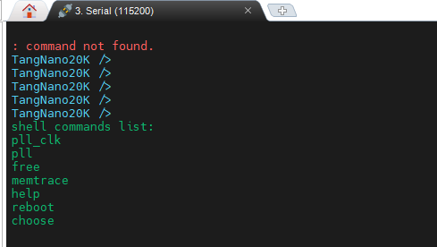
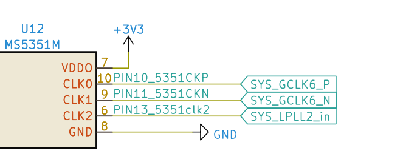
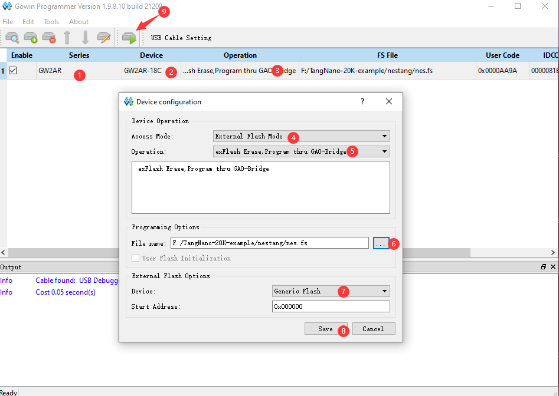
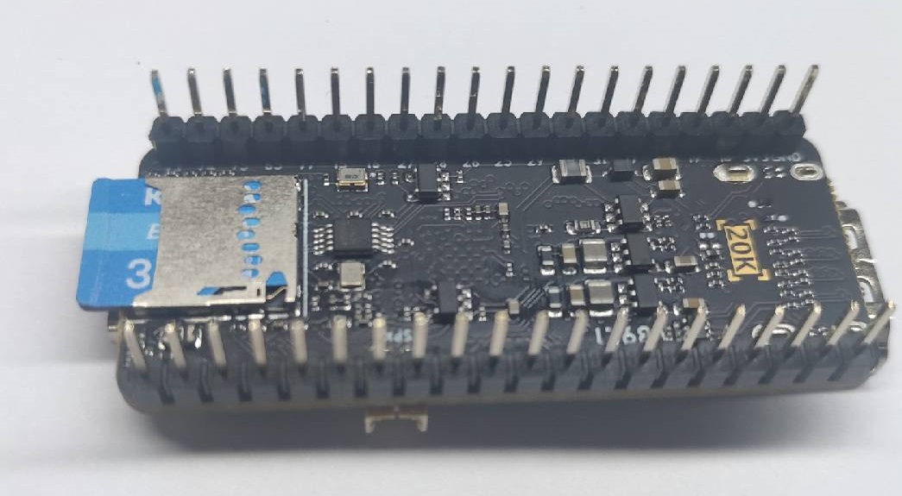
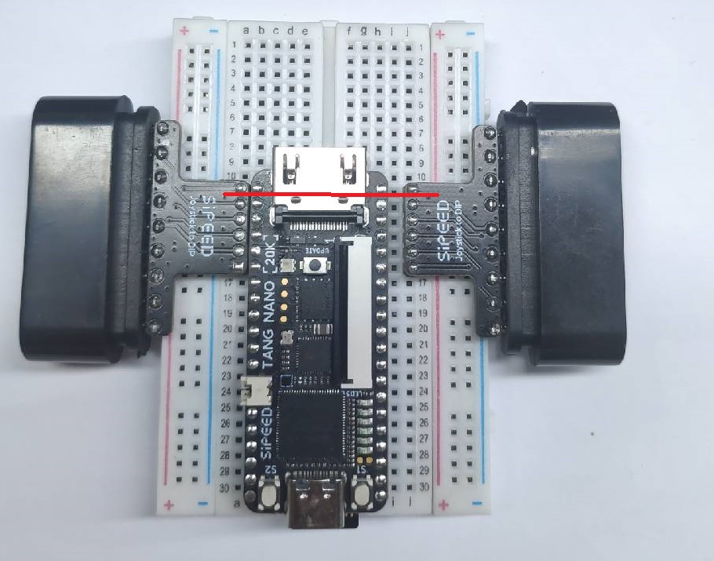
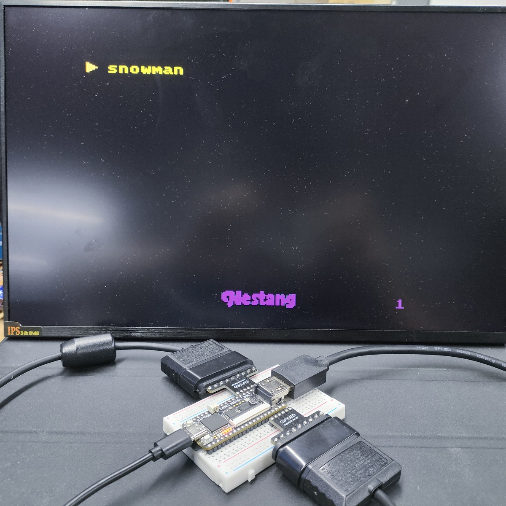

Tang Nano 20K is mainly available as two purchase options: `Retro Game kits` and `development board kits`

## Primary power-on

The default firmware in Tang Nano 20K is [litex](https://github.com/litex-hub), and it can be download from [github](https://github.com/sipeed/TangNano-20K-example/tree/main/litex).

Power on Tang Nano 20K, leds flow.



Windows 10 and Windows 11 can install the driver automatically, and there is at least one USB Serial Port in the device manager. We can open this serial port via the serial port available application like [Mobaxterm](https://mobaxterm.mobatek.net/).


Set baudrate 115200, open the serial port, and we succeed opening the litex terminal.


Tap the `tab` on your serial terminal via keyboard to see all commands we can use.


Here we take leds as example, type `leds` command.


We can see it requires a value with `leds` command.

Here we type `leds 62` via serial terminal and see the state of onboard leds.


There is only one led on.



If the value we type is too big, this command will set the value to `0xffffffff`.


## Advanced usage

All commands above we run are on FPGA, apart from the GW2AR-18C FPGA chip, there is an onboard BL616 chip on this board, we can open its terminal and run its built-in commands.

Similar to the previous steps, open the serial port via Mobaxterm, then use shortcut key combinations `Ctrl + x` and `Ctrl + c`, then tap `Enter` key to open the BL616 inside terminal.


Tap `Enter` key to test the terminal, and it supports commands auto-completion.



Here we take `pll_clk` and `choose` these two commands as example.

### pll_clk

There is a MS5351 configurable clock generator on Tang Nano 20K, it's configured by BL616 chip, and we set the generated clock via `pll_clk` command.


MS5351 can generate 3 clock output, we can see its clock output pin via the schematic.



The CLK0 clock is connected with the PIN10 of FPGA, and CLK1 clock is connected with the PIN11 of FPGA, CLK2 clock is connected with the PIN13 of FPGA.

- Set CLK1 output 50M clock

`pll_clk O1=50M`

<table>
    <tr>
        <td></td>
        <td>
            ① Type the command, we can see the log <br>
            ② Type `pll_clk` again, we can see the current configuration <br>
            ③ This means O1 output 50M clock <br>
            ④ [EN] means O1 enabled, [DIS] means disabled.
        </td>
    </tr>
</table>

- Disable CLK1

`pll_clk O1`

<table>
    <tr>
        <td></td>
        <td>
            ① View the current configuration <br>
            ② CLK1 enabled <br>
            ③ Run command to disable CLK1 <br>
            ④ CLK1 disabled
        </td>
    </tr>
</table>

- Save configuration

`pll_clk -s`


- Set CLK2 output 100M clock and save configuration

`pll_clk O2=100M -s`


### choose

`choose` command is used to choose the communication methods between FPGA and BL616 Chip.


The default communication method between FPGA and BL616 Chip is `uart` mode.

Use shortcut key combinations `Ctrl + x` and `Ctrl + c`, then tap Enter to quit serial communication mode, and get into BL616 terminal.

- `uart` mode test

Run `choose uart` in BL616 terminal, the BL616 communicates with FPGA via serial pins.


Type Enter to test the FPGA default litex terminal if you did not flash any firmware for FPGA.

To quit serial communication mode, use command `Ctrl + x` and `Ctrl + c`, then tap Enter to open the BL616 terminal.


- `spi` Mode

When in SPI mode, BL616 is the SPI slave device, and receives the SPI data from FPGA. However, the default FPGA firmware does not contain the test.

## Retro Game kits

Tang Nano 20K can act as NES [NESTang](https://github.com/nand2mario/nestang), here we tell how to build your Tang Nano 20K a Retro Game. Visit [Tang Nano 20K nestang github example](https://github.com/sipeed/TangNano-20K-example/tree/main/nestang) or [NESTang](https://github.com/nand2mario/nestang) if you want to know more.

### Hardware Preparation

- One Tang Nano 20K
- One or two Joystick and Joystick convertor board 
- One TF card and a card reader
- One breadboard (To tie the FPGA board and Joystick)
- HDMI monitor

### Software Preparation

- Windows：[Gowin Programmer](http://www.gowinsemi.com.cn/faq.aspx) ,  [balenaEtcher](https://etcher.balena.io/) and `python`
- Linux: [Openfpgaloader](https://github.com/trabucayre/openFPGALoader) and `python`

Linux users can visit [Tang Nano 20K nestang github example](https://github.com/sipeed/TangNano-20K-example/tree/main/nestang) to see how to build this game kit, here we use Windows as the example to tell the steps of building the game kit.

### Flash FPGA firmware

Run [Gowin Programmer](http://www.gowinsemi.com.cn/faq.aspx) to flash [this firmware](https://dl.sipeed.com/shareURL/TANG/Nano_20K/7_Nestang/firmware) into FPGA external Flash.



### Make games image

Use these [scripts](https://dl.sipeed.com/shareURL/TANG/Nano_20K/7_Nestang/script)(All scripts need downloading), to generate your NES games into the file image which can be loaded by FPGA NES Emulator.

The following command converts `1.nes` `2.nes` `3.nes` these three NES games into the game image file(games.img).

```bash
python nes2img.py -o games.img 1.nes 2.nes 3.nes
```

> If it tells PIL not found. Install PIL via pip manually.

Then the game image file(games.img) is generated.

### Burn game image file

We need a TF card to store the game, with this we can load the game on Tang Nano 20K.

Here we use [balenaEtcher](https://etcher.balena.io/) to flash the game image file.

Open this program, choose `Flash from file`, select the generated game image file `games.img`


A warning comes out, but we click Continue.


Tick your TF card, make sure you choose the right TF card, not the other disk. Click Select.


Click Flash.


### Assemble board

- Insert TF card into board.



- Tie joystick convertor board and FPGA board on breadboard.



Note the read line in the picture above, it shows the relative position of FPGA pin and convertor board.

- Connect the joystick and HDMI cable


> When connected 2 joysticks, player ① is the right one in the picture above.

### Start game

Power on Tang Nano 20K, we can see the game menu. The number of games and the name of games depends on your NES game name and quantity when generating the game image file.



- Press `②` or `O` to start the game
- Press `S1` on the FPGA board to go back to the game menu

## FPGA Development guide

[Blink the LED](https://wiki.sipeed.com/hardware/en/tang/tang-nano-20k/example/led.html)
