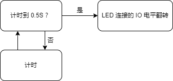
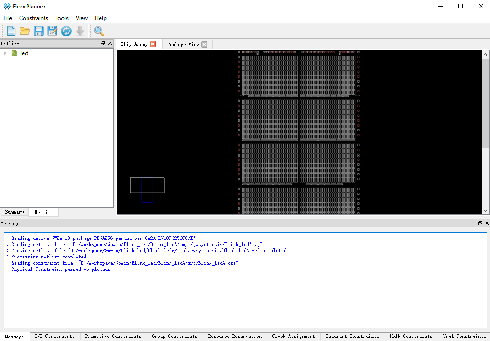
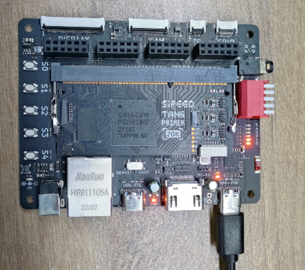
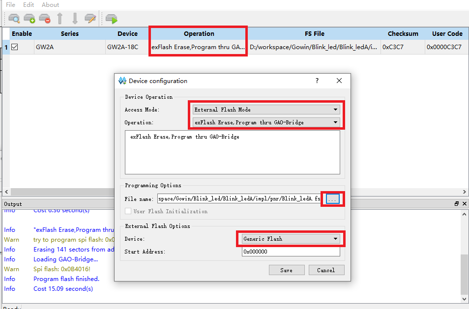
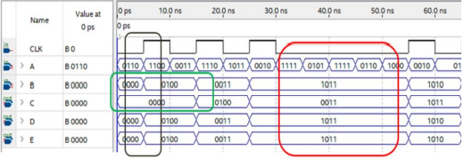

To know a programming language, we start with `hello world`. But in hardware development, we start by blinking a led.

## Install IDE

Visit [install IDE](https://wiki.sipeed.com/hardware/en/tang/Tang-Nano-Doc/install-the-ide.html) to prepare the development environment.

For linux user we suggest using [openfpgaLoader](https://wiki.sipeed.com/hardware/zh/tang/Tang-Nano-Doc/get_started/flash_in_linux.html) to burn the firmware into fpga.

## New Project

New Project：File-->NEW-->FPGA Dsign Project-->OK

<div>
    
    
</div>

设置工程名称，要求只用英文的下划线命名，存放路径中不要有中文字符或者空格等。


然后在下面的芯片型号中选择 GW2A-LV18PG256C8/I7，使用上面的筛选能够更快地选择到正确的型号。注意 Device 那一栏为 GW2A-18C


然后点击确定后就可以进行最终项目预览了。确认无误后就完成工程创建了。

## 编写代码

### 新建文件

高云半导体 IDE 提供了三种新建文件的方法。在此我们直接使用快捷键 `Ctrl + N` 来新建文件，其他两种不在此讲述。

在弹出的窗口中选择 `Verilog File`，会 VHDL 的也可以选择下面的 `VHDL File`，这篇文章只用 Verilog 来做点灯示例。


    
点击 OK 之后会提示让我们输入文件名称，此处以 `led` 为文件名做示范。


到这里我们就完成文件的创建了，可以直接编写代码了。


### Verilog 简单说明

Verilog 是一种硬件描述语言，用来对数字电路进行抽象化描述。

Verilog 的基本设计单元是“模块”(module)。

一个模块是由两部分组成的：一部分描述接口，另一部分描述内部逻辑功能，即定义输入是如何影响输出的。

一个模块长成这样：

```v
module module_name
#(parameter)
(port) ;
    function   
endmodule
```

模块整体结构由 module 和 endmodule 组成，module 后面跟着的是模块的名称(module_name)，可传递变量参数(parameter)，端口及其方向的申明(port)，紧接着就是内部逻辑功能描述(function) ,最后用 endmodule 来表示这一个模块，描述完毕。

内部逻辑功能通常由 assign 和 always 块完成；其中 assign 语句描述逻辑功能，always 块常用于描述时序功能。

### 阻塞赋值与非阻塞赋值

在时序逻辑描述中，赋值符号有 `=` 和 `<=` 两种。注意 `<=` 在 if 判断语句中为小于或等于，不是赋值符号。

详细解释查看底部的 [阻塞赋值与非阻塞赋值区别](#阻塞赋值与非阻塞赋值区别)


### 代码思路

写代码前我们需要先想清楚代码目的：每隔 0.5S 灯闪一次。

对此所画的需求框图如下：


然后对于 0.5S 我们需要一个计数器来计时，LED 灯闪就是 IO 翻转



把上面的思维框图具体到实际使用的话，就变成下面的样式了:


其中 Clock 为时钟源，用来给计时器提供准确的时间。

### 代码描述

根据上文 Verilog 简单说明和所描述的框图，可以所要编写 Verilog 模块有 Clock 和 IO电平 两个端口；

```v
module led(
    input  Clock,
    output IO_voltage
);

endmodule
```

对于内部的计时模块，Primer 20K 核心板上的晶振为 27MHZ，因此我们每秒钟会有 27000000 个时钟上升沿，想要 0.5S 计数的话那么只需要计数 13500000 次上升沿就好。计数是从 0 开始的，数 13500000 的话就是从 0 数到 13499999。计数完后我们需要设置一个标志位，来通知 LED 的 IO 翻转一下电平。整体计数代码如下：

```v
//parameter Clock_frequency = 27_000_000; // 时钟频率为27Mhz
parameter count_value       = 13_499_999; // 计时 0.5S 所需要的计数次数

reg [23:0]  count_value_reg ; // 计数器
reg         count_value_flag; // IO 电平翻转标志

always @(posedge Clock) begin
    if ( count_value_reg <= count_value ) begin //没有计数到 0.5S
        count_value_reg  <= count_value_reg + 1'b1; // 继续计数
        count_value_flag <= 1'b0 ; // 不产生翻转标志
    end
    else begin //计数到 0.5S 了
        count_value_reg  <= 23'b0; // 清零计数器，为重新计数最准备
        count_value_flag <= 1'b1 ; // 产生翻转标志
    end
end
```

对于 LED IO 电平翻转代码如下：

```v
reg IO_voltage_reg = 1'b0; // 声明 IO 电平状态用于达到计时时间后的翻转，并赋予一个低电平初始态

always @(posedge Clock) begin
    if ( count_value_flag )  //  电平翻转标志有效
        IO_voltage_reg <= ~IO_voltage_reg; // IO 电平翻转
    else //  电平翻转标志无效
        IO_voltage_reg <= IO_voltage_reg; // IO 电平不变
end
```


将上面的代码整合后就变成了下面的内容:

```v
module led(
    input  Clock,
    output IO_voltage
);

/**********计时部分**********/
//parameter Clock_frequency = 27_000_000; // 时钟频率为27Mhz
parameter count_value       = 13_499_999; // 计时 0.5S 所需要的计数次数

reg [23:0]  count_value_reg ; // 计数器
reg         count_value_flag; // IO 电平翻转标志

always @(posedge Clock) begin
    if ( count_value_reg <= count_value ) begin //没有计数到 0.5S
        count_value_reg  <= count_value_reg + 1'b1; // 继续计数
        count_value_flag <= 1'b0 ; // 不产生翻转标志
    end
    else begin //计数到 0.5S 了
        count_value_reg  <= 23'b0; // 清零计数器，为重新计数最准备
        count_value_flag <= 1'b1 ; // 产生翻转标志
    end
end
reg IO_voltage_reg = 1'b0; // 声明 IO 电平状态用于达到计时时间后的翻转，并赋予一个低电平初始态

/**********电平翻转部分**********/
always @(posedge Clock) begin
    if ( count_value_flag )  //  电平翻转标志有效
        IO_voltage_reg <= ~IO_voltage_reg; // IO 电平翻转
    else //  电平翻转标志无效
        IO_voltage_reg <= IO_voltage_reg; // IO 电平不变
end


/**********补充一行代码**********/
assign IO_voltage = IO_voltage_reg;

endmodule
```

上面代码最后面补充了一行代码，是因为 IO_voltage 声明在了 port 位置，默认为 wire 型，想要将它与 reg 变量 IO_voltage_reg 连接起来，需要用到 assign 语句。

## 综合，约束，布局布线

### 综合

代码保存后，可以双击 IDE 内部的 Process -> Synthesize 来进行代码综合，将 verilog 代码内容转换为综合网表。


关于网表有兴趣的可以自己去查阅相关资料，此处不再额外说明。

### 约束

综合完之后我们需要进行管脚约束，才能将所编写的模块端口与 FPGA 引脚相对应，并且实现模块的功能。

点击上图 Synthesize 上面的 FloorPlanner 来进行管脚约束。


由于是首次创建，所以会弹出下面的对话框，点击 OK 后就弹出了图形化约束交互界面。




关于约束的方法可以查看 [SUG935-1.3_Gowin设计物理约束用户指南.pdf](http://cdn.gowinsemi.com.cn/SUG935-1.3_Gowin%E8%AE%BE%E8%AE%A1%E7%89%A9%E7%90%86%E7%BA%A6%E6%9D%9F%E7%94%A8%E6%88%B7%E6%8C%87%E5%8D%97.pdf)

此处因个人喜所以仅使用下图中 IO Constranins 方法来约束引脚：


根据[核心板原理图](https://dl.sipeed.com/fileList/TANG/Primer_20K/02_Schematic/)，我们可以知道晶振所输入的引脚为 H11。


然后结合底板上的 IO 丝印，决定用底板上的 FPGA 的 L14 引脚进行点灯，对应的 LED 编号为 LED4。


因此对于在 FloorPlanner 交互窗口下面的 IO Constranins 中将 PORT（端口）与 Location（引脚） 分别填入下面的值：


输入完毕后快捷键 Ctrl + S 来保存一下引脚约束，然后接可以关闭 FloorPlanner 的交互图形界面了。

接着发现在工程项目里面多出来刚刚创建的 cst 文件了，里面的内容也比较好理解。


### 布局布线

完成约束后就要开始运行布局布线了，目的是为了把综合所生成的网表与我们自己定义的约束来通过 IDE 算出最优解然后将资源合理地分配在 FPGA 芯片上。

双击下体红框处的 Place&Route 就开始运行了。

。

紧接着没有报错，全部通过。就可以开始进行烧录了。

## 烧录固件

Dock 板载了下载器，在 [安装IDE](https://wiki.sipeed.com/hardware/zh/tang/Tang-Nano-Doc/get_started/install-the-ide.html) 地时候我们已经安装了驱动。因此我们将板子与电脑连接起来就行。



对于 Programmer 软件建议使用高云官网下载到 [点我跳转](http://www.gowinsemi.com.cn/faq.aspx) ，下载下图所示的 Programmer 软件即可。


### 扫描设备

在使用 Dock 底板的时候不要忘记使能核心板，按下 1 号拨码开关即可。


双击下图中的下载程序(Program Device) 来运行 Programmer 软件


然后在打开的页面中点击一下 scan_device 来扫描到我们的设备。


点击 OK 后就可以进行烧录操作了。

烧录相关的文档可以参考 [SUG502-1.3_Gowin_Programmer用户指南.pdf](http://cdn.gowinsemi.com.cn/SUG502-1.3_Gowin_Programmer%E7%94%A8%E6%88%B7%E6%8C%87%E5%8D%97.pdf)

### 下载到 SRAM

一般来说这个模式是以用来快速验证所生成的固件是否满足自己目的的。

因为其烧录快的特性所以使用的较多，然是当然断电会丢失数据，所以如果想上电运行程序的话是不能选这个的。

点击 Operation 下面的功能框来打开设备设置界面，接着在 Operation 框中选择 SRAM Program 选项来设置为下载到 SRAM ，最后点击下面的那三个点点框来选择我们所生成的 .fs 下载固件。通常来说下载固件生成与工程文件目录下的 impl -> pnr 目录下。


接着来点击红框处开始进行烧录 


有问题的话可以前往 [常见问题](https://wiki.sipeed.com/hardware/zh/tang/Tang-Nano-Doc/questions.html) 自行排查。

到这里就下载完成了。

### 下载到 Flash

上面说过下载到 SRAM 是为了快速验证，但是不能上电运行程序。
所以想要上电运行的话我们需要设置下载到 Flash。

和上面下载到 SRAM 的步骤几乎类似，先点开 Operation 下面的功能框来打开设备设置界面，接着在 Operation 框中选择 External Flash Mode 选项来设置为下载到外部 Flash ，最后点击下面的那三个点点框来选择我们所生成的 .fs 下载固件，通常来说下载固件生成与工程文件目录下的 impl -> pnr 目录下。最后在下面的外部 Flash 选项中选择设备为 Generic Flash 。



接着来点击红框处开始进行烧录 


然后我们的程序重新上电也能照样运行了。

## 代码结果

如图所示，只有一个灯在闪。


## 结语

到这里我们就已经完成了 FPGA 的 “Hello world” 了。以后的示例工程不会再叙述新建文件等操作了。

## 阻塞赋值与非阻塞赋值区别

以下内容搬运自 `大猪蹄子` （有改动）：

编写一段简单的代码，对它进行简单的仿真：

```v
module test(
    input      CLK,
    input      [3:0] A,
    output reg [3:0] B,C,D,E
);

always@(posedge CLK)
begin
    B <= A;
    C <= B;

    D  = A;
    E  = D;
end
endmodule
```



根据仿真结果我们可以看出阻塞和非阻塞赋值的差别。这里对比 `B` `C` `D` `E` 四种结果。`<=` 叫做非阻塞赋值，同一个 `always` 中的 `<=` 会同时执行。这就造成了绿框内的情况：`B` 直接被赋予 `A` 的值同时 `C` 被赋予 `B` 的值。由于这两步是同时进行的，就导致 `C` 被赋予的值是 `B` 的旧值，也就造成了图中所示，`C` 的数据变化时钟要慢 `B` 一个时钟周期。再说阻塞赋值 `=`，也就是说同一个 `always` 中上一个 `=` 语句执行完才会执行下一个 `=` 语句。在这个代码中，上一个语句 `D` 已经被赋予了 `A` 的值，才执行把 `D` 的值赋给 `E`，所以 `D` 、`E` 的值在仿真中始终保持一致。

> 不过一般来说，不建议在时序逻辑中使用阻塞赋值 `=`。

也得出了额外两个结论：
- 第一，输入的数据不是完全有效，以时钟边沿时刻的输入数据为准。`posedge` 就是以上升沿执行，`negedge` 就是以下降沿执行。如果数据维持的时间小于一个时钟周期，就很有可能采集不到（如红框所示）。
- 第二、每次触发特定时钟边沿，对应的 `always` 块就会从头到尾执行一次代码（如绿框所示），而不是从中间某处执行。

## 常见问题

### No Cable found

检查设备管理器里有没有下图这两个，没有的话需要安装 Programmer 驱动。


确定有 converter 设备的话在确认用的是不是所要求使用的 Programmer, 本文[这里](#烧录固件)有写过。

### No gowin device found

确认自己使能了核心板。

### 其他问题

前往 [Gowin 板卡常见问题查看](./../../Tang-Nano-Doc/questions.md)