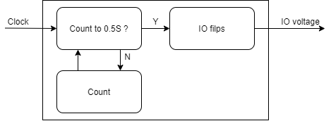
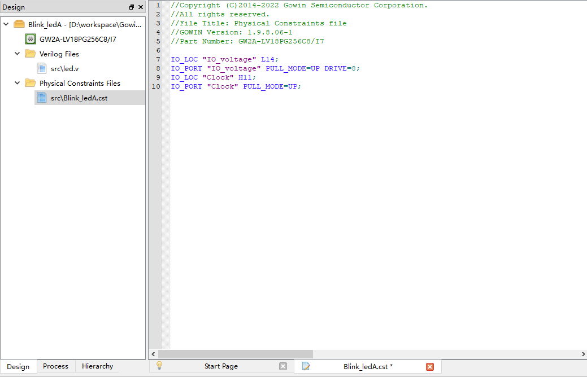
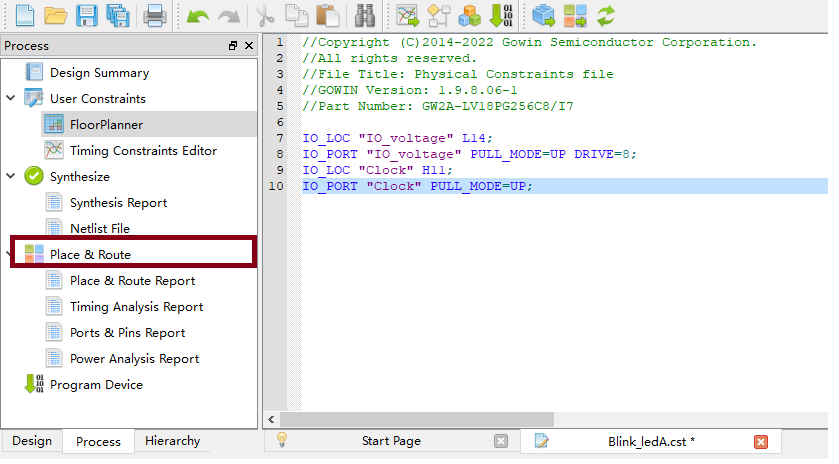
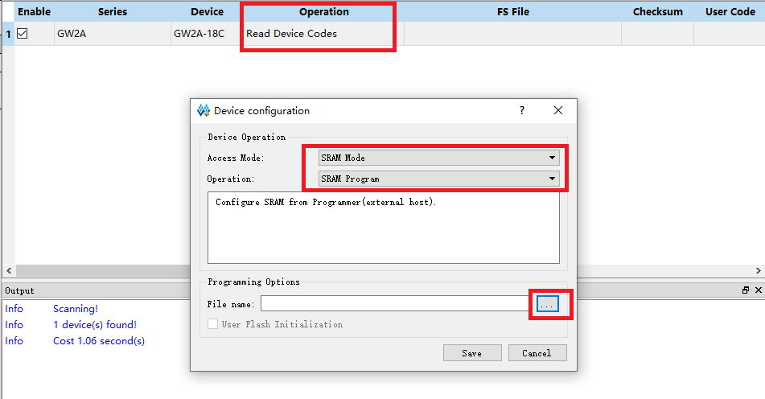
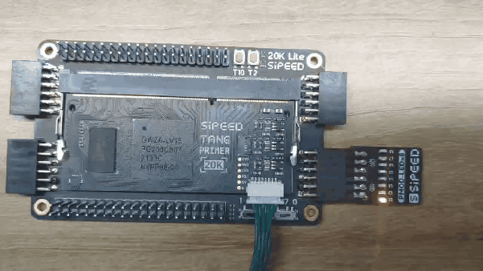

Let's blink a led after getting the Tang Primer 20K Lite suits.

## Preread

This document is writen for guiding user start preparing GOWIN development enviroment and use the Tang Primer 20K.

The default firmware function in the Core board is as followings:
- All IO port routed to pin 2.54mm pad toggles regularly, including spi_lcd connector ports and sd_card connector ports on Core Board
- DDR test; Test result print_out by serial port connector on Core Board and we can use serial tool in computer to see

Because of the DDR test function, Core Board will be very hot. you can erase the firmware in the Core Board if you mind this. And default firmware project can be found here: [github](https://github.com/sipeed/TangPrimer-20K-example/tree/main/Lite-bottom%20test%20project/test_board)

## Install IDE

Visit [Install IDE](./../../../Tang-Nano-Doc/install-the-ide.md) to prepare the enviroment for this FPGA.

For windows users, we recommend use this [Programmer](https://dl.sipeed.com/shareURL/TANG/programmer) application install the Programmer application installed with IDE, this can reduce many trobules we will meet.

For Linux users, if it's difficult to run Programmer application to burn firmware into fpga, please visit [OpenFpgaloader](https://wiki.sipeed.com/hardware/en/tang/Tang-Nano-Doc/flash-in-linux.html) to see how to use it.

## New Project

New Project：File-->NEW-->FPGA Dsign Project-->OK

<div>
    
    
</div>

Set Project Name and path, Project Name and project path should be English.


Select Device we choose GW2A-LV18PG256C8/I7, use filter like below to help us choose device more easy. Note that the Device is GW2A-18C.


Then click OK to preview the project. After confirming no error, the project is created.

## New file

Gowin IDE contains 3 ways to create file. Here we use shortcuts keys `Ctrl + N` to new a file. The other 2 ways to new file are not mentioned here,

In the pop-up windows, we choose `Verilog File`, you can also choose `VHDL File` if you are good at it. Here we just use Verilog as example.


Then click OK to set the file name, here we take `led` as the verilog file name as example.


Up to now we have finished creating file, then we need to prepare our code.


### Verilog introduction

Verilog is a kind of Hardware Description Language(HDL), it's used to describe digital circuits.

The basic unit in Verilog is module.

A module is composed of two parts: one describes the interface, and the other describes the internal logic function, that is, defines how the input affects the output.

A module is like this:

```v
module module_name
#(parameter)
(port) ;
    function   
endmodule
```

The module starts from module and ends by endmodule. The module is followed by the module name (module_name), transitable variable parameters (parameter), port and direction declaration (port), followed by internal logic function description (function), and finally, endmodule is used to represent this module.

The internal logic function is usually composed by the assign and always blocks; The assign statement describes logical circuit, and the always block is used to describe timing circuit.

### Think storm

Before coding, we need to think our purpose: The led flashes every 0.5S.

Then we draw demand block diagram as follows:


Then we need a counter to time of every 0.5S, LED flashes means IO flip.


Put the thought diagram into practical use, then it will look like this:



The Clock is the clock source, provides the accurate time for the time counter.

### Code description

From the verilog introduction and think storm diagram above, we can know the module we will create contains 2 ports:

```v
module led(
    input  Clock,
    output IO_voltage
);

endmodule
```

For time counter inside module, crystal oscillator on the Primer 20K core board is 27MHZ, so we have 27 million times rising edges per second, and we just need to count 13500000 times rising edges to get 0.5 seconds. The counter starts form `0`, and to count 13500000 times rising edges, we count to 13499999. when counted to 0.5S, we set a flag to inform LED IO to flip its voltage. The overall count code is as follows:

```v
//parameter Clock_frequency = 27_000_000; // Crystal oscillator freqiamcy is 27Mhz
parameter count_value       = 13_499_999; // The number of times needed to time 0.5S

reg [23:0]  count_value_reg ; // counter_value
reg         count_value_flag; // IO chaneg flag

always @(posedge Clock) begin
    if ( count_value_reg <= count_value ) begin //not count to 0.5S
        count_value_reg  <= count_value_reg + 1'b1; // Continue counting
        count_value_flag <= 1'b0 ; // No flip flag
    end
    else begin //Count to 0.5S
        count_value_reg  <= 23'b0; // Clear counter,prepare for next time counting.
        count_value_flag <= 1'b1 ; // Flip flag
    end
end
```

The code to vhange IO voltage are as following:

```v
reg IO_voltage_reg = 1'b0; // Initial state

always @(posedge Clock) begin
    if ( count_value_flag )  //  Flip flag 
        IO_voltage_reg <= ~IO_voltage_reg; // IO voltage filp
    else //  No flip flag
        IO_voltage_reg <= IO_voltage_reg; // IO voltage constant
end
```

Combined the codes above, it becomes like this:

```v
module led(
    input  Clock,
    output IO_voltage
);

/********** Counter **********/
//parameter Clock_frequency = 27_000_000; // Crystal oscillator freqiamcy is 27Mhz
parameter count_value       = 13_499_999; // The number of times needed to time 0.5S

reg [23:0]  count_value_reg ; // counter_value
reg         count_value_flag; // IO chaneg flag

always @(posedge Clock) begin
    if ( count_value_reg <= count_value ) begin //not count to 0.5S
        count_value_reg  <= count_value_reg + 1'b1; // Continue counting
        count_value_flag <= 1'b0 ; // No flip flag
    end
    else begin //Count to 0.5S
        count_value_reg  <= 23'b0; // Clear counter,prepare for next time counting.
        count_value_flag <= 1'b1 ; // Flip flag
    end
end

/********** IO voltage flip **********/
reg IO_voltage_reg = 1'b0; // Initial state

always @(posedge Clock) begin
    if ( count_value_flag )  //  Flip flag 
        IO_voltage_reg <= ~IO_voltage_reg; // IO voltage filp
    else //  No flip flag
        IO_voltage_reg <= IO_voltage_reg; // IO voltage constant
end

/***** Add an extra line of code *****/
assign IO_voltage = IO_voltage_reg;

endmodule
```

Because the `IO_voltage` is declared in the port position, which is wire type by default. To connect it to the reg variable `IO_voltage_reg`, we need to use assign. 

## Synthesize, constrain, place&route

### Synthesize

After finishing the code, go to the "Process" interface and double click "Synthesize" to synthesize our code to convert the verilog code content to netlist.


### Constraint

After Synthesizing our code, we need to set constrains to bind the ports defined in our code to fpga pins, by which we can realize our module function on fpga. 

Click the FloorPlanner in the top of Synthesize to set constrains.


Since this is the first time we create it, the following dialog box will pop up. Click OK and the graphical constraint interface will pop up.


The ways to constraint the file can be get from this docs: [SUG935-1.3E_Gowin Design Physical Constraints User Guide.pdf](https://dl.sipeed.com/fileList/TANG/Nano%209K/6_Chip_Manual/EN/General%20Guide/SUG935-1.3E_Gowin%20Design%20Physical%20Constraints%20User%20Guide.pdf)

Here we only use the IO Constranins method shown below to constrain the pins:


According to [Schematic of core board](https://dl.sipeed.com/shareURL/TANG/Primer_20K/02_Schematic), we can know the input pin of crystal oscillator is H11。


Take consideration in the IO screen printing on the ext_board, we decide to use the L14 pin on the ext_board for flashing. 


So for the IO Constranins under the FloorPlanner interactive window, we fill in the following values for PORT and Location:


Finishing filling, use `Ctrl + S` to save constraints file, then close FloorPlanner interactive graphical interface.

Then we see there is a .cst file in our project, and its content are easy to understand. 



### Place & Route

After finishing constrainting, we run Place & Route. The purpose is to synthesize the generated netlist and our defined constraints to calculate the optimal solution through IDE, then allocate resources reasonably on the FPGA chip.

Couble click Place&Route marked with red box to run.

。

Then there is no error, everything works well, we can burn our fpga.

## Burn bitstream

It's suggested use this programmer application [Click me](https://dl.sipeed.com/shareURL/TANG/programmer) ro burn fpga.

### Connection comment

The JTAG pin orders can be found in the back of 20K core board.

<table>
    <tr>
        <td>Core Board</td>
        <td>5V0</td>
        <td>TMS</td>
        <td>TDO</td>
        <td>TCK</td>
        <td>TDI</td>
        <td>RX</td>
        <td>TX</td>
        <td>GND</td>
    </tr>
    <tr>
        <td>Debugger</td>
        <td>5V0</td>
        <td>TMS</td>
        <td>TDO</td>
        <td>TCK</td>
        <td>TDI</td>
        <td>TX</td>
        <td>RX</td>
        <td>GND</td>
    </tr>
</table>


### Scan Device

Click `Program Device` twice to run Programmer application.


Click scan_device marked by red box to scan our device.


CLick OK to burn fpga.

### Burn to SRAM

Normally this mode is used to verify biststream.

Because of its fast burning characteristics so the use of more, but of course the power will lose data, so if you want to power on the running program you can't choose this mode.

Click the function box below Operation to open the device configuration interface, then select the SRAM Mode option in Access Mode to set to download to SRAM, and finally click the three dots box below to select our generated `.fs` bitstream file . Generally speaking, bitstream firmware file is in the impl -> pnr directory.



Click where the red box is to burn firmware.


Go to [Questions](https://wiki.sipeed.com/hardware/zh/tang/Tang-Nano-Doc/questions.html) if you have any trouble。

Here we finished downloading into SRAM。

### Burn into Flash

Burnning into sram is used for verifying biststream, but can't store program.
If we want to run application at startup, we need to burn into flash.

This steps are similar to the steps above of burnning to SRAM.

Click the function box below Operation to open the device configuration interface,   then select the External Flash Mode in the Access Mode to burn into external Flash. Finally click the three dots below to select the.fs we generated to download the firmware. Choose the three dots box below to select our generated `.fs` bitstream file. Generally speaking, bitstream firmware file is in the impl -> pnr directory. Finally, select the Generic Flash device from the following external Flash options.


Click where the red box is to burn firmware.


Then we can run our program when power on.

### Result

After using PMOD designed by Sipeed，one led flashes like below.



## Question

Go to [Questions](https://wiki.sipeed.com/hardware/zh/tang/Tang-Nano-Doc/questions.html) if you have any trouble。