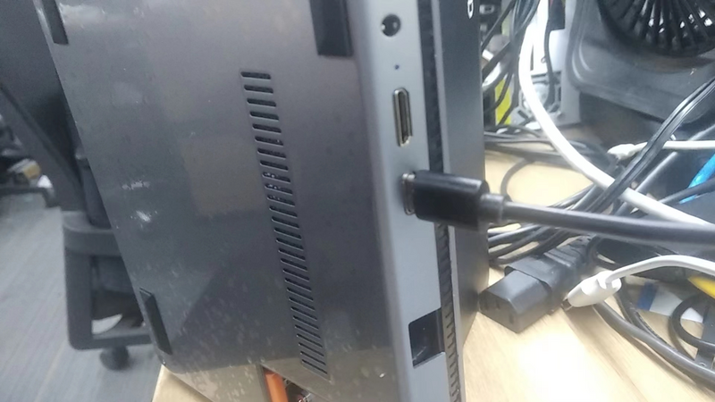
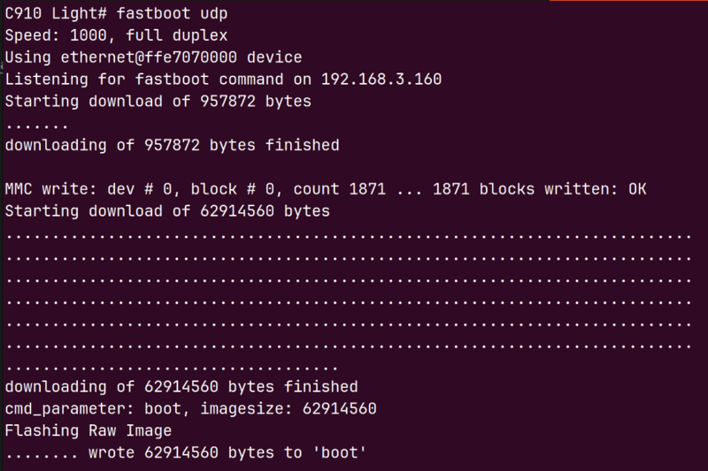

## 最小镜像

针对使用 8+8 内测版核心板的用户，全量烧录镜像会因为容量不够从而无法烧录，可以先在[这里](https://pan.baidu.com/e/1xH56ZlewB6UOMlke5BrKWQ)下载烧录开发板的 BASIC 镜像，然后进行部分替换，即可得到适用于 console 的最小镜像。

需要替换的部分可以在[github](https://github.com/sipeed/LicheePi4A-Build/releases)中下载。
下载完成后，使用 scp 上传到开发板，然后在开发板上执行如下命令即可完成替换：
```shell
sudo apt update
sudo apt install squashfs-tools
unsquashfs overlay_20231215.sqfs
sudo cp -r squashfs-root/* /
```

替换完成后，再烧录一下 console 对应的 u-boot（注意是只烧录u-boot），烧录完成后重启即可。

## 全量镜像

### 通过 typeC 口烧录

1. 拆掉SSD后盖

2. 找到BOOT按键和RST按键


3. 按着BOOT按键，然后按键盘上的电源按键开机，然后将 console 连接 typec 口到烧录镜像的 PC。



4. 在烧录镜像的 PC 上下载用于烧录的镜像: [点我下载](https://wiki.sipeed.com/hardware/zh/lichee/th1520/lcon4a/3_images.html)

5. 在烧录镜像的 PC 上执行 `fastboot flash ram u-boot-with-spl-console.bin`

6. 在烧录镜像的 PC 上执行 `fastboot reboot`

7. 在烧录镜像的 PC 上执行 `fastboot flash uboot u-boot-with-spl-console.bin`

8. 在烧录镜像的 PC 上执行 `fastboot flash boot boot.ext4`

9. 在烧录镜像的 PC 上执行 `fastboot flash root root.ext4`

10. 按下 BOOT 旁边的 RST 按键重启 Console 笔记本。

### 通过 u-boot 进行网络烧录

1. console 连接网线（注意和用于烧录镜像的 PC 处于同一局域网中）

2. 用串口工具连接 console 上的串口，上电，进入到 uboot 命令行中

3. console 执行 dhcp 命令分配一个 ip 地址

4. console 执行 fastboot udp 开启监听

5. 烧录镜像的 PC 机上运行如下命令
```shell
./fastboot -s udp:刚刚板子上设置的ip地址 flash uboot uboot文件名
./fastboot -s udp:刚刚板子上设置的ip地址 flash boot boot文件名
./fastboot -s udp:刚刚板子上设置的ip地址 flash root root文件名
```

效果如下：
