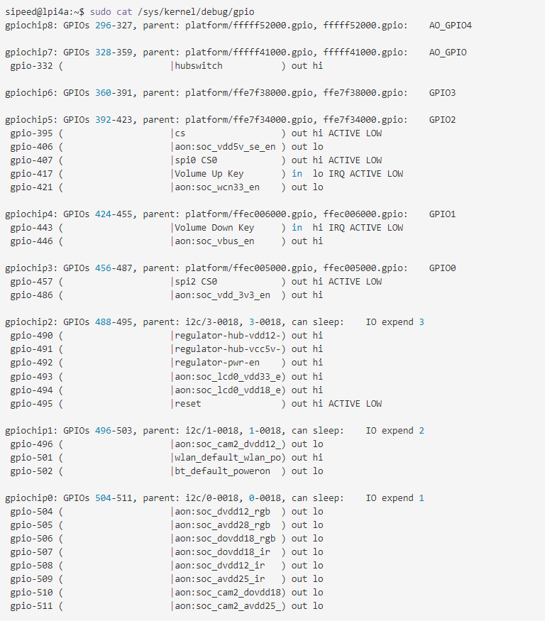
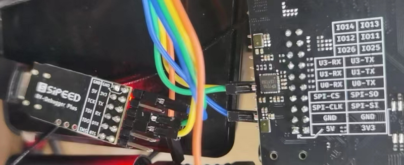

## SoC 相关
 
### CPU 运行频率

`sudo cat /sys/devices/system/cpu/cpu*/cpufreq/cpuinfo_cur_freq `
单位为 KHz   
注意系统自带温控策略，当系统过于空闲或者温度过高时，都会降频。请保持良好散热，使得 CPU 在 60 度以下，获得最佳性能。   

### 芯片温度

`cat /sys/class/thermal/thermal_zone0/temp`   

单位为0.001摄氏度  

### CPU超频

TH1520 默认最大运行频率为 1.85GHz，但是经过初步测试发现，有 80% 左右的芯片可以在 2GHz 运行，有 50% 左右的芯片可以在 2GHz 通过压力测试。   
这里放出简易超频步骤，仅供参考，不对稳定性和安全性做保证。  

查看`/boot`下的文件：

```bash
fw_dynamic.bin        #opensbi
Image                 #kernel image
kernel-release        #commit id of kernel
light_aon_fpga.bin    #fw for E902 aon
light_c906_audio.bin  #fw for C906 audio
light-lpi4a.dtb       #1.85GHz dtb
light-lpi4a_2Ghz.dtb  #2GHz overclock dtb
light-lpi4a-ddr2G.dtb #history dtb
```

将 `light-lpi4a_2Ghz.dtb` 拷贝覆盖为 `light-lpi4a.dtb`，重启，即可修改开机后的最大频率。   
注意有一定几率这样修改后无法启动，此时需要重新烧录固件来恢复。

如果成功启动，则可以查看下面的数值确认是否已成功超频：     
`sudo cat /sys/devices/system/cpu/cpu0/cpufreq/cpuinfo_max_freq`

## PWM

以散热风扇所接的 PWM1 为例，可以通过如下代码进行风扇使能操作：

```bash
echo 1 > /sys/class/pwm/pwmchip0/export
echo 1000000 > /sys/class/pwm/pwmchip0/pwm1/period
echo 1000000 > /sys/class/pwm/pwmchip0/pwm1/duty_cycle
echo 1 > /sys/class/pwm/pwmchip0/pwm1/enable
```

## GPIO

LicheePi 4A 板载 2x10pin 插针，其中有 16 个原生 IO，包括 6 个普通 IO，3 对串口，一个 SPI。
> 注意：SOC的所有原生IO均是1.8V电平，请注意电平转换。 
> 插针上的串口输入侧已经进行了1/2分压处理，可以接3.3V的串口。 

TH1520 SOC 具有4个GPIO bank，每个bank最大有32个IO：

|Bank      |Address      | kernel io num|
|---       |---          |---           |
|GPIO0     |0xffec005000 | 456-487 |
|GPIO1     |0xffec006000 | 424-455 |
|GPIO2     |0xffe7f34000 | 392-423 |
|GPIO3     |0xffe7f38000 | 360-391 |
|AO_GPIO   |0xfffff41000 | 328-359 |
|AO_GPIO4  |0xfffff52000 | 296-327 |
|AUDIO_GPIO|0xffcb013000 | - |

其中 0x0 偏移处的 4Byte（32bit）是 GPIO 数据寄存器，0x4 偏移处的 4Byte（32bit）是 GPIO 方向寄存器

SOM 上的 GPIO 对应表格为：

|名称 |GPIO|
|--- |---|
|01  |GPIO0_27|
|02  |GPIO0_28|
|03  |GPIO2_0 |
|04  |AOGPIO4 |
|05  |GPIO2_1 |
|06  |GPIO1_22|
|07  |GPIO0_24|
|08  |GPIO0_25|
|09  |GPIO3_2 |
|10  |GPIO3_3 |
|11  |GPIO1_3 |
|12  |GPIO1_4 |
|13  |GPIO1_5 |
|14  |GPIO1_6 |

LicheePi 4A上的插针的 GPIO 对应关系为：  
  

> 以文档的标注为准，内测版的丝印标注可能有误 

GPIO 操作：  
> 注意，可能需要事先设置 pinmux

```bash
num=xxx
echo ${num} > /sys/class/gpio/export  
echo out>/sys/class/gpio/gpio${num}/direction 
echo 1 > /sys/class/gpio/gpio${num}/value  
echo 0 > /sys/class/gpio/gpio{num}/value
```

也可以直接操作寄存器：

> devmem 可以从此处下载编译：https://github.com/VCTLabs/devmem2/blob/master/devmem2.c   

```bash
./devmem 0xffe7f38000 w
```

系统内GPIO信息查看：

```bash
sipeed@lpi4a:~$ sudo cat /sys/kernel/debug/gpio
```

下面是示例结果:



<!--
```bash
sipeed@lpi4a:~$ sudo cat /sys/kernel/debug/gpio
gpiochip8: GPIOs 296-327, parent: platform/fffff52000.gpio, fffff52000.gpio:    AO_GPIO4

gpiochip7: GPIOs 328-359, parent: platform/fffff41000.gpio, fffff41000.gpio:    AO_GPIO
 gpio-332 (                    |hubswitch           ) out hi 

gpiochip6: GPIOs 360-391, parent: platform/ffe7f38000.gpio, ffe7f38000.gpio:    GPIO3

gpiochip5: GPIOs 392-423, parent: platform/ffe7f34000.gpio, ffe7f34000.gpio:    GPIO2
 gpio-395 (                    |cs                  ) out hi ACTIVE LOW
 gpio-406 (                    |aon:soc_vdd5v_se_en ) out lo 
 gpio-407 (                    |spi0 CS0            ) out hi ACTIVE LOW
 gpio-417 (                    |Volume Up Key       ) in  lo IRQ ACTIVE LOW
 gpio-421 (                    |aon:soc_wcn33_en    ) out lo 

gpiochip4: GPIOs 424-455, parent: platform/ffec006000.gpio, ffec006000.gpio:    GPIO1
 gpio-443 (                    |Volume Down Key     ) in  hi IRQ ACTIVE LOW
 gpio-446 (                    |aon:soc_vbus_en     ) out hi 

gpiochip3: GPIOs 456-487, parent: platform/ffec005000.gpio, ffec005000.gpio:    GPIO0
 gpio-457 (                    |spi2 CS0            ) out hi ACTIVE LOW
 gpio-486 (                    |aon:soc_vdd_3v3_en  ) out hi 

gpiochip2: GPIOs 488-495, parent: i2c/3-0018, 3-0018, can sleep:    IO expend 3
 gpio-490 (                    |regulator-hub-vdd12-) out hi 
 gpio-491 (                    |regulator-hub-vcc5v-) out hi 
 gpio-492 (                    |regulator-pwr-en    ) out hi 
 gpio-493 (                    |aon:soc_lcd0_vdd33_e) out hi 
 gpio-494 (                    |aon:soc_lcd0_vdd18_e) out hi 
 gpio-495 (                    |reset               ) out hi ACTIVE LOW

gpiochip1: GPIOs 496-503, parent: i2c/1-0018, 1-0018, can sleep:    IO expend 2
 gpio-496 (                    |aon:soc_cam2_dvdd12_) out lo 
 gpio-501 (                    |wlan_default_wlan_po) out hi 
 gpio-502 (                    |bt_default_poweron  ) out lo 

gpiochip0: GPIOs 504-511, parent: i2c/0-0018, 0-0018, can sleep:    IO expend 1
 gpio-504 (                    |aon:soc_dvdd12_rgb  ) out lo 
 gpio-505 (                    |aon:soc_avdd28_rgb  ) out lo 
 gpio-506 (                    |aon:soc_dovdd18_rgb ) out lo 
 gpio-507 (                    |aon:soc_dovdd18_ir  ) out lo 
 gpio-508 (                    |aon:soc_dvdd12_ir   ) out lo 
 gpio-509 (                    |aon:soc_avdd25_ir   ) out lo 
 gpio-510 (                    |aon:soc_cam2_dovdd18) out lo 
 gpio-511 (                    |aon:soc_cam2_avdd25_) out lo
```  -->

## UART 

### 系统串口

LicheePi 4A 的系统串口是 UART0,在侧边插针中有引出。  
你可以使用 USB 转串口模块连接该串口，即 `U0-RX` 和 `U0-TX`，注意交叉连接，以及 GND 连接。   
  

连接完成后，即可使用串口工具进行通信，Windows 下推荐 `XShell`，`mobaterm`，Linux下推荐 `minicom`   
设置串口波特率为 `115200`，即可在串口终端下登录并进行指令操作：  
> 注：刚连接后可以敲几个回车查看是否有反应，如果没有反应则检查接线或者串口配置

  

### 一般串口

LicheePi 4A的侧边插针中还引出了 UART1/2/3, 同样可以操作。  
默认镜像中仅使能了 UART1, 其它串口可能需要重新配置设备树操作。  
> 注意：SOC串口电平为1.8V，刚好处于3.3V的高电平阈值附近，可能某些串口模块无法正确输入输出，建议使用我们提供配套串口模块，或者微调其他串口模块的3.3V电压到2.8V 

#### 查看串口设备

```bash
ls /dev/ttyS*
```

#### 查看串口的波特率等信息

```bash
stty -F /dev/ttyS1 -a 
```

#### 设置串口波特率、数据模式

```bash
stty -F /dev/ttyS1 ispeed 115200 ospeed 115200 cs8
```

#### 查看串口数据

```bash
cat /dev/ttyS1
```

#### 发送串口数据

```bash
echo "12345" > /dev/ttyS1
```

#### 其它方法

也可以使用`minicom`，或者pyserial库进行串口操作，请用户自行查找相关资料使用。  

## I2C

LicheePi 4A 上有多个 I2C 设备（I2C0/1/2/3），其中 0/1/3 用于连接 I2C IO 扩展芯片，I2C2 预留在对外插针上。  

这里我们使用 i2c-tools 来进行 i2c 验证操作，镜像默认预装了 i2c-tools:

```bash
sipeed@lpi4a:/usr$ ls /sbin/i2c*
/sbin/i2c-stub-from-dump  /sbin/i2cdetect  /sbin/i2cdump  /sbin/i2cget  /sbin/i2cset  /sbin/i2ctransfer
```

列出所有I2C总线：

```bash
sipeed@lpi4a:~$ /sbin/i2cdetect -l
i2c-0   unknown         Synopsys DesignWare I2C adapter         N/A
i2c-1   unknown         Synopsys DesignWare I2C adapter         N/A
i2c-2   unknown         Synopsys DesignWare I2C adapter         N/A
i2c-3   unknown         Synopsys DesignWare I2C adapter         N/A
i2c-4   unknown         Synopsys DesignWare I2C adapter         N/A
i2c-5   unknown         Synopsys DesignWare I2C adapter         N/A
i2c-6   unknown         Synopsys DesignWare I2C adapter         N/A
i2c-7   unknown         DesignWare HDMI                         N/A
```

检测 I2C 总线上的设备，可见 PCA9557PW 的 I2C 地址为 0x18，与原理图相符： 

```bash
sipeed@lpi4a:~$ sudo /sbin/i2cdetect -r -y 0
     0  1  2  3  4  5  6  7  8  9  a  b  c  d  e  f
00:                         -- -- -- -- -- -- -- -- 
10: -- -- -- -- -- -- -- -- UU -- -- -- -- -- -- -- 
20: -- -- -- -- -- -- -- -- -- -- -- -- -- -- -- -- 
30: -- -- -- -- -- -- -- -- -- -- -- -- -- -- -- -- 
40: -- -- -- -- -- -- -- -- -- -- -- -- -- -- -- -- 
50: -- -- -- -- -- -- -- -- -- -- -- -- -- -- -- -- 
60: -- -- -- -- -- -- -- -- -- -- -- -- -- -- -- -- 
70: -- -- -- -- -- -- -- --  
``` 

  

此外还可以使用 `i2cdump` 来 dump 指定 i2c 地址的所有寄存器，用 `i2cget` 来读出指定 i2c 地址的指定寄存器值，用 `i2cset` 来写入指定 i2c 地址的指定寄存器值。   
不过由于 IO 扩展芯片已经被内核使用，所以无法直接使用这些命令验证。用户可以自行在 I2C2 上外接外设来验证。  


## SPI   

LicheePi4A上预留了两路SPI，一路是背面空贴的SPI Flash焊盘，一路是插针上的SPI。

```bash
sipeed@lpi4a:~$ ls /dev/spidev2.0 
/dev/spidev2.0
```

TODO

## USB

TODO  

### USB SSD

### USB 网卡


### USB 摄像头


### USB 声卡


## ETH

LicheePi4A 具有双千兆网口，其中 Eth0 还具备 PoE 功能。 

TODO

### PoE

TODO


## Audio

LicheePi 4A 上有两个模拟硅麦，使用 ES7210 CODEC，以及有一路板载的扬声器，和立体声耳机，使用 ES8156 CODEC。

> 注：板载扬声器与立体声耳机使用了互斥设计，插入耳机后，音频输出自动切换到耳机，板载扬声器失能。

使用 aplay 和 arecord 可以进行简易录放测试， 注意板载扬声器是右声道。  

```bash
#!/bin/bash

echo "Play Test Audio" 
aplay /usr/share/sounds/alsa/Side_Right.wav

# Record Audio
echo "Start record auido, auto replay after 3 seconds"
arecord -Dhw:0,1 -d 3 -r 48000 -f S16_LE -t wav test.wav & > /dev/null &
sleep 4

# Play Audio
aplay test.wav
echo "Start Play"
```

你还可以使用alsa相关工具，如`alsamixer`，进行音量调整等操作。

## HDMI

> 注：早期镜像的HDMI音频不生效，请升级到较新版本使能HDMI音频功能。  

## MIPI CSI

LicheePi 4A 具有 CAM0/CAM1/CAM2 三个摄像头接口， CAM0 最大 4lane，CAM1/2 为 2lane，默认使用 CSI0 接口，接 OV5693 摄像头。  

TODO

## MIPI DSI

LicheePi 4A 具有 MIPI DSI0 接口，支持 4K 视频输出，可以选配 10.1 寸 1280x800 或者 1920x1200 的屏幕。  

TODO  

## GPU

`sudo watch cat /sys/kernel/debug/pvr/status`

TODO
## NPU

TODO

## 其它
欢迎投稿～ 投稿接受后可得￥5～150（$1~20）优惠券！
