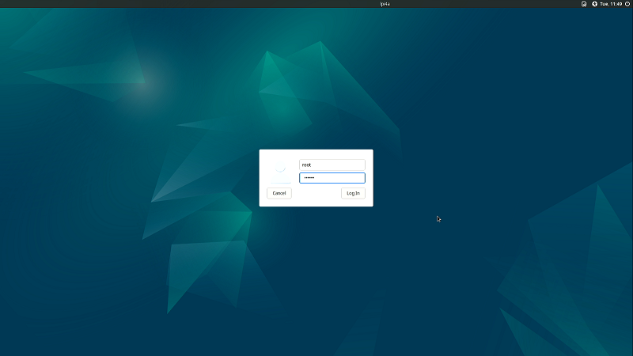

# LicheePi 4A 基础上手

## 需要的配件

为了更容易地使用 LicheePi 4A，需要准备以下的配件:

- HDMI 显示器，或者与 LicheePi 4A 拍套售卖的显示屏；图形化操作系统很方便操作。
- 键盘和鼠标；用来操作图形化系统。
- 电源适配器；最好购买与 LicheePi 4A 配套的电源适配器；这会给 LicheePi 4A 提供足够的供电。
- 一张 8G 以上内存容量的 TF 卡，或者直接使用搭载了 eMMC 的核心板；没有这个可启动不了 LicheePi 4A。

## 烧录系统

### 获取镜像

### 烧录系统

参考：https://gitee.com/thead-yocto/light_deploy_images

## 串口登录

20230423 记录:

> 当前图形化系统显示驱动有一些问题，先使用串口登录到系统后，删除 `/lib/libGLESv1_CM_PVR_MESA.so` 和`/lib/libGLESv2_PVR_MESA.so` 两个文件后，可以流畅的使用图形化系统了

使用串口连接上底板上 GPIO 的 `U0-RX` 和 `U0-TX`，然后打开串口软件，`Windows` 上可以使用 `mobaxterm`，`Linux` 系统可以使用 `minicom`。

设置波特率 `115200` 后打开选择并打开连接在电脑上的串口端口，然后在打开串口后的终端里可以敲击几次 **回车键** 来看看终端有没有反应.


如果没有反应：
1. 检查 Lichee Pi 4A 的供电情况；如果底板 TypeC 附近的 LED 亮起来，说明供电正常。
2. 检查串口引脚接线情况；可以更换 `TX` 和 `RX` 接线来尝试排除串口接线错误导致串口不能正常通信的情况
3. 检查系统烧录情况；在底板 TypeC 接口与天线接口之间有一个复位按键，尝试按下后可以从串口终端中开到启动信息日志；多次重启说明系统有缺失，需要重新烧录镜像。

登录系统后，使用 `rm /lib/libGLESv1_CM_PVR_MESA.so` 和`rm /lib/libGLESv2_PVR_MESA.so` 命令来删除两处文件，暂时解决图形化系统卡顿的情况。


## 登录系统

将 Lichee Pi 4A 连接上显示器后，可以看到图形化交互界面了。

在登录界面，输入用户名 `root`，密码 `sipeed` 就可以登录进系统了。



## 打开命令行

在 Lichee Pi 4A 的 Debian 图形化系统中，使用快捷键 `Ctrl` + `Alt` + `T` 三个组合键可以直接打开命令行终端，来快速方便地操作系统。


## 连接网络

### 连接有线网络

Lichee Pi 4A 由两个千兆网络接口；将已经接通网络的网线插入到 Lichee Pi 4A 的网络接口中节能实现连接有线网络了。

<table>
    <tr>
        <td>插上网线之前</td>
        <td>插上网线之后</td>
    </tr>
    <tr>
        <td></td>
        <td></td>
    </tr>
    <tr>
        <td colspan=2> 上面两张图对比可以看到：在接上网线前，系统中 <code>Ethernet Network</code> 下面显示着 <code>disconnected</code>, 接上网线后显示 <code>Wired connection </code></td>
    </tr>
</table>

### 连接无线网络

Lichee Pi 4A 板载无线模组，支持蓝牙和 wifi 。

从状态栏中的 `Avaliable networks` 中查看自己想要连接到的无线网络，输入密码之后就自动连接上了。

<table>
    <tr>
        <td colspan=2></td>
    </tr>
    <tr>
        <!-- <td></td>
        <td></td> -->
    </tr>
</table>

## 连接蓝牙

## 测试 USB 接口

## 挂载 U 盘

## 挂载 SD 卡

## 音频测试

### 测试耳机接口

### 测试扬声器接口

### 测试 HDMI 音频输出

## 设置中文显示

## 安装中文输入法

## 更换软件源

## 升级软件

## 安装程序

## 更改开机 LOGO

## 操作 GPIO

> 进阶使用

## 获取设备 IP

## VNC 远程桌面

## 通过 SSH 登录到系统

### 远程登录到系统

### 远程拷贝文件

## Samba 文件共享

Samba 基于SMB/CIFS网络协议，不同设备之间可以通过该协议共享访问文件、串行端口等，这里通过它将 Windows 10 系统设备上的共享文件夹挂载至树莓派。

下面的命令会自动安装 Samba 作为服务器和客户端的全部必需组件：

```bash
sudo apt install samba samba-common-bin smbclient cifs-utils
```

## 搭建 FTP 服务

## 配置 NGINX

## 安装 Docker

## 测试 GPU

## 编程语言体验

### C

### Java

### Python

## 使用 Python 进行串口通信

## 编译体验 Opencv

## 编译体验 Wiringpi

## 配置开机脚本

### 开机自动挂载 U 盘