<!-- M1s Dock 设计精巧，可以用来所很多有意思的事，这里简单说明一下一些使用方法。要注意的是串口默认波特率 2000000。

通过板子上的 UART 口连接 PC，在 Windows 系统的设备管理器中显示有两个 Converter 设备。

 -->

## 硬件准备

- 两根 TypeC 数据线
- 一个 M1s Dock
- 一台电脑

M1S Dock 搭载有两个 TypeC 接口。默认情况下 UART 口用做于电脑和 M1S Dock 的串口通信，OTG 口默认用于给板子上的 BL808 芯片里面的 C906 核心烧录固件。


1. 上图中可以看到 `S1` 、 `S2` 两个按键，另外还有 `BOOT` 按键和 `RST` 按键
2. 上图中板子的左下角有 UART 口，默认有 USB 转双串口功能连接到 BL808 芯片的两个核心上
3. 上图中板子的右下角有 OTG 口，M1s Dock 默认固件将它作用于烧录 C906 核心的固件。

## 初次通电

### 板卡现象

首次对 M1s Dock 板子上电，屏幕会显示摄像头所拍摄到的内容。

按下 `S1` 或者 `S2` 按键后屏幕上的数字会发生变化，那个数字表示着板子上 LED 的亮度百分比。


可以看到下图中的 LED 亮度为 50% 时候的亮起状态。


### OTG 口现象

> 通过 OTG 口连接 PC 的话会有一个大小为 3M 的 U 盘。

部分电脑可能会因为兼容性问题显示不出来这个 U 盘，但是可以通过[串口烧录](https://wiki.sipeed.com/hardware/zh/maix/m1s/other/start.html#%E4%B8%B2%E5%8F%A3%E7%83%A7%E5%BD%95) 来重新烧录一次 M1s Dock 来解决该问题。


并且在 Windows 的设备管理器中会看到大容量存储设备，在 linux 系统中也会出现一个可移动设备。


如果没有看到大容量存储设备或者 U 盘在电脑中显示，可以先更换数据线或者链接电脑其他 USB 接口来尝试解决问题，仍然看不到的话可以跳转到 [串口烧录](https://wiki.sipeed.com/hardware/zh/maix/m1s/other/start.html#%E4%B8%B2%E5%8F%A3%E7%83%A7%E5%BD%95) 来重新烧录一次 M1s Dock 来解决该问题；烧录的时候并且勾选烧录 `partition table`, `boot2`, `firmware` 三个选项，烧录结束后重新将板子连接电脑。

### UART 口现象

> 通过 UART 口连接 PC 会显示有两个串口设备


并且在 Windows 系统的设备管理器中可以看到两个 Converter 设备。


没有串口设备的话更换 USB 数据线或者使用电脑别的 USB 口。

依旧没有的话可以查看 [给板载 bl702 进行烧录](https://wiki.sipeed.com/hardware/zh/maix/m1s/other/start.html#%E7%BB%99%E6%9D%BF%E8%BD%BD-bl702-%E8%BF%9B%E8%A1%8C%E7%83%A7%E5%BD%95) 相关的内容来给 bl702 重新烧录一次固件。在 M1s Dock 上，我们使用 bl702 芯片作为 USB 转双串口芯片，由于某些原因串口功能不能正常使用的时候，可以重新烧录固件来解决这个问题。

只有一个串口设备的话也可以查看 [给板载 bl702 进行烧录](https://wiki.sipeed.com/hardware/zh/maix/m1s/other/start.html#%E7%BB%99%E6%9D%BF%E8%BD%BD-bl702-%E8%BF%9B%E8%A1%8C%E7%83%A7%E5%BD%95) 章节并且重新烧录 bl702 来解决问题。

设置波特率为 2000000，分别打开两个串口，会看到不同的信息。

打开小号串口可以看到一直在打印信息：


打开大号串口可以进行简单的命令行交互：


## 烧录方法

想要让板子运行自己预期的程序，就要先知道怎么样烧录固件到板卡。

### U 盘烧录

为了便捷烧录，我们准备了 U 盘烧录的方法来给快速地烧录 M1s Dock 上 bl808 的 C906 核心所运行的程序。

先使用 TypeC 数据线将电脑与板子的 OTG 口连接起来，再同时按住板子上面两侧的按键（已经在下面图片中指明），然后按一下板子上的 RST 键就可以进入 U 盘烧录模式。

<table>
    <tr>
        <td></td>    
        <td>同时按住两侧的按键然后按一下 RST 键来复位板子，并让它进入 U 盘烧录模式</td>
    </tr>
</table>

另外，按住两侧按键的时候，从板子的 OTG 口板子给板子通电来启动板子也可以进入 U 盘下载模式。


板子成功进入 U 盘烧录模式后在电脑上会显示出一个容量很小的磁盘，直接把固件 <a href="https://dl.sipeed.com/shareURL/MAIX/M1s/M1s_Dock/7_Firmware/demo_bin">点我跳转部分例程固件</a> 拖拽进去即可完成烧录。。


文件存放进去后数秒后板子会重启，U 盘被弹出，表示烧录完成，看不到效果的话可以给板子重新插拔板子 USB 来完全重启一次再来查看烧录结果。

### 串口烧录

上面的 U 盘烧录方法适用于给 C906 核心烧录固件。当板子出现固件异常或者需要将板子的固件全部升级时，我们需要通过串口烧录这种方法来重新烧录 M1s Dock, 这可以解决所有问题。

使用 TypeC 数据线将电脑与板子的 UART 口连接起来，此时电脑上会出现两个串口 （如果出现鼠标不能动的现象请拔掉 USB 并且查看 [更新板载 bl702 固件](#给板载-bl702-进行烧录) 相关内容来修复问题)。

#### 软件获取

给 M1s 烧录需要用到博流官方烧录工具，前往 https://dev.bouffalolab.com/download 下载名称为 `Bouffalo Lab Dev Cube` 的文件。解压后就得到了用来烧录板子的应用程序。


备份链接：[Sipeed 下载站](https://dl.sipeed.com/shareURL/others/BouffaloLabDevCube)

解压后的文件夹中有 `BLDevCube`、 `BLDevCube-macos` 和 `BLDevCube-ubuntu` 三个文件，用于在不同系统启动这个图形化烧录工具。


还有 `bflb_iot_tool`、`bflb_iot_tool-macos`、`bflb_iot_tool-ubuntu` 这三个程序，用于在不同系统通过命令行进行烧录。

#### 图形化界面烧录

根据自己的系统启动软件 `BLDevCube` 后选择 bl808 ，紧接着软件的 IOT 页面选择分区表文件[点我下载](https://dl.sipeed.com/fileList/MAIX/M1s/M1s_Dock/7_Firmware/partition/partition_cfg_16M_m1sdock.toml)（图里 ②）。

<table>
    <tr>
        <td>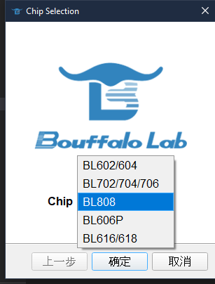</td>    
        <td></td>
    </tr>
</table>

选择完上面的分区表文件后，烧录工具的可选项就变多了，主要关注 `boot2`, `firmware`, `d0fw` 三项。


上图中，`boot2` 是固定的，位于 `BLDevCube\chips\bl808\builtin_imgs\boot2_isp_bl808_xxxx_xxx` 目录下，就是在解压的烧录程序文件夹的子目录里面，要选择名称带有 `debug` 的文件；`firmware` 是 E907 核心运行的固件 ；`d0fw`是 C906 核心运行的固件，前面的 U 盘烧录里面的固件就是给这个核心烧录的。E907 的固件文件和 C906 的固件文件均可以通过 [M1s_dock example](https://gitee.com/sipeed/M1s_BL808_example) 来编译得到。

首次烧录 `firmware` 和 `boot2` 都需要烧录进去，之后就可以按需烧录而不用全部勾选。

默认固件可以在 [这里下载到](https://dl.sipeed.com/shareURL/MAIX/M1s/M1s_Dock/7_Firmware/factory)。

正确的选择固件后，在窗口右侧点击一下 `Refresh` 来刷新串口，正常情况有两个串口号相邻的串口可供选择，如果没有两个串口请参考下面的 [烧录 BL702](#给板载-bl702-进行烧录)来查看解决方法。在本烧录应用中，对 M1s Dock 操作均需要通过串口号较大的串口，而不是小号串口。


按住板子上的 BOOT 键和 RST 键， 然后先松开 RST 键再松开 BOOT 键来使板子进入串口烧录模式。


点击下载 (Create & Download) 后会看到下图箭头中多指向的信息，在这之前我们需要操作硬件使它进入串口烧录模式。


成功进入烧录模式会握手成功并且接下来会进行烧录。


握手失败的话就重新点击烧录并且再次尝试。这种错误可能是按键释放顺序错误（应该先松开 RST 键再松开 BOOT 键，即在松开 RST 键的时候 boot 键应该是按下的状态）而导致板子没有进入串口烧录模式，软件等待超时而导致的。


#### 命令行烧录

我们可以使用命令行来通过板子上的串口来对 M1s Dock 进行烧录。

在 `BLDevCube` 的文件夹下面，还有 `bflb_iot_tool`、`bflb_iot_tool-macos`、`bflb_iot_tool-ubuntu` 这三个程序，用于在不同系统通过命令行进行烧录。

下面是在 `Windows` 系统中通过命令行烧录的命令。其中 `firmware` 是 E907 核心的固件，可以在[默认固件](https://dl.sipeed.com/shareURL/MAIX/M1s/M1s_Dock/7_Firmware/factory)处下载得到；`pt` 文件是分区表文件，默认在 `M1s_BL808_example\partition` 目录下，当然也可以 [点我](https://dl.sipeed.com/fileList/MAIX/M1s/M1s_Dock/7_Firmware/partition/partition_cfg_16M_m1sdock.toml) 直接下载到；`boot2` 文件默认位于 `BLDevCube\chips\bl808\builtin_imgs\boot2_isp_bl808` 目录下，是名称带有 `debug` 的文件；波特率为 2M，这样烧录的时候会快点；`port` 应指定为串口号较大的串口。

```bash
.\bflb_iot_tool.exe --chipname=bl808 --port=COM38 --baudrate=2000000 --firmware="firmware_20221212.bin" --pt="M1s_BL808_example\partition\partition_cfg_16M_m1sdock.toml" --boot2="BLDevCube\chips\bl808\builtin_imgs\boot2_isp_bl808\boot2_isp_debug.bin"
```

当然，在烧录前需要让 M1s Dock 进入下载模式：按住板子上的 BOOT 键和 RST 键， 然后先松开 RST 键再松开 BOOT 键。


烧录完之后，可以参考前面的 [U 盘烧录](#u-盘烧录) 来给 C906 核心烧录固件。也可以自己根据烧录地址来烧录固件，烧录地址可以在 `partition_cfg_16M_m1sdock.toml` 文件查看到，也可以自己更改，此处不述。

### 烧录时候的常见问题

#### BFLB IMG LOAD SHAKEHAND FAIL

这种情况是板子的 bl808 没有进入下载模式，确定自己在板子在运行时（已经通电）自己同时按下 RST 按键和 BOOT 按键，然后先松开 RST 键后松开 BOOT 键来时 bl808 进入下载模式。


并且确定自己在下载的时候选择的是串口号大的那一个串口，而不是小号串口。


#### 只看到一个串口

这种情况是进入了板载 bl702 下载模式。需要注意的是不应该按住 BOOT 键然后给板子通电，这样会进入 bl702 的下载模式，只有一个串口显示在电脑中。给 bl808 通过串口烧录是在板子通电后，同时按下 RST 按键和 BOOT 按键，然后先松开 RST 键后松开 BOOT 键来时 bl808 进入下载模式。


#### 没有串口设备

确定自己连接的是板子上的 UART 接口，换一根数据线或者连接电脑另一个 USB 口。

#### 烧录单个固件

在烧录工具软件中，首次烧录要求将 `partition table`, `boot2`, `firmware`, `d0fw` 文件都勾选上并烧录进板子，以后如果想要烧录由 SDK 编译出来的单个固件，在对应的烧录选项中选择编译出来的文件就行：
`firmware` 选择由 e907_demo 编译出来的最终固件。
`d0fw` 选择由 c906_demo 编译出来的最终固件。

`partition table` 和 `boot2` 每次烧录都要勾选中。

<table>
<tr>
  <td>烧录 c906_demo 固件</td>
  <td>烧录 e907_demo 固件</td>
</tr>
<tr>
  <td>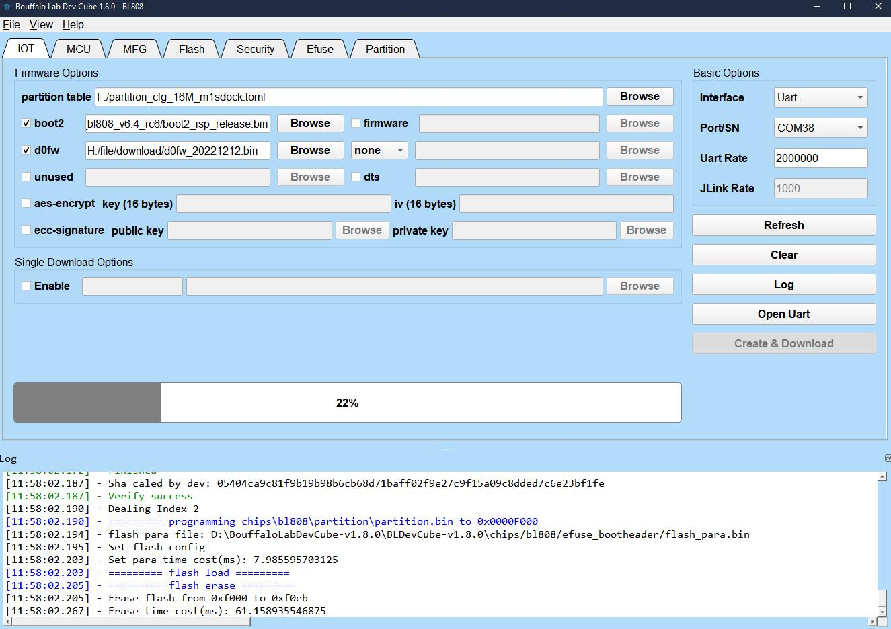</td>
  <td></td>
</tr>
</table>

## 烧录例程

下面的几个 Demo 都是从 M1s_bl808_example 里面编译出来的，适用于 bl808 里面的 C906 核心。

建议使用 U 盘烧录的方法烧录进板卡，直接体验一下这款板卡。

### lvgl_demo

[LVGL](https://lvgl.io/) (轻巧而多功能的图形库)是一个免费的开放源代码图形库，适合用于 mcu 构建图形界面。

Demo 文件：[点我](https://dl.sipeed.com/shareURL/MAIX/M1s/M1s_Dock/7_Firmware/demo_bin/lvgl_demo)

通过 U 盘烧录的方法烧录进 M1s Dock 后，屏幕显示着 lvgl 测试效果，设置波特率为 2000000，串口号较小的串口打印着最后一次触摸屏幕位置。

 


### image_processing_demo

一个简单的图像处理例子。

Demo 文件：[点我](https://dl.sipeed.com/shareURL/MAIX/M1s/M1s_Dock/7_Firmware/demo_bin/image_processing_demo)

通过 U 盘烧录的方法烧录进 M1s Dock 后，屏幕上显示摄像头画面，按下两侧的按键可以切换不同的图像算子。设置波特率为 2000000，串口号较小的串口显示着上次按键和其他信息。

按下复位键后串口号较小的串口会显示摄像头相关的配置信息，摄像头异常的话可以从串口信息看到。

 


### tinymaix_mnist_demo

[TinyMaix](https://github.com/sipeed/TinyMaix) 是面向单片机的超轻量级的神经网络推理库，即 TinyML 推理库，可以在任意单片机上运行轻量级深度学习模型。

Demo 文件：[点我](https://dl.sipeed.com/shareURL/MAIX/M1s/M1s_Dock/7_Firmware/demo_bin/tinymaix_mnist_demo)

通过 U 盘烧录的方法烧录进 M1s Dock 后，屏幕中间的红框识别数字。设置波特率为 2000000，串口号较小的串口打印着识别信息。

 


### pikascript_demo

[PikaScript](http://pikascript.com/) 是一个跨平台的超轻量级嵌入式 Python 引擎。

Demo 文件：[点我](https://dl.sipeed.com/shareURL/MAIX/M1s/M1s_Dock/7_Firmware/demo_bin/pikascript_demo)

通过 U 盘烧录的方法烧录进 M1s Dock 后，屏幕白屏，无内容。设置波特率为 2000000，打开串口号较小的串口来进行命令行交互。

在命令行中输入这些指令：

```bash
arc = lv.arc(lv.scr_act())
arc.set_end_angle(200)
arc.set_size(150, 150)
arc.center()
```


然后可以看到屏幕上显示出来一些画面（忽略这糟糕的拍照）：


## SDK 编译

M1s 需要在 Linux 环境下进行编译

### 安装编译所需要的相关软件

获取 SDK 需要用到 `git` 这个软件，编译 SDK 需要用到 `make` 这个软件，对应着后面文档检查自己的目录结构配置的时候需要用到 `tree` 这个软件。

下面是在 debian 系 Linux 发行版（比如 Ubuntu）中安装上述三个软件的示例命令。

```bash
sudo apt-get install git make tree
```

其它 Linux 发行版本安装上述所需的三个软件所使用的命令自行网上查找解决。

### 获取例程仓库

```bash
git clone https://gitee.com/Sipeed/M1s_BL808_example.git
```

最终结构树如下 `tree -L 1 M1s_BL808_example/`


<!-- ```bash
sipeed@DESKTOP:~$ tree -L 1 M1s_BL808_example/
M1s_BL808_example/
├── LICENSE           # 许可证文件
├── assets            # 资源文件
├── c906_app          # C906 核心例程
├── e907_app          # E907 核心例程
├── partition         # 分区表文件
└── readme.md         # 仓库说明
``` -->

### 获得 SDK 仓库

仓库很大，120M 以上。

```bash
git clone https://gitee.com/sipeed/M1s_BL808_SDK.git
```

最终结构树如下 `tree -L 1`


<!-- ```bash
sipeed@DESKTOP:~$ tree -L 1
.
├── M1s_BL808_example   # 例程文件夹
└── M1s_BL808_SDK       # SDK 文件夹
``` -->

### 在 SDK 仓库文件夹下，获取编译工具链

根据例程仓库里面的 readme 的要求，工具链应存放在 M1s_BL808_SDK/toolchain 目录下

```bash
mkdir -p M1s_BL808_SDK/toolchain
cd M1s_BL808_SDK/toolchain
git clone https://gitee.com/wonderfullook/m1s_toolchain.git
```

修改工具链的名称为 `Linux_x86_64` ，然后返回到上两级目录

```bash
mv m1s_toolchain Linux_x86_64
cd ../../
```

这时得到的结构树应如下(截取部分)：`tree -L 2`

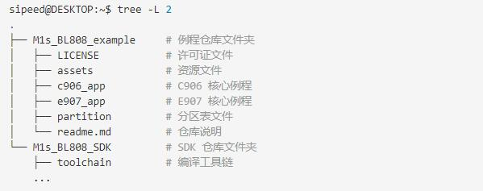

<!-- ```bash
sipeed@DESKTOP:~$ tree -L 2
.
├── M1s_BL808_example     # 例程仓库文件夹
│   ├── LICENSE           # 许可证文件
│   ├── assets            # 资源文件
│   ├── c906_app          # C906 核心例程
│   ├── e907_app          # E907 核心例程
│   ├── partition         # 分区表文件
│   └── readme.md         # 仓库说明
└── M1s_BL808_SDK         # SDK 仓库文件夹
    ├── toolchain         # 编译工具链
    ...
``` -->

### 配置编译工具链路径

首先确定 `M1s_BL808_SDK` 文件夹所在的路径：

```bash
cd M1s_BL808_SDK
pwd
```


<!-- ```bash
sipeed@DESKTOP:~$ cd M1s_BL808_SDK
sipeed@DESKTOP:~/M1s_BL808_SDK$ pwd
/home/lee/bl808/M1s_BL808_SDK
``` -->

我们复制上面执行 `pwd` 后的结果（每个人的会不一样），比如上面截图中的 pwd 命令的执行结果为 `/home/lee/bl808/M1s_BL808_SDK`，因此在配置 `BL_SDK_PATH` 路径时后面应该跟着 `/home/lee/bl808/M1s_BL808_SDK`。

> 以后每次开始编译都需要执行一次这个来配置下编译工具链路径（注意自行修改 BL_SDK_PATH 的值，并且 = 符号后面没有空格）

```bash
export BL_SDK_PATH=
```


然后执行下面的命令就可以准备开始交叉编译了。

<!-- ```bash
export BL_SDK_PATH=/home/lee/bl808/M1s_BL808_SDK
``` -->

注意是 `M1s_BL808_SDK` ，不是 `M1s_BL808_SDK/`，一般自动补全会导致这个错误。

### 编译 demo

执行 M1s_BL808_example/c906_app 目录下的 build.sh ，后面追加上想要编译的 demo 就可以完成了。

Demo 如下（编辑于 2022-12-13）：

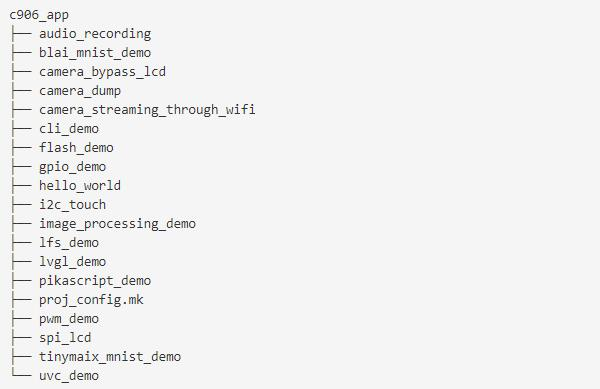

<!-- ```txt
c906_app
├── audio_recording
├── blai_mnist_demo
├── camera_bypass_lcd
├── camera_dump
├── camera_streaming_through_wifi
├── cli_demo
├── flash_demo
├── gpio_demo
├── hello_world
├── i2c_touch
├── image_processing_demo
├── lfs_demo
├── lvgl_demo
├── pikascript_demo
├── proj_config.mk
├── pwm_demo
├── spi_lcd
├── tinymaix_mnist_demo
└── uvc_demo
``` -->

下面是编译 lvgl_demo 的示例命令，其他 demo 的编译自己更改 ./build.sh 后面的名称。

```bash
cd M1s_BL808_example/c906_app
./build.sh lvgl_demo
```

然后编译出来的固件就会在 M1s_BL808_example/c906_app/build_out 目录下，名称为 `d0fw.bin`，通过虚拟 U 盘拖拽烧录即可。


虚拟 U 盘找不到的话也可以通过博流官方烧录工具来使用串口下载，注意在 d0fw 框中应当勾选自己所编译出来的 `d0fw.bin` （下图仅做示例）


### 编译 firmware

执行 M1s_BL808_example/e907_app 目录下的 build.sh ，后面追加上 firmware 就可以编译了

```bash
cd M1s_BL808_example/e907_app
./build.sh firmware
```

然后编译出来的固件就会在 M1s_BL808_example/e907_app/build_out 目录下，名称为 `firmware.bin`。

通过博流官方烧录工具来使用串口下载，注意在 firmware 框中应当勾选自己所编译出来的`firmware.bin` （下图仅做示例）


### 常见问题

1. 执行完 build.sh 后提示 `Makefile:14: *** BL_SDK_PATH not found, please enter: export BL_SDK_PATH={sdk_path}.  Stop.`，查看 [配置编译工具链路径](#配置编译工具链路径) 来配置自己的 BL_SDK_PATH。

2. 编译出错

    注意编译的时候使用的命令为 `./build.sh demo_name`，比如  `./build.sh hello_world`，而不是 `./build.sh hello_world/` （注意最后面的路径符号`/`）

## WIFI 串流摄像头 DEMO

博流官方无线网络相关的 SDK 没有公开（预计在 5 月份会公开），这里用这个实例来说明 M1s Dock 是有无线功能的。

### 软件环境

网络环境： PC 与板卡需要在同一网络环境中；M1s Dock 支持 2.4G 无线网络

PC 软件环境：`python3`， `OpenCV`

板卡固件要求：要求 [Firmware](https://dl.sipeed.com/shareURL/MAIX/M1s/M1s_Dock/7_Firmware/factory) 固件为 `firmware_20230227.bin`，通过烧录方法中的 [串口烧录](https://wiki.sipeed.com/hardware/zh/maix/m1s/other/start.html#%E4%B8%B2%E5%8F%A3%E7%83%A7%E5%BD%95) 说明的内容烧录 [Firmware](https://dl.sipeed.com/shareURL/MAIX/M1s/M1s_Dock/7_Firmware/factory) 固件

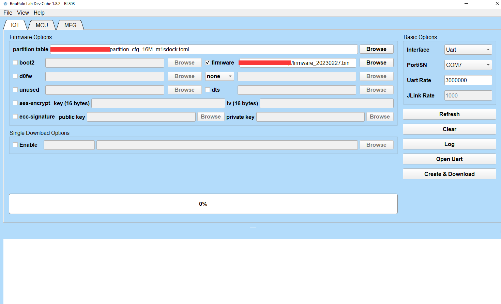

### 代码修改

打开例程路径 `M1s_BL808_example/c906_app/camera_streaming_through_wifi` 中的 `main.c` 文件。

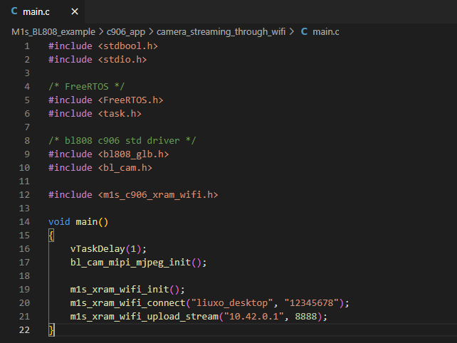

注意到里面的 `m1s_xram_wifi_connect()` 和 `m1s_xram_wifi_upload_stream()` 函数。

- 手动将 `liuxo_desktop` 要连接到的 PC 已经连接上的网络，并且将 `12345678` 更改为目标网络的连接密码。
- 将 `10.42.0.1` 替换成 PC 所在目标网络中的 IP 地址。

比如在下面的示例中，PC 所在的名为 `Test` 网络中的 IP 为 `192.168.43.183`，并且名为 `Test` 的无线网络密码是 `testtest`。


编辑完 `main.c` 文件后记得保存一下。

### 固件编译和烧录

修改代码且保存后，根据上面的 [SDK 编译说明](https://wiki.sipeed.com/hardware/zh/maix/m1s/other/start.html#SDK-%E7%BC%96%E8%AF%91) 来编译 `camera_streaming_through_wifi` 这个例程。

将编译得到的 `d0fw.bin` 固件通过 U 盘烧录的方式来快速的烧入到 M1s Dock 里面，打开大号串口，按下板子上面的复位键。

在板子成功连接到网络后它会在大号串口打印出自己的 IP 信息，并且 `Socket connect` 表示正在等待 PC 端应答。

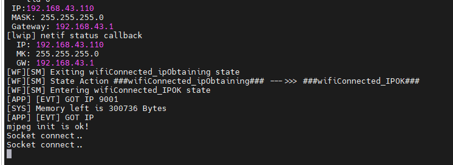

### PC 显示流

在 `M1s_BL808_example/c906_app/camera_streaming_through_wifi` 路径下，直接执行命令 `python3 main.py` 来使用 python 接收 M1s dock 的流并且调用 opencv 来显示画面。


### 注意事项

1. 确认自己对 M1s Dock 烧录了修复 bug 后的 [firmware_20230227.bin](https://dl.sipeed.com/shareURL/MAIX/M1s/M1s_Dock/7_Firmware/factory) 固件
2. 确定板子连接到了目标网络；成功连接到网络后板子的大号串口会显示出板卡的 IP 地址
3. 确定板子与 PC 在同一网络，且正确地修改了 `main.c` 中 PC 的 IPV4 地址

## Linux Demo

这是一个能在 M1s Dock 上能运行起来的简易 Linux Demo。

[点我](https://dl.sipeed.com/fileList/MAIX/M1s/M1s_Dock/7_Firmware/m1sdock_linux_20221116.zip) 下载 Linux 例子，按照压缩包里面 `steps.md` 操作步骤完成 Linux 系统烧录。


使用 `root` 登录


查看 CPU 信息
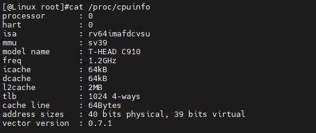

相关的 Linux SDK 前往 [github](https://github.com/sipeed/M1s_BL808_Linux_SDK) 查看。

## 使用 Jtag

可以在[淘宝店铺](https://sipeed.taobao.com/)购买到 Jtag 调试器来调试 M1s Dock.


### 连接设备

将 Jtag 插入到板子的 TF 卡槽中来连接设备。自弹式 TF 卡槽可以自动固定连接，尽量减少硬插拔避免 TF 卡槽损坏。

连接后的样式如下图所示。


调试器和 M1s Dock 的 UART 口都需要与电脑连接上（如上图，板子上的 UART 口和调试器都连接了电脑）；仅调试器连接电脑会因为需要给 M1s Dock 供电而导致调试器很烫，并且我们需要通过串口在 M1s Dock 上开启 Jtag 功能才能调试。

### 安装驱动

前往 [下载站](https://dl.sipeed.com/shareURL/MAIX/M1s/M1s_Dock/9_Driver/cklink) 下载适合自己电脑的驱动。

#### Windows

解压 `T-Head-DebugServer-windows` 压缩包后，运行解压后的 `Setup` 程序来安装驱动。

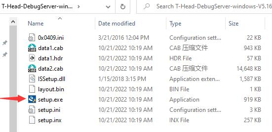

在确定安装目录界面，建议不要更改默认的安装位置。避免因错误安装到根目录后，卸载该程序导致全盘清空的悲剧。


全部都安装，避免以后还需要别的组件。


安装结束后，连接上了调试器的话可以在设备管理器中看到有 `CKlink-Lite`。


桌面上有一个调试软件的图标。


#### Linux

获得驱动：[点我](https://dl.sipeed.com/shareURL/MAIX/M1s/M1s_Dock/9_Driver/cklink)


解压所下载的压缩文件。

```bash
tar xvf T-Head-DebugServer*
```

然后当前目录下会多出一个脚本文件。


执行一下脚本，会显示说明，可以知道在脚本后面加上 `-i` 会安装软件，加上 `-u` 会卸载软件。

```
./T-Head-DebugServer-linux-x86_64-V5.16.5-20221021.sh
```


开始安装驱动：

```
sudo ./T-Head-DebugServer-linux-x86_64-V5.16.5-20221021.sh -i
```


上图中有两处是我们手动输入的 `yes` ，在 `Set full installing path` 处直接回车确认的话它会被安装到默认路径下，有需要的话自己指定一下安装路径。

安装完后使用 `lsusb` 可以查看到 `CKlink-Lite` 设备。


### 调试设备

在调试设备前，我们需要先通过 M1s Dock 上面的大号串口来操作板子，开启板子的调试功能。


从上面可以看到有两个 jtag 选项，执行 `jtag_cpu0` 就会对 C906 核心进行调试，执行 `jtag_m0` 就是对 E907 核心进行调试。


#### Windows

运行前面安装驱动后在桌面上的 T-HeadDebugServer 程序，出现下面的提示的话说明没有连接上设备，可以自己检查：

- 确定已经在串口里面使能了核心的 jtag 调试
- 设备管理器里面的 `CKlink-Lite` 设备，没有的话检查核心板与电脑的连接情况或者重新安装驱动
- 调试器已经被其他 T-HeadDebugServer 程序打开


点击下图箭头指向的 三角标志 可以连接设备：


出现下图所示的 Failed 的话说明连接失败，端口不可用，可以自己设置端口来连接设备。


选择 Socket Setting，设置合适的端口。


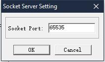

成功连接上的话箭头所指的地方会从 三角形 变成 圆形。


到这里已经完成连接了，上面的图里是使用 `jtag_m0` 命令来调试 E907 核心，需要的话可以使用 `jtag_cpu0` 命令更改成调试 C906 核心。

接下来就可以用 gdb 等工具来调试了。


此外，在调试工具的安装目录下，有命令行程序 `DebugServerConsole`。

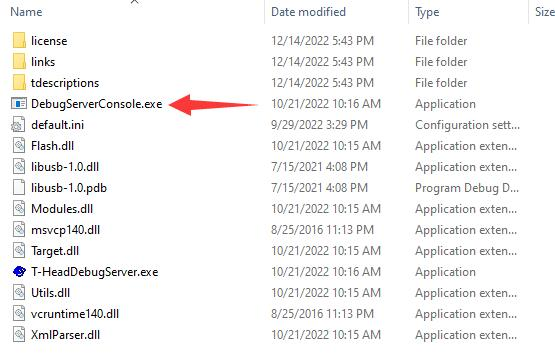

使用命令行执行可以看到用法并且操作它。

```bash
.\DebugServerConsole.exe -h
```


```bash
.\DebugServerConsole.exe -port 65535
```


就可以通过 65535 端口来调试了。

#### Linux

使用 `DebugServerConsole -h` 可以查看使用帮助。


在命令行运行命令后，可以通过 12345 端口来调试了。

```bash
DebugServerConsole -port 12345
```

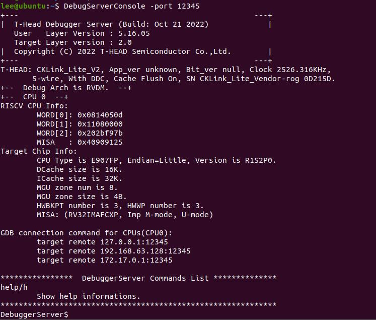

## blai npu

### 支持算子

<table>
<thead>
<tr>
  <th>Type</th>
  <th>Operators</th>
  <th>Applicable Subset Spec.</th>
  <th>Processor</th>
</tr>
</thead>
<tbody>
<tr>
  <td rowspan="10">Convolution</td>
  <td rowspan="4">Conv </td>
  <td>Kernel: 1x1,3x3,5x5,7x7</td>
  <td rowspan="4">:strong:<code>NPU</code></td>
</tr>
<tr>
  <td>Stride: 1x1, 2x2</td>
</tr>
<tr>
  <td>Dilation: 1x1, 2x2</td>
</tr>
<tr>
  <td>Pad: same</td>
</tr>
<tr>
  <td rowspan="4">Depthwise Conv</td>
  <td>Kernel: 1x1,3x3 (5x5, 7x7 TBD)</td>
  <td rowspan="4">:strong:<code>NPU</code></td>
</tr>
<tr>
  <td>Stride: 1x1, 2x2</td>
</tr>
<tr>
  <td>Dilation: 1x1 (2x2 TBD)</td>
</tr>
<tr>
  <td>Pad: same</td>
</tr>
<tr>
  <td rowspan="2">Transpose Conv</td>
  <td>Kernel: 3x3</td>
  <td rowspan="2">strong:<code>NPU</code></td>
</tr>
<tr>
  <td>Stride: 2x2</td>
</tr>
<tr>
  <td rowspan="4">Pooling</td>
  <td rowspan="2">MaxPool (NPU TBD)</td>
  <td>Kerenl: 2x2</td>
  <td rowspan="2">DSP</td>
</tr>
<tr>
  <td>Stride: 2x2</td>
</tr>
<tr>
  <td rowspan="2">MaxPool</td>
  <td>Kerenl: 3x3</td>
  <td rowspan="2">:strong:<code>NPU</code></td>
</tr>
<tr>
  <td>Stride: 1x1, 2x2</td>
</tr>
<tr>
  <td rowspan="2">Activation</td>
  <td>Relu</td>
  <td></td>
  <td>:strong:<code>NPU</code></td>
</tr>
<tr>
  <td>Relu 6</td>
  <td></td>
  <td>:strong:<code>NPU</code></td>
</tr>
<tr>
  <td rowspan="5">Other processing</td>
  <td>BatchNormalization</td>
  <td>fused with conv</td>
  <td>:strong:<code>NPU</code></td>
</tr>
<tr>
  <td>Add (shortcut)</td>
  <td></td>
  <td>:strong:<code>NPU</code></td>
</tr>
<tr>
  <td>Concat (route)</td>
  <td>Channel wise (AXIS 3 in BHWC)</td>
  <td>:strong:<code>NPU</code></td>
</tr>
<tr>
  <td>Fully Connected</td>
  <td></td>
  <td>:strong:<code>NPU</code></td>
</tr>
<tr>
  <td>Upsample</td>
  <td>Nearest</td>
  <td>:strong:<code>NPU</code></td>
</tr>
</tbody>
</table>

### blai_mnist_demo

编译之后使用 U 盘拖拽烧录的方法将编译出来的[固件](https://dl.sipeed.com/shareURL/MAIX/M1s/M1s_Dock/7_Firmware/demo_bin/blai_mnist_demo)烧录进板子。前面说过编译出来的固件名称都是 `d0fw.bin`，且位于 `M1s_BL808_example/c906_app/built_out` 文件夹下。

```
#c906_app
./build.sh blai_mnist_demo
```


烧录进去后（U 盘自动弹出就表示烧录完成）按下 RST 按键复位芯片来重新加载固件，此时查看通过串口号较小的串口（记住波特率为 2000000）查看会发现提示加载模型失败。


因此我们要将模型上传到模型，从源码中可以看到对于这个 demo 我们要将模型存放到 flash 中。


然后将板子的 OTG 口与电脑连接的话会看到一个大小为 7M 的 U 盘。


按照源码的要求把文件存进去：在 U 盘里新建一个 models 文件夹，然后将 [mnist.blai](https://dl.sipeed.com/shareURL/MAIX/M1s/M1s_Dock/7_Firmware/demo_bin/blai_mnist_demo) 模型文件存放进去。

```bash
models
└── mnist.blai
```


按下板子上的复位键(RST)，复位板卡程序来使板卡重新加载模型。

小号串口显示模型加载成功，并且显示板子识别数字结果。板子屏幕显示摄像头捕获到的画面，且也显示识别结果。


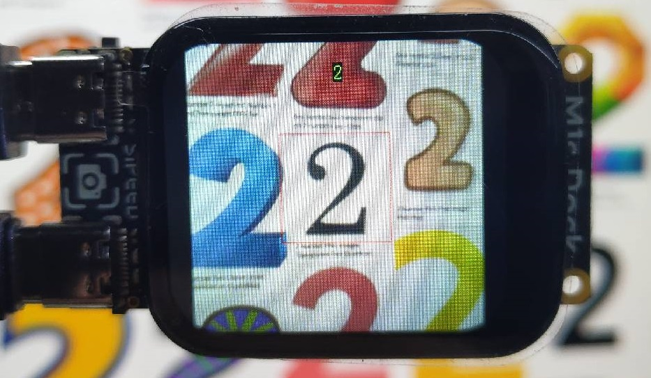

### tom_and_jerry_classification_demo

这是一个在 [MaixHub](https://maixhub.com/model/zoo/127) 上可下载的模型文件，我们可以在这个网站直接上传数据集、标注和生成模型文件再部署到板卡上，这里叙述一下怎么样将在 [MaixHub](https://maixhub.com/) 所下载的模型部署到 M1s Dock 上。

首先根据前面搭建 SDK 环境所描述的内容，编译出 [tom_and_jerry_classification_demo](https://dl.sipeed.com/fileList/MAIX/M1s/M1s_Dock/7_Firmware/demo_bin/tom_and_jerry_classification_demo.bin) 这个例程固件。

```
#c906_app
./build.sh tom_and_jerry_classification_demo
```

然后通过 U 盘拖拽烧录的方法将编译出来的固件烧录进板子。


在 tom_and_jerry_classification_demo 里面的 `main.c` 源码中可以所加载的模型在 Flash 里面的 models 文件夹里面，且模型名称为 `tj.blai`。


所以我们在 [MaixHub](https://maixhub.com/model/zoo/127) 下载到这个例程模型后，解压并将里面拓展名为 `.blai` 的文件重命名为 `tj.blai`。


然后将板子的 OTG 口与电脑连接的话会看到一个大小为 7M 的 U 盘。


按照源码要求把上面重命名后所得到的 `tj.blai` 文件存放到 U 盘的 models 文件夹下：在 U 盘里新建一个 models 文件夹，然后将 `tj.blai` 这个模型文件存放进所创建的 models 文件夹中 。


然后就可以使用 M1S Dock 来分辨 Tom 和 Jerry 了。


因为模型文件比较大，所以识别略有压力。

## 常见解答

### 板子上为什么有一个额外的 BL702 芯片

BL702 芯片在这里担任着 USB 转双串口芯片功能。

因此有时候串口异常的话，可以上电前按住 BOOT 按键来给 BL702 重新烧录一下 USB 转双串口的固件。

### 为什么要用双串口

根据 BL808 的手册可以知道里面有三颗核心，双串口分别连接到了其中的两颗核心，可以自己体验异构核心的执行顺序。

### 为什么用虚拟 U 盘

虚拟 U 盘是基于固件出来的，目的是方便用户快速烧录体验 Demo。

把 BL808 里面的全部固件擦除后，就不会再有虚拟 U 盘了。

想要再次使用虚拟 U 盘的话，按照文档重新使用串口烧录的方法重新烧录一下默认的固件就行了。

### 为什么要说明串口烧录

虚拟 U 盘是基于固件的，想要烧录这个固件就必须有一种烧录方式将它烧录进板子。

这里我们用串口烧录的方法来烧录最基础的固件到芯片里面的 FLASH 中。

### 怎么样擦除 bl808 的固件

擦除固件需要使用到 [Bouffalo Lab Dev Cube](https://dev.bouffalolab.com/download) 这款软件，在打开软件后选择 BL808 芯片型号。


首先在软件里面点开高级模式


选择 FLASH 界面然后使板子进入下载模式（按住板子上的 BOOT 键和 RST 键， 然后先松开 RST 键再松开 BOOT 键），选择串口号较大的串口，勾选 Whole Chip，点击 `Erase Flash` 开始擦除。


擦除的时候没有进度条，擦除完成的时候会直接显示 SUCCESS。


### 烧录 BL808 时候提示 BFLB IMG LOAD SHAKEHAND FAIL

这种情况是板子的 bl808 没有进入下载模式，确定自己在板子在运行时（已经通电）自己同时按下 RST 按键和 BOOT 按键，然后先松开 RST 键后松开 BOOT 键来时 bl808 进入下载模式。


并且确定自己在下载的时候选择的是串口号大的那一个串口，而不是小号串口。


### 烧录 BL808 时候只看到一个串口

这种情况是进入了板载 bl702 下载模式。需要注意的是不应该按住 BOOT 键然后给板子通电，这样会进入 bl702 的下载模式，只有一个串口显示在电脑中。给 bl808 通过串口烧录是在板子通电后，同时按下 RST 按键和 BOOT 按键，然后先松开 RST 键后松开 BOOT 键来时 bl808 进入下载模式。


### 烧录 BL808 时候没有串口设备

确定自己连接的是板子上的 UART 接口，换一根数据线或者连接电脑另一个 USB 口。


### 烧录 BL808 时候只想要烧录单个固件

在烧录工具软件中，首次烧录要求将 `partition table`, `boot2`, `firmware`, `d0fw` 文件都勾选上并烧录进板子，以后如果想要烧录由 SDK 编译出来的单个固件，在对应的烧录选项中选择编译出来的文件就行：
`firmware` 选择由 e907_demo 编译出来的最终固件。
`d0fw` 选择由 c906_demo 编译出来的最终固件。

`partition table` 和 `boot2` 每次烧录都要勾选中。

<table>
<tr>
  <td>烧录 c906_demo 固件</td>
  <td>烧录 e907_demo 固件</td>
</tr>
<tr>
  <td></td>
  <td></td>
</tr>
</table>

### 编译 SDK 相关的常见问题

1. 执行完 build.sh 后提示 `Makefile:14: *** BL_SDK_PATH not found, please enter: export BL_SDK_PATH={sdk_path}.  Stop.`，查看 [配置编译工具链路径](#配置编译工具链路径) 来配置自己的 BL_SDK_PATH。

2. 编译出错

    注意编译的时候使用的命令为 `./build.sh demo_name`，比如  `./build.sh hello_world`，而不是 `./build.sh hello_world/` （注意最后面的路径符号`/`）

### 给板载 bl702 进行烧录

一般来说板子串口出问题才进行这里的烧录。

按住 BOOT 键后冷启动板子，就可以通过 UART 口烧录板载 bl702 了。

在给板子通电前按住板子上的 BOOT 按键，然后通过板子上的 UART USB 接口连接电脑，此时板载 bl702 进入下载模式，打开 `BLDevCube` 烧录软件（根据自己系统选择），选择 `BL702` 芯片，在打开的软件界面选择 MCU 模式，接着可以在 [这里](https://dl.sipeed.com/shareURL/MAIX/M1s/M1s_Dock/7_Firmware) 下载到 bl702 的固件，名称为 `usb2dualuart_bl702` 开头的就是我们需要烧录的文件。

<table>
    <tr>
        <td></td>    
        <td></td>
    </tr>
</table>

点击 `Refresh`，选择唯一的串口（如果看到的不是唯一串口，记住是先按住 BOOT 键，再给板子通电），设置波特率 2000000， 点击下载烧录。


烧录结束后，重新插拔一次 USB 来重新启动 bl702 以应用新的固件。


### 给 bl702 烧录时没有串口

如果没有出现，就需要确认自己是在板子未通电的时候按住板子上的 BOOT 键后再通过板子上的 UART 接口来给板子通电。

Windows 用户可以在设备管理器中先查看一下有没有一个 `Bouffalo CDC` 设备。

Windows 10 以下的系统不会自动加载 USB CDC 驱动，需要自己手动搜索 `Windows7 CDC` 相关的问题解决。

