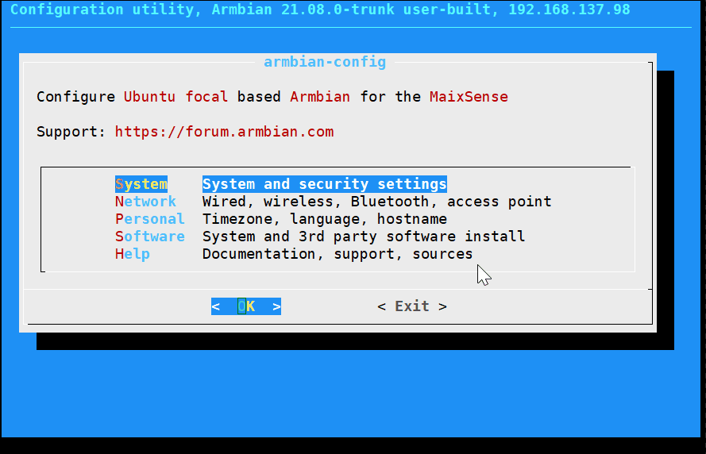
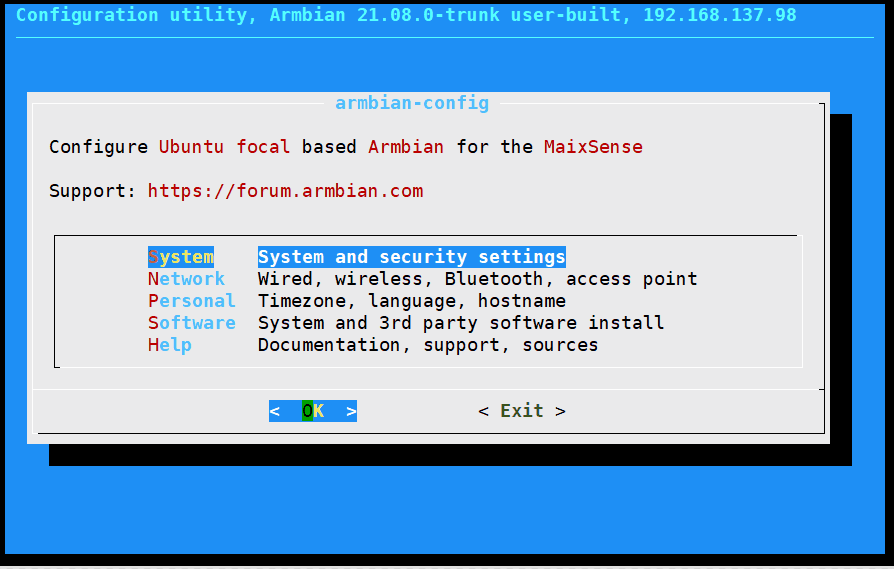

# Armbian 配置及使用

> 编辑于2022年8月10日

## 扩容系统

进行完前面的 [配置系统](./config_system.md) 后，

- 使用前先执行一下 `/usr/lib/armbian/armbian-resize-filesystem start` 命令来扩容一下系统大小，会花费一下时间；执行时不要强行退出，执行完毕后会自动退回到终端

## 配置网络

我们使用 `nmtui` 命令来配置 wifi


## 新建用户

一般来说不使用root来登录linux系统，因为这样很容易把系统玩崩了。
因此新建一个用户来避免一直使用root账户来进行操作。

```bash
adduser xxx                                             # 添加用户名为 xxx 的用户

# ...                                                   # 省略一些 log

New password:                                           # 新建用户密码
Retype new password:                                    # 重新输入密码

# ...                                                   # 省略一些 log

Enter the new value, or press ENTER for the default     # 添加信息，或者直接按 ENTER 选择默认信息

# ...                                                   # 按五次 enter 选择默认即可

Is the information correct? [Y/n] y                     # 输入 y 完成创建

```

到这里我们就已经成功创建名称为 xxx 的用户了

### 授予管理员权限

有时候用户需要使用到管理员权限，下面内容就是授予用户管理员权限.首先编辑相关文件

```bash
sudo nano /etc/sudoers                                   # 修改 /etc/sudoers 文件。编辑器个人喜好
```

在文件里找到下面的内容

```vim
# User privilege specification
root    ALL=(ALL:ALL) ALL

```

在里面添加上（其中xxx是你之前添加的用户名）

```vim
# User privilege specification
root    ALL=(ALL:ALL) ALL
xxx     ALL=(ALL:ALL) ALL           

```

接着保存后退出即可。

## 安装程序

这里我们使用安装 `armbian-config` 为例。直接执行下面的命令即可

```bash
sudo apt install armbian-config -y  # 使用root权限来运行apt应用的install命令来安装armbian-config且默认全都是通过
```

## 设置时区

命令行中输入`armbian-config`，选中Personal，再选择Timezone -> Asia ->Shanghai设置上海时间（Debian中没有北京时间），按住TAB键切换到ok，保存即可。		



## 设置中文显示

命令行中输入`armbian-config`，选中Personal -> Locales -> 下滑到最下面，空格选中zh.GBK和zh.UTF-8,，然后勾选zh_CN.UTF8设置为系统默认语言，按住TAB键切换到ok，保存，exit退出，下载中文字体，`apt-get install fonts-wqy-zenhei`，重启后系统环境就变成中文的了。


## 配置蓝牙

打开`armbian-config`，选中Network，选择BTinstall安装蓝牙支持包。



可以使用Xftp传输，安装完毕后断电重启即可。

然后就可以使用Bluetoothctl配置蓝牙。

<html>
<details>
  <summary><font color="#4F84FF">点开查看常用命令</font></summary>
    <pre  class="line-numbers language-bash">
devices                     列出活动的蓝牙设备
paired-devices              列出已配对蓝牙设备
pairable &lt;on/off&gt;           是否允许配对
discoverable &lt;on/off&gt;       是否允许被发现
discoverable-timeout [value]设置暴露时间
pair [dev]                  配对设备
trust [dev]                 信任设备
untrust [dev]               取消设备信任
remove &lt;dev&gt;                移除设备
connect &lt;dev&gt;               连接设备
disconnect [dev]            断开设备连接                      
quit                        退出
help                        查看帮助
</pre>
</details>
</html>

### 连接蓝牙设备

使用`bluetoothctl`连接蓝牙设备。

```bash
scan on             #扫描设备
scan off            #停止扫描
trust XX:XX:XX:XX   #信任设备
pair XX:XX:XX:XX    #配对设备
connect XX:XX:XX:XX #连接设备
```


### 设置蓝牙音频输入/输出

启用蓝牙音频前，需要先安装 `pulseaudio` 即及蓝牙组件

```bash
sudo apt install pulseaudio
sudo apt install pulseaudio-module-bluetooth
```

然后使用pactl查看是否有蓝牙输出设备

```bash
pactl list short sinks
```

切换音频输出到蓝牙

```bash
pactl set-default-sink <dev>
```

log如下：

```bash
maixsense:~:# apt install pulseaudio
maixsense:~:# apt install pulseaudio-module-bluetooth
maixsense:~:# pactl list short sinks
0	alsa_output.platform-7032000.codec.stereo-fallback	module-alsa-card.c	s16le 2ch 44100Hz	SUSPENDED
2	bluez_sink.00_26_04_00_73_B1.a2dp_sink	module-bluez5-device.c	s16le 2ch 44100Hz	SUSPENDED
maixsense:~:# pactl set-default-sink 2 
```


然后就可以播放音频到蓝牙设备，或者通过蓝牙连接手机当作蓝牙音箱使用。

## 配置音量

`alsamixer`


<html>
<details>
  <summary><font color="#4F84FF">点开查看常用命令</font></summary>
    <pre>
------------------- Help-----------------------
xxEsc        离开                             ▒x
xxF1 ? H     帮助                             ▒x
xxF2 /       系统信息                         ▒x
xxF3         回放控制                         ▒x
xxF4         捕获控制                         ▒x
xxF5         所有控制                         ▒x
xxTab        切换显示模式                     ▒x
xxF6 S       选择声卡                         ▒x
xxL          刷新屏幕                         ▒x
xxLeft       移动到上一个的控制               ▒x
xxRight      移动到下一个的控制               ▒x
xxUp/Down    改变音量                         ▒x
xx+ -        改变音量                         ▒x
xxPage Up/Dn 大幅改变音量                     ▒x
xxEnd        设置音量为0                      ▒x
xx0-9        从0到9依次设置音量               ▒x
xxQ W E      增加 左/全部/右声道音量          ▒x
xxZ X C      减少 左/全部/右声道音量          ▒x
xxB          左右声道平衡                     ▒x
xxM          切换静音                         ▒x
x< >         切换左/右静音                    ▒x
xxSpace      切换捕获                         ▒x
xx; '        切换左/右捕获                    ▒x
-----------------------------------------------
</pre>
</details>
</html>

如果需要控制蓝牙设备音量，需要使用`pactl` ，并且`pcatl`也支持控制声卡，所以推荐使用此app控制音量。

```bash
##查看输入/输出设备索引
pactl list short sources/sinks
##设置输入/输出音量
pactl set-source/sink-volume index volume
pactl set-default-source/sink
##设置默认输入/输出
```

示例，设置蓝牙耳机为输出设备，音量为10%,然后增加20%，最后减少30%

```bash
maixsense:~:# pactl list short sinks
0	alsa_output.platform-7032000.codec.stereo-fallback	module-alsa-card.c	s16le 2ch 44100Hz	SUSPENDED
2	bluez_sink.00_26_04_00_73_B1.a2dp_sink	module-bluez5-device.c	s16le 2ch 44100Hz	RUNNING
##蓝牙设备一般为bluez_sink
maixsense:~:# pactl set-default-sink 2
maixsense:~:# pactl set-sink-volume 2 10%  
maixsense:~:# pactl set-sink-volume 2 +8192  
maixsense:~:# pactl set-sink-volume 2 -0x3000
##可选 百分比，十进制数，十六进制数控制，效果相同，并且可以超过100%
```

## 媒体播放

媒体播放常用 mplayer

- 下载mplayer 
  
> sudo apt install mplayer

接着我们需要把想要播放的文件传到板子上。

文件可以在[下载站](https://dl.sipeed.com/shareURL/MaixII/MaixII-Dock/example)获取到下面的示例文件

这里可以用最初提到过的 [mobaxterm](../M2/tools/mobaxterm.md) 软件来使用无线网络把文件传输到板子上。
  
- 然后执行 `sudo mplayer badapple_240_60fps.mp4 -vo fbdev2` 来播放视频
- 或者`sudo mplayer Short.mp3` 播放音频

退出的话使用 `Ctrl+C` 即可。

也在后面加上`< /dev/null > /dev/null 2>1 &`以便在后台播放

```bash
mplayer badapple_240_60fps.mp4 -vo fbdev2  < /dev/null > /dev/null 2>1 &
```

上面的指令是在后台播放的。想要停止的话可以先使用 `fg` 命令来切换到任务，再用 `Ctrl+C` 来终止程序


如果没播放成功的话，尝试增加设备音量（前文提过alsamixer）或者确认一下文件路径是否正确

## 编写c代码

一般命令行都是用 vim 来作为编辑器。有兴趣的可以额外学习一下这款强大的编辑器

如果提示没有安装 vim 的话，可以使用命令 `sudo apt install vim -y` 来安装。

```bash
vim helloworld.c  #使用 vim 创建一个文件并打开
i                 #在vim中这个指令的意思是输入，之后就可以敲代码了
```
可以将下面的代码输入到刚刚新创建的文件中
```c
#include <stdio.h>
int main()
{
    printf("Hello, world\n");
    return 0;
}
```
输完上面的代码后需要按下 esc 键来退出编辑模式
就这再输入 `:wq` 来保存文件且退出vim
```bash
gcc hello.c -o hello.o #编译C文件
./hello.o              #运行编译出来的C文件
```


## 编写python代码

- 详细解释看上面的C代码样例
```bash
vim helloworld.py       #新建一个python文件并且用vim打开
i
print("hello world!\n")
esc
:wq
python3 helloworld.py
```


## 使用python点亮第一个灯

安装GPIO的python支持库

```bash
pip install gpiod
```

把led正极插入PH5,负极插入GND

创建文件

``` bash
vim led.py
```

复制代码进去

```python
import time
import gpiod as gpio
PH_BASE = (8-1)*32 # "PH"
gpiochip1 = gpio.chip("gpiochip1")
led = gpiochip1.get_line((PH_BASE + 5)) # "PH5"
config = gpio.line_request()
config.request_type = gpio.line_request.DIRECTION_OUTPUT
led.request(config)

while led:
    led.set_value(0)
    time.sleep(1)
    print("led on")
    led.set_value(1)
    time.sleep(1)
    print("led off")
```

执行代码

 ```bash
 python3 led.py
 ```

效果如下：


## 设置开机启动

启用开机自启动脚本

```bash
vim /lib/systemd/system/rc-local.service
```

在最后面添加

```bash
[Install]
WantedBy=multi-user.target
Alias=rc.local.service
```

编辑自启动脚本

 ```bash
 vim /etc/rc.local
 ```

在`exit 0`前面添加需要启动的服务

然后重启即可

注意，此脚本会在用户登录前执行，执行日志如下

```bash
[  OK  ] Finished Permit User Sessions.
[  38.569457] rc.local[1322]: hello world!
```

## 更多的使用方法
请到[MaixPy3](/soft/maixpy3/zh/readme.md)和[极术社区](https://aijishu.com/a/1060000000221780)中自行查看