基于上文的上手指引后，本文介绍使用 Maix-III AXera-Pi 开发板的 Linux debian11 系统基础使用方法。

## 系统登录
### 登录工具

这里介绍相关使用的终端登录工具，分别是：`MobaXterm`、`electerm`、`vscode remote`。

- **MobaXterm 介绍**

MobaXterm 是在 Windows 下使用的全能终端管理软件，而 Linux 系统可以使用 ssh 远程被操作，使用 MobaXterm 进行 ssh 登陆板子直接编辑板内的代码或执行命令，也能方便的拖拽文件上传或下载到电脑里，类似的工具还有 vscode remote 远程登录 linux 服务器。


下载链接：[点击跳转](https://mobaxterm.mobatek.net/download.html) 分别付费与免费双版本，下载免费版本即可。
使用教程：[如何使用 MobaXterm](https://wiki.sipeed.com/hardware/zh/maixII/M2/tools/mobaxterm.html?highlight=ssh)

- **electerm 介绍**

electerm 是一个基于 `electron/ssh2/node-pty/xterm/antd/useProxy` 等开源组件开发，支持跨平台的 `Terminal/SSH/SFTP` 客户端工具，同时支持 `Linux、MacOS、Windows` 等多种操作系统，它既可以作为终端工具来使用，还能传输文件并自带中文界面，更加满足用户日常对终端的需求。

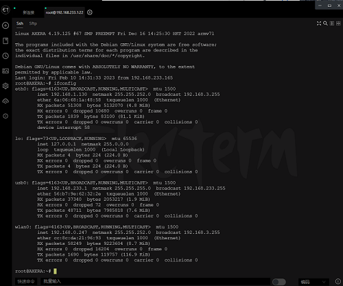

下载链接：[点击跳转](https://electerm.html5beta.com/) 根据操作系统来下载相对应的版本即可。

- **vscode remote 介绍**

vscode remote 是 vscode 的一个插件，可以直接连接到远程的 linux 服务器，然后在本地编辑代码，同步到远程服务器上编译运行，这里以一台 Windows 10 的桌面计算机系统为例，只要能安装 vscode 编辑器软件计算机都行。

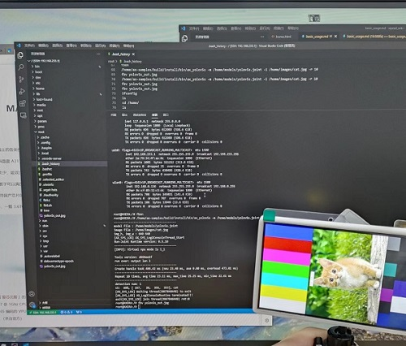

下载连接：[点击跳转](https://code.visualstudio.com/)
连接教程：[如何使用 vscode remote 连接板子](https://wiki.sipeed.com/hardware/zh/maixIII/ax-pi/dev_prepare.html?highlight=ssh#vscode-remote)

### 登录方式

Maix-III AXera-Pi 开发板的 Linux debian11 系统默认使用 root 用户登录。
用户名为 `root`，密码为 `root`，目前板子接入电脑端上电启动后支持以下登录 Linux 系统方式。

#### 有线 串口 serial 登陆

> 使用串口 serial 登陆前需安装 tty 转 USB 串口驱动

**Linux**：系统本身自带无需再装驱动，使用 `ls /dev/ttyUSB*` 即可看到设备号。

**Windows**：直接[点击下载 CH340 驱动](https://api.dl.sipeed.com/fileList/MAIX/tools/ch340_ch341_driver/CH341SER.EXE)安装，安装后可在`设备管理器`查看串口设备。

.. details::点此展开查看 CH340 驱动安装
    先打开设备管理器查看是否有 **CH340** 驱动，如无驱动的话请点击上方链接进行下载。
    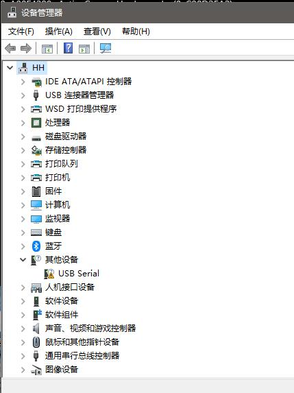
    下载完成后，右键点击文件，选择**以管理员身份运行(A)**即会自动安装。
    
    安装完成，可在设备管理器端口处查看设备。

>[有些同学会遇到 Ubuntu22.04 CH340系列串口驱动（没有ttyUSB）问题，点此查看解决方案。](https://blog.csdn.net/qq_27865227/article/details/125538516)

.. details::点此展开查看 USB UART 接口示意图

    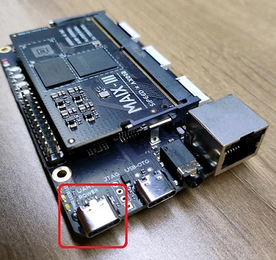

使用 usb 3.0 线连接板子上的 USB UART 接入电脑端，使用前请安装上文的驱动，再使用 MobaXterm 即可连接，默认串口配置为 115200、8N1（波特率115200，8位数据，无奇偶校验，1位停止位）。

**serial 登陆教程**：[点击查看](https://wiki.sipeed.com/hardware/zh/maixII/M2/tools/mobaxterm.html?highlight=ssh#%E8%BF%9E%E6%8E%A5-%E4%B8%B2%E5%8F%A3%28Serial%29)
成功连接后会打印大量调试信息，会弹出登陆账号信息，输入用户名及密码即可登陆。

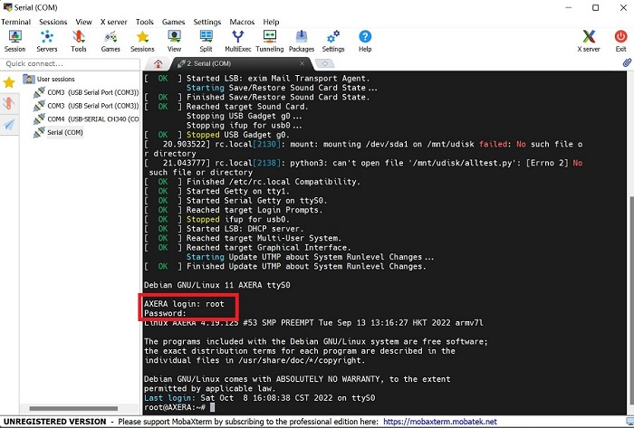

> 串口通常只提供给专业的驱动开发工程师调试用，会打印大量的调试信息，如感到不适请使用 **ssh** 登陆。

#### 基于 ip + ssh 登录

> 登录前需安装 **rndis usb** 网卡驱动

一般情况下 rndis usb 网卡驱动在 Linux 下可不用安装，在 Windows 下需要按下图手动安装系统自带驱动，而 macos 需要编译安装驱动（horndis），Windows 还需要配置一下网络优先级，勾选微软 rndis 驱动后设置网络跃点数调整优先级。

**Windows 配置网络优先级**：[设置网络跃点数调整优先级](https://jingyan.baidu.com/article/358570f6bc5cfdce4724fca2.html)

这里举例如何在 Win10 安装系统自带的 rndis 驱动，在 Linux 上免驱动自动识别 rndis 驱动，MacOS 安装可以参考这篇 [【AXPI】如何在 M1/M2 Mac上使用 Rndis](https://zhuanlan.zhihu.com/p/593627641) 。

.. details::点此展开查看 Win10 驱动安装过程

    打开设备管理器找到其他设备，选中 rndis 选择更新驱动程序，在如何搜索设备软件窗口中，选择**浏览计算机查找驱动程序软件（R）**。

    
    再选择**从计算机的设备驱动程序列表中选择（L）**在硬件设备列表中往下拉，找到**网络适配器**，选中**下一步**。

    
    在厂商列表中选择 **Microsoft**，右侧列表中选择 **USB RNDIS Adapter**。

    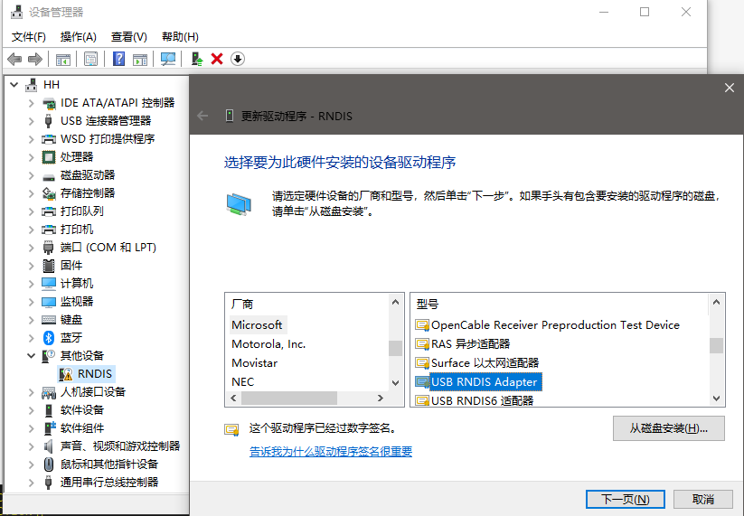

    点击下一步等待安装即可。

.. details::点此展开查看 USB OTG 接口示意图

    

系统默认开启了 usb rndis 虚拟以太网，用户可通过板载 USB OTG 口连接 usb0 网卡的 IP `192.168.233.1` 进行 ssh 登录操作。使用 ssh 登录前需要先登陆板子通过 `ifconfig -a` 命令得到板子 IP 后再使用 IP 进行 ssh 登录上 Linux 系统，下图的 IP 地址（除 `127.0.0.1` 外）都能登陆板子。

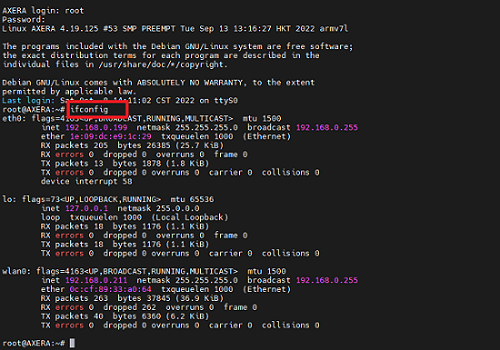

**ssh 连接教程**：[点击跳转](https://wiki.sipeed.com/hardware/zh/maixII/M2/tools/mobaxterm.html?highlight=ssh#%E8%BF%9E%E6%8E%A5-SSH)
按教程示例新建 ssh 会话，双击会话后会有提醒输入账号及密码，输入后按回车即可连接。


### 登录后

登录后，可以使用 `ls` 命令查看当前目录下的文件，使用 `cd` 命令切换目录，使用 `pwd` 命令查看当前目录。

## 网络配置

### 网络操作基础

- **使用 ping baidu.com 测试网络**

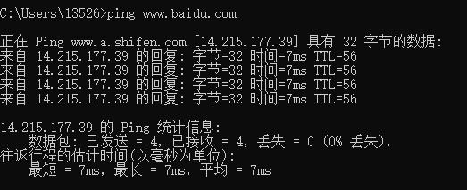

- **使用 ifconfig -a 查看所有网卡情况**

Maix-III AXera-Pi 开发板的 Linux 系统默认使用 DHCP 协议获取 IP 地址，可以使用命令行 `ifconfig -a` 查看当前网络配置，板子根据下述会配置四种网卡类型。


```bash
root@AXERA:~# cat /etc/network/interfaces
# interfaces(5) file used by ifup(8) and ifdown(8)
# Include files from /etc/network/interfaces.d:
source /etc/network/interfaces.d/*

auto lo
iface lo inet loopback

# auto eth0
allow-hotplug eth0
iface eth0 inet dhcp

# auto usb0
allow-hotplug usb0
iface usb0 inet static
address 192.168.233.1
netmask 255.255.255.0

# allow-hotplug wlan0
# wpa-ssid "dalaoshu"
# wpa-psk "junhuanchen"
auto wlan0
iface wlan0 inet manual
wpa-conf /boot/wpa_supplicant.conf
iface wlan0 inet dhcp
```

可以使用命令行 `ifconfig -a` 查看所有网卡信息。

```bash
root@AXERA:~# ifconfig -a
eth0: flags=4163<UP,BROADCAST,RUNNING,MULTICAST>  mtu 1500
        inet 192.168.0.77  netmask 255.255.255.0  broadcast 192.168.0.255
        ether 1e:09:dc:e9:1c:29  txqueuelen 1000  (Ethernet)
        RX packets 301  bytes 41433 (40.4 KiB)
        RX errors 0  dropped 0  overruns 0  frame 0
        TX packets 31  bytes 2970 (2.9 KiB)
        TX errors 0  dropped 0 overruns 0  carrier 0  collisions 0
        device interrupt 56

lo: flags=73<UP,LOOPBACK,RUNNING>  mtu 65536
        inet 127.0.0.1  netmask 255.0.0.0
        loop  txqueuelen 1000  (Local Loopback)
        RX packets 16  bytes 1064 (1.0 KiB)
        RX errors 0  dropped 0  overruns 0  frame 0
        TX packets 16  bytes 1064 (1.0 KiB)
        TX errors 0  dropped 0 overruns 0  carrier 0  collisions 0

usb0: flags=4163<UP,BROADCAST,RUNNING,MULTICAST>  mtu 1500
        inet 192.168.233.1  netmask 255.255.255.0  broadcast 192.168.233.255
        ether 02:da:9b:e4:a8:7f  txqueuelen 1000  (Ethernet)
        RX packets 121  bytes 15220 (14.8 KiB)
        RX errors 0  dropped 15  overruns 0  frame 0
        TX packets 35  bytes 7258 (7.0 KiB)
        TX errors 0  dropped 0 overruns 0  carrier 0  collisions 0

wlan0: flags=4163<UP,BROADCAST,RUNNING,MULTICAST>  mtu 1500
        inet 192.168.0.112  netmask 255.255.255.0  broadcast 192.168.0.255
        ether 0c:cf:89:32:c5:c0  txqueuelen 1000  (Ethernet)
        RX packets 950  bytes 154305 (150.6 KiB)
        RX errors 0  dropped 950  overruns 0  frame 0
        TX packets 5  bytes 1398 (1.3 KiB)
        TX errors 0  dropped 0 overruns 0  carrier 0  collisions 0
```

- **使用 dhclient 触发 DHCP 获取 ip**

>这里以有线网卡（eth0）为例，decliient 还支持无线 WIFI（wlan0）.
使用上方 `ifconfig -a` 命令后，如果 eth0 的地址获取失败可使用 `dhclient eth0` 触发 DHCP 获取 IP。

```bash
root@AXERA:~# dhclient eth0 &
[1]+  Done                    dhclient eth0
root@AXERA:~# ifconfig eth0
wlan0: flags=4163<UP,BROADCAST,RUNNING,MULTICAST>  mtu 1500
        inet 192.168.0.136  netmask 255.255.255.0  broadcast 192.168.0.255
        ether 0c:cf:89:32:c5:dc  txqueuelen 1000  (Ethernet)
        RX packets 1284  bytes 157505 (153.8 KiB)
        RX errors 0  dropped 1274  overruns 0  frame 0
        TX packets 205  bytes 20798 (20.3 KiB)
        TX errors 0  dropped 0 overruns 0  carrier 0  collisions 0
```

### USB RNDIS（usb0）配置方法

可使用静态 IP 地址 `192.168.233.1` 这里已配置好 dhcp 服务了，从而避免用户需手动设置 IP 地址的操作。

> 使用 usb0 前需要安装 rndis 驱动，可点击[驱动安装过程](https://wiki.sipeed.com/hardware/zh/maixIII/ax-pi/basic_usage.html#%E5%9F%BA%E4%BA%8E-ip-%2B-ssh-%E7%99%BB%E5%BD%95)前往安装。

在 Windows 系统下如果遇到多个网卡时，发现 USB 网卡优于局域网导致内网网站访问很慢甚至失败，此时就需要通过 Win10 设置跃点数来调整网络优先级的连接顺序，去修改优先级改善访问慢的状态，数值越大优先级越低（比如设置 1000），从而把 USB 网卡优先级调至最低，可点击前往[配置网络优先级](https://jingyan.baidu.com/article/358570f6bc5cfdce4724fca2.html).

- **查看 usb0 网卡是否存在**

可通过 `ifconfig usb0` 命令查看 usb0 网卡或尝试 `ping 192.168.233.1` 是否能通。

```bash
root@AXERA:~# ifconfig usb0
usb0: flags=4099<UP,BROADCAST,MULTICAST>  mtu 1500
        inet 192.168.233.1  netmask 255.255.255.0  broadcast 192.168.233.255
        ether 16:37:cd:c6:f2:ae  txqueuelen 1000  (Ethernet)
        RX packets 0  bytes 0 (0.0 B)
        RX errors 0  dropped 0  overruns 0  frame 0
        TX packets 0  bytes 0 (0.0 B)
        TX errors 0  dropped 0 overruns 0  carrier 0  collisions 0
```

- **在 ping 通后 192.168.233.1 即可通过 usb 线登陆到板子**

USB 网卡会自动 DHCP 配置，直接连接 192.168.233.1 即可，连接方式可参考示意图。


### 有线以太网（eth0）配置方法

- **查看 eth0 网卡是否存在**

可使用 `dhclient eth0 &` 手动启动 DHCP 客户端获取 IP 地址，得到 ip 后使用 `ifconfig eth0` 命令查看当前网络配置。默认支持千兆网络，只需要开机前将网线插上去，在启动过程中就会自动配置并联网，可以通过 `apt update` 测试软件源更新。

```bash
root@AXERA:~# ifconfig
eth0: flags=4163<UP,BROADCAST,RUNNING,MULTICAST>  mtu 1500
        inet 192.168.0.77  netmask 255.255.255.0  broadcast 192.168.0.255
        ether 1e:09:dc:e9:1c:29  txqueuelen 1000  (Ethernet)
        RX packets 301  bytes 41433 (40.4 KiB)
        RX errors 0  dropped 0  overruns 0  frame 0
        TX packets 31  bytes 2970 (2.9 KiB)
        TX errors 0  dropped 0 overruns 0  carrier 0  collisions 0
        device interrupt 56
```

- **关于 eth0 地址相同的问题**

执行下述代码就会从 `/proc/ax_proc/uid` 读取 chip_id 写到 `/etc/network/interfaces` 的 eth0 配置里，该命令多次执行不受影响。

```
python3 -c "import os, binascii; os.system('sed -i \'/iface eth0 inet dhcp/ahwaddress ether {}\' /etc/network/interfaces'.format(binascii.hexlify(bytes.fromhex(open('/proc/ax_proc/uid').read().split('0x')[1][:-5]),':').decode('iso8859-1'))) if os.system('grep \'hwaddress ether\' /etc/network/interfaces -q') != 0 else exit();"
```

- **一些问题排除方法，如没有 ip 如何配置**

登录后无法获取以太网地址的话，可用上文命令启动 DHCP 客户端获取 IP 地址。
或者是使用 `ifdown eth0` 关闭网卡后再使用 `ifup eth0 --force` 启动手动配置 IP。

.. details::点此展开查看配置示例
    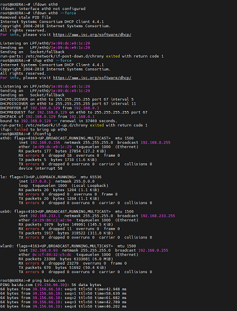


### 无线 WIFI （wlan0）配置方法

>**20230103** 后镜像更新以及不同硬件（rtl8189fs）WiFi 模组，相关的 `WiFi` 配置全部采用 `nmtui` 图形化或命令行进行联网。相关的硬件版本区分或出现 `wlan0` 不显示的情况都请移步[ Maix-III 系列 AXera-Pi 常见问题（FAQ）](https://wiki.sipeed.com/hardware/zh/maixIII/ax-pi/faq_axpi.html)查看。

- **查看 WIFI 网卡是否存在**

**wlan0**：无线网卡，使用 DHCP 协议获取 IP 地址，可使用命令 `ifconfig wlan0` 查看当前网络配置。

#### 使用命令行联网

>注意：新镜像（**20230103**）已提前配置好 `nmtui-connect` 直接可以根据下文进行联网。
>旧镜像使用前需先配置 `nmtui-connect` 才可使用，可点击前往[ 启动 nmtui-connect 图形化联网 ](https://wiki.sipeed.com/hardware/zh/maixIII/ax-pi/basic_usage.html#配置-nmtui-connect-使用图形化联网)查看。

用户修改以下命令行的 `账户密码` 直接在终端运行连接即可，系统会自动保存连接过的 WiFi 账户以及密码。

```bash
nmcli device wifi connect Sipeed_Guest password qwert123
# 示例
nmcli device wifi connect AXera-Pi password 11111111
# 改动 WiFi 名称以及 pssword 密码
```

.. details::点击查看修改示例图

    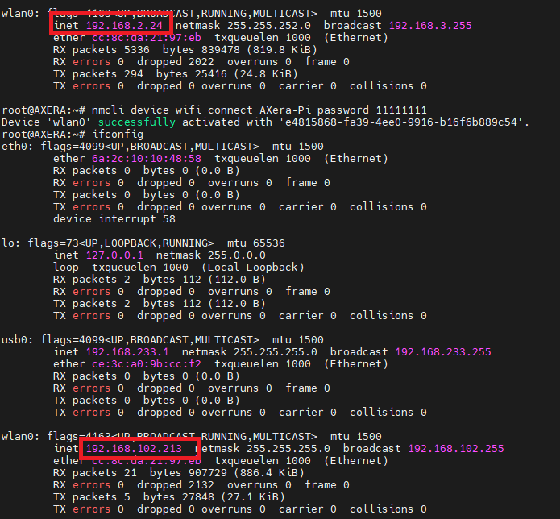

#### 使用 nmtui-connect 图形化联网

终端输入 `nmtui-connect` 打开可视化联网页面。页面会显示扫描到的 WiFi 信息，使用键盘的 **上下左右** 键选择要连接的 WiFi 按下 **回车** 键，页面提示输入 WiFi 密码，输完后选择 `OK` 并按 **回车** 键则会弹出页面，选择 `Quit` 按 **回车** 键退出，页面会显示 * 标变动代表联网完成。

<html>
  
  
</html>

#### nmtui-connect 图形化联网详解

系统已预置 NetworkManager 在 `nano /etc/NetworkManager/NetworkManager.conf` 里的 `managed=false` 修改成 `managed=true` 和注释掉 `/etc/network/interfaces` 里的有关于 `wlan0` 的配置（可以打开 `allow-hotplug wlan0` ）后「拔线断电重启」即可使用 `nmtui-connect` 进行联网，但原来的 `wpa_supplicant.conf` 里的配置会失效。

```
root@AXERA:~# cat /etc/network/interfaces
# interfaces(5) file used by ifup(8) and ifdown(8)
# Include files from /etc/network/interfaces.d:
source /etc/network/interfaces.d/*

auto lo
iface lo inet loopback

# auto eth0
allow-hotplug eth0
iface eth0 inet dhcp

# auto usb0
allow-hotplug usb0
iface usb0 inet static
address 192.168.233.1
netmask 255.255.255.0

allow-hotplug wlan0
# wpa-ssid "2.4G"
# wpa-psk "1qaz2wsx"

# auto wlan0
# iface wlan0 inet manual
# wpa-conf /boot/wpa_supplicant.conf
# iface wlan0 inet dhcp
```

> [配置 NetworkManager 参考](https://support.huaweicloud.com/bestpractice-ims/ims_bp_0026.html#section1) & [linux系统中使用nmtui命令配置网络参数（图形用户界面）](https://www.cnblogs.com/liujiaxin2018/p/13910144.html)

这样你就可以使用 `nmcli --pretty device wifi list` 进行 Wi-Fi 的扫描了。

```
root@AXERA:~# nmcli --pretty device wifi list
===========================
  Wi-Fi scan list (wlan0)
===========================
IN-USE  BSSID              SSID                 MODE   CHAN  RATE        SIGNAL>
------------------------------------------------------------------------------->
        CC:81:DA:5B:10:98  2.4G                 Infra  7     270 Mbit/s  92    >
        22:59:57:DD:90:63  田震天啊天震田       Infra  1     270 Mbit/s  65    >
        C4:70:AB:3B:5A:EF  201                  Infra  1     130 Mbit/s  65    >
        6A:70:AB:3B:5A:EC  --                   Infra  1     130 Mbit/s  65    >
        48:A0:F8:22:BB:2D  ChinaNet-KQXN        Infra  3     130 Mbit/s  65    >
        10:C1:72:2F:AD:FC  ChinaNet-kWCT        Infra  11    130 Mbit/s  64    >
        B0:DF:C1:76:C5:21  --                   Infra  2     195 Mbit/s  62    >
        66:9A:08:0C:57:D4  aWiFi-204            Infra  3     270 Mbit/s  62    >
        1C:60:DE:96:19:16  26JK                 Infra  6     270 Mbit/s  60    >
        1C:60:DE:78:D8:D2  EDwinLam.            Infra  1     270 Mbit/s  59    >
        64:64:4A:28:14:3F  Xiaomi_143E          Infra  2     130 Mbit/s  59    >
        08:40:F3:27:63:70  大王                 Infra  5     270 Mbit/s  59    >
        14:A3:2F:62:80:F4  HUAWEI-211           Infra  6     270 Mbit/s  59    >
        E4:0E:EE:DA:96:A4  w168                 Infra  6     270 Mbit/s  59    >
        66:9A:08:0C:2D:34  aWiFi-305            Infra  6     270 Mbit/s  59    >
        00:E0:4C:2B:2F:F3  UU加速盒-2FF2        Infra  11    270 Mbit/s  59    >
        74:50:4E:8D:51:69  --                   Infra  5     270 Mbit/s  57    >
        76:50:4E:1D:51:69  207                  Infra  5     130 Mbit/s  57    >
lines 1-23
```

#### 如何打开 WIFI AP 热点模式（需替换 rtl8189fs wifi 模组）

基于 nmtui 联网成功后改用 nmcli 命令。

- `nmcli device wifi hotspot ifname wlan0 con-name MyHostspot ssid MyHostspotSSID password 12345678` 即可创建 MyHostspotSSID 的 ap 热点。


> 目前 rtl8723bs WIFI 能打开，但连上会重启板子，网卡驱动问题暂时不修，更换成 rtl8189fs 即可正常使用。

#### 如何修改连接的 WIFI 账号密码（已过时）

默认 WIFI 账号密码配置存放在 `/boot/wpa_supplicant.conf` 里，测试过并支持 Android 手机开放的 WPA-PSK2 热点，配置修改后会在重启后生效（**建议用 nmtui-connect 进行配置连接**)。

```bash
root@AXERA:~# cat /boot/wpa_supplicant.conf
ctrl_interface=DIR=/var/run/wpa_supplicant GROUP=netdev
update_config=1

network={
    ssid="Sipeed_Guest"
    key_mgmt=WPA-PSK
    psk="qwert123"
}
```


#### 如何扫描 WIFI 热点（已过时）

这需要了解 iwconfig 和 iwlist 命令去管理 WIFI 网卡，例如 WIFI 扫描方法 `iwlist wlan0 scanning`，由于 iwconfig 只支持无密码和 WEP 认证的热点，所以现已不使用这个命令，仅供简单的查询热点或测试 WIFI 的好与坏。

```
root@AXERA:~# iwlist wlan0 scanning
wlan0     Scan completed :
          Cell 01 - Address: 58:41:20:05:07:96
                    ESSID:"Sipeed_Guest"
                    Protocol:IEEE 802.11bgn
                    Mode:Master
                    Frequency:2.412 GHz (Channel 1)
                    Encryption key:on
                    Bit Rates:300 Mb/s
                    Extra:wpa_ie =dd160050f20101000050f20401000050f20401000050f202
                    IE: WPA Version 1
                        Group Cipher : CCMP
                        Pairwise Ciphers (1) : CCMP
                        Authentication Suites (1) : PSK
                    Extra:rsn_ie =30140100000fac040100000fac040100000fac020000
                    IE: IEEE 802.11i/WPA2 Version 1
                        Group Cipher : CCMP
                        Pairwise Ciphers (1) : CCMP
                        Authentication Suites (1) : PSK
                    Quality=100/100  Signal level=100/100
                    Extra:fm =0003
          Cell 02 - Address: 0C:3A:FA:0E:81:7F
                    ESSID:""
                    Protocol:IEEE 802.11bgn
                    Mode:Master
                    Frequency:2.412 GHz (Channel 1)
                    Encryption key:off
                    Bit Rates:144 Mb/s
                    Quality=100/100  Signal level=88/100
                    Extra:fm =0001
          Cell 03 - Address: 64:64:4A:88:7F:06
                    ESSID:"Reachintelligent"
                    Protocol:IEEE 802.11bgn
                    Mode:Master
                    Frequency:2.412 GHz (Channel 1)
                    Encryption key:on
                    Bit Rates:144 Mb/s
                    Extra:rsn_ie =30140100000fac040100000fac040100000fac020c00
                    IE: IEEE 802.11i/WPA2 Version 1
                        Group Cipher : CCMP
                        Pairwise Ciphers (1) : CCMP
                        Authentication Suites (1) : PSK
                    IE: Unknown: DD7B0050F204104A0001101044000102103B00010310470010876543219ABCDEF0123464644A887F04102100067869616F6D69102300045241373210240004303030321042000531323334351054000800060050F20400011011000C5869616F4D69526F75746572100800020000103C0001031049000600372A000120
                    Quality=100/100  Signal level=100/100
                    Extra:fm =0003

```

> 目前所有的网络配置都会在重启后自动生效，如果想要自己手工控制网卡的开关，请了解一下 ifup 或 ifdown 命令的用法，类似 ifup eth0 启动 eth0 网卡，ifdown eth0 --force 强制关闭 eth0 网卡等。

## 系统配置

### 系统时间

Maix-III AXera-Pi 开发板的 Linux 系统默认使用 NTP 协议获取系统时间，可以使用 `date` 命令查看当前系统时间。

> 如果联网了会自动使用 `ntp-debian` 同步时间，没有同步则说明没有网络，没有同步 `apt update` 更新软件也会失败。

### 安装软件

Maix-III AXera-Pi 开发板的 Linux 系统可以通过 `apt` 更新软件。
比如安装 gcc gdb ffmpeg 等常用 Linux 软件，只需要使用下述命令即可，其他软件安装也同理。

```bash
sudo apt update
sudo apt install gcc gdb ffmpeg
```

.. details::点此展开查看示例图

    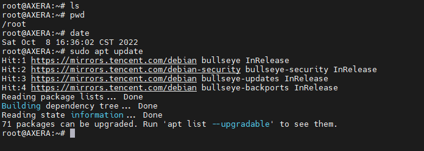

> 由于 Linux 系统直接断电可能会导致文件系统损坏，如果可以的话建议按下述命令去进行开关机，可以避免一些由于直接断电系统损坏导致的奇怪问题出现。

### 重启系统

Maix-III AXera-Pi 开发板的 Linux 系统可以通过 `reboot` 命令重启，重启命令如下：

```bash
reboot
```

### 关闭系统

Maix-III AXera-Pi 开发板的 Linux 系统可以通过 `poweroff` 命令关闭，关闭命令如下：

```bash
poweroff
```

### 磁盘扩容

基于一些用户可能有扩容分区的需求，因此在这里添加在 AXera-Pi 上给板子扩容或者是建立新分区的内容。

- 操作方法

首先需要烧录完上方的 debian11 的镜像系统后，再使用 AXera-Pi 登陆上 Linux 系统来进行磁盘扩容分区。

>[点击查看 AXera-Pi 登陆方式](https://wiki.sipeed.com/hardware/zh/maixIII/ax-pi/basic_usage.html#%E7%B3%BB%E7%BB%9F%E7%99%BB%E5%BD%95)

成功登陆到 AXera-Pi 上后，用户可以先使用 `lsblk` 命令来查看设备当前的存储情况。接着使用 `cfdisk /dev/mmcblk2` 来进行磁盘分区扩容的操作。（`mmcblk2` 是我们进行操作的区域名称也称设备名）

.. details::点击查看配置示意图
    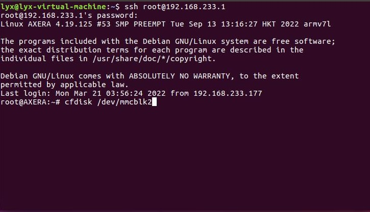

运行命令后终端会弹出下图操作界面，由 `Free space` 可见存储空间还余 `4.3G`，用户可使用键盘上的方向键移动选择我们要扩容的分区 `/dev/mmcblk2p2` 。

.. details::点击查看配置示意图
    

选择上图的 `Resize` 按下**回车键**对当前分区进行缩容或扩容，界面会跳出提示用户修改新的分区大小。

.. details::点击查看配置示意图
    

修改后敲**回车键**确定，终端界面会回到原页面。这时我们已经完成对分区扩容的修改了，还需要把改动的部分写入磁盘。在页面选择 `Write` 并敲**回车键**后输入 `yes` 确定将改动分区表写入磁盘中，再敲**回车键**即可。

.. details::点击查看配置示意图
    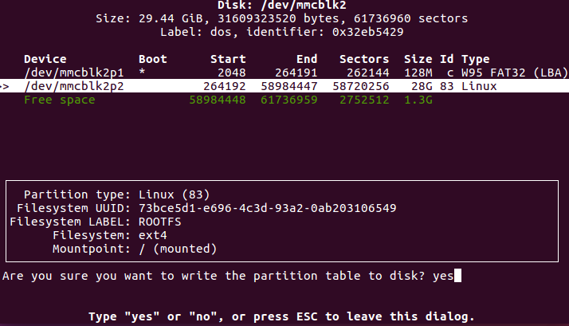

操作后会返回原界面，选择 `Quit` 退出即可。

.. details::点击查看配置示意图
    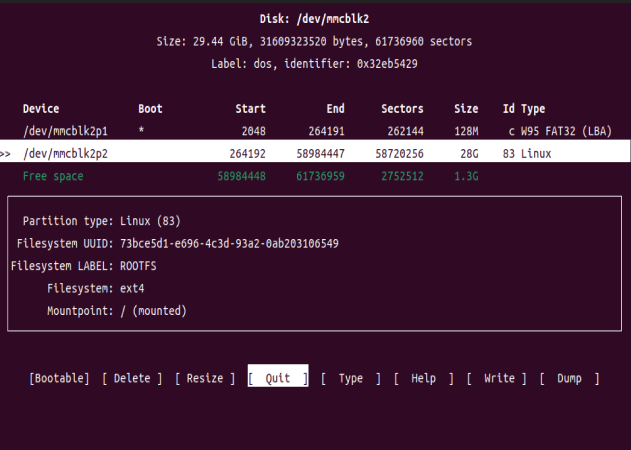

接下来使用命令行 `df -h` 查询磁盘使用空间的情况，终端会显示用户没改动之前的使用情况，需要我们使用命令 `resize2fs /dev/mmcblk2p2` 来调整文件系统的大小实现对 `mmcblk2` 分区的扩容，再使用 `df -h` 查询就可以看到磁盘改动后的情况。

.. details::点击查看配置示意图
    

> **注意**：如果调整完文件系统的大小后使用 `df -h` 查询磁盘信息依旧是改动前的信息，可使用 `reboot` 重启设备后在查询。

### 开机启动脚本

系统已经内置好 `/boot/rc.local` 的开机启动脚本，用户可参照以下示例进行修改。

开机启动脚本是在 / 根目录下运行的，举例来说，如果想要开机启动 `/home/run.sh` 脚本。

1. 用绝对路径挂后台运行程序 `/home/run.sh & ` 才可以确保开机后进入 shell 命令终端。
2. 【推荐】用相对路径挂后台运行程序 `cd /home && ./run.sh &` 注意此时 pwd 和绝对路径是不一样。

请先验证好可以在 / 根目录下启动后再放入以下的开机脚本中，不会就抄以下脚本的例子。

```bash
root@AXERA:~# cat /boot/rc.local
#!/bin/sh

# this file is called by /etc/rc.local at boot.

# systemctl stop usb-gadget@g0
# mkdir -p /mnt/udisk && mount /dev/sda1 /mnt/udisk
# python3 /mnt/udisk/alltest.py

# this control lcd backlight(50 ~ 1000)
echo 0 > /sys/class/pwm/pwmchip0/export
echo 1000 > /sys/class/pwm/pwmchip0/pwm0/period
echo 500 > /sys/class/pwm/pwmchip0/pwm0/duty_cycle
echo 1 > /sys/class/pwm/pwmchip0/pwm0/enable

# wifi connect ssid Sipeed_Guest pasw qwert123
nmcli device wifi connect Sipeed_Guest password qwert123

if [ -f "/root/boot" ]; then
  cd /root/ && chmod 777 * && ./boot &
elif [ -d "/root/app" ]; then
  cd /root/app && chmod 777 *
  if [ -f "./main" ]; then
    ./main &
  elif [ -f "./main.bin" ]; then
    ./main.bin &
  elif [ -f "./main.py" ]; then
    python3 ./main.py &
  fi
else
  aplay /home/res/boot.wav >/dev/null 2>&1 &
  /opt/bin/sample_vo_fb -v dsi0@480x854@60 -m 0 >/dev/null 2>&1 &
  sleep 0.8 && /home/fbv-1.0b/fbv /home/res/2_480x854.jpeg && killall sample_vo_fb &
  python3 -c "import os, binascii; os.system('sed -i \'/iface eth0 inet dhcp/ahwaddress ether {}\' /etc/network/interfaces'.format(binascii.hexlify(bytes.fromhex(open('/proc/ax_proc/uid').read().split('0x')[1][:-5]),':').decode('iso8859-1'))) if os.system('grep \'hwaddress ether\' /etc/network/interfaces -q') != 0 else exit();" &
fi

exit 0

```

.. details::点此展开查看示例图
    

.. details::点击查看连接后串口输出的 debian11 系统启动日志。

    ```bash
    Vddr init success!
    The system boot form EMMC
    enter boot normal mode

    U-Boot 2020.04 (Jun 16 2022 - 00:16:34 +0800)

    Model: AXERA AX620_demo Board
    DRAM:  1 GiB
    NAND:  unknown raw ID 77ee0178
    uclass_get_device: Invalid bus 0 (err=-524)
    0 MiB
    initr_pinmux: delay pinmux_init for env board id
    MMC:   enter sdhci_cdns_get_cd call mmc_getcd
    enter sdhci_cdns_get_cd call mmc_getcd
    mmc@10000000: 0, mmc@4950000: 1
    Loading Environment from MMC... OK
    In:    serial
    Out:   serial
    Err:   serial
    MMC: no card present
    sd card is not present
    enter normal boot mode
    Net:
    reset EMAC0: ethernet@0x4970000 ...
    Warning: ethernet@0x4970000 (eth0) using random MAC address - 6a:e4:fd:58:97:ea
    eth0: ethernet@0x4970000
    Hit any key to stop autoboot:  0
    reading DTB and BOOT image ...
    reading bootimg header...
    MAGIC:       AXERA!
    img size:    4841536
    kernel_size: 4841472
    kernel_addr: 64
    id:bc 19 bb a7 2d 27 74 de 7c 91 4b 70 ea c9 ab 96 50 61 bd e0 2b 02 8b e5 c8 ee 22 ce df b1 cf ea
    load kernel image addr = 0x40008000,load dtb image addr = 0x48008000
    boot cmd is :bootm 0x40008000 - 0x48008000
    ## Booting kernel from Legacy Image at 40008000 ...
    Image Name:   Linux-4.19.125
    Image Type:   ARM Linux Kernel Image (uncompressed)
    Data Size:    4839952 Bytes = 4.6 MiB
    Load Address: 40008000
    Entry Point:  40008000
    Verifying Checksum ... OK
    ## Flattened Device Tree blob at 48008000
    Booting using the fdt blob at 0x48008000
    Loading Kernel Image
    Using Device Tree in place at 48008000, end 480103d6

    Starting kernel ...


    Welcome to Debian GNU/Linux 11 (bullseye)!

    [  OK  ] Created slice system-getty.slice.
    [  OK  ] Created slice system-modprobe.slice.
    [  OK  ] Created slice system-serial\x2dgetty.slice.
    [  OK  ] Created slice User and Session Slice.
    [  OK  ] Started Dispatch Password …ts to Console Directory Watch.
    [  OK  ] Started Forward Password R…uests to Wall Directory Watch.
    [  OK  ] Reached target Local Encrypted Volumes.
    [  OK  ] Reached target Network is Online.
    ......

>因物料更换屏幕现有不同的版本，需区别版本以及使用屏幕时出现锯齿等画面请移步到[ Maix-III 系列 AXera-Pi 常见问题(FAQ) ](https://wiki.sipeed.com/hardware/zh/maixIII/ax-pi/faq_axpi.html#Q：硬件物料更改说明、没有-wlan0-、屏幕烧屏、摄像头倒过来怎么解决？)查询。

### 更新内核与驱动

在 SD 卡的第一分区会挂载到系统根目录下的 /boot 系统启动相关的文件，替换它后重启（reboot）即可完成更新。

- boot.bin 芯片 spl 初始化程序

- uboot.bin uboot 启动引导程序

- kernel.img linux 内核

- dtb.img linux 设备树

例如：

- 更新设备树可以用 `cp /boot/dtb.img.lcd20221025 /boot/dtb.img`
- 更新内核驱动可以用 `cp /boot/kernel.img.rtl8723bs /boot/kernel.img`

最后 reboot 即可生效。

## 如何传输文件

> 如果在使用 AXera-Pi 途中出现从设备到电脑端文件互传的需求，可根据以下的方式进行传输：
###  使用读卡器物理拷贝文件

**物理传输**：由于 Linux 系统采用 `ext4` 分区在 Windows / Mac 默认系统下无法进行查看，用户需额外安装增强工具才能读取到具体的分区。而 Linux 系统可直接看到卡里的分区和内容，也可以选择把读卡器接到安卓设备通过 **OTG** 转接头实现文件拷贝。

- [如何在 Windows 下访问 ext4 格式的硬盘？](https://zhuanlan.zhihu.com/p/448535639)

- [[macOS] 在 macOS 上挂载 Linux 的 ext/ext3/ext4 文件系统](https://blog.twofei.com/773/)

### 板子与电脑的文件互传

>基于让用户的使用更加快速便捷，还可以选择直接在板子上与电脑端通过工具实现文件互传。

**使用 SSH 远程管理工具进行文件传输：**

使用前需要使用 `ifconfig` 查询板子的 IP 地址做登录备用，可点击前往[系统登录](https://wiki.sipeed.com/hardware/zh/maixIII/ax-pi/basic_usage.html#%E5%9F%BA%E4%BA%8E-ip-%2B-ssh-%E7%99%BB%E5%BD%95)查看。在 Windows 上有众多远程管理 Linux 服务器的工具都提供了文件传输的功能，这里推荐免费绿色的 **Mobaxterm** 工具。

- [如何使用 MobaXterm](https://wiki.sipeed.com/hardware/zh/maixII/M2/tools/mobaxterm.html)

- [利用 MobaXterm 实现 Linux 和 Windows 之间传输文件](https://jingyan.baidu.com/article/9f63fb91e2bc6688400f0e93.html)

- [用 MobaXterm 在 Linux 和 Windows 之间上传/下载文件](https://blog.csdn.net/unforgettable2010/article/details/123930796)

> 如果想了解更多的工具可点击[【推荐7款超级好用的终端工具 —— SSH+FTP】](https://zhuanlan.zhihu.com/p/301653835)查看，而其他系统都提供了好用的命令行终端，支持 SSH 、scp 等命令直接执行。

**使用 scp 命令复制文件：**

和 cp 复制文件等命令一样，它就是 `ssh + cp = scp` 这个意思。

- [Linux 操作系统 scp 命令使用方法](https://cloud.tencent.com/developer/article/1876623)

**使用有线串口互传文件：**

使用前根据串口 serial 登录接线配置参数连上板子，安装 `apt-get install lrzsz` 工具后可参考以下文章。

- [有线串口 serial 登录](https://wiki.sipeed.com/hardware/zh/maixIII/ax-pi/basic_usage.html#%E6%9C%89%E7%BA%BF-%E4%B8%B2%E5%8F%A3-serial-%E7%99%BB%E9%99%86)

- 使用命令行工具 `minicom -D /dev/ttyUSB0 -b 115200` 可以查看[ Ubuntu 中使用 minicom 玩转文件的上传与下载](https://blog.csdn.net/wanyeye/article/details/42002377)。

- 使用 MobaXterm 可以点击 [MobaXterm 使用 rz/sz 传送文件](https://blog.csdn.net/qq_28837389/article/details/120073720)查看。

## 验证系统外设

### 系统预置的资源

Maix-III AXera-Pi 开发板的 Linux 系统预置了一些资源，可以通过 `ls /opt` 命令来查看。

```bash
root@AXERA:~# ls /opt
bin  include  lib  scripts  share
```

还有一些在 `home` 目录下：

```bash
root@AXERA:~# tree -L 1 /home
├── ax-samples          # npu ai sdk
├── examples            # 一些开箱示例
├── fbv-1.0b            # fbv 图片查看器
├── images              # 一些测试图片
├── libmaix             # simple pipeline sdk
├── models              # 内置的 AI 模型
├── res                 # 一些图像字体资源
├── systemd-usb-gadget  # 配置 usb 服务
├── usb-uvc-gadget      # 配置 uvc 服务
└── ustreamer           # mjpeg 图传
```

板子已经预置了 `gcc g++ gdb libopencv ffmpeg` 等工具，可直接在板上编译运行程序。

可参考下方使用方法：

```bash
cd /home/libmaix/examples/axpi/
python3 project.py build
fbon
./dist/start_app.sh
```

.. details::点击查看示例效果
    使用命令行后会打印大量数据信息并启动摄像头及屏幕。

    

而 axsample 已经预编译好了，相关 joint 模型已内置在 `/home/models/` 下便于用户查询。

```bash
/home/ax-samples/build/install/bin/ax_yolov5s -m /home/models/yolov5s.joint -i /home/images/cat.jpg -r 10
fbon
fbv yolov5s_out.jpg
```

.. details::点击查看效果
    输入上方命令后屏幕会显示 yolovs_out.jpg 图像

    

可以在联网后直接 `git pull` 更新仓库的提交记录，如果不能访问 github 的话就设置一下 `git remote` 从 gitee 拉取代码吧。

> **注意**：使用 xxxx menuconfig 报错请移步[Maix-III 系列 AXera-Pi 常见问题（FAQ）](https://wiki.sipeed.com/hardware/zh/maixIII/ax-pi/faq_axpi.html)

### 排针引脚图


### RTC

使用 `ls /sys/class/rtc` 查询会出现 /dev/rtc0 和 /dev/rtc1，分别是外部电池以及芯片内部的 rtc 时钟。

- **查看时间**

```bash
cat /sys/class/rtc/rtc0/time && cat /sys/class/rtc/rtc0/date

cat /sys/class/rtc/rtc1/time && cat /sys/class/rtc/rtc1/date
```

```bash
root@AXERA:~# cat /sys/class/rtc/rtc0/time && cat /sys/class/rtc/rtc0/date
08:13:30
2022-08-19
```

- **设置时间**

使用 `hwclock -w -f /dev/rtc0` 或 `hwclock -w -f /dev/rtc1` 写入。
只有这个方法可以写进去，确认 RTC 是否写入成功，只需要断电后重启的时间不为 1970 就行。

### CPU & RAM

默认 800MHz 可以调到 1ghz.

```bash
root@AXERA:~# ax_lookat 0x01900000 -s 33
0x1900000:00000033
root@AXERA:~# ax_clk
AX620A:
DDR:                 3733 MHz
CPU:                 800 MHz
BUS of VPU:         624 MHz
BUS of NPU:         624 MHz
BUS of ISP:         624 MHz
BUS of CPU:         624 MHz
NPU OTHER:         800 MHz
NPU GLB:         24 MHz
NPU FAB:         800 MHz
NPU CORE1:         800 MHz
NPU CORE0:         800 MHz
ISP:                 533 MHz
MM:                 594 MHz
VPU:                 624 MHz
root@AXERA:~# ax_lookat 0x01900000 -s 35
0x1900000:00000035
root@AXERA:~# ax_clk
AX620A:
DDR:                 3733 MHz
CPU:                 1000 MHz
BUS of VPU:         624 MHz
BUS of NPU:         624 MHz
BUS of ISP:         624 MHz
BUS of CPU:         624 MHz
NPU OTHER:         800 MHz
NPU GLB:         24 MHz
NPU FAB:         800 MHz
NPU CORE1:         800 MHz
NPU CORE0:         800 MHz
ISP:                 533 MHz
MM:                 594 MHz
VPU:                 624 MHz
root@AXERA:~#
```

目前硬件内存虽然是 2g 但在系统上只能看到 745M ，不用担心，这是目前的分配内存过于保守导致的，后续更新内核调整一下 NPU 和 CMM 的内存分配的。**(注：内核已更新，用户空间恢复 1.22G)**

### VIDEO

>**注意**：以下例程是原始测试时检查硬件好坏的程序，请用下面内置应用看正常的效果！
>内置开箱应用传送门：[点击前往](https://wiki.sipeed.com/hardware/zh/maixIII/ax-pi/basic_usage.html#%E5%86%85%E7%BD%AE%E5%BC%80%E7%AE%B1%E5%BA%94%E7%94%A8)
目前系统的摄像头驱动不经过 v4l2 驱动框架，所以必须通过代码配置的方式进行启用，相关摄像头驱动都是在应用层上完成的，

- gc4653 （基础版）（使用 -c 2)
- os04a10（夜视版）（使用 -c 0)

```bash
sample_vin_vo -c 2 -e 1 -s 0 -v dsi0@480x854@60
```

.. details::运行上方命令后可看到画面（示例效果）
    

>默认使用的是 gc4653 ，使用 os04a10 请移步[Maix-III 系列 AXera-Pi 常见问题(FAQ)](https://wiki.sipeed.com/hardware/zh/maixIII/ax-pi/faq_axpi.html)查询。

### DISPLAY

>因物料更换屏幕现有不同的版本，需区别版本以及使用屏幕时出现锯齿等画面请移步到[ Maix-III 系列 AXera-Pi 常见问题(FAQ) ](https://wiki.sipeed.com/hardware/zh/maixIII/ax-pi/faq_axpi.html#Q：硬件物料更改说明、没有-wlan0-、屏幕烧屏、摄像头倒过来怎么解决？)查询。

目前系统默认使用的是最简单的 framebuffer 显示驱动（/dev/fb0），在系统里内置了 `fbon / fboff / fbv xxx.jpg` 三个命令负责管理 fb 设备的启用和现实。

```bash
fbon
fbv /home/res/logo.png
fboff
```


目前想要使用 libdrm 需要搭配代码使用，请参考 sdk 的源码实现，因为目前系统还未移植好 gpu 驱动所以无法使用 modetest 进行测试，但可以参考下面进行测试。

测试屏幕是否能用运行右侧 `sample_vo -v dsi0@480x854@60 -m 0` 命令屏幕会显示彩条，但使用前务必调用 `fboff` 关闭 fb 设备。

### NPU

测试 NPU 的示例程序在 `/home/ax-samples/build/install` 目录下，已经预编译好了，直接就可以调用并显示运行结果。

```bash
fbon
/home/ax-samples/build/install/bin/ax_yolov5s -m /home/models/yolov5s.joint -i /home/images/cat.jpg -r 10
fbv yolov5s_out.jpg
```

.. details::点击查看效果
    

### AUDIO

和桌面系统保持一致，直接可用 alsa-utils 进行测试。

- **测试脚本**：`speaker-test -t sine -f 440 -c1`
- **录制音频**：`arecord test.wav -c 2 -f cd -d 2`
- **播放音频**：`aplay test.wav`

录音回放的 `python3` 代码如下：

```python
import pyaudio
try:
    chunk = 1024      # Each chunk will consist of 1024 samples
    sample_format = pyaudio.paInt16      # 16 bits per sample
    channels = 2      # Number of audio channels
    fs = 44100        # Record at 44100 samples per second
    time_in_seconds = 30
    p = pyaudio.PyAudio()
    stream = p.open(format=sample_format,
                    channels = channels,
                    rate = fs,
                    frames_per_buffer = chunk,
                    input = True, output = True)
    # Store data in chunks for 3 seconds
    for i in range(0, int(fs / chunk * time_in_seconds)):
        data = stream.read(chunk)
        stream.write(data)
finally:
    # Stop and close the Stream and PyAudio
    stream.stop_stream()
    stream.close()
    p.terminate()
```

可以在 alsamixer 配置你的设备，如果不了解的话建议不要修改。


### USB

>**注意**：由于芯片只有一个完整功能的 usb2.0，同一时刻下只有一个使用方向如 OTG 从机或 HOST 主机。

#### 如何配置 USB OTG 虚拟网卡 RNDIS usb0 有线 ssh 登录

默认就会启动配置 `systemctl enable usb-gadget@g0`，启动用 `systemctl start usb-gadget@g0`，停止开机启动用 `systemctl disable usb-gadget@g0`，停止服务用`systemctl stop usb-gadget@g0`。

此时使用命令 `sshpass -p root ssh root@192.168.233.1` 即可连接，账号及密码都是 root 。


#### 如何配置 USB OTG 虚拟串口 /dev/ttyGS0 并转发登录接口

停止 usb-gadget@g0 后使用 `systemctl start usb-gadget@g1` 即可看到，然后使用 `systemctl start getty@ttyGS0` 即可转发串口终端到 usb 的虚拟串口上。


#### 如何使用 USB HOST 读取一个 256M 的 SD 卡

先关了 otg 的 rndis 后再 lsusb 就可以看到了。

>我们在 debian 系统上配置了 usb-gadget@g1 和 usb-gadget@g0 两个服务。

```bash
root@AXERA:~# systemctl stop usb-gadget@g0
root@AXERA:~# lsusb
Bus 002 Device 001: ID 1d6b:0003 Linux Foundation 3.0 root hub
Bus 001 Device 002: ID 067b:2731 Prolific Technology, Inc. USB SD Card Reader
Bus 001 Device 001: ID 1d6b:0002 Linux Foundation 2.0 root hub
root@AXERA:~# fdisk -l
Disk /dev/mmcblk2: 58.94 GiB, 63281561600 bytes, 123596800 sectors
Units: sectors of 1 * 512 = 512 bytes
Sector size (logical/physical): 512 bytes / 512 bytes
I/O size (minimum/optimal): 512 bytes / 512 bytes
Disklabel type: dos
Disk identifier: 0x32eb5429

Device         Boot  Start       End   Sectors  Size Id Type
/dev/mmcblk2p1 *      2048    264191    262144  128M  c W95 FAT32 (LBA)
/dev/mmcblk2p2      264192 123596799 123332608 58.8G 83 Linux


Disk /dev/sda: 240 MiB, 251658240 bytes, 491520 sectors
Disk model: SD Card Reader
Units: sectors of 1 * 512 = 512 bytes
Sector size (logical/physical): 512 bytes / 512 bytes
I/O size (minimum/optimal): 512 bytes / 512 bytes
Disklabel type: dos
Disk identifier: 0x0607cfd2

Device     Boot Start    End Sectors   Size Id Type
/dev/sda1  *      240 490239  490000 239.3M  e W95 FAT16 (LBA)
root@AXERA:~# mkdir /mnt/sdcard && mount /dev/sda1 /mnt/sdcard
```

一步到位挂载 U 盘第一分区的命令 `systemctl stop usb-gadget@g0 && lsusb && mkdir -p /mnt/udisk && mount /dev/sda1 /mnt/udisk`

#### 如何配置 USB OTG 虚拟一个 USB 摄像头

**usb-uvc-gadget**：[usb-uvc-gadget](https://github.com/junhuanchen/usb-uvc-gadget)

**更多详情请移步内置应用查看**：[应用传送门](http://wiki.sipeed.com/hardware/zh/maixIII/ax-pi/basic_usage.html#uvc_vo)

#### 如何配置 USB HOST 读取一个 USB 摄像头

>适配 usb 摄像头前我们需要给板子接上以太网 `eth0`，使用 `ifconfig` 查询以太网的 `IP` 方便我们使用。
>如果获取不到以太网的 `IP` 地址，请移步右侧进行重新启动/配置[点击前往相关](https://wiki.sipeed.com/hardware/zh/maixIII/ax-pi/basic_usage.html#%E6%9C%89%E7%BA%BF%E4%BB%A5%E5%A4%AA%E7%BD%91%EF%BC%88eth0%EF%BC%89%E9%85%8D%E7%BD%AE%E6%96%B9%E6%B3%95)。

**Ustreamer**：[点击查看相关仓库](https://github.com/pikvm/ustreamer)
运行下方的命令行，终端会弹出调试信息无明显报错后，打开任意浏览器输入我们刚获取的以太网 `IP` 地址，进入 `ustreamer` 使用体验拍照及录像功能。

```bash
/home/ustreamer/ustreamer --device=/dev/video0 --host=0.0.0.0 --port=80
```


`snapshot` 为拍照功能，`stream` 为视频功能。


.. details::点击查看效果图

    

- **使用 Opencv 读取 USB 摄像头**

可在终端进入 `python3` 模式运行以下代码即可使用 USB 摄像头进行拍照。

```python
import os
import cv2
video = cv2.VideoCapture(0)
for i in range(30):
    ret, frame = video.read()
    if ret:
        cv2.imwrite("/tmp/capture.jpg", frame)
        os.system("fbon && fbv /tmp/capture.jpg")
```

.. details::点击查看终端运行图以及效果图

    
    

>运行出现报错请移步[Maix-III 系列 AXera-Pi 常见问题(FAQ)](https://wiki.sipeed.com/hardware/zh/maixIII/ax-pi/faq_axpi.html)进行查询。

### GPIO

#### 读取 KEY 按键输入：GPIO2 21

```bash
echo 85  > /sys/class/gpio/export
echo in > /sys/class/gpio/gpio85/direction
cat /sys/class/gpio/gpio85/value
```

#### 点亮 LED 灯 GPIO2 A4-A5 68-69

```bash
echo 68  > /sys/class/gpio/export
echo out > /sys/class/gpio/gpio68/direction
echo 1 > /sys/class/gpio/gpio68/value
sleep 1
echo 0 > /sys/class/gpio/gpio68/value
sleep 1
echo 1 > /sys/class/gpio/gpio68/value
```

> 计算规则 GPIO2 A4 == 32 *  2 + 4 = 68
对于爱芯的芯片，GPIO0 和 GPIO2 对应 A 和 C ，此处 A4 并不代表 GPIO2 只是序号。
也就是 GPIO2 A4 在标准设备中的定义为 GPIO C(2) 4(A4) 同理 GPIOA0 对应 GPIO0A4。

以后主流会统一到 PA0 或 PC4 这类定义，方便不同芯片共同定义。

使用 Python 控制排针上的 GPIO 方法举例，可见排针上的 BOT_GPIO_0 - 7 对应 GPIO2_A16_m - GPIO2_A23_m 喔。


先在 python3 中加载简易封装 gpio 类，使用的是 linux 的 libgpiod 的 python 版本。

```python

try:
    from gpiod import chip, line, line_request
    config = None # rpi is default value A 0
    def gpio(gpio_line=0, gpio_bank="a", gpio_chip=0, line_mode = line_request.DIRECTION_OUTPUT):
        global config
        if config != None and gpio_line in config:
            gpio_bank, gpio_chip = config[gpio_line]
        l, c = [32 * (ord(gpio_bank.lower()[0]) - ord('a')) + gpio_line, chip("gpiochip%d" % gpio_chip)]
        tmp = c.get_line(l)
        cfg = line_request() # led.active_state == line.ACTIVE_LOW
        cfg.request_type = line_mode # line.DIRECTION_INPUT
        tmp.request(cfg)
        tmp.source = "GPIO chip %s bank %s line %d" % (gpio_chip, gpio_bank, gpio_line)
        return tmp
    def load(cfg=None):
        global config
        config = cfg
except ModuleNotFoundError as e:
    pass

```

GPIO 输入测试：

```python3

led0 = gpio(16, gpio_chip=2, line_mode = line_request.DIRECTION_INPUT)
led1 = gpio(17, gpio_chip=2, line_mode = line_request.DIRECTION_INPUT)
led2 = gpio(18, gpio_chip=2, line_mode = line_request.DIRECTION_INPUT)
led3 = gpio(19, gpio_chip=2, line_mode = line_request.DIRECTION_INPUT)

def test():
    import time
    print(led0.get_value())
    print(led1.get_value())
    print(led2.get_value())
    print(led3.get_value())
    time.sleep(1)
    print(time.asctime())

while True:
    test()

```

GPIO 输出测试：

```python3

led0 = gpio(0, gpio_chip=2, line_mode = line_request.DIRECTION_OUTPUT)
led1 = gpio(1, gpio_chip=2, line_mode = line_request.DIRECTION_OUTPUT)
led2 = gpio(2, gpio_chip=2, line_mode = line_request.DIRECTION_OUTPUT)
led3 = gpio(3, gpio_chip=2, line_mode = line_request.DIRECTION_OUTPUT)

def test():
    import time
    time.sleep(1)
    led0.set_value(1)
    led1.set_value(1)
    led2.set_value(1)
    led3.set_value(1)
    time.sleep(1)
    led0.set_value(0)
    led1.set_value(0)
    led2.set_value(0)
    led3.set_value(0)
    print(time.asctime())

test()

```

[可参考的 gpio.h/gpio.c 代码](https://www.cnblogs.com/juwan/p/16917802.html#linux-spiv)

### UART

> 关闭 ttyS0 交互在开机后用 `systemctl stop serial-getty@ttyS0.service` 串口就不会再出现交互了，但彻底禁用遇到点问题，重启后会恢复，待研究。

系统输出默认是 **ttyS0** ，排针上的是 **ttyS1** ，而虚拟串口是 **ttyGS0**。


可用 `python3 pyserial` 库来测试功能的好与坏，但是需要注意排针丝印可能不准确。
如果出现串口的 tx 和 rx 没有数据的话可以反接一下，以及确保是共地的。

```python
import serial
ser = serial.Serial('/dev/ttyS1', 115200, timeout=1)
ser.write(b'hello world\n')
ser.close()
```

[可参考的 uart.h/uart.c 代码](https://www.cnblogs.com/juwan/p/16917802.html#linux-uart-ttysx)

### PWM

以配置一个 pwm0 修改屏幕背光为例，需更新到 **20221201** 后的镜像。
**例**：`echo 204 > /sys/class/pwm/pwmchip0/pwm0/duty_cycle` 运行后屏幕亮度只有十分之一.

```bash
echo 0 > /sys/class/pwm/pwmchip0/export
echo 4167 > /sys/class/pwm/pwmchip0/pwm0/period
echo 204 > /sys/class/pwm/pwmchip0/pwm0/duty_cycle
echo 2084 > /sys/class/pwm/pwmchip0/pwm0/duty_cycle
echo 1 > /sys/class/pwm/pwmchip0/pwm0/enable
```

PWM 使用参考：[点击查看](https://wiki.sipeed.com/soft/maixpy3/zh/usage/hardware/PWM.html#%E5%BC%80%E5%A7%8B).

### I2C

> m3axpi 的排针上的 I2C 是 /dev/i2c-7 对应 `i2cdetect -y -r 7` 喔， 0 1 2 是摄像头的， 8 是系统的 usb rtc 的， 9 做预留。
使用 i2c-tools 工具包，可使用 i2cdetect -y 0 来查看 i2c 总线上的设备。
如果出现 i2c 设备扫不到的情况需要接一下上拉电阻。

```bash
root@AXERA:~# i2cdetect -y -r 0
     0  1  2  3  4  5  6  7  8  9  a  b  c  d  e  f
00:                         -- -- -- -- -- -- -- --
10: -- -- -- -- -- -- -- -- -- -- -- -- -- -- -- --
20: -- 21 -- -- -- -- -- -- -- -- -- -- -- -- -- --
30: -- -- -- -- -- -- 36 -- -- -- -- -- -- -- -- --
40: -- -- -- -- -- -- -- -- -- -- -- -- -- -- -- --
50: -- -- -- -- -- -- -- -- -- -- -- -- -- -- -- --
60: -- -- -- -- -- -- -- -- -- -- -- -- -- -- -- --
70: -- -- -- -- -- -- -- --
root@AXERA:~#
```

这里 **0x21** 和 **0x36** 就代表的板子在 cam0 这个排线上的 /dev/i2c-0 设备存在某个摄像头的 i2c 设备，而读写可用 i2cget 和 i2cset 命令，与其他芯片皆为同理。

### SPI

可参考右边同理事例：[为 AW V831 配置 spidev 模块，使用 py-spidev 进行用户层的 SPI 通信。](https://www.cnblogs.com/juwan/p/14341406.html)

```
root@AXERA:~# ./spidev_test -D /dev/spidev1.0 -v
spi mode: 0x0
bits per word: 8
max speed: 500000 Hz (500 KHz)
TX | FF FF FF FF FF FF 40 00 00 00 00 95 FF FF FF FF FF FF FF FF FF FF FF FF FF FF FF FF FF FF F0 0D  | ......@....�..................�.
RX | FF FF FF FF FF FF 40 00 00 00 00 95 FF FF FF FF FF FF FF FF FF FF FF FF FF FF FF FF FF FF F0 0D  | ......@....�..................�.
root@AXERA:~# ./spidev_test -D /dev/spidev1.0 -v
spi mode: 0x0
bits per word: 8
max speed: 500000 Hz (500 KHz)
TX | FF FF FF FF FF FF 40 00 00 00 00 95 FF FF FF FF FF FF FF FF FF FF FF FF FF FF FF FF FF FF F0 0D  | ......@....�..................�.
RX | FF FF FF FF FF FF FF FF FF FF FF FF FF FF FF FF FF FF FF FF FF FF FF FF FF FF FF FF FF FF FF FF  | ................................
root@AXERA:~# ./spidev_test -D /dev/spidev1.0 -v
spi mode: 0x0
bits per word: 8
max speed: 500000 Hz (500 KHz)
TX | FF FF FF FF FF FF 40 00 00 00 00 95 FF FF FF FF FF FF FF FF FF FF FF FF FF FF FF FF FF FF F0 0D  | ......@....�..................�.
RX | FF FF FF FF FF FF FF FF FF FF FF FF FF FF FF FF FF FF FF FF FF FF FF FF FF FF FF FF FF FF FF FF  | ................................
```

### CHIP ID

获取芯片唯一的 id 码。

```
cat /proc/ax_proc/uid
```

### ADC（暂未支持）

.. details::点击查看

    硬件上支持，但软件上目前还没写调试工具配合。
    可参考外围开发手册，这需要专用的代码控制，目前还没有全部补充完。

    1. 设置 THM 寄存器
    2. 中间需要 delay 一段时间，否则读取出来的值，可能不对.
    3. 0x2000028 寄存器读取出来的值 DATA
    4. DAT 和 voltage 的对应关系，voltage = DATA / 1024 * VREF(1.8V)
    5. 如果读取 chan1/2/3/4，需要读取 0x200002c，0x2000030，0x2000034，0x2000038

    使能 ADC 通道
    devmem 0x2000020 32 0x1000 //chan0
    devmem 0x2000020 32 0x800 //chan1
    devmem 0x2000020 32 0x400 //chan2
    devmem 0x2000020 32 0x200 //chan3
    devmem 0x2000020 32 0x100 //chan4

    devmem 0x200002c
    devmem 0x2000030
    devmem 0x2000034
    devmem 0x2000038

### 出厂测试脚本

.. details::点击可查看产品出厂测试时用的 Python 测试脚本
    ```python
    test_flag = False

    try:
        from gpiod import chip, line, line_request
        config = None # rpi is default value A 0
        def gpio(gpio_line=0, gpio_bank="a", gpio_chip=0, line_mode = line_request.DIRECTION_OUTPUT):
            global config
            if config != None and gpio_line in config:
                gpio_bank, gpio_chip = config[gpio_line]
            l, c = [32 * (ord(gpio_bank.lower()[0]) - ord('a')) + gpio_line, chip("gpiochip%d" % gpio_chip)]
            tmp = c.get_line(l)
            cfg = line_request() # led.active_state == line.ACTIVE_LOW
            cfg.request_type = line_mode # line.DIRECTION_INPUT
            tmp.request(cfg)
            tmp.source = "GPIO chip %s bank %s line %d" % (gpio_chip, gpio_bank, gpio_line)
            return tmp
        def load(cfg=None):
            global config
            config = cfg
    except ModuleNotFoundError as e:
        pass

    key = gpio(21, gpio_chip=2, line_mode = line_request.DIRECTION_INPUT)
    led0 = gpio(4, gpio_chip=2, line_mode = line_request.DIRECTION_OUTPUT)
    led1 = gpio(5, gpio_chip=2, line_mode = line_request.DIRECTION_OUTPUT)

    import time
    import ifcfg
    import os

    def check_ifconfig():
        result = []
        for name, interface in ifcfg.interfaces().items():
            if name in ['eth0', 'wlan0'] and interface['inet']:
                result.append(name)
        return result

    try:
        if (0 == key.get_value()):
            os.system("export LD_LIBRARY_PATH=/opt/lib:LD_LIBRARY_PATH && /opt/bin/sample_vin_vo -c 2 -e 1 -s 0 -v dsi0@480x854@60 &")
            led1.set_value(1)
            while True:
                led0.set_value(1)
                time.sleep(0.2)
                led0.set_value(0)
                time.sleep(0.2)
                tmp = check_ifconfig()
                if len(tmp) > 1:
                    led0.set_value(0)
                    led1.set_value(0)
                    test_flag = True
                    break
            while (0 == key.get_value()):
                time.sleep(0.2)
            os.system("aplay /home/res/boot.wav")
            led0.set_value(1)
            led1.set_value(1)
            import pyaudio
            chunk = 1024      # Each chunk will consist of 1024 samples
            sample_format = pyaudio.paInt16      # 16 bits per sample
            channels = 2      # Number of audio channels
            fs = 44100        # Record at 44100 samples per second
            p = pyaudio.PyAudio()
            stream = p.open(format=sample_format,
                            channels = channels,
                            rate = fs,
                            frames_per_buffer = chunk,
                            input = True, output = True)
            while (1 == key.get_value()):
                data = stream.read(chunk, exception_on_overflow = False)
                stream.write(data)
            while (0 == key.get_value()):
                time.sleep(0.2)
            os.system('killall sample_vin_vo')
            os.system('killall sample_vin_vo')
            # Stop and close the Stream and PyAudio
            stream.stop_stream()
            stream.close()
            p.terminate()
    except Exception as e:
        print(e)
    finally:
        if test_flag:
            led0.set_value(0)
            led1.set_value(0)

    '''

    import pyaudio
    try:
        chunk = 1024      # Each chunk will consist of 1024 samples
        sample_format = pyaudio.paInt16      # 16 bits per sample
        channels = 2      # Number of audio channels
        fs = 44100        # Record at 44100 samples per second
        time_in_seconds = 300
        p = pyaudio.PyAudio()
        stream = p.open(format=sample_format,
                        channels = channels,
                        rate = fs,
                        frames_per_buffer = chunk,
                        input = True, output = True)
        for i in range(0, int(fs / chunk * time_in_seconds)):
            data = stream.read(chunk)
            stream.write(data)
    finally:
        # Stop and close the Stream and PyAudio
        stream.stop_stream()
        stream.close()
        p.terminate()

    '''
    ```


## 内置开箱应用

### IPCDemo

这是一个典型的 IPC 演示程序，对应的功能模块有：

- ISP：负责从 Sensor 获取图像 RAW 数据并转为 YUV，最终分 3 路通道输出以上信息。
- IVPS：图像视频处理模块。实现对视频图形进行一分多、Resize、Crop、旋转等功能。
- VENC / JENC：视频/JPEG 编码输出。
- Detect：支持人脸或结构化检测。
- Web 显示：实现 H264 流的 Web 传输和提供 Web 方式查看实时视频。
- RTSP 推流：实现 H264 流的 RTSP 封装以及传输。
- 录像 TF 卡存储：封装 H264 流为 MP4 格式文件并保存至 TF 卡或者 FLASH 空间。

<p align="center">
    <iframe src="//player.bilibili.com/player.html?aid=260625114&bvid=BV1me411T7g8&cid=837160730&page=1" scrolling="no" border="0" frameborder="no" framespacing="0" allowfullscreen="true" style="max-width:640px; max-height:480px;"> </iframe>
</p>

<p align="center">
    <iframe src="//player.bilibili.com/player.html?aid=688159412&bvid=BV1p24y1d7Te&cid=837167669&page=1" scrolling="no" border="0" frameborder="no" framespacing="0" allowfullscreen="true" style="max-width:640px; max-height:480px;"> </iframe>
</p>

#### 使用方法

>**注意**：启动命令默认的镜头型号为 **gc4653** ，因不同的摄像头配置文件不一致，使用别的型号时需点击右侧[更换摄像头](https://wiki.sipeed.com/hardware/zh/maixIII/ax-pi/faq_axpi.html#Q%EF%BC%9A%E5%A6%82%E4%BD%95%E6%9B%B4%E6%8D%A2-os04a10-%E6%91%84%E5%83%8F%E5%A4%B4%EF%BC%9F)进行修改。

在终端运行下面的命令即可启动软件，服务默认绑定到 0.0.0.0 地址，直接在浏览器输入 usb0 的 IP 即可访问，使用板子上其他 IP 也可以访问页面（例如：`192.168.233.1:8080`）.

```bash
/opt/bin/IPCDemo/run.sh /opt/bin/IPCDemo/config/gc4653_config.json
```
.. details::点击查看
    输入启动命令后，终端会打印大量调试信息。
    

访问页面后会弹出登录页面，点击登录后页面会弹出下图画面。


#### 如何抓拍？如何录制？

浏览器抓拍录制（web）

- **抓拍图像**

软件经过上文的启动后显示画面，右下角有抓拍和录制的功能图标。
用户可点击摄像头图标进行抓拍喜欢的场景，抓拍的照片浏览器会自动弹出进行下载方便用户查看存储。


- **录制视频**

点击右下角的录制图标，即可进入本地录制视频（mp4）模式，再次点击图标即录制完成结束。


用户可在配置页面的`录像回放`选项预览视频进行下载到本地或删除的操作。


>**注意**：
>**20221017** 后的镜像默认打开了录制保存到`/opt/mp4`的目录下。
>视频录制要储存到文件系统后才能打开，某种意义上用户也可以挂载网络路径来当监控录像使用。

#### 人脸检测
>基于上文的基础功能，IPCDemo 自身还附带其他一些功能应用.例如**：人脸检测、车牌识别**。

使用前请参考上文使用命令行登录 IPC 网页，登录后先进行相机结构化配置，具体配置流程看下文。

.. details::点击查看配置流程
    接入页面后选择**配置**在**智能配置**里再进行**结构化配置**，用户可根据自己的需要进行勾选即可。

    

设置完成后回到预览页面即可进行人脸及人形识别，IPC 会自动框出识别人脸并且截取人脸的图片，可在预览页面下方点击截取图样放大查看附带信息。
- 左侧：人脸检测 右侧：人形检测

<html>
  
  
</html>

#### 车牌识别

使用前请参考上文基础功能使用命令行登录网页，再进行**结构化配置**勾选车牌所需的检测画框即可。

.. details::点击查看 IPC 配置流程
    接入页面后选择**配置**在**智能配置**里再进行**结构化配置**，用户可根据自己的需要进行勾选即可。

    

设置完成即可回到预览页面进行车牌识别，IPC 会自动框出识别到得车牌及读取车牌数字信息，用户可在预览下方点击图片放大查看截取到车牌图片及信息。


<!-- <p align="center">
    <iframe src="//player.bilibili.com/player.html?aid=773227207&bvid=BV1B14y1Y7A4&cid=837154353&page=1" scrolling="no" border="0" frameborder="no" framespacing="0" allowfullscreen="true" style="max-width:640px; max-height:480px;"> </iframe>
</p> -->

### rtsp

>**rtsp**：也称实时流传输协议，该协议定义了一对多应用程序如何有效地通过 IP 网络传送多媒体数据。

**VLC Media Player**：[点击下载](https://www.videolan.org/vlc/)

使用 RTSP 传送数据前，我们需要先认识工具 `VLC Media Player`。

.. details::点此展开查看 VLC Media Player 介绍
    VLC Media Player（VLC 多媒体播放器），是一款可播放大多数格式，而无需安装编解码器包的媒体播放器，以及支持多平台使用、支持 DVD 影音光盘，VCD 影音光盘及各类流式协议。

    

运行命令后终端会弹出调试信息，打开 `VLC Media Player` 进行配置网络串流后即可看到画面效果。

```bash
/home/examples/vin_ivps_joint_venc_rtsp_vo_onvif_mp4v2/run.sh
```

.. details::点击查看终端运行图
    

.. details::点此展开查看 VLC Media Player 配置步骤
    打开后在上方选择**媒体**后选择**打开网络串流**进到配置画面。
    
    在网络页面输入**网络 URL ：`rtsp://192.168.233.1:8554/axstream0`**，
    勾选下方更多选项进行调整缓存后点击下方播放即可。
    

- 双屏效果如下图示例：

<html>
  
  
</html>

>**注意**：默认摄像头为 gc4653 型号不同请移步[Maix-III 系列 AXera-Pi 常见问题(FAQ)](https://wiki.sipeed.com/hardware/zh/maixIII/ax-pi/faq_axpi.html)更换参数。
#### ffplay

工具除了 `VCL` 还可以直接使用 `ffplay`。
**ffplay** :[点击下载](https://dl.sipeed.com/shareURL/MaixIII/AXera/09_Software_tool)

```bash
sudo apt install ffmpeg
ffplay rtsp://192.168.233.1:8554/axstream0 -fflags nobuffer
```

### ONVIF ODM

>在 **20221111** 后的更新的镜像系统，内置了按键录像 mp4 和支持更换 yolov5s 人脸/物体检测模型以及对 ODM（ONVIF）进行支持。

**ONVIF Device Manager**：[点击下载](https://sourceforge.net/projects/onvifdm/)

.. details::点击查看 ODM 软件介绍

    ONVIF 协议作为全球性的网络视频监控开放接口标准，推进了网络视频在安防市场的应用，特别是促进了高清网络摄像头的普及和运用。 越来越多的前端 IPC 厂家和后端 NVR 及存储提供商加入进来。而 ONVIF Device Manager 是 ONVIF 官方基于协议提供的免费第三方的 ONVIF 协议测试工具，与上文的 VLC 相比性能不同，但 ODM 的内容形式更加多样丰富。

   

在终端运行下方命令，设备屏幕会跳出 yolov5s 模型运行画面，接着我们来配置 `ODM` 实现 PC 端显示。

>**注意**：ODM 受网络影响较大，如果有卡顿现象把网络更换成以太网即可。
>默认摄像头为 gc4653 如型号不同请移步[Maix-III 系列 AXera-Pi 常见问题(FAQ)](https://wiki.sipeed.com/hardware/zh/maixIII/ax-pi/faq_axpi.html)更换参数。

.. details::点击设备运行效果图
    

```bash
/home/examples/vin_ivps_joint_venc_rtsp_vo_onvif_mp4v2/run.sh
```

打开我们下载好的 `ODM` 软件点击左侧白框的 `Refresh` 按键扫描设备，扫描成功会显示 `IP-Camera` 方框点击后选择下方的 `Live video` 即可在 PC 端看到画面。


还可通过下方命令去查看文件配置：

```bash
 cd /home/examples/vin_ivps_joint_venc_rtsp_vo_onvif_mp4v2/
 ls -l
```

- **更换模型**
>20221116 后更新的镜像已在 `run.sh` 内置了不同摄像头参数的源码。
>20221111 镜像内置 yolov5s 的人脸/物体检测模型，可使用以下命令更改运行脚本内容更换模型。

``` bash
nano /home/examples/vin_ivps_joint_venc_rtsp_vo_onvif_mp4v2/run.sh
```

.. details::点击查看修改操作示例
    运行后会显示 `run.sh` 的编辑页面，对当前启动的模型进行注释或调用其他模型即可，
    按 **ctrl+X** 键后会提示是否保存修改内容。
    
    根据提示按下 **Y** 键保存，界面会显示修改内容写入的文件名按**回车**键确定，
    再次运行 `run.sh` 脚本即可看到模型更换成功。
    
    除了上方通过命令修改 `run.sh` 更换还可以通过 `MdbaXterm` 工具查看 `/home/examples/vin_ivps_joint_venc_rtsp_vo_onvif_mp4v2/` 目录下的`run.sh`脚本文件直接修改保存。

- **按键录制 MP4**
运行 `run.sh` 期间可按下板载的按键 `user` 进行录制视频，按下后 **LED0** 会亮起代表开始录制 MP4，

.. details::点击查看按键示意图
    

终端界面会显示下图 `delete file`，当录制完成后再次按下按键停止录制而 LED0 会灭掉，


录制完成的 MP4 文件可在 **`home/examples/`** 目录下查看。


### PP_human

>**20221116** 后更新的系统镜像已内置了 `pp_human` 人体分割应用。
>还内置了不同摄像头的参数命令在 `run.sh`，只需要调用注释相应源码即可使用。

运行下方的命令后终端会输出调试信息，设备屏幕会显示运行画面。

```bash
/home/examples/vin_ivps_joint_vo_pp_human_seg/run.sh
```

可使用下方命令进入图形化页面，对 `run.sh` 里不同摄像头参数的源码进行调用或注释。

```bash
nano /home/examples/vin_ivps_joint_vo_pp_human_seg/run.sh
```

.. details::点击查看图形化页面
    修改后按 **ctrl+x** 退出键会提示是否保存页面，后续按终端提示操作即可。
    

### uvc_vo

**usb-uvc-gadget**：[点击查看相关仓库](https://github.com/junhuanchen/usb-uvc-gadget)

>**20221123** 镜像内置了 uvc vo 应用，并且还可以在手机端软件使用。
>目前应用还处于不稳定的状态，第一次启动程序会改变 usb otg rndis 转成 usb otg uvc 模式导致设备重启，重启再运行即可，画面绿屏是启动脚本里摄像头配置不对。

使用前需要准备两条 USB type_c  的数据线以及一条双 type_c 口的数据线。
把设备的 **UART** 及 **OTG** 口用`USB type-c` 线全部接入 `PC` 端，再运行下方命令终端会弹出无报错调试信息。

```bash
/home/examples/vin_ivps_joint_venc_uvc_vo/run.sh
```

.. details::点击查看终端示例图
    

打开 `PC` 端自带相机应用即可在设备屏幕以及 `PC` 端观察到模型检测画面。


可以使用以下的命令行更换尾缀 `start` 开启、`stop` 停止、`restore` 重启来对 `uvc` 程序进行操作。

```bash
/home/usb-uvc-gadget/uvc-gadget.sh #start/stop/restore
```

- **手机端虚拟摄像头**

UVC 也能在安卓手机端的 `app` 上当虚拟摄像头使用，使用前在软件商店下载好 **USB 摄像头专业版** 软件。

.. details::USB 摄像头专业版软件介绍
    USB 摄像头是一款支持 USB 摄像头、适配采集卡等设备通过 OTG 连接手机并驱动设备展示画面。

    

把双头 `type-c` 线的分别接上手机端以及设备的 OTG 口，运行上方命令后会自动连接。


>**注意**：如果需要完全脱离电脑端用手机端供电的话，需要把 uvc 程序写入开机脚本即可。

### 人体关键点

>镜像系统已内置人体关键点模型，直接使用终端命令行运行模型或使用 `Python` 调用模型.

- **终端使用命令行调用模型**

用户先使用 `nano /home/run.sh` 进入 `run.sh` 可视化编辑页面修改相关命令行并退出。
修改示例可参考下文，再运行启动 `run.sh` 脚本命令调用模型。

**如何修改 `run.sh` 脚本，以人体关键点 `ax_poes` 为例。**


使用命令 `nano /home/run.sh` 进入后找到自己需要调用的模型及命令，使用上下左右键移动取消注释更换 `-c 2` 的不同摄像头参数，然后按 `ctrl+x` 键退出会提示保存，按提示进行操作即修改完成。

**修改后使用 `/home/run.sh` 运行程序，即可体验人体关键点。**

<p align="center">
<iframe src="//player.bilibili.com/player.html?aid=647932316&bvid=BV1Pe4y1W7n6&cid=901750338&page=1" scrolling="no" border="0" frameborder="no" framespacing="0" allowfullscreen="true"> </iframe>
</p>

- **前往[试试 Python 编程](https://wiki.sipeed.com/hardware/zh/maixIII/ax-pi/python_api.html#%E4%BD%BF%E7%94%A8-Python-%E8%B0%83%E7%94%A8-ax-poes-ppl-%E6%A8%A1%E5%9E%8B)查看如何使用 `Python` 调用模型示例。**

- **如何调用运行 `run.sh` 里的更多预置模型。**

我们在 `run.sh` 里预置了调用多种模型的命令行以及相应的摄像头参数。

具体使用可参考上文 `nano /home/run.sh` 进入可视化编辑页面修改，运行启动脚本即可使用。

```bash
sample_vin_ivps_joint_vo
sample_vin_ivps_joint_venc_rtsp_vo
```

```bash
yolov5_seg.json         yolov7.json           yolox.json
yolov5s_face.json       pp_human_seg.json     ax_pose.json
hrnet_animal_pose.json  hand_pose.json
```


### lvgl7 UI

> 在 **20221125** 后更新的镜像系统里，我们内置了 lvgl7 UI 应用。

**运行应用前请先准备材料：**USB type-c 线/USB type-c 转换头/无线鼠标。

使用 USB type-c 数据线两端分别接入设备的 **UART** 口与电脑端 **USB** 口，再使用转换头的 **USB** 端接入鼠标的 USB 接收器，另一端接入设备 **OTG** 口。

运行下方命令后终端会弹出无报错的启动信息后，屏幕会显示画面用户即可体验 lvgl 应用了。

```
cd /home
./bin/sample_vin_ivps_joint_vo_lvgl -c 0
```

.. details::点击查看终端示例图
    

<p align="center">
    <iframe src="//player.bilibili.com/player.html?aid=690497396&bvid=BV1n24y1C7DN&cid=901748014&page=1" scrolling="no" border="0" frameborder="no" framespacing="0" allowfullscreen="true"> </iframe>
</p>

- **如何调用运行 `/home/bin` 目录下更多内置应用**

以下应用是内置在 `home/bin` 目录下的，用户可使用 `ls /home/bin` 查询并参考示例调用其余应用。

```bash
root@AXERA:~# ls /home/bin
sample_h264_ivps_joint_vo       sample_v4l2_user_ivps_joint_vo      sample_vin_ivps_joint_vo       sample_vin_joint
sample_rtsp_ivps_joint          sample_vin_ivps_joint_venc_rtsp     sample_vin_ivps_joint_vo_h265
sample_rtsp_ivps_joint_rtsp_vo  sample_vin_ivps_joint_venc_rtsp_vo  sample_vin_ivps_joint_vo_lvgl
```

例：调用 `sample_vin_ivps_joint_vo_h265` 运行命令如下方示例，`-c 2` 为摄像头参数。

```bash
/home/bin/sample_vin_ivps_joint_vo_h265 -c 2
```

.. details::点击查看终端示例图
    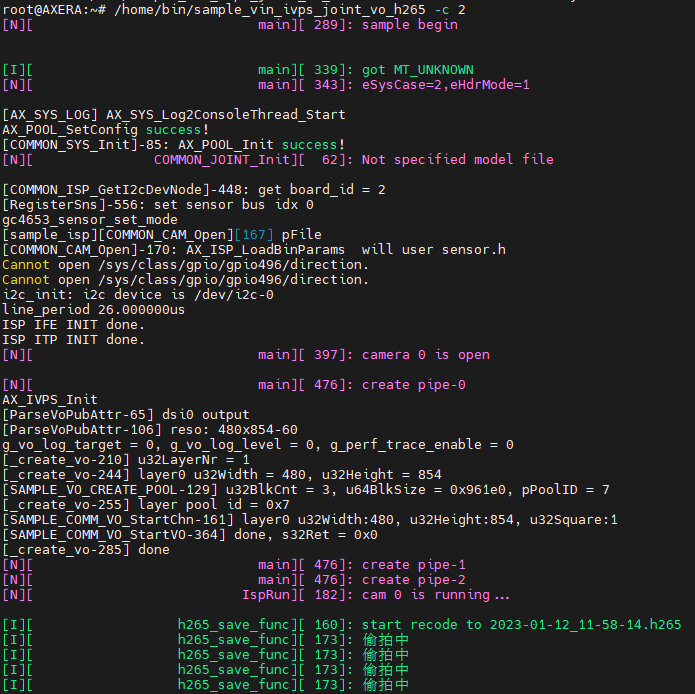


