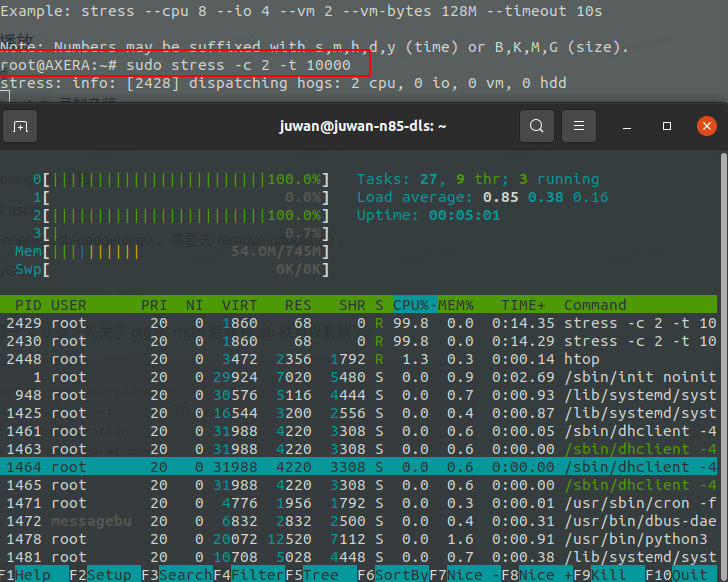
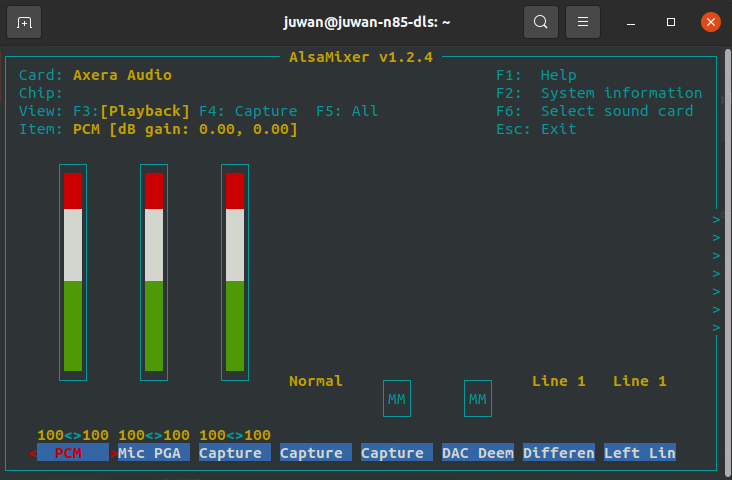
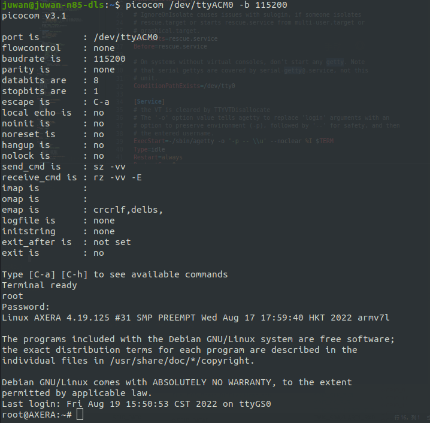
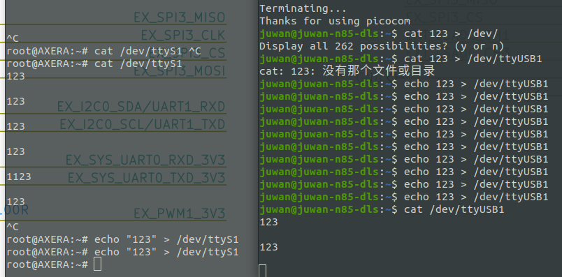
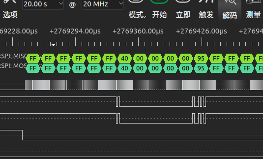

基于上文的烧录系统后，本文介绍使用 Maix-III AXera-Pi 开发板的系统基础使用方法。


## 准备工作

1. 操作前，先把 网线 路由器 准备好，插入 SD 卡上电测试。
2. 开机时按住 USR 键后上电，系统在 20 秒左右将屏幕会亮起，此时屏幕会显示摄像头画面，可用人眼测试屏幕与摄像头。
3. 这时灯光会开始闪烁，等待 WIFI 和 以太网的连接，如果两个都获得 IP 则灯光会灭。
4. 松开按键灯光会全亮，并播放一段测试音频，此时进入录音回放模式，用纸巾刮蹭测试左右声道有效（要调低音量防止过大噪声），此时再按一下按键摄像头画面会停止，灯光会全灭。
5. 我们烧录的是 debian11 系统，常用软件都可以通过 apt 去获取。
6. 系统用户和密码: `root / root` 

如果出现异常现象的话请查询[常见问题]()

## CPU RAM 压测

 `sudo apt-get install stress` 安装 stress 软件，现已预置。
 `sudo stress -c 2 -t 10000` 执行 CPU 压力测试。2代表核数 10000代表时间
查看系统信息使用 `htop` 即可



 `sudo apt install memtester DDR RAM` 测试需要安装一下。
格式: `memtester 内存数量 次数` 比如测试 512M 使用 `memtester 512M &` 挂后台循环测试。

```python
juwan@juwan-n85-dls:~$ memtester 8M
memtester version 4.3.0 (64-bit)
Copyright (C) 2001-2012 Charles Cazabon.
Licensed under the GNU General Public License version 2 (only).

pagesize is 4096
pagesizemask is 0xfffffffffffff000
want 8MB (8388608 bytes)
got  8MB (8388608 bytes), trying mlock ...locked.
Loop 1:
  Stuck Address       : ok         
  Random Value        : ok
  Compare XOR         : ok
  Compare SUB         : ok
  Compare MUL         : ok
  Compare DIV         : ok
  Compare OR          : ok
  Compare AND         : ok
  Sequential Increment: ok
  Solid Bits          : ok         
  Block Sequential    : ok         
  Checkerboard        : ok         
  Bit Spread          : ok         
  Bit Flip            : ok         
  Walking Ones        : ok         
  Walking Zeroes      : ok         
  8-bit Writes        : ok
  16-bit Writes       : ok

Loop 2:
  Stuck Address       : ok         
  Random Value        : ok
  Compare XOR         : ok
  Compare SUB         : ok
  Compare MUL         : ok
  Compare DIV         : ok
  Compare OR          : ok
  Compare AND         : ok
  Sequential Increment: ok
  Solid Bits          : ok         
  Block Sequential    : ok         
  Checkerboard        : ok         
  Bit Spread          : ok         
  Bit Flip            : ok         
  Walking Ones        : ok         
  Walking Zeroes      : ok         
  8-bit Writes        : ok
  16-bit Writes       : ok
```

## EMMC

在 sd 卡启动的系统里它被当做磁盘使用，可以对它进行分区，创建文件系统。

```bash
#相关命令记录
fdisk /dev/mmcblk0 #然后 n p p w 默认创建一个分区 /dev/mmcblk0p1 。
mkfs.ext4 /dev/mmcblk0p1
mount /dev/mmcblk0p1 /mnt/
dd bs=1M count=128 if=/dev/zero of=/mnt/test conv=fdatasync
```

### fdisk 命令参数

```css
p    打印分区列表
n    新建一个分区
d    删除一个分区
回车  使用默认数据输入
q    退出不保存
w    把分区写进分区表，保存并退出
```

## 音频录音与播放

录音驱动采用 alsa 标准音频驱动，与上层保持一致，内置的 wav 文件。

- 测试脚本 `speaker-test -t sine -f 440 -c1`
- 播放音频 `aplay test.wav`
- 录制音频 `arecord test.wav -c 2 -d 2`
- 录音回放 的 python3 代码如下：

```python
import pyaudio

try:
    chunk = 1024      # Each chunk will consist of 1024 samples
    sample_format = pyaudio.paInt16      # 16 bits per sample
    channels = 2      # Number of audio channels
    fs = 44100        # Record at 44100 samples per second
    time_in_seconds = 30
    p = pyaudio.PyAudio()
    stream = p.open(format=sample_format,
                    channels = channels,
                    rate = fs,
                    frames_per_buffer = chunk,
                    input = True, output = True)

    # Store data in chunks for 3 seconds
    for i in range(0, int(fs / chunk * time_in_seconds)):
        data = stream.read(chunk)
        stream.write(data)

finally:
    # Stop and close the Stream and PyAudio
    stream.stop_stream()
    stream.close()
    p.terminate()
```

配置命令 `alsamixer`


## 网卡相关操作

系统里面有回环(lo)、以太网(eth0)、RNDIS（usb0）、wifi-rtl8723bs(wlan0) 等网卡。
目前的网络信息配置参考：

```bash
root@AXERA:~# cat /etc/network/interfaces 
# interfaces(5) file used by ifup(8) and ifdown(8)
# Include files from /etc/network/interfaces.d:
source /etc/network/interfaces.d/*

auto lo
iface lo inet loopback

# auto eth0
allow-hotplug eth0
iface eth0 inet dhcp

# auto usb0
allow-hotplug usb0
iface usb0 inet static
address 192.168.233.1
netmask 255.255.255.0

# allow-hotplug wlan0
# wpa-ssid "dalaoshu"
# wpa-psk "junhuanchen"
auto wlan0
iface wlan0 inet manual
wpa-conf /etc/wpa_supplicant/wpa_supplicant.conf
iface wlan0 inet dhcp
```

`ifconfig` 查看所有网卡信息

```bash
root@AXERA:~# ifconfig 
eth0: flags=4163<UP,BROADCAST,RUNNING,MULTICAST>  mtu 1500
        inet 192.168.0.77  netmask 255.255.255.0  broadcast 192.168.0.255
        ether 1e:09:dc:e9:1c:29  txqueuelen 1000  (Ethernet)
        RX packets 301  bytes 41433 (40.4 KiB)
        RX errors 0  dropped 0  overruns 0  frame 0
        TX packets 31  bytes 2970 (2.9 KiB)
        TX errors 0  dropped 0 overruns 0  carrier 0  collisions 0
        device interrupt 56  

lo: flags=73<UP,LOOPBACK,RUNNING>  mtu 65536
        inet 127.0.0.1  netmask 255.0.0.0
        loop  txqueuelen 1000  (Local Loopback)
        RX packets 16  bytes 1064 (1.0 KiB)
        RX errors 0  dropped 0  overruns 0  frame 0
        TX packets 16  bytes 1064 (1.0 KiB)
        TX errors 0  dropped 0 overruns 0  carrier 0  collisions 0

usb0: flags=4163<UP,BROADCAST,RUNNING,MULTICAST>  mtu 1500
        inet 192.168.233.1  netmask 255.255.255.0  broadcast 192.168.233.255
        ether 02:da:9b:e4:a8:7f  txqueuelen 1000  (Ethernet)
        RX packets 121  bytes 15220 (14.8 KiB)
        RX errors 0  dropped 15  overruns 0  frame 0
        TX packets 35  bytes 7258 (7.0 KiB)
        TX errors 0  dropped 0 overruns 0  carrier 0  collisions 0

wlan0: flags=4163<UP,BROADCAST,RUNNING,MULTICAST>  mtu 1500
        inet 192.168.0.112  netmask 255.255.255.0  broadcast 192.168.0.255
        ether 0c:cf:89:32:c5:c0  txqueuelen 1000  (Ethernet)
        RX packets 950  bytes 154305 (150.6 KiB)
        RX errors 0  dropped 950  overruns 0  frame 0
        TX packets 5  bytes 1398 (1.3 KiB)
        TX errors 0  dropped 0 overruns 0  carrier 0  collisions 0
```

`ifup eth0` 启动 eth0 网卡
`ifdown eth0 --force` 强制关闭 eth0 网卡
WIFI 账号密码存放在 wpa_supplicant.conf 里。

```bash
root@AXERA:~# cat /etc/wpa_supplicant/wpa_supplicant.conf
ctrl_interface=DIR=/var/run/wpa_supplicant GROUP=netdev
update_config=1

network={
    ssid="Sipeed_Guest"
    key_mgmt=WPA-PSK
    psk="qwert123"
}
```

usb0 网卡 rndis 驱动安装参考这篇 [Ghost系列USB网卡（RNDIS) 使用教程](https://www.foream.com/wiki/docs/mindoc/mindoc-1b2er0dm4pos9)，其中在 win10 则如下图。

<html>
  
  
</html>

连接方法看 USB 相关操作：USB 网卡会自动 DHCP 配置，直接连接 192.168.233.1 即可。

## USB 相关操作

在 debian 系统上配置了 `usb-gadget@g1` 和 `usb-gadget@g0` 两个服务。

### 如何配置虚拟网卡 RNDIS usb0

默认就会启动配置 `systemctl enable usb-gadget@g0`，停止开机启动用 `systemctl disable usb-gadget@g0`，停止服务用 `systemctl stop usb-gadget@g0`。
使用 `sshpass -p root ssh root@192.168.233.1` 即可连接，账号密码都是 root 。


### 如何配置虚拟串口 /dev/ttyGS0 并使用

停止 `usb-gadget@g0` 后使用 `systemctl start usb-gadget@g1` 即可看到 。 
然后使用 `systemctl start getty@ttyGS0` 即可转发串口终端到 usb 的虚拟串口上。



### 使用 USB HOST 读取一个 256M 的 SD 卡

先关了 otg 的 rndis 后再 lsusb 就可以看到了。

```bash
root@AXERA:~# systemctl stop usb-gadget@g0
root@AXERA:~# lsusb 
Bus 002 Device 001: ID 1d6b:0003 Linux Foundation 3.0 root hub
Bus 001 Device 002: ID 067b:2731 Prolific Technology, Inc. USB SD Card Reader     
Bus 001 Device 001: ID 1d6b:0002 Linux Foundation 2.0 root hub
root@AXERA:~# fdisk -l
Disk /dev/mmcblk2: 58.94 GiB, 63281561600 bytes, 123596800 sectors
Units: sectors of 1 * 512 = 512 bytes
Sector size (logical/physical): 512 bytes / 512 bytes
I/O size (minimum/optimal): 512 bytes / 512 bytes
Disklabel type: dos
Disk identifier: 0x32eb5429

Device         Boot  Start       End   Sectors  Size Id Type
/dev/mmcblk2p1 *      2048    264191    262144  128M  c W95 FAT32 (LBA)
/dev/mmcblk2p2      264192 123596799 123332608 58.8G 83 Linux


Disk /dev/sda: 240 MiB, 251658240 bytes, 491520 sectors
Disk model: SD Card Reader  
Units: sectors of 1 * 512 = 512 bytes
Sector size (logical/physical): 512 bytes / 512 bytes
I/O size (minimum/optimal): 512 bytes / 512 bytes
Disklabel type: dos
Disk identifier: 0x0607cfd2

Device     Boot Start    End Sectors   Size Id Type
/dev/sda1  *      240 490239  490000 239.3M  e W95 FAT16 (LBA)
root@AXERA:~# 
```

## NPU 相关操作

[点击获取文件]()
把文件放进系统里 `/opt/bin/run_joint resnet50.joint --repeat 100 & `重复运行 100 次测试 npu 模型功能。

## 测试屏幕驱动

`/opt/bin/sample_vo -v dsi0@480x360@60 -m 0` 屏幕会显示彩条。

### 新增 fb 设备支持

- 先使用 `/opt/bin/sample_vo_fb &` 绑定 fb0 设备，如果使用 libdrm 则需要 `killall ample_vo_fb`，解除 vo 的占用。
- 再使用 `/home/fbv-1.0b/fbv /home/examples/480x360.jpg` 显示图像。

- 使用 `wget https://picsum.photos/200/300` 即可获取想要的图像（如分辨率 200x300）。

## 内置 AI 应用

现在默认终端不是 dash 而是 bash 了，使用 `sudo dpkg-reconfigure dash` 切换。
要有以太网 IP 才能启动。

### IPCDEMO 人脸识别 车牌识别

介绍：
获取方式：
效果：
**使用流程**

1. 在浏览器上打开 http://192.168.0.147:8080 这是以太网的 IP ，也可以通过 usb 访问 192.168.233.1 这个 IP 。

```bash
[1660898353.438209] [      IVPS][                    Start] CStage::Start ---
[1660898353.438257] [    Camera][                    Start] [0][0] +++
[1660898353.438269] [      IVPS][   ProcessFrameThreadFunc] +++
[1660898353.438542] [    Camera][        ItpLoopThreadFunc] [0] +++
[1660898353.489382] [    Camera][                    Start] [0][0] ---
[1660898353.490782] [HOTBALANCE][                    Start] +++
[1660898353.490975] [HOTBALANCE][                    Start] HotBalance monitor start: (M:105.00,L:90.
00,Gap:0.00,level:1)
[1660898353.492605] [HOTBALANCE][      APP_EnterNormalMode] Clk works to mid mode
[1660898353.493132] [HOTBALANCE][                    Start] ---
[1660898353.594197] [      MAIN][                     main] Preview the video using URL: <<<<< http:/
/192.168.0.147:8080 >>>>>n
```

2. 访问上面的 IP 地址后会弹出以下页面，直接登录即可。

3. 登录后会出现图像(待补充)


### SKEDEMO 人体姿态检测

介绍：
获取方式：
效果：

### 摄像头直显屏幕

### 设置 RTC 時間方法

1. 查看时间 `cat /sys/class/rtc/rtc0/time && cat /sys/class/rtc/rtc0/date`

```bash
root@AXERA:~# cat /sys/class/rtc/rtc0/time && cat /sys/class/rtc/rtc0/date
08:13:30
2022-08-19
```
2. 設置时间 hwclock -w -f /dev/rtc0 只要这个方法可以写进去。
3. 确认 RTC 是否写入成功，只需要断电后重启的时间不为 1970 就行。

## GPIO 操作示意

对于 AX 的芯片，只需要参考这份配好的引脚图（pinmux）即可。
[点击查看引脚图]()

### 读取 KEY 按键

读取 KEY 按键输入：GPIO0 30

```bash
echo 30  > /sys/class/gpio/export
echo in > /sys/class/gpio/gpio30/direction
cat /sys/class/gpio/gpio30/value
```

### 点亮 LED 灯 

GPIO2 A4 == 68 A5 69

```bash
echo 68  > /sys/class/gpio/export
echo out > /sys/class/gpio/gpio68/direction
echo 1 > /sys/class/gpio/gpio68/value
sleep 1
echo 0 > /sys/class/gpio/gpio68/value
sleep 1
echo 1 > /sys/class/gpio/gpio68/value
```

计算规则 GPIO2 A4 == 32 *  2 + 4 = 68
对于爱芯的芯片，GPIO0 和 GPIO2 对应 A 和 C ，此处 A4  不代表 GPIO2 只是序号。
也就是 GPIO2 A4 在标准设备中的定义为 GPIO C(2) 4(A4) 同理 GPIOA0 对应 GPIO0A4。
所以现在统一到 PA0 或 PC4 这类定义，方便后续使用。

## I2C 操作示意

```bash
root@AXERA:~# i2cdetect -y -r 0
     0  1  2  3  4  5  6  7  8  9  a  b  c  d  e  f
00:                         -- -- -- -- -- -- -- -- 
10: -- -- -- -- -- -- -- -- -- -- -- -- -- -- -- -- 
20: -- 21 -- -- -- -- -- -- -- -- -- -- -- -- -- -- 
30: -- -- -- -- -- -- 36 -- -- -- -- -- -- -- -- -- 
40: -- -- -- -- -- -- -- -- -- -- -- -- -- -- -- -- 
50: -- -- -- -- -- -- -- -- -- -- -- -- -- -- -- -- 
60: -- -- -- -- -- -- -- -- -- -- -- -- -- -- -- -- 
70: -- -- -- -- -- -- -- --                         
root@AXERA:~# 
```

与其他芯片同理

## PWM 操作示意

以 pwm1 示意，pwm0 被锁在屏幕背光了，目前在系统上还没有开 debugfs 或 sysfs 接口去控制。

```bash
echo 1 > /sys/class/pwm/pwmchip0/export
echo 4167 > /sys/class/pwm/pwmchip0/pwm1/period
echo 2084 > /sys/class/pwm/pwmchip0/pwm1/duty_cycle
echo 1 > /sys/class/pwm/pwmchip0/pwm1/enable
```

## UART 操作示意

里面默认是 ttyS0 ，排针上的是 ttyS1 ，虚拟串口是 ttyGS0


## SPI 操作示意

要更新 uboot 和 内核 
[点击查询](https://www.cnblogs.com/juwan/p/14341406.html)
获取 spidev:


```bash
root@AXERA:~# ./spidev_test -D /dev/spidev1.0 -v 
spi mode: 0x0
bits per word: 8
max speed: 500000 Hz (500 KHz)
TX | FF FF FF FF FF FF 40 00 00 00 00 95 FF FF FF FF FF FF FF FF FF FF FF FF FF FF FF FF FF FF F0 0D  | ......@....�..................�.
RX | FF FF FF FF FF FF 40 00 00 00 00 95 FF FF FF FF FF FF FF FF FF FF FF FF FF FF FF FF FF FF F0 0D  | ......@....�..................�.
root@AXERA:~# ./spidev_test -D /dev/spidev1.0 -v 
spi mode: 0x0
bits per word: 8
max speed: 500000 Hz (500 KHz)
TX | FF FF FF FF FF FF 40 00 00 00 00 95 FF FF FF FF FF FF FF FF FF FF FF FF FF FF FF FF FF FF F0 0D  | ......@....�..................�.
RX | FF FF FF FF FF FF FF FF FF FF FF FF FF FF FF FF FF FF FF FF FF FF FF FF FF FF FF FF FF FF FF FF  | ................................
root@AXERA:~# ./spidev_test -D /dev/spidev1.0 -v 
spi mode: 0x0
bits per word: 8
max speed: 500000 Hz (500 KHz)
TX | FF FF FF FF FF FF 40 00 00 00 00 95 FF FF FF FF FF FF FF FF FF FF FF FF FF FF FF FF FF FF F0 0D  | ......@....�..................�.
RX | FF FF FF FF FF FF FF FF FF FF FF FF FF FF FF FF FF FF FF FF FF FF FF FF FF FF FF FF FF FF FF FF  | ................................
```

## ADC 操作示意

参考 外围开发手册，这需要专用的代码控制，暂时没有写。
1. 设置 THM 寄存器
2. 中间需要 delay 一段时间，否则读取出来的值，可能不对；
3. 0x2000028 寄存器读取出来的值 DATA
4. DAT 和 voltage 的对应关系，voltage = DATA / 1024 * VREF(1.8V)
5. 如果读取 chan1/2/3/4，需要读取 0x200002c，0x2000030，0x2000034，0x2000038

### 使能 ADC 通道

```bash
devmem 0x2000020 32 0x1000 //chan0
devmem 0x2000020 32 0x800 //chan1
devmem 0x2000020 32 0x400 //chan2
devmem 0x2000020 32 0x200 //chan3
devmem 0x2000020 32 0x100 //chan4

devmem 0x200002c
devmem 0x2000030
devmem 0x2000034
devmem 0x2000038
```
