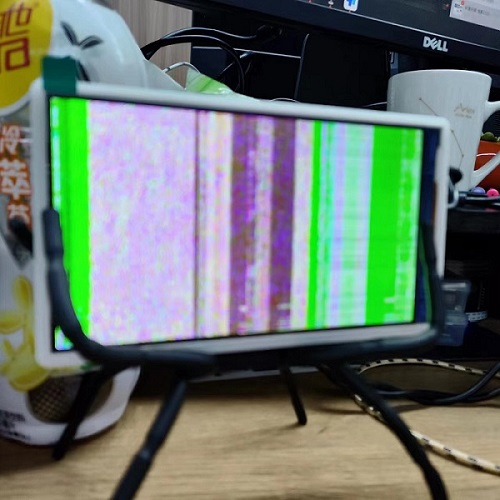
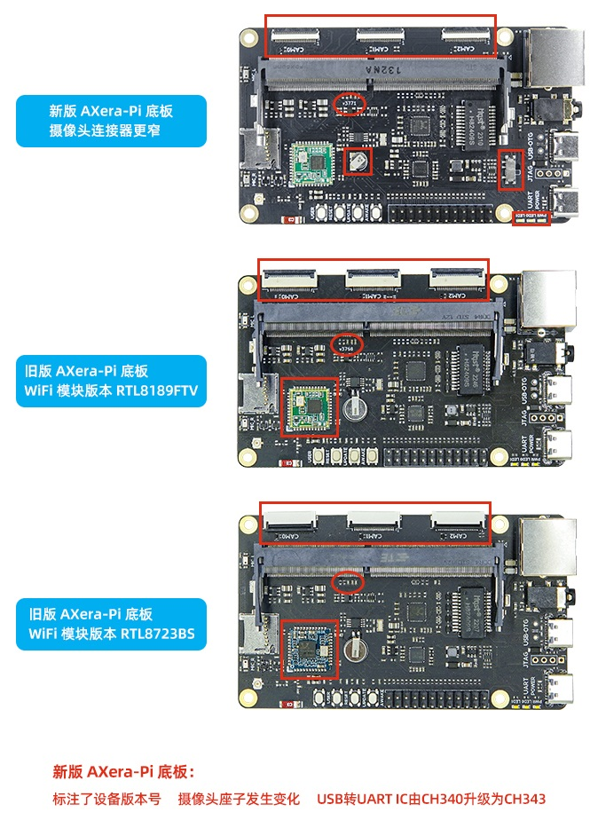
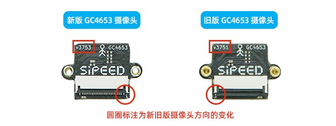
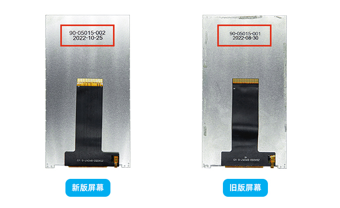
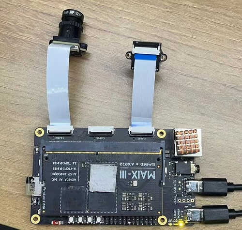

## Q：供电不足怎么办？

A：可以把两根 usb 口接上来供电，板子至少要 USB3.0 1A 的电流才能启动喔！（拉黑 USB2.0 500ma）

## Q：被产品电了怎么办？

A：最近冬天静电来了，产品要注意接地喔。

## Q：如何更换 os04a10 摄像头？

A：**一改参数，二改代码，以下述改动为例**：

- 类似 sample_vin_vo 这类命令改 `-c 0` 就可以启用 os04a10 摄像头，对应 `-c 2` 就是默认提供的 gc4653 摄像头。
- 如果是类似 [IPCDemo](https://wiki.sipeed.com/hardware/zh/maixIII/ax-pi/basic_usage.html#IPCDemo) 的话更改相对应后缀 gc4653 为 `gc4653_config.json`、os04a10 为 `os04a10_config.json`。
  
- 像[RSTP](https://wiki.sipeed.com/hardware/zh/maixIII/ax-pi/basic_usage.html#rtsp) 这种脚本运行的示例，可以通过编辑里面的摄像头注释来改变摄像头配置。
  

- 可以编辑 C 代码里设置默认摄像头的代码 `COMMON_SYS_CASE_E eSysCase = SYS_CASE_SINGLE_GC4653;` 来切换摄像头，详细可看[components/libmaix/lib/arch/axpi/libmaix_cam/libmaix_cam.cpp#L93](https://github.com/sipeed/libmaix/blob/release/components/libmaix/lib/arch/axpi/libmaix_cam/libmaix_cam.cpp#L93)

  
  

## Q：运行摄像头有关程序时报错 i2c_read: Failed to read reg: Remote I/O error.!？

A：摄像头接线是否正确、检查摄像头配置是否与型号相匹配、参数是否修改、启动命令行输入是否出错、以及摄像头是否启动；如果以上都是正确的话，摄像头依旧报错就是硬件问题了。

## Q：如何更换其他屏幕？

A：目前默认只提供 5 寸屏幕，支持其他屏幕需要自行修改驱动代码和设备树，以及对应的应用层显示代码。

## Q：运行 xxxx menuconfig 时遇到报错 locale.Error: unsupported locale setting !?

A：可以使用 `sudo localedef -i en_US -f UTF-8 en_US.UTF-8` 恢复一下配置即可。

## Q：运行 IPC ODM 命令时报错 VCEncInit:ERROR codecFormat NOT support by HW !?

A：试着按复位键或者是插拔重启设备即可。

## Q：运行程序后屏幕显示花屏？

A：查看摄像头型号参数是否配置正确。

## Q：运行命令后报错：Bus Error！？

A：这种情况是 SD 卡质量问题导致掉卡，也就是镜像卡里面的程序崩掉了无法读取到。

- 更换质量好一点的 SD 卡或官方购买镜像卡，可参照 `SD` 卡测试选购合适的卡[点击前往查看](https://wiki.sipeed.com/hardware/zh/maixIII/ax-pi/flash_system.html#%E5%A6%82%E4%BD%95%E9%80%89%E6%8B%A9-SD-%E5%8D%A1%EF%BC%9F)。

## Q：使用 `ifconfig -a` 查看后没有 eth0 ip 地址？

A：没有联网的话会直接看不到 ip 地址，查看下网线是否有接入、是否接稳了。
   - 或使用 `dhclient eth0` 手动启动或参考文档[传送门](https://wiki.sipeed.com/hardware/zh/maixIII/ax-pi/basic_usage.html#%E6%9C%89%E7%BA%BF%E4%BB%A5%E5%A4%AA%E7%BD%91%EF%BC%88eth0%EF%BC%89%E9%85%8D%E7%BD%AE%E6%96%B9%E6%B3%95)重新配置 ip 获取地址。

## Q：运行 uvc 命令后一直报错读取不到设备？

A：这种情况一般会少数出现在 Windows 环境上，查看设备管理器是不是有什么显示异常驱动，卸载后即可使用。

## Q：运行 uvc 命令后出现卡住现象？

A：重启即可

## Q：使用 ssh 登陆后断开报错：packet_write_wait: Connection to 10.xxx.xxx.xxx port 22: Broken pipe！

A: 运行一下`python3 -c "import os, binascii; os.system('sed -i \'/iface eth0 inet dhcp/ahwaddress ether {}\' /etc/network/interfaces'.format(binascii.hexlify(bytes.fromhex(open('/proc/ax_proc/uid').read().split('0x')[1][:-5]),':').decode('iso8859-1'))) if os.system('grep \'hwaddress ether\' /etc/network/interfaces -q') != 0 else exit();"` 后重启即可。

## Q：硬件物料更改说明、没有 wlan0 、屏幕烧屏、摄像头倒过来怎么解决？

> **新旧版底板区别**
> 
1. 在新底板上我们标注了设备号：`v3768`，用户也可以根据版本号来确认版本的不同。
2. 底板摄像头 FPC 连接座更换，主要就是固定方向改变，但是接线方向未变。
3. WiFi 模块更换：`旧 RTL8723BS` -> `新 RTL8189FTV`。

**如果遇到 wlan0 不显示的话请参考以下解决方法：**

1. 根据下图确定 WiFi 模块的版本来替换 `/boot` 目录下的相对应的驱动，更新内核驱动可以用 `cp /boot/kernel.img.rtl8723bs /boot/kernel.img` 更新后请重启板卡。
2. 可能是运输导致核心板与底板衔接松了，重新插拔装紧核心板即可。
3. 尝试以上方法后仍不显示 wlan0 的话，重新烧录镜像（未知系统问题、极少见）。

> **新旧版摄像头区别**

新版摄像头线序方向发生了变化，可点击[接线示例](https://wiki.sipeed.com/hardware/zh/maixIII/ax-pi/flash_system.html#%E5%A6%82%E4%BD%95%E8%BF%9E%E6%8E%A5%E5%A4%96%E8%AE%BE%E5%92%8C%E9%85%8D%E4%BB%B6%EF%BC%9F)参考并进行接线防止接反导致烧坏排线或板卡。

**如出现摄像头、屏幕画面反了倒过来了可参考以下解决方法：**

`V3751` 版本的摄像头批次导致的问题，物理旋转即可解决。

有装配亚克力外壳的 AXera-Pi 可参考以下图例旋转安装：

<html>
      
      
</html>

> **新旧版屏幕区别**

新旧板的屏幕所使用的设备树（驱动）不同。

**屏幕上电后出现残影、锯齿、烧屏或下图画面请参考以下解决方法：**

<html>
      
      
</html>

新旧版的屏幕设备树不同，根据上图日期区分并替换 `/boot` 目录下对应的 `dtb` 设备树驱动即可，请及时更换否则会导致烧屏，使用 `cp /boot/dtb.img.lcd20220830 /boot/dtb.img` 进行设备树替换后重启。

## Q：运行 opencv 相关后报错：can't open camera by index.

A：查询一下摄像头设备号是否与代码内调用设备号的一致。

## Q：烧录后启动失败显示 XERA-UBOOT=>

A：进入 uboot 模式了输入 boot 后即可启动。

## Q：芯片为什么显示 1G 内存以及用户为什么只能用 1.3g 内存

- 第一个是 uboot 显示 bug 我们贴的都是 2GB 内存.
- 第二个是 系统上显示的内存为什么不是刚好 2GB，这里根据原厂芯片方案可知官方设计的 1G 内存分配方案为 256M + 768M CMM.

- 而我们贴的是 2GB 内存采用的是 512M CMM 的内存方案，其余的内存 2048M - 512M = 1536M 为用户空间内存，再除去 256M kernel 内存后剩下 1536M - 256M 约等于 1.3G 供用户使用

什么是 CMM 内存，简单理解就是一段独立于 linux 系统之外的大段线性物理内存，一般是分给 NPU ISP GPU 用的线性物理空间，这意味着加载模型不需要消耗 1.22G 用户空间内存，消耗的是 CMM 内存，如推理、编码、ISP处理都不会吃用户空间内存。

现在带 NPU ISP GPU 的芯片都会有类似的设计或概念，可以从芯片手册或驱动代码中得知。
如爱芯的 `/soc/scripts/auto_load_all_drv.sh` 存放有 `insmod /soc/ko/ax_cmm.ko cmmpool=anonymous,0,0x60000000,512M` 这个字段。

以及系统启动配置：
`/* bootargs for SD */#define BOOTAGRS_SD "mem=1536M initcall_debug=0 loglevel=0 ax_boot_delay=0 vmalloc=768M console=ttyS0,115200n8 earlyprintk=dw_uart, init=/sbin/init noinitrd root=/dev/mmcblk2p2 rw rootdelay=3 rootfstype=ext4"`

## Q：关于 M3axpi 支持双摄的说明（支持 gc4653）

在硬件上不能支持 os04a10 双摄，软件支持但需要自行画底板使用，使用 GC4653 双摄的话需替换设备树文件，具体资料可参考：[点我](https://dl.sipeed.com/shareURL/MaixIII/AXera/11_patch/dual_gc4653_patch)