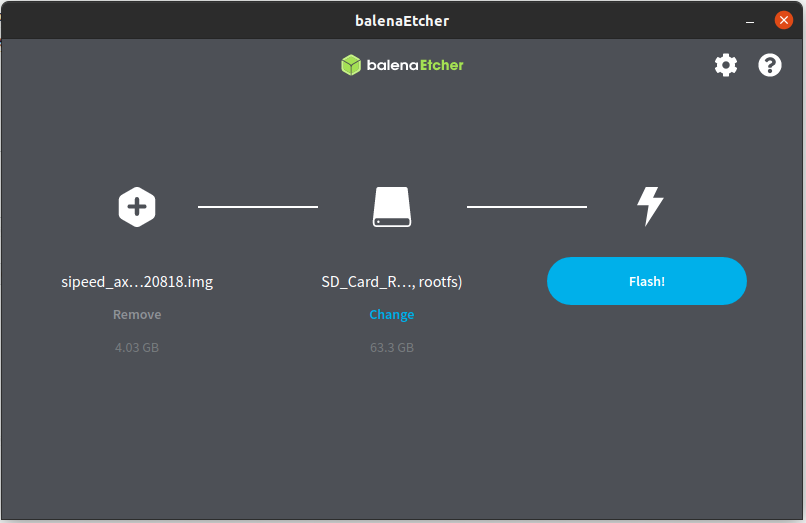

---

## 系统简介

AXera-Pi 默认板卡没有存储介质，因此我们需要准备一张系统卡来启动设备。

对于 AXera-Pi 我们提供的是 Debian 镜像，用来使用这款开发板足够了。

官方店铺可以购买到预烧录了系统镜像的 SD 卡，不然的话我们就需要进行下面的操作来自己准备 SD 镜像卡了。

## 获取镜像

因为镜像文件比较大，因此这里仅提供百度云下载链接：

前往百度云 [点我](https://eyun.baidu.com/s/3htTXfaG#sharelink/path=%2F%E4%B8%8B%E8%BD%BD%E7%AB%99%E6%96%87%E4%BB%B6%2FMaix-III%2FAXera%2Fsdk%2Frelease&parent_path=%2F%E6%B7%B1%E5%9C%B3%E7%9F%BD%E9%80%9F%E7%A7%91%E6%8A%80%E6%9C%89%E9%99%90%E5%85%AC%E5%8F%B8) 下载文件，镜像包与校验文件都已经放在里面了。

## 烧录镜像

### 准备工作

硬件：
- 一张容量大于 4G 的 SD 卡；建议购买官方提供的卡，不然可能因为其他的 SD 卡质量差而带来糟糕的体验
- 一个读卡器；建议使用 USB3.0 接口得读卡器，不然读卡器得 USB 速度过低会导致烧录时间过长

软件：
- <a href="https://www.balena.io/etcher/" alt="Etcher" target="_blank"> Etcher </a>；根据自身电脑下载对应版本的软件即可

### 镜像系统烧录方法

首先解压所下载的镜像压缩包，得到 `.img` 镜像文件，打开 [Etcher](https://www.balena.io/etcher/ "Etcher") 软件，点击 `Flash from file` ,选中解压出来的 `.img ` 文件镜像，然后点击 `Select target` 选中sd卡，最后点击 `Flash` 进行烧录，等待完成即可。 

解压出镜像文件：

烧录镜像文件到 SD 卡：

下面这种是烧录中的一张截图：

最终下载结束后的效果会和下图一样，显示 `Flash Complete!`：

如果烧录失败了，请手动格式化一下 sd 卡。Windows 和 MacOS 可以使用 [SD Card Formatter](https://www.sdcard.org/downloads/formatter/eula_windows/SDCardFormatterv5_WinEN.zip)来格式化 sd 卡，Linux 系统可以使用 [Gparted](https://gparted.org/)来格式化。

<!-- 烧录方法如下图示意

点击“flash!”开始烧录，可看到进度条的跳动。

最终下载结束后的效果会和下图一样，显示 `Flash Complete!`：

如果烧录失败的话 方法： -->