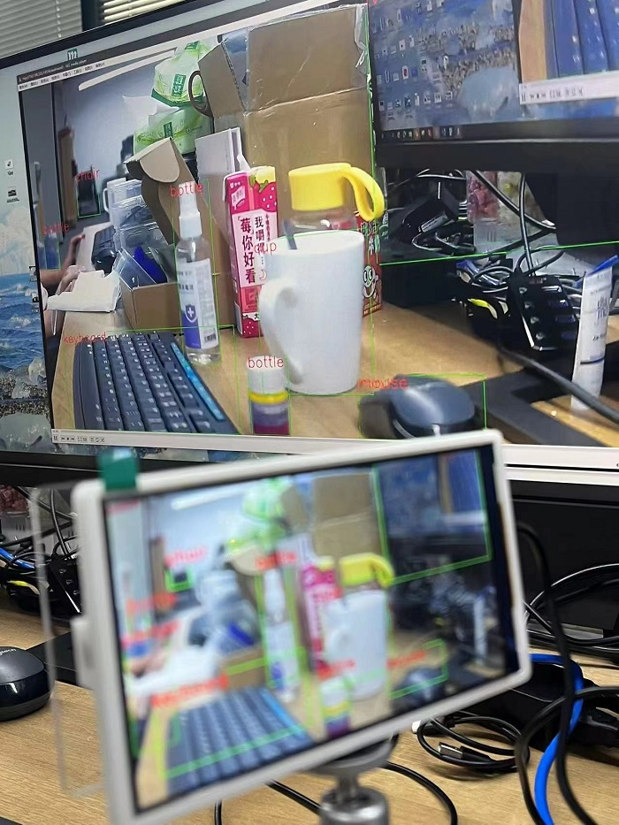
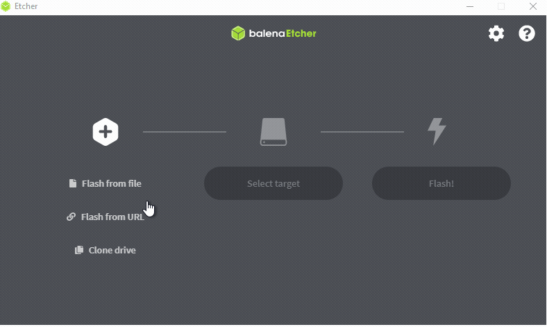

---

## 上手引导指南

为了让小伙伴们轻松、快速、平稳地把产品用起来，我们准备了新手初学者上手引导指南：

### 烧录系统

>**注意**：已购买镜像卡的同学跳过这一步骤，直接把 TF 卡插上即可启动 Linux Debian 系统。

**烧录系统镜像传送门**：[点击前往](https://wiki.sipeed.com/hardware/zh/maixIII/ax-pi/flash_system.html#系统简介).

设备默认是没有 Emmc 介质可以启动的，需要从 TF 卡启动 Linux 系统，请从上文「烧录系统镜像」了解。
通过跨平台烧录工具 [Etcher](https://etcherpc.com/) 烧录镜像成功后，进行下一步接线准备启动板子。


### 启动系统

**如何正确接入屏幕及摄像头**：[点击查看](https://wiki.sipeed.com/hardware/zh/maixIII/ax-pi/basic_usage.html#%E6%8E%A5%E7%BA%BF%E7%A4%BA%E4%BE%8B).

当完成上一步骤后我们需要给 AXera-Pi 进行正确的接线并上电启动。
把镜像卡插入卡槽并接上 `USB-UART` 和 `USB-OTG` 口，再把摄像头与屏幕后接好给设备通电就行。


>在 **20221013** 后设备通电开机会从耳机播放音乐和点亮出厂的 5 寸屏幕，并在串口输出如下的 debian11 系统启动日志（截取部分日志如下）.[有些同学会遇到 Ubuntu22.04 CH340系列串口驱动（没有ttyUSB）问题，点此查看解决方案](https://blog.csdn.net/qq_27865227/article/details/125538516)。

.. details:: 点击查看 debian11 系统启动日志  

    

    ```bash
    Vddr init success!
    The system boot form EMMC
    enter boot normal mode

    U-Boot 2020.04 (Jun 16 2022 - 00:16:34 +0800)

    Model: AXERA AX620_demo Board
    DRAM:  1 GiB
    NAND:  unknown raw ID 77ee0178
    uclass_get_device: Invalid bus 0 (err=-524)
    0 MiB
    initr_pinmux: delay pinmux_init for env board id
    MMC:   enter sdhci_cdns_get_cd call mmc_getcd
    enter sdhci_cdns_get_cd call mmc_getcd
    mmc@10000000: 0, mmc@4950000: 1
    Loading Environment from MMC... OK
    In:    serial
    Out:   serial
    Err:   serial
    MMC: no card present
    sd card is not present
    enter normal boot mode
    Net:
    reset EMAC0: ethernet@0x4970000 ...
    Warning: ethernet@0x4970000 (eth0) using random MAC address - 6a:e4:fd:58:97:ea
    eth0: ethernet@0x4970000
    Hit any key to stop autoboot:  0
    reading DTB and BOOT image ...
    reading bootimg header...
    MAGIC:       AXERA!
    img size:    4841536
    kernel_size: 4841472
    kernel_addr: 64
    id:bc 19 bb a7 2d 27 74 de 7c 91 4b 70 ea c9 ab 96 50 61 bd e0 2b 02 8b e5 c8 ee 22 ce df b1 cf ea
    load kernel image addr = 0x40008000,load dtb image addr = 0x48008000
    boot cmd is :bootm 0x40008000 - 0x48008000
    ## Booting kernel from Legacy Image at 40008000 ...
      Image Name:   Linux-4.19.125
      Image Type:   ARM Linux Kernel Image (uncompressed)
      Data Size:    4839952 Bytes = 4.6 MiB
      Load Address: 40008000
      Entry Point:  40008000
      Verifying Checksum ... OK
    ## Flattened Device Tree blob at 48008000
      Booting using the fdt blob at 0x48008000
      Loading Kernel Image
      Using Device Tree in place at 48008000, end 480103d6

    Starting kernel ...


    Welcome to Debian GNU/Linux 11 (bullseye)!

    [  OK  ] Created slice system-getty.slice.
    [  OK  ] Created slice system-modprobe.slice.
    [  OK  ] Created slice system-serial\x2dgetty.slice.
    [  OK  ] Created slice User and Session Slice.
    [  OK  ] Started Dispatch Password …ts to Console Directory Watch.
    [  OK  ] Started Forward Password R…uests to Wall Directory Watch.
    [  OK  ] Reached target Local Encrypted Volumes.
    [  OK  ] Reached target Network is Online.
    ......
    ```

### 登录到板子里

**系统使用手册传送门**：[点击前往](https://wiki.sipeed.com/hardware/zh/maixIII/ax-pi/basic_usage.html#%E7%B3%BB%E7%BB%9F%E7%99%BB%E5%BD%95).

当 **AXera-Pi** 正常开机成功后，这时候我们把板子当做一台 Linux 服务器来对待。还需要通过**「系统使用手册」**来快速帮助用户了解如何登录到设备里的 Linux 系统。同时它还会告诉你，板上所有验证过的系统调频、外设、驱动、应用等资源的用法，像一些 Linux 操作基础、如何控制 I2C / UART / SPI 这些硬件设备的操作，或是直接运行板子内置的 AI 开箱应用模型等内容。


.. details::这里以 USB-OTG 口的 usb0 网卡（192.168.233.1）作为 ssh 登录的 ip 进入板子为例。

    ```bash
    juwan@juwan-n85-dls:~/sipeed_wiki$ sshpass -p root ssh root@192.168.233.1
    Linux AXERA 4.19.125 #53 SMP PREEMPT Tue Sep 13 13:16:27 HKT 2022 armv7l

    The programs included with the Debian GNU/Linux system are free software;
    the exact distribution terms for each program are described in the
    individual files in /usr/share/doc/*/copyright.

    Debian GNU/Linux comes with ABSOLUTELY NO WARRANTY, to the extent
    permitted by applicable law.
    Last login: Wed Oct 12 16:43:43 2022 from 192.168.233.10
    root@AXERA:~# screenfetch
            _,met$$$$$gg.           root@AXERA
          ,g$$$$$$$$$$$$$$$P.        OS: Debian
        ,g$$P""       """Y$$.".      Kernel: armv7l Linux 4.19.125
      ,$$P'              `$$$.      Uptime: 2d 3h 5m
      ',$$P       ,ggs.     `$$b:    Packages: 785
      `d$$'     ,$P"'   .    $$$     Shell: bash 5.1.4
      $$P      d$'     ,    $$P     Disk: 2.6G / 3.6G (77%)
      $$:      $$.   -    ,d$$'     CPU: ARMv7 rev 5 (v7l) @ 4x 1.248GHz
      $$\;      Y$b._   _,d$P'      RAM: 88MiB / 744MiB
      Y$$.    `.`"Y$$$$P"'
      `$$b      "-.__
        `Y$$
        `Y$$.
          `$$b.
            `Y$$b.
                `"Y$b._
                    `""""

    root@AXERA:~# ax_clk
    AX620A:
    DDR:            3733 MHz
    CPU:            800 MHz
    BUS of VPU:     624 MHz
    BUS of NPU:     624 MHz
    BUS of ISP:     624 MHz
    BUS of CPU:     624 MHz
    NPU OTHER:      800 MHz
    NPU GLB:        24 MHz
    NPU FAB:        800 MHz
    NPU CORE1:      800 MHz
    NPU CORE0:      800 MHz
    ISP:            533 MHz
    MM:             594 MHz
    VPU:            624 MHz
    root@AXERA:~#
    ```

我们可以知道板子的基础信息，目前默认是用 800Mhz 来跑，而且内存分配较保守能留给用户的空间内存不到 1GB，但不用担心，板子贴得内存最小都得是 2G 的，所以之后会通过更新内核开放更多内存给用户空间。

### 编译代码运行

能走到这里就说明板子已经用起来了，那就来开发吧！在这之前需要**「准备开发环境」**了解如何拷贝文件到板子里，如何搭建本地编译或交叉编译，然后通过**「SDK 开发指南」**学习到如何基于现有的代码进行开发。

- [准备开发环境](https://wiki.sipeed.com/hardware/zh/maixIII/ax-pi/dev_prepare.html)

快速了解现在提供哪些开源代码仓库以及用法，这些开源仓库会持续更新和开放的。

- [SDK 开发指南](https://wiki.sipeed.com/hardware/zh/maixIII/ax-pi/sdk_usage.html)


### 训练模型部署

初学者训练模型可以从 [AI 开发指南](https://wiki.sipeed.com/ai/zh/deploy/ax-pi.html) 学习如何训练一个最简单的模型到量化转换部署测试。


更专业更深入的调优需要了解 [Pulsar](https://pulsar-docs.readthedocs.io/) ，这是由**「爱芯元智」**自主研发的 all-in-one 神经网络编译器，充分发挥片上异构计算单元(CPU+NPU)算力， Pulsar 工具链核心功能是将 .onnx 模型编译成芯片能解析并运行的 （.joint） 模型。

目前有以下几种部署方式（Pipeline）推荐：

- **libmaix**：并不在意程序的性能和效率，用最快的方式把摄像头图像输入 AI 模型后输出识别结果绘制到显示到屏幕上验证一下识别效果。

- **ax-pipeline**：没有多余的封装，直接操作芯片核心资源 vin \ ivps \ npu \ vo 等硬解设备进行部署开发，可以使模型部署达到一个非常好的效果。

- **IPCDemo**：以效果最好、性能最好、占用最少、稳定可靠、功能最多、确保最终能部署到用户的现场不出问题的框架代码来开发 AI 程序。

#### libmaix 部署

在板子上编译这个示例代码 [axpi_classification_cam](https://github.com/sipeed/libmaix/tree/release/examples/axpi_classification_cam)，然后放入模型运行后即可看到效果，截止 **20221013** 前代码还没有优化所以性能不高只够看个结果，想要效果和性能可以看 **ax-pipeline** 部署。

<p align="center">
  
</p>

即可验证效果：[详细可从 maixhub 上获取](https://maixhub.com/model/zoo/89)。

#### ax-pipeline 部署

以上的部署方式都出于快速验证或应用落地的角度进行的，还有一套基于 **bsp sdk** 的 [ax-pipeline](https://github.com/AXERA-TECH/ax-pipeline) 部署方式，它面向既了解 AI 又知道芯片底层 Linux 开发方法的同学，目前内置应用中提供了板子的 **rtsp** 和屏幕双推流 **yolov5** 实时识别以及新增 **yolov5s-seg** 实例分割的程序就是来自于它。



#### IPCDemo 部署

这是一个典型的 IPC 演示程序，源码在这里 [axpi_bsp_sdk IPCDemo](https://github.com/sipeed/axpi_bsp_sdk/tree/main/app/IPCDemo) ，其中 IPCDemo 的功能模块有：

- ISP：负责从 Sensor 获取图像 RAW 数据并转为 YUV，最终分 3 路通道输出以上信息。
- IVPS：图像视频处理模块。实现对视频图形进行一分多、Resize、Crop、旋转等功能。
- VENC / JENC：视频/JPEG 编码输出。
- Detect：支持人脸或结构化检测。
- Web 显示：实现 H264 流的 Web 传输和提供 Web 方式查看实时视频。
- RTSP 推流：实现 H264 流的 RTSP 封装以及传输。
- 录像 TF 卡存储：封装 H264 流为 MP4 格式文件并保存至 TF 卡或者 FLASH 空间。

以下视频中的 IPCDemo 程序使用方法请点击右侧[内置开箱应用](https://wiki.sipeed.com/hardware/zh/maixIII/ax-pi/basic_usage.html#%E5%86%85%E7%BD%AE%E5%BC%80%E7%AE%B1%E5%BA%94%E7%94%A8)查看。

<p align="center">
    <iframe src="//player.bilibili.com/player.html?aid=260625114&bvid=BV1me411T7g8&cid=837160730&page=1" scrolling="no" border="0" frameborder="no" framespacing="0" allowfullscreen="true" style="max-width:640px; max-height:480px;"> </iframe>
</p>

## 系统简介

AXera-Pi 默认板卡没有存储介质，因此需要准备一张系统卡来启动设备。

目前 AXera-Pi 提供的是 Debian11 Bullseye 镜像，[Ubuntu 源自 Debian。 这意味着 Ubuntu 使用与 Debian 相同的 apt 打包系统，并共享来自 Debian 存储库的大量软件包和库，利用 Debian 基础设施作为基础。 大多数“派生” Linux 发行版，它们使用相同的包管理系统并与基于的发行版共享软件包。 ](https://zhuanlan.zhihu.com/p/426219868)。

> [选择 Debian 的理由](https://www.debian.org/intro/why_debian)

官方店铺可以购买预烧录系统镜像的 SD 卡，否则就需要自己进行以下的操作来准备 SD 镜像卡了。

## 如何选择 SD 卡？

除了在官方店铺购买以及预烧录 debian11 的 SD 卡还可以在参考以下表格选择适合需求的 SD 卡。
为了方便用户选择，我们对部分 SD 卡在 AXera-Pi 板子上进行了读写测速。


> 因为部分 SD 卡是后面陆续才进行测试，没有一一单独拍照但可以根据型号辨认。 

| 序号 | 型号                                     | <p style="white-space:nowrap">写入速度（写入量 160MB）</p> | <p style="white-space:nowrap">读取速度（读取量 160MB） </p> |
| ---- | ---------------------------------------- | ---------------------------------------------------------- | ----------------------------------------------------------- |
| 1.   | Netac 朗科 A2  P500-超高速-64GB 存储卡   | 2.04697 s, 80.0 MB/s                                       | 1.8759 s, 87.3 MB/s                                         |
| 2.   | 三星 microSDXC UHS-I 128G 存储卡（蓝卡） | 2.53387 s, 64.7 MB/s                                       | 1.99882 s, 82.0 MB/s                                        |
| 3.   | EAGET TF卡（T1系列）64G 存储卡           | 6.56955 s, 24.9 MB/s                                       | 7.13792 s, 23.0 MB/s                                        |
| 4.   | 京东 高性能 microSDXC UHS-I 128G 存储卡  | 2.28133 s, 71.8 MB/s                                       | 1.92001 s, 85.3 MB/s                                        |
| 5.   | KIOXIA microSDXC UHS-I 32G 存储卡        | 6.71284 s, 24.4 MB/s                                       | 2.36794 s, 69.2 MB/s                                        |
| 6.   | Netac 朗科 A1 32GB 存储卡                | 4.31411 s, 38.0 MB/s                                       | 2.00759 s, 81.6 MB/s                                        |
| 7.   | BanQ JOY card 白金 64G 存储卡            | 9.08105 s, 18.0 MB/s                                       | 9.02843 s, 18.1 MB/s                                        |
| 8.   | 海康威视 HS -TF- P2 64G 存储卡           | 2.28079 s, 71.8 MB/s                                       | 1.87698 s, 87.3 MB/s                                        |

下面为没有拍照但是测速过的卡：

| 序号 | 型号                                                  | <p style="white-space:nowrap">写入速度（写入量 160MB）</p> | <p style="white-space:nowrap">读取速度（读取量 160MB） </p> |
| ---- | ----------------------------------------------------- | ---------------------------------------------------------- | ----------------------------------------------------------- |
| 1.   | 雷克沙（Lexar）64GB TF（MicroSD）存储卡 C10 U3 V30 A2 | 2.59644 s, 63.1 MB/s                                       | 1.9106 s, 85.8 MB/s                                         |
| 2.   | 雷克沙（Lexar）128GB TF（MicroSD）存储卡 C10 U3 V30   | 6.73793 s, 24.3 MB/s                                       | 6.94079 s, 23.6 MB/s                                        |

## 获取镜像

因为镜像文件比较大，因此这里仅提供百度云下载链接。

前往百度云 [点我](https://pan.baidu.com/s/1-UtDoAVP6spwqjHP2wneJA) ，提取码 `sdls` ,下载文件，镜像包与校验文件都已经放在里面了。


用两个文件名来举例，其中文件命名规则如下（拖动滚动条来查看全部）：

| 文件名                                 | 提供方 | 文件类型                                          | 适用芯片 | 镜像发行版 | 发布日期 |
| -------------------------------------- | ------ | ------------------------------------------------- | -------- | ---------- | -------- |
| sipeed_ax620a_debian11_20221013.zip    | sipeed | 镜像压缩包                                        | ax620a   | debian11   | 20221009 |
| sipeed_ax620a_debian11_20221013.md5sum |        | <p style="white-space:nowrap">md5sum 校验文件</p> |          |            |          |

如果里面有多个镜像文件，那么建议下载最新的镜像文件。

校验文件需要在 Linux 环境中使用，windows10 及以上的用户可以使用 wsl 当作 Linux 环境。

使用方法为 `md5sum -c md5sum校验文件`。

.. details::点我查看校验 log

    ```bash    
    root@desktop:$ md5sum -c sipeed_ax620a_debian11_20221009.md5sum
    sipeed_ax620a_debian11_20221009.zip: OK
    ```

## 烧录镜像

### 准备工作

**硬件**：
- 一张容量大于 8G 的 SD 卡：建议购买官方提供的卡，不然可能因为其他的 SD 卡质量差而带来糟糕的体验
- 一个读卡器：建议使用 USB3.0 接口的读卡器，不然读卡器的 USB 速度过低会导致烧录时间过长

**软件**：
- <a href="https://www.balena.io/etcher/" alt="Etcher" target="_blank"> Etcher </a>：根据自身电脑下载对应版本的软件即可

### 镜像系统烧录方法

> **20221012** 现已确认 Etcher 软件可直接支持烧录 zip 压缩包里面的 img 镜像，用户不需要解压的步骤直接选择 zip 文件按下面步骤操作即可。

首先打开 [Etcher](https://www.balena.io/etcher/ "Etcher") 软件，点击 `Flash from file` ,选中已经下载好的 `zip` 文件镜像，然后点击 `Select target` 选中sd卡，最后点击 `Flash` 进行烧录，等待完成即可。 

<!-- **解压出镜像文件：**
 -->

**烧录镜像文件到 SD 卡：**


下图是烧录过程中的一张截图（可参照）：


最终下载结束后的效果会和下图一样，显示 `Flash Complete!`：


> **注意**：如果出现烧录失败的情况，请手动格式化一下 SD 卡。
> Windows 和 MacOS 可以使用 [SD Card Formatter](https://www.sdcard.org/downloads/formatter/eula_windows/SDCardFormatterv5_WinEN.zip)来格式化 SD 卡，Linux 系统可以使用系统的 disk 工具或 [Gparted](https://gparted.org/)来格式化。


