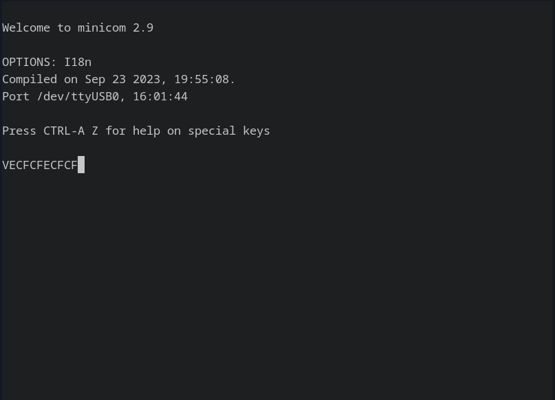
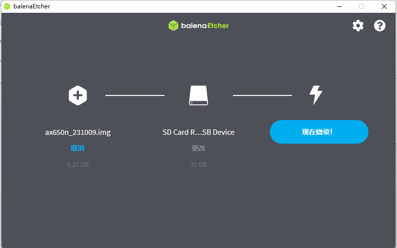
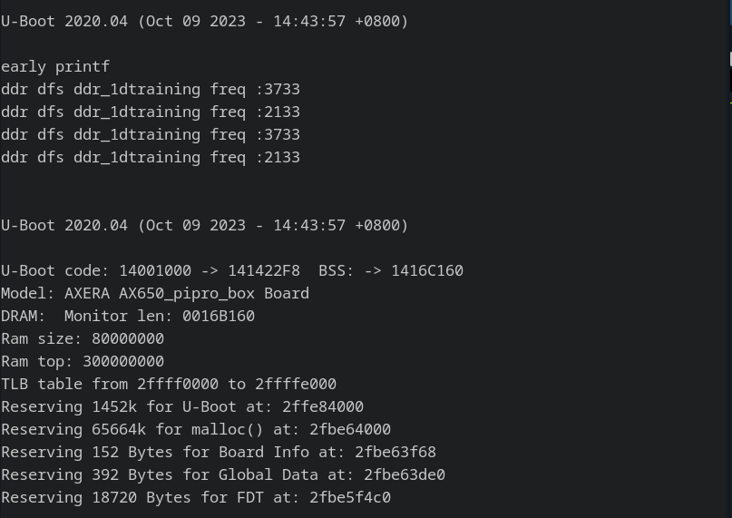

**该页面介绍的烧录方法所使用的镜像包因体积过大，且下载站带宽有限故仅存储在百度企业网盘同级目录下，入口链接可见于下载站页面顶端区域。**

M4N-Dock 的板载 eMMC 为默认启动介质，上电和手动复位以及系统内reboot命令都将使其尝试从 eMMC 启动。正常启动打印如下。

若 eMMC 内无系统镜像或系统受损则会启动失败，同时串口会有打印如下 VECFCFECFCF，复位则会重复打印该内容。

此时从 eMMC 将无法启动，只有在重新烧录后方可正常启动。您可选择通过 TF 卡启动测试再烧录或通过 AXDL 直接烧录。具体操作过程如下。

## 通过TF卡启动
可选启动介质有 USB 和 TF 卡，启动方法是在连接好 USB 线缆或 TF 卡后，保持按下 BOOT 按键时点按一下 RST 按键，即可自动从 USB 或 TF 卡等合法介质进行启动。

1. 我们会发布标明版本的 TF 卡镜像，选择所需版本下载后，再使用 Win32DiskImager 或 BalenaEtcher 等烧录工具烧录到容量不小于 8G 的 TF 卡内。
2. 将 TF 卡插入卡槽，并提供 12V 电源。观察 Type-C 口旁边有两按键，请保持按下 BOOT 不放，此时点按 RST 一次后稍等片刻再松开 BOOT。
3. 此时可见串口打印系统正常启动信息，约 20 多秒后即可进入该 TF 卡系统。

Linux 用户可使用如下命令烧录到 TF 卡内
```bash
xzcat ax650n_231009.img.xz | sudo dd of=/dev/sdx status=progress oflag=direct bs=1G
```
Windows 用户可使用 BalenaEtcher 烧录

获得烧录好的 TF 卡后，插入并上电，特定手法按键以从 TF 卡启动，正常应输出如下，稍后即启动完成正常进入系统。



## TF卡系统分区扩容

TF 卡第二分区为根文件系统分区，格式为 ext4，默认大小 6GB 左右，除去系统、桌面、内置软件可能剩余不到 3GB。而用户有时需要在 TF 卡系统上进行大文件的处理或者大型软件的测试，此时剩余空间就有些捉襟见肘。这时就需要进行 TF 卡系统分区的无损扩容，前提当然是所使用的 TF 卡实际物理容量空间足够用于扩容所需。

扩容不能在已挂载的分区上进行，因此通过 TF 卡启动后，该分区被挂载到根目录，无法本地扩容。因此需要第三方系统进行操作，可从 eMMC 启动系统，再插入 TF 卡进行操作。


## 通过TF卡烧录
TF 卡内系统即为待更新目标系统，在/root目录下有一脚本文件update.sh，手动执行并等待其完成即可将 TF 卡内系统烧录进 eMMC 内。此方法会格式化 eMMC ，先前的变动将会丢失，仅适用于全盘恢复系统。

```bash
/root/update.sh
```
完成后，HDMI 旁边的两个灯会一直闪烁，用以指示更新完成。

建议您将个人数据存于特定分区，或使用外置存储设备如 SSD 进行持久化存储而仅将 eMMC 作为系统盘。请避免使用`/opt`和`/soc`路径，如若不然，请自行确认所有个人数据并备份保存以避免丢失。


## 通过AXDL烧录
一次性烧录进EMMC，方便快捷。需要提供`12V`充足供电，请注意仅`USB`供电可能出现烧录失败的情况。

烧录文件名格式为`xxx.axp`。

具体操作方法见首页资源汇总软件开发文档压缩包内`AXDL 工具使用指南.pdf`。

**提示：官方EVB板上 Download 按键对应 M4NDOCK 的 BOOT 按键**

AXDL软件（仅 Windows 可用）位于下载站`PC_Software`目录下。

**注意：USB烧录口是位于靠近`HDMI`接口的以太网座子最下面贴近板子的那一个`USB-A`口。请准备`A-to-A`的数据线，或者电脑有`Type-C`口也可以直接使用`A-to-C`的数据线**

**注意：烧写时不要连接 `12V` 电源，仅使用USB烧写线供电即可，否则有烧毁`PC`的`USB接口`的风险**
