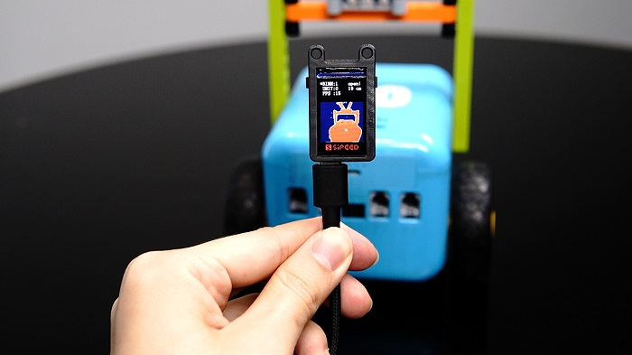
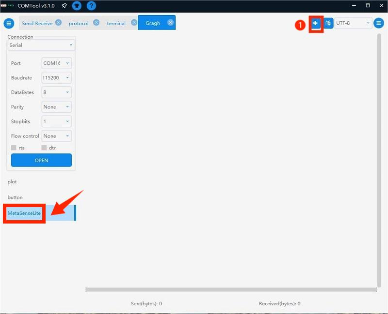
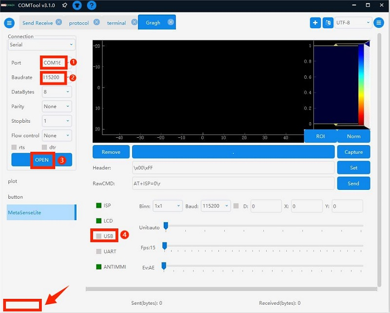
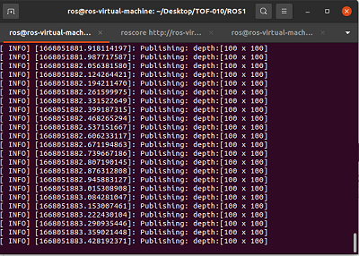
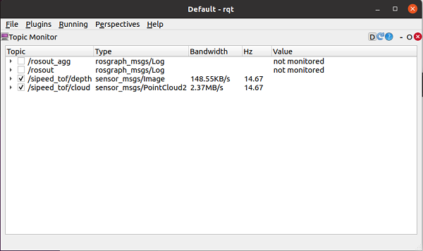
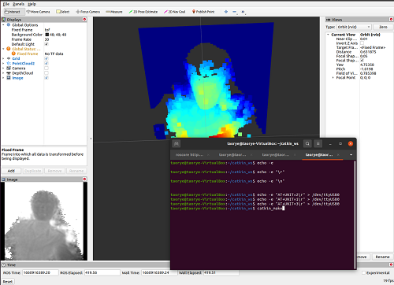

# MaixSense-A010

|     时间      | 负责人 |   更新内容   |
| :-----------: | :----: | :----------: |
| 2022.09.10 | lyx | 初次编写文档 |
| 2022.11.12 | lyx | 补充细节 |
## 产品概述


**MaixSense-A010** 是 **SIPEED** 推出由 **BL702** + 炬佑 **100x100 TOF** 所组成的 **3D** 传感器模组，最大支持 **100x100** 的分辨率和 **8** 位精度并自带 **240×135** 像素的 **LCD** 屏可实时预览 **colormap** 后的深度图。

### 资料汇总

硬件资料：[点击查看下载](https://dl.sipeed.com/shareURL/MaixSense/MaixSense_A010)
Github：[点击查看](https://github.com/sipeed/MaixSense_ROS)

## 产品开箱指南

### 准备工作

**MaixSense-A010** 采用串口协议对外提供接口以及传输数据。
我们提供的物理接口有 type-c（虚拟串口）及 1.0mm 4pin 母座（UART）都能获取深度图数据用于集成.

- **产品接线说明**
 
通过 type-c 接口连接 PC 端后，可以识别到 `/dev/ttyUSBx（Linux）`或 `COMx（Windows)`.


还可通过 usb2ttl 模组按照硬件引脚图（设备屏幕正面朝下）连接 4pin 母座。

<html>
  
  
</html>

<table>
    <tr>
        <td>MS-A010</td>
        <td>TX</td>
        <td>RX</td>
        <td>GND</td>
        <td>5V</td>
    </tr>
    <tr>
        <td>usb2ttl 模块</td>
        <td>RX</td>
        <td>TX</td>
        <td>GND</td>
        <td>5V</td>
    </tr>
</table>

### 上电互动预览

**按键功能**：左侧为“下一个”右侧为“切换”.

**屏幕显示**：屏幕中心的 **+** 字是测距点，右上方会实时显示 **xx cm** 代表测距的距离。如镜头前近处有大面积物体时屏幕右上会显示 **“block!”**而其他情况为 **“open!”**.

将设备接入电源后，可在设备上自带 LCD 屏实时预览 color map 后的深度伪彩图。



### PC 互动预览

在 PC 端上预览修改配置前需要先安装上位机软件 COMTOOL.

**COMTOOL/Windows 系统**：[点击下载](https://dl.sipeed.com/shareURL/MaixSense/MaixSense_A010/software_pack/comtool)
**COMTOOL/Linux 系统**：[需用户自行编译/点击跳转](https://github.com/sipeed/MetaSense-ComTool)

>注意：Win 7 及以下系统需装驱动，可自行前往 FTDI 官网下载。

打开 COMTOOL 软件后选择 `Graph` 界面，如果软件上方无 `Graph` 的话可在右上角 **+** 号处添加 `Graph`，创建后若居中部分为白无图，则**双击**左下角 `MaixSenseLite` 即可打开界面显示端口。



在左侧 `Port` 选择小的端口和对应波特率（任意选择高波特率），点击 `open` 后再勾选下方 `USB` 即可接收大量数据,左下角处会显示 **Connected**.



设定 `Header` 为 `\x00\xFF` 即可解析正确的图像数据并观察到深度图，可以直观感受二维平面图像上的深度。


### 互动配置说明

COMTOOL 上位机的配置控件说明
- **Header**：设置识别包头
- **RawCMD**：用户可以手动发送指令（USB 和 UART 串口行为相同）
- **ISP**：启动停止
- **LCD**：显示自带屏的开启关闭
- **USB**：串口传输深度图开启关闭
- **UART**：串口传输深度图开启关闭
- **ANTIMMI**：自动抗多机干扰开启关闭（易受干扰，关闭的效果都要更好些）
- **Binn**：可下拉设置 BINNING，Baud 设置 UART 波特率
- **X、Y**：设置坐标：D 左侧多选框开启后显示出该摄像头的距离。
- **Unit**：设置量化单位（16位量化到8位，比例缩小，设置太小的话会只能看清很近处的影像）
- **FPS**：设置出图帧率（不宜过高，根据对接设备的性能合理设置即可，减小帧率可以减少传输数据量）
- **Ev**：曝光间隙控制（最左代表 AE，其他是固定曝光时间）

## 案例：远近中物体实拍

设备自带 **LCD** 屏上电后可实时观察到远近中物体的深度值差异。
物体不同的放置位置形成距离的差异，设备捕捉到差异后转化为深度值并因距离的远近显示冷暖色调。


## 案例：检测人流

实时高精度，大分辨率的监测人流量走动的情况并且快速统计出数据。


>例程源码暂时还未开源，待整理公开。
## 案例：键盘灯跟随

实现超酷炫的键盘灯跟随，设备实时跟踪手部的位置变化，再根据手部的位置映射键盘灯。
**键盘灯相关代码支持**：[点击查看](https://dl.sipeed.com/shareURL/others/maixsense_example)


## 案例：接入 MCU 

因 **MaixSense-A010** 拥有强大的兼容性，可基于串口协议外接 **K210 Maix bit** 这样的 **AIOT** 开发板或树莓派之类的 **Linux** 开发板来进行二次开发，为了方便用户的使用我们开放接入例程。

.. details::点击查看 K210 Maix Bit 介绍
    Maix Bit 是 sipeed Maix 中产品线的一员，基于嘉楠堪智科技的边缘智能计算芯片 K210 设计的一款 AIOT 开发板。以 K210 作为核心单元，功能非常很强大，芯片内置 64 位双核处理器，拥有 8M 的片上 SRAM，在Al机器视觉、听觉性能方便表现突出，内置多种硬件加速单元(KPU、FPU，FFT等)，总算力最高可达 1TOPS，可以方便地实现各类应用场景的机器视觉/听觉算法,也可以进行语音方向扫描和语音数据输出的前置处理工作。

    

**Maix Bit 购买传送门**：[点击查看](https://item.taobao.com/item.htm?spm=a230r.1.14.11.681570a1yq4sJD&id=586580351110&ns=1&abbucket=10&mt=)
**Maix Bit 资料传送门**：[更多详细资料](https://wiki.sipeed.com/hardware/zh/maix/maixpy_develop_kit_board/maix_bit.html)
**MaixSense-A010 外接 Maix Bit 例程**：[点击查看](http://wiki.sipeed.com/hardware/zh/maixsense/maixsense-a010/mcu.html)


## 二次开发：串口协议

可参考上方的案例：**MS-A010 外接 K210 bit**
**MaixSense-A010 串口协议传送门**：[点击查看](http://wiki.sipeed.com/hardware/zh/maixsense/maixsense-a010/at_command.html)

## 二次开发：接入 ROS
### 接入 ROS1 

**1. 准备工作** 
运行 ROS 前我们要准备适用的环境：`Linux` 系统。
可使用虚拟机 `virtual box` 或者 `vmware`：[点击获取](https://www.vmware.com/cn/products/workstation-player/workstation-player-evaluation.html)
也可以自行安装双系统，安装方法请自行搜索或参考右侧：[双系统安装教程](https://neucrack.com/p/330)

**2. 安装运行**
ROS 接入包：[点击前往下载](https://dl.sipeed.com/shareURL/MaixSense/MaixSense_A010/software_pack/SDK)

```bash
#解压缩 sipeed_tof_ms_a010.zip，并进入目录
cd ros1
source /opt/ros/*/setup.sh
catkin_make
source devel/setup.sh 
rosrun sipeed_tof_ms_a010 a010_publisher _device:="/dev/ttyUSB0"
#之后终端会持续刷新显示[sipeed_tof]: Publishing，即正常工作
```



**3. 可自行在 RQT 查看帧率**



**4. RVIZ2 预览**
打开 `rviz2` 后，在界面左下角的 `Add`->`By topic`->`PointCloud2或/depth` ->`Image 添加` ->`Display/Global Options/Fixed Frame` 需要修改成 `tof`，才能正常显示点云，根据添加的内容，左侧会显示 `Image` 而中间则显示点云。


### 接入 ROS2 

**1. 准备工作**
运行 ROS 前我们要准备适用的环境：`Linux` 系统。
可使用虚拟机 `virtual box` 或者 `vmware`：[点击获取](https://www.vmware.com/cn/products/workstation-player/workstation-player-evaluation.html)
也可以自行安装双系统，安装方法请自行搜索或参考右侧：[双系统安装教程](https://neucrack.com/p/330)

> 如果环境同时安装了 ROS1，使用 ROS2 的话需要选额外择正确的版本。

```bash
ls /opt/ros
ros@ros-virtual-machine:~/Desktop$ ls /opt/ros
noetic  rolling
```
**2. 安装运行**
我们提供了 ROS2 的接入功能包，用户需要在运行 ROS2 的系统上编译安装。
ROS 接入包：[点击前往下载](https://dl.sipeed.com/shareURL/MaixSense/MaixSense_A010/software_pack/SDK)

```bash
#解压缩sipeed_tof_ms_a010.zip，并进入目录
cd ros2
source /opt/ros/*/setup.sh
colcon build #（如提示缺少colcon时需要sudo apt install python3-colcon-ros）
source install/setup.sh
ros2 run sipeed_tof_ms_a010 publisher --ros-args -p device:="/dev/ttyUSB0"
#之后终端会持续刷新显示[sipeed_tof]: Publishing，即正常工作
```

**3. RQT 查看帧率**


**4. RVIZ2 预览**
打开 `rviz2` 后，在界面左下角的 `Add`->`By topic`->`PointCloud2或/depth` ->`Image 添加` ->`Display/Global Options/Fixed Frame` 需要修改成 `tof`，才能正常显示点云，根据添加的内容，左侧会显示 `Image` 而中间则显示点云。


