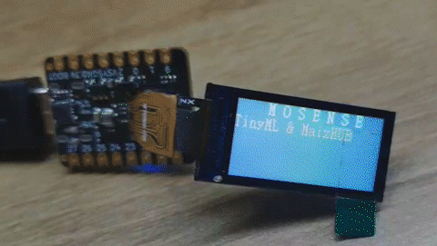
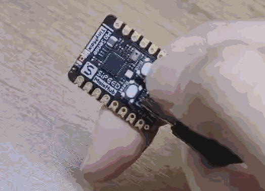
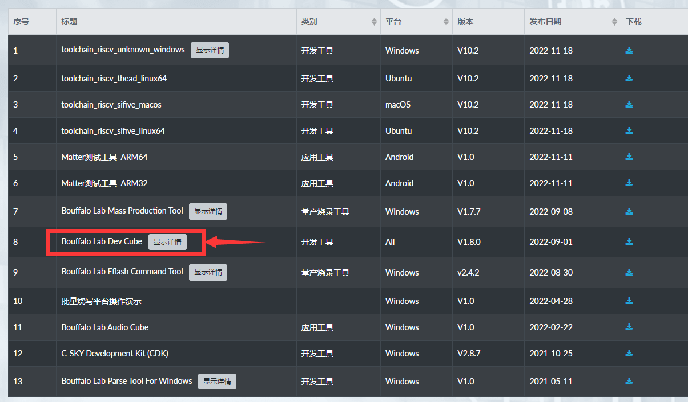
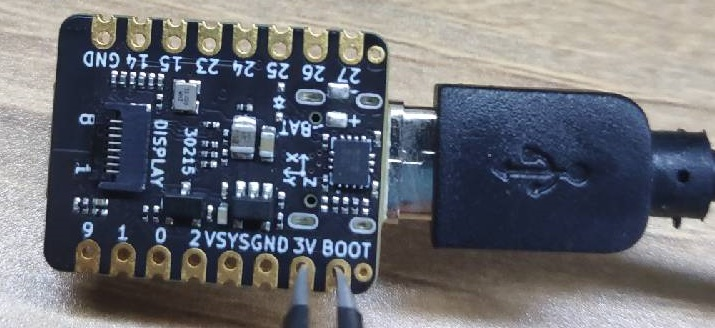

## 初见

通电后板子上的 led 亮起，且屏幕显示出周围环境音的频谱图。


## U 盘烧录

对于 M0sense 我们提供了使用虚拟 U 盘拖拽烧录固件的方式。

按住板子上的 BOOT 键后按下 RST 键，就会在电脑上显示一个 U 盘了。


直接将想要烧录的固件拖进 U 盘，成功烧录后 U 盘会自动弹出且板子会自动复位来重新加载新固件。


这边提供了几个 Demo 固件 [点我跳转](https://dl.sipeed.com/shareURL/Maix-Zero/Maix-Zero/7_Example_demos)，可以直接拖拽到 U 盘查看烧录结果，其对应的源码均可在 [github](https://github.com/sipeed/M0sense_BL702_example) 上面获取。

> 源码镜像地址： https://gitee.com/sipeed/M0sense_BL702_example

下面是这几个 demo 固件的说明与效果展示

### hello_world.uf2

通过串口软件打开板子串口，可以看到板子打印出的 `Hello,World`


### blink_baremetal.uf2

拖拽到 U 盘烧录完后，断电重新连接一下板子，LED 开始闪灯。打开串口后会显示灯的状态。

- 打开串口软件


- LED 闪灯


### blink_rtos.uf2

这个 demo 效果与上面的一样，只是是基于 RTOS 实现的，上面那个 demo 是裸机程序。

使用串口软件打开串口后才开始闪灯，关闭串口后灯的颜色会保持不变。

- 打开串口软件


- LED 闪灯


### lcd_flush.uf2

烧录进板子后，板子配套的 lcd 背景色变化，打开串口会显示当前屏幕颜色的数值。




### imu.uf2

烧录进板子后，从串口可以看到板子上面 6 轴 IMU (惯性传感器)的数据。


### single_button_control.uf2

烧录到板子中后，按下 BOOT 键，LED 会切换颜色，串口会打印当前 LED IO 状态。

具体逻辑可以查看[源码](https://gitee.com/Sipeed/M0sense_BL702_example/blob/main/m0sense_apps/rtos_demos/single_button_control/main.c)。




### audio_recording.uf2

烧录进板子后，串口会持续打印麦克风所获得的周围环境音的 16bit pcm 格式数据。


## SDK 环境搭建

M0sense 要求在 Linux 环境下进行编译。

### 获取例程仓库

```bash
git clone https://gitee.com/Sipeed/M0sense_BL702_example.git
```

最终结构树如下

```bash
sipeed@DESKTOP:~$ tree -L 1 M0sense_BL702_example/
M0sense_BL702_example/
├── LICENSE           # 许可证文件
├── README.md         # 仓库说明
├── bl_mcu_sdk        # SDK 文件
├── build.sh          # 编译脚本
├── m0sense_apps      # 例程源码
├── misc              # 其他应用
└── uf2_demos         # 例程文件
```

### 在例程目录下，获得 SDK 仓库

仓库很大，400M 以上。

```bash
cd M0sense_BL702_example
git clone https://gitee.com/bouffalolab/bl_mcu_sdk
```

最终得到的结构树应如下(截取部分)：

```bash
sipeed@DESKTOP:~$ tree -L 2 M0sense_BL702_example/
M0sense_BL702_example/
├── LICENSE           # 许可证文件
├── README.md         # 仓库说明
├── bl_mcu_sdk        # SDK 文件
│   ├── README_zh.md  # SDK 中文说明
│   ├── ReleaseNotes  # SDK 发布说明
│   ├── bsp
│   ├── cmake
│   ├── components
│   ├── docs
│   ├── drivers
│   ├── examples
│   ├── project.build
│   ├── tools
│   └── utils
├── build.sh          # 编译脚本
├── m0sense_apps      # 例程源码
├── misc              # 其他应用
└── uf2_demos         # 例程文件
```

### 在例程目录下，获取编译工具链

```bash
git clone https://gitee.com/bouffalolab/toolchain_gcc_sifive_linux
```

最终得到的结构树应如下(截取部分)：

```bash
sipeed@DESKTOP:~$ tree -L 2 M0sense_BL702_example/
M0sense_BL702_example/
├── LICENSE                       # 许可证文件
├── README.md                     # 仓库说明
├── bl_mcu_sdk                    # SDK 文件
│   ├── README_zh.md              # SDK 中文说明
│   ├── ReleaseNotes              # SDK 发布说明
│   ...
├── build.sh                      # 编译脚本
├── m0sense_apps                  # 例程源码
├── misc                          # 其他应用
├── toolchain_gcc_sifive_linux    # 编译工具链
│   ├── bin                       # 编译链可执行文件路径
│   ├── lib                       # 动态库文件
│   ...
└── uf2_demos                     # 例程文件
```

### 在例程目录下，打补丁

首先确定是在 `M0sense_BL702_example` 目录下。

打补丁前需要先设置一下用户名和邮箱, 随便设置一个

```bash
cd bl_mcu_sdk
git config user.email "m0sense@sipeed.com"
git config user.name "tinymaix"
```

设置完后可以打补丁了。

```bash
cd ..
./build.sh patch
```

出现 `Apply patch for you!` 说明成功打补丁了，可以接着下面的操作了。


### 配置编译工具链路径

以后每次开始编译都需要执行一次这个来配置下编译工具链路径。

首先需要知道 `M0sense_BL702_example` 的路径。

```bash
sipeed@DESKTOP:~$ pwd
/home/lee/M0sense_BL702_example
```

我们复制上面执行 `pwd` 后的结果（每个人的会不一样）然后在后面加上 `/toolchain_gcc_sifive_linux/bin`，然后执行下面的命令，就配置完路径了

```bash
PATH=$PATH:/home/lee/M0sense_BL702_example/toolchain_gcc_sifive_linux/bin
```

根据每个人电脑不同执行完上述命令后可以使用下面的命令 `riscv64-unknown-elf-gcc -v` 来看所配置的工具链是不是正确了。

配置成功了的结果和下面类似。

```bash
sipeed@DESKTOP:~$ riscv64-unknown-elf-gcc -v
Using built-in specs.
COLLECT_GCC=riscv64-unknown-elf-gcc
COLLECT_LTO_WRAPPER=/home/lee/M0sense_BL702_example/toolchain_gcc_sifive_linux/bin/../libexec/gcc/riscv64-unknown-elf/10.2.0/lto-wrapper
Target: riscv64-unknown-elf
```

没有成功的话会提示没找到 `riscv64-unknown-elf-gcc`，自己再重新配置一下


### 编译 demo

首次编译 demo 前，需要在自己的电脑上编译一下固件转换工具来为了直接 U 盘拖拽烧录。

确定自己是在 `M0sense_BL702_example` 目录下执行下面的命令。

```bash
sudo apt install gcc # 安装适用于自己电脑的 gcc
gcc -I libs/uf2_format misc/utils/uf2_conv.c -o uf2_convert # 编译出固件转换工具
```

然后就可以编译 demo 了

```bash
./build.sh m0sense_apps/blink/blink_baremetal
```

最终生成的 U 盘烧录的 uf2 文件在 uf2_demos 目录下，bin 文件之类的在 bl_mcu_sdk/out 文件夹下。

## SDK 编译注意事项

1. 第一次搭建环境最好自己编译一份 uf2 文件转换工具
2. 每次新开终端编译记得配置一下 [编译工具链路径](#配置编译工具链路径)

## 烧录 bin 文件

有时候可能由于某些原因需要烧录 bin 文件，这里写一下烧录方法。

给 M0sense 烧录需要用到博流官方烧录工具，前往 https://dev.bouffalolab.com/download 下载名称为 `Bouffalo Lab Dev Cube` 的文件。解压后就得到了用来烧录板子的应用程序。



解压后的文件夹中主要关注 `BLDevCube`、 `BLDevCube-macos` 和 `BLDevCube-ubuntu` 三个文件，用于在不同系统启动这个烧录工具。


然后使用镊子或其他金属短接上板子上的 3.3V 引脚和 boot 引脚，然后在给板子通电，这样板子进入烧录模式了。可以在电脑设备管理器中看到出现了一个串口设备。

| 短接引脚                                   | 设备管理器中的串口设备                                |
| ------------------------------------------ | -------------------------------------------------- |
|  |  |

接着打开 `BLDevCube` 烧录软件（根据自己系统选择），选择 `BL702` 芯片，在打开的软件界面选择 MCU 模式，选择想要烧录进去的固件。默认的固件可以在这里下载到: [Click me](https://dl.sipeed.com/shareURL/Maix-Zero/Maix-Zero/7_Example_demos/default_firmware)

<table>
    <tr>
        <td></td>    
        <td></td>
    </tr>
</table>

点击 `Refresh`，选择唯一的串口（如果看到的不是唯一串口，重新短接 boot 引脚和 3.3v 引脚），设置波特率 2000000， 点击下载烧录。


烧录结束后，重新插拔一次 USB 来重新启动 bl702 以应用新的固件。

