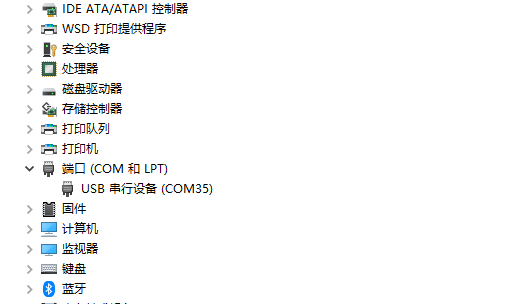
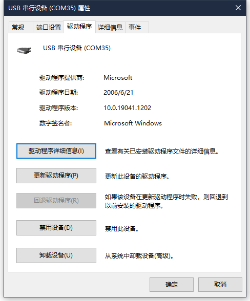
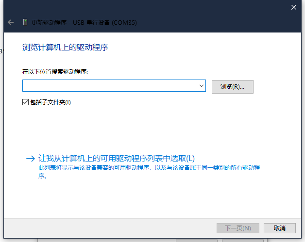
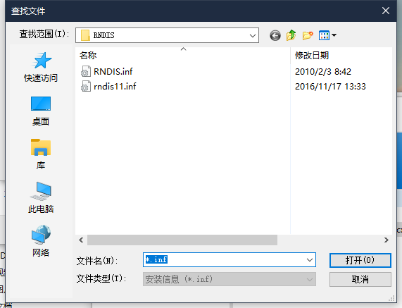
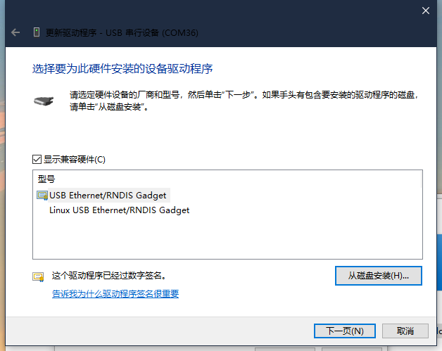
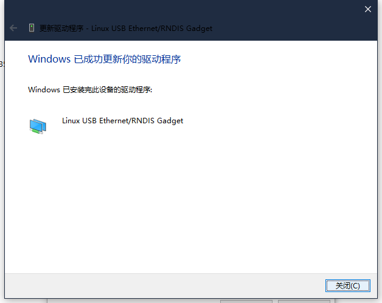

# 安装 RNDIS 驱动

> 编辑于 2022年8月9日

## 说明

RNDIS 全称为 Remote Network Driver Interface Specification，即远程网络驱动接口规范，是在 USB 设备上跑 TCP/IP 一种规范。

## 相关操作

在 Windows7 及其以上的操作系统中，均已经内置了 RNDIS，但是如果不进行一些特殊操作的话，电脑一般是识别不到相关符合 RNDIS 设备的。

### 安装驱动

将目标设备与电脑通过 USB 接口连接起来，且能够在电脑的设备管理器中看到串行设备。如果没有看到有串行设备的话大概率是供电不足所导致的：对于台式机建议使用主机背部的 USB 接口；使用 USB hub 的话建议使用带有额外供电的；另外建议使用 USB 3.0 的数据口，因为 USB 2.0 驱动供电可能不足。

右键它，选择更新驱动程序，接着在下面的界面中选择更新驱动程序

这里我们选择下面的 `让我从计算机上的可用驱动列表中选出(L)`

接着对于下面的图我们选择偏右下方的 `从磁盘安装(H)...`

然后在下面的对话框中选择右下角的浏览

选中我们所下载且解压之后的文件夹里面，选择一个 .inf 文件后，点击右下角的 `打开`

接着会回退到下面的界面，这里直接右下角的点击下一页即可

然后就会显示已经更新驱动了

重新拔插 USB 设备后，等待大概十秒左右，可以在系统的设备管理器里网络适配器中看到看到有 `RNDIS/Ethernet Gadget`，到此已经成功安装驱动了