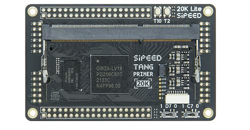

Tang 系列开发板主要有 Tang Nano 和 Tang Primer 两个系列。

| Tang Nano                                                             | Tang Primer                                                               |
| --------------------------------------------------------------------- | ------------------------------------------------------------------------- |
| - Tang Nano 1K - Tang Nano 4K - Tang Nano 9K - Tang Nano 20K | - Tang Primer 20K - Tang Primer 20K Dock - Tang Primer 20K Lite  |

## Tang Nano

Tang Nano 系列板卡都有迷你的体积，板载了 Jatg 调试器，能够只通过一根 TypeC 数据线来烧录、仿真固件。多个可选的 FPGA 容量能够让你购买到最合适的 FPGA。

### 参数

| 条目            | 
Tang Nano 20K
 | 
Tang Nano 9K
 | 
Tang Nano 4K
 | 
Tang Nano 1K
 |
| :-------------- | :---------------------------------------------- | :--------------------------------------------- | :--------------------------------------------- | ---------------------------------------------- |
| 逻辑单元(LUT4)  | 20736                                           | 8640                                           | 4608                                           | 1152                                           |
| 寄存器（FF）    | 15552                                           | 6480                                           | 3456                                           | 864                                            |
| S-SRAM (bits)   | 41472                                           | 17280                                          |                                                |                                                |
| B-SRAM (bits)   | 828K                                            | 468K                                           | 180K                                           | 72K                                            |
| 用户闪存 (bits) |                                                 | 608K                                           | 256K                                           | 96K                                            |
| 锁相环 (PLL)    | 4                                               | 2                                              | 2                                              | 1                                              |
| 板载 Flash      | 32Mbits NOR Flash                               | 32Mbits NOR Flash                              | 32Mbits NOR Flash                              | 预留焊盘                                       |
| 硬核处理器      |                                                 |                                                | Cortex-M3                                      |                                                |

### 外观

<table>
<thead>
<tr>
<th style="text-align:center">Tang Nano 20K</th>
<th style="text-align:center">Tang Nano 9K</th>
</tr>
</thead>
<tbody>
<tr>
<td style="text-align:center"></td>
<td style="text-align:center"></td>
</tr>
</tbody>
<thead>
<tr>
<th style="text-align:center">Tang Nano 4K</th>
<th style="text-align:center">Tang Nano 1K</th>
</tr>
</thead>
<tbody>
<tr>
<td style="text-align:center"></td>
<td style="text-align:center"></td>
</tr>
</tbody>
</table>

## Tang Primer

Tang Primer 系列开发板是为了便于用户直接连接并驱动外设所设计的开发板。

### 参数

| 条目           | 
Tang Primer 20K
 | 
Tang Primer 20K Dock
 | 
Tang Primer 20K Lite
 |
| :------------- | :------------------------------------------------ | :----------------------------------------------------- | :----------------------------------------------------- |
| 逻辑单元(LUT4) | 20736                                             | 20736                                                  | 20736                                                  |
| 寄存器（FF）   | 15552                                             | 15552                                                  | 15552                                                  |
| S-SRAM (bits)  | 41472                                             | 41472                                                  | 41472                                                  |
| B-SRAM (bits)  | 828K                                              | 468K                                                   | 180K                                                   |
| 锁相环 (PLL)   | 2                                                 | 2                                                      | 2                                                      |
| 板载 Flash     | 32Mbits NOR Flash                                 | 32Mbits NOR Flash                                      | 32Mbits NOR Flash                                      |
| LED (个)       |                                                   | 6                                                      |                                                        |

### 外观

| Tang Primer 20K                                                              | Tang Primer 20K Dock                             | Tang Primer 20K Lite                                         |
| ---------------------------------------------------------------------------- | ------------------------------------------------ | ------------------------------------------------------------ |
|  |  |  |

## 开发板选择建议

对于新手来说，建议使用 [Tang Nano 1K](https://wiki.sipeed.com/tang1k) 或者 [Tang Nano 9K](https://wiki.sipeed.com/tang9k) 来入门学习 FPGA。

会自己制作扩展板并且想要深入使用 FPGA 的话，可以选择 [Tang Nano 4K](https://wiki.sipeed.com/tang4k) 或者 [Tang Nano 20K](https://wiki.sipeed.com/nano20k)。 [Tang Primer 20K](https://wiki.sipeed.com/primer20k) 非常适合进行二次硬件设计，但是 DDR3 SODIMM 底座焊接有一定的难度，

如果自己不会制作扩展板，但是想要连接多个外设的话可以选择 [Tang Primer 20K Dock](https://wiki.sipeed.com/primer20k) 或者  [Tang Primer 20K Lite](https://wiki.sipeed.com/primer20k)。前者提供了足够多的可直接连接外设的接口，后者拥有足够多的排针引脚。

## 全部参数对比

<table>
<thead>
<tr>
  <th style="text-align:left"></th>
  <th style="white-space:nowrap">Tang Primer 20K Dock</th>
  <th style="white-space:nowrap">Tang Nano 20K</th>
  <th style="white-space:nowrap">Tang Nano 9K</th>
  <th style="white-space:nowrap">Tang Nano 4K</th>
  <th style="white-space:nowrap">Tang Nano 1K</th>
</tr>
</thead>
<tbody>
<tr>
  <td style="text-align:left">芯片系列  </td>
  <td style="text-align:left">GW2A-18  </td>
  <td style="text-align:left">GW2AR-18 </td>
  <td style="text-align:left">GW1NR-9  </td>
  <td style="text-align:left">GW1NSR-4C</td>
  <td style="text-align:left">GW1NZ-1  </td>
</tr>
<tr>
  <td style="text-align:left">芯片版本  </td>
  <td style="text-align:left">C        </td>
  <td style="text-align:left">C        </td>
  <td style="text-align:left">C        </td>
  <td style="text-align:left">         </td>
  <td style="text-align:left">         </td>
</tr>
<tr>
  <td style="text-align:left">逻辑单元(LUT4)</td>
  <td style="text-align:left">20736        </td>
  <td style="text-align:left">20736        </td>
  <td style="text-align:left">8640         </td>
  <td style="text-align:left">4608         </td>
  <td style="text-align:left">1152         </td>
</tr>
<tr>
  <td style="text-align:left">寄存器(FF)</td>
  <td style="text-align:left">15552    </td>
  <td style="text-align:left">15552    </td>
  <td style="text-align:left">6480     </td>
  <td style="text-align:left">3456     </td>
  <td style="text-align:left">864      </td>
</tr>
<tr>
  <td style="text-align:left">分布式静态随机存储器 S-SRAM (bits)</td>
  <td style="text-align:left">41472</td>
  <td style="text-align:left">41472</td>
  <td style="text-align:left">17280</td>
  <td style="text-align:left"></td>
  <td style="text-align:left">4K</td>
</tr>
<tr>
  <td style="text-align:left">块状静态随机存储器 B-SRAM (bits)</td>
  <td style="text-align:left">828K</td>
  <td style="text-align:left">828K</td>
  <td style="text-align:left">468K</td>
  <td style="text-align:left">180K</td>
  <td style="text-align:left">72K </td>
</tr>
<tr>
  <td style="text-align:left">用户闪存</td>
  <td style="text-align:left"></td>
  <td style="text-align:left"></td>
  <td style="text-align:left">608K</td>
  <td style="text-align:left">256K</td>
  <td style="text-align:left">64K</td>
</tr>
<tr>
  <td style="text-align:left">乘法器（个）</td>
  <td style="text-align:left">48</td>
  <td style="text-align:left">48</td>
  <td style="text-align:left">20</td>
  <td style="text-align:left">16</td>
  <td style="text-align:left"> </td>
</tr>
<tr>
  <td style="text-align:left">大容量 RAM</td>
  <td style="text-align:left">DDR SDRAM 容量 1G bits 位宽 16 bits</td>
  <td style="text-align:left">SDR SDRAM 容量 64M bits 位宽 32 bits</td>
  <td style="text-align:left">PSRAM 容量 64M bits 位宽 32 bits</td>
  <td style="text-align:left">HyperRAM 容量 64M bits 位宽 8 bits</td>
  <td style="text-align:left"></td>
</tr>
<tr>
  <td style="text-align:left">锁相环 (PLL)</td>
  <td style="text-align:left">4</td>
  <td style="text-align:left">2</td>
  <td style="text-align:left">2</td>
  <td style="text-align:left">2</td>
  <td style="text-align:left">1</td>
</tr>
<tr>
  <td style="text-align:left">板载 Flash</td>
  <td style="text-align:left">64Mbits Flash</td>
  <td style="text-align:left">32Mbits Flash</td>
  <td style="text-align:left">32Mbits Flash</td>
  <td style="text-align:left">32Mbits Flash</td>
  <td style="text-align:left"> </td>
</tr>
<tr>
  <td style="text-align:left">硬核处理器</td>
  <td style="text-align:left"></td>
  <td style="text-align:left"></td>
  <td style="text-align:left"></td>
  <td style="text-align:left">Cortex-M3</td>
  <td style="text-align:left"></td>
</tr>
<tr>
  <td style="text-align:left">摄像头接口</td>
  <td style="text-align:left">有</td>
  <td style="text-align:left"></td>
  <td style="text-align:left"></td>
  <td style="text-align:left">有</td>
  <td style="text-align:left"></td>
</tr>
<tr>
  <td style="text-align:left">HDMI 接口</td>
  <td style="text-align:left">有</td>
  <td style="text-align:left">有</td>
  <td style="text-align:left">有</td>
  <td style="text-align:left">有</td>
  <td style="text-align:left"></td>
</tr>
<tr>
  <td style="text-align:left">RGB 屏幕接口</td>
  <td style="text-align:left">有</td>
  <td style="text-align:left">有</td>
  <td style="text-align:left">有</td>
  <td style="text-align:left"></td>
  <td style="text-align:left">有</td>
</tr>
<tr>
  <td style="text-align:left">SPI 排线接口</td>
  <td style="text-align:left">有</td>
  <td style="text-align:left"></td>
  <td style="text-align:left">有</td>
  <td style="text-align:left"></td>
  <td style="text-align:left"></td>
</tr>
<tr>
  <td style="text-align:left">以太网口</td>
  <td style="text-align:left">有</td>
  <td style="text-align:left"></td>
  <td style="text-align:left"></td>
  <td style="text-align:left"></td>
  <td style="text-align:left"></td>
</tr>
<tr>
  <td style="text-align:left">USB 2.0</td>
  <td style="text-align:left">有</td>
  <td style="text-align:left"></td>
  <td style="text-align:left"></td>
  <td style="text-align:left"></td>
  <td style="text-align:left"></td>
</tr>
<tr>
  <td style="text-align:left">WS2812</td>
  <td style="text-align:left">有</td>
  <td style="text-align:left">有</td>
  <td style="text-align:left"></td>
  <td style="text-align:left"></td>
  <td style="text-align:left"></td>
</tr>
<tr>
  <td style="text-align:left">MS5351</td>
  <td style="text-align:left"></td>
  <td style="text-align:left">有</td>
  <td style="text-align:left"></td>
  <td style="text-align:left"></td>
  <td style="text-align:left"></td>
</tr>
<tr>
  <td style="text-align:left">特点</td>
  <td style="text-align:left">大容量，多外设，能用于多种验证</td>
  <td style="text-align:left">大容量，小体积，具有多路时钟可以使用</td>
  <td style="text-align:left">价格实惠，能够进行软核试验</td>
  <td style="text-align:left">内含 mcu 的 FPGA，板卡能够直接驱动摄像头</td>
  <td style="text-align:left">最小系统板</td>
</tr>
<tr>
  <td style="text-align:left">详细信息</td>
  <td style="text-align:left"><a href="https://wiki.sipeed.com/primer20k">点我跳转</a></td>
  <td style="text-align:left"><a href="https://wiki.sipeed.com/nano20k">点我跳转</a></td>
  <td style="text-align:left"><a href="https://wiki.sipeed.com/tang9k">点我跳转</a></td>
  <td style="text-align:left"><a href="https://wiki.sipeed.com/tang4k">点我跳转</a></td>
  <td style="text-align:left"><a href="https://wiki.sipeed.com/tang1k">点我跳转</a></td>
</tr>
</tbody>
</table>