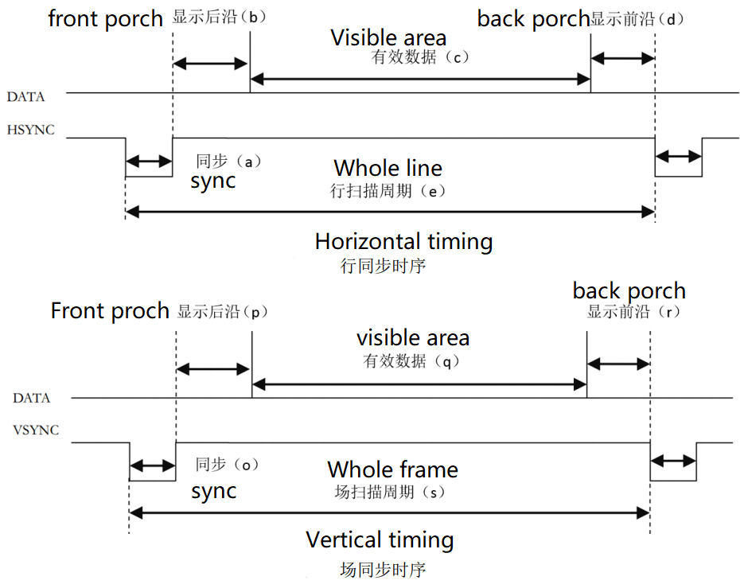
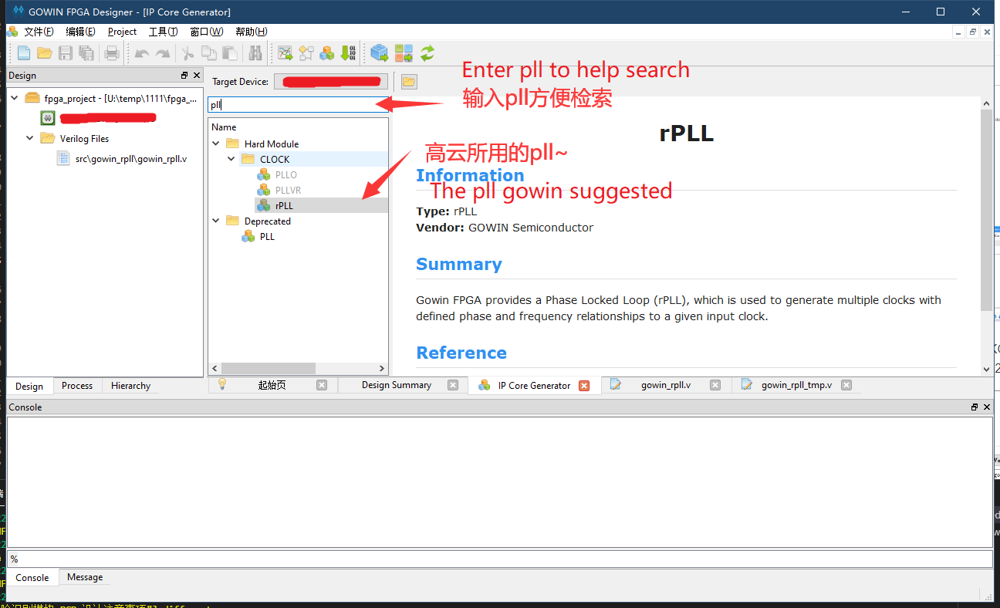
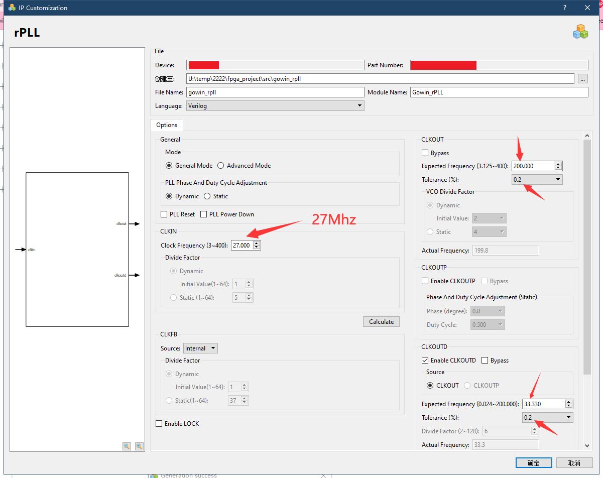
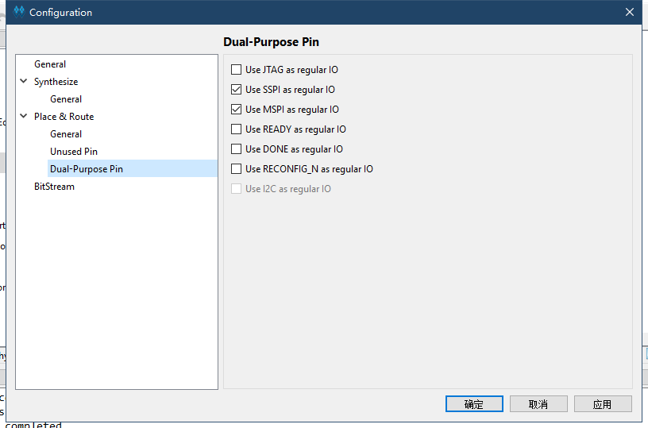

> 编辑于2022年3月30日

## 先介绍时序

RGB LCD 显示协议和 VGA 类似，通信都有专用的行同步、场同步信号线。它们的主要区别是前者传输用的是数字信号，后者传输走的是模拟信号。

下面就介绍 VGA 的时序



上图分别是 VGA 在数据传输中的行同步、场同步时序

从时序图中可以看出，不论是显示一行数据还是一列数据，都需要一个对应的同步(sync)信号，数据的传输在两个同步信号的脉冲之间完成

每一行的数据包括显示前沿(back porch)、有效数据(active video)、显示后沿(front porch)三个阶段

其中的有效数据就是我们常说的分辨率，而显示前后沿的参数需要参考具体的分辨率与帧数进行设置，相关参数可以参考典型参数，链接在此： http://www.tinyvga.com/vga-timing

这块5寸屏幕的控制时序略有不同，相关参数的设置可以查看[规格书](https://dl.sipeed.com/fileList/TANG/Nano%209K/6_Chip_Manual/CN/LCD_Datasheet/5.0inch_LCD_Datashet%20RGB.pdf)

其他尺寸的屏幕相关规格书均可以在这里下载 [点我](https://dl.sipeed.com/shareURL/TANG/Nano%209K/6_Chip_Manual/CN/LCD_Datasheet)

下面为这块 LCD 时序相关的截图


上面一张图是时序中的参数表，下面的图是时序图

从时序图中看出，这块屏幕可以不用设置前后沿，可以只设置消影(blanking)时间，通过实际的程序证明，两种方式都是可以的

## 新建工程

新建工程方法参考[自建点灯文章(点我)](./led/self_create.md)


## 生成屏幕时钟

- 这里需要用到高云半导体官方的IP核

### pll

板载的晶振时钟为 27MHz ，但是我们的屏幕要求 33.3MHZ 的时钟，所以我们需要使用相应的ip核来生成需要的时钟

这里需要使用到 `IP Core Generate` ，位置在 Tools -> IP Core Generate



双击 `rpll` ，在弹出窗口 language 选择 Verilog ，CLKIN 为 27MHz ，CLKOUT 为  33.00MHz。



点击ok后提示是否需要添加到当前工程，此时应当选择确定
  

接着会出现一个例化的tmp文件，用来例化所设置的ip。比如下图中例子


## 屏幕驱动代码

- **首先新建一个额外的verilog文件来保存下面要编写的代码**
  
### 端口定义

首先需要先定义出驱动屏幕所需要的端口

```verilog
module VGAMod
(
    input                   CLK,
    input                   nRST,

    input                   PixelClk,

    output                  LCD_DE,
    output                  LCD_HSYNC,
    output                  LCD_VSYNC,

	output          [4:0]   LCD_B,
	output          [5:0]   LCD_G,
	output          [4:0]   LCD_R
);
```

本例程使用RGB565作为驱动方式；

### 时序常量

接着定义出时序图上所要求的常量

```verilog
localparam      V_BackPorch = 16'd6; //0 or 45
localparam      V_Pluse 	= 16'd5; 
localparam      HightPixel  = 16'd480;
localparam      V_FrontPorch= 16'd62; //45 or 0

localparam      H_BackPorch = 16'd182; 	
localparam      H_Pluse 	= 16'd1; 
localparam      WidthPixel  = 16'd800;
localparam      H_FrontPorch= 16'd210;

localparam      PixelForHS  =   WidthPixel + H_BackPorch + H_FrontPorch;  	
localparam      LineForVS   =   HightPixel + V_BackPorch + V_FrontPorch;
```

首先是设置时序相关的参数：前沿、后沿、有效像素

关于显示前沿、后沿，前面也说了，可以合并为一个消影时间，就是可以把其中一个设置为0，另一个设置为消影时间。反正前后沿的时间加起来符合表中的时间要求就可以

### 计数变量

- 定义一些变量能够容易编写程序

```verilog

reg [15:0] LineCount;
reg [15:0] PixelCount;

reg	[9:0]  Data_R;
reg	[9:0]  Data_G;
reg	[9:0]  Data_B;

```

### 同步信号

这段代码产生同步信号，需要注意的是，这块屏幕的同步信号是负极性使能

```verilog
    always @(  posedge PixelClk or negedge nRST  )begin
        if( !nRST ) begin
            LineCount       <=  16'b0;    
            PixelCount      <=  16'b0;
            end
        else if(  PixelCount  ==  PixelForHS ) begin
            PixelCount      <=  16'b0;
            LineCount       <=  LineCount + 1'b1;
            end
        else if(  LineCount  == LineForVS  ) begin
            LineCount       <=  16'b0;
            PixelCount      <=  16'b0;
            end
        else
            PixelCount      <=  PixelCount + 1'b1;
    end

   always @(  posedge PixelClk or negedge nRST  )begin
        if( !nRST ) begin
			Data_R <= 9'b0;
			Data_G <= 9'b0;
			Data_B <= 9'b0;
            end
        else begin
			end
	end

//注意这里HSYNC和VSYNC负极性
assign  LCD_HSYNC = (( PixelCount >= H_Pluse)&&( PixelCount <= (PixelForHS-H_FrontPorch))) ? 1'b0 : 1'b1;
assign  LCD_VSYNC = ((( LineCount  >= V_Pluse )&&( LineCount  <= (LineForVS-0) )) ) ? 1'b0 : 1'b1;
```

### 使能信号

这段代码设置 LCD 使能图像显示，这块屏幕需要控制一个管脚用作显示开关，实际这个信号就是传输图像有效的那 800*480 的数据时置 1
  
```verilog
assign  LCD_DE = (  ( PixelCount >= H_BackPorch )&&
                    ( PixelCount <= PixelForHS-H_FrontPorch ) &&
                    ( LineCount >= V_BackPorch ) &&
                    ( LineCount <= LineForVS-V_FrontPorch-1 ))  ? 1'b1 : 1'b0;
                    //这里不减一，会抖动
```

### 测试彩条

这段代码用来产生 LCD 的测试数据，产生彩条显示

```verilog
assign  LCD_R   =   (PixelCount<200)? 5'b00000 : 
                    (PixelCount<240 ? 5'b00001 :    
                    (PixelCount<280 ? 5'b00010 :    
                    (PixelCount<320 ? 5'b00100 :    
                    (PixelCount<360 ? 5'b01000 :    
                    (PixelCount<400 ? 5'b10000 :  5'b00000 )))));

assign  LCD_G   =   (PixelCount<400)? 6'b000000 : 
                    (PixelCount<440 ? 6'b000001 :    
                    (PixelCount<480 ? 6'b000010 :    
                    (PixelCount<520 ? 6'b000100 :    
                    (PixelCount<560 ? 6'b001000 :    
                    (PixelCount<600 ? 6'b010000 :  
                    (PixelCount<640 ? 6'b100000 : 6'b000000 ))))));

assign  LCD_B   =   (PixelCount<640)? 5'b00000 : 
                    (PixelCount<680 ? 5'b00001 :    
                    (PixelCount<720 ? 5'b00010 :    
                    (PixelCount<760 ? 5'b00100 :    
                    (PixelCount<800 ? 5'b01000 :    
                    (PixelCount<840 ? 5'b10000 :  5'b00000 )))));
```


**当然在最后的驱动文件最后别忘记换行加上 endmodule** 

到这里驱动模块的编写已经完成了。

## 在顶层模块中例化

- **这里也是要新建文件的**

```verilog
module TOP //设置顶层模块
(
	input			nRST,
    input           XTAL_IN,

	output			LCD_CLK,
	output			LCD_HYNC,
	output			LCD_SYNC,
	output			LCD_DEN,
	output	[4:0]	LCD_R,
	output	[5:0]	LCD_G,
	output	[4:0]	LCD_B

); // 罗列需要的端口

	wire		CLK_SYS;	
	wire		CLK_PIX;
    
    //例化pll
    Gowin_rPLL chip_pll(
        .clkout(CLK_SYS), //output clkout     //200M
        .clkoutd(CLK_PIX), //output clkoutd   //33.00M
        .clkin(XTAL_IN)    //input clkin
    );	

	VGAMod	VGAMod_inst //例化vga驱动
	(
		.CLK		(	CLK_SYS     ),
		.nRST		(	nRST		),

		.PixelClk	(	CLK_PIX		),
		.LCD_DE		(	LCD_DEN	 	),
		.LCD_HSYNC	(	LCD_HYNC 	),
    	.LCD_VSYNC	(	LCD_SYNC 	),

		.LCD_B		(	LCD_B		),
		.LCD_G		(	LCD_G		),
		.LCD_R		(	LCD_R		)
	);

	assign		LCD_CLK		=	CLK_PIX;

endmodule
```

## 综合、约束、布局布线

### 综合

完成上面步骤后转到“Process”界面下，对编辑好的代码进行综合，即运行“Synthesize” 


运行的结果如下图出现 
 

且下方结果栏不出现任何从报错，说明前面编辑的代码无误，如果有错，根据错误提示进行改正即可。

### 约束 

- 此处仅管脚约束

对应的管脚约束如下表格；
关于管脚约束可以参考[自建点灯文章(点我)](./led/self_create.md)里面的约束方法
如果感觉麻烦的话也可以直接复制准备好的[文件(点我)](./lcd_constrains.md)，将页面里的内容复制到工程目录里 .cst 文件中（如果没有.cst 文件那么自己新建一个）**物理管脚约束文件** 即可。

|   PORT   |  PIN  |   PORT   |  PIN  |
| :------: | :---: | :------: | :---: |
|  LED_B   |  10   |  LED_G   |  11   |
|  LED_R   |   9   | LCD_B[4] |  24   |
| LCD_B[3] |  23   | LCD_B[2] |  22   |
| LCD_B[1] |  20   | LCD_B[0] |  19   |
| LCD_G[5] |  18   | LCD_G[4] |  17   |
| LCD_G[3] |  16   | LCD_G[2] |  15   |
| LCD_G[1] |  27   | LCD_G[0] |  28   |
| LCD_R[4] |  29   | LCD_R[3] |  30   |
| LCD_R[2] |  31   | LCD_R[1] |  34   |
| LCD_R[0] |  35   | LCD_DEN  |  21   |
| LCD_SYNC |  32   | LCD_HYNC |  33   |
| LCD_CLK  |   8   | XTAL_IN  |  47   |
|   nRST   |  44   |          |       |


### 布局布线

管脚约束之后需要在设置里面开启引脚复用才能完成布局布线。
具体位置在 软件顶部菜单栏 Project -> Configuration -> Place&Route -> Dual-Purpose Pin


设置完上面的之后。
就可以开始布局布线(Place&Route)了。
完成后就可以给开发板验证代码内容了。

## 烧录

布局布线结束后生成比特流，就可以烧录开发板了。

## 结束

上面差不多叙述了所需要的代码。
整个工程可以参考 [这里](https://github.com/sipeed/TangNano-1K-examples/tree/main/example_lcd/) 


<p id="back">
    <a href="#" onClick="javascript :history.back(-1);">返回上一页(Back)</a>
</p>